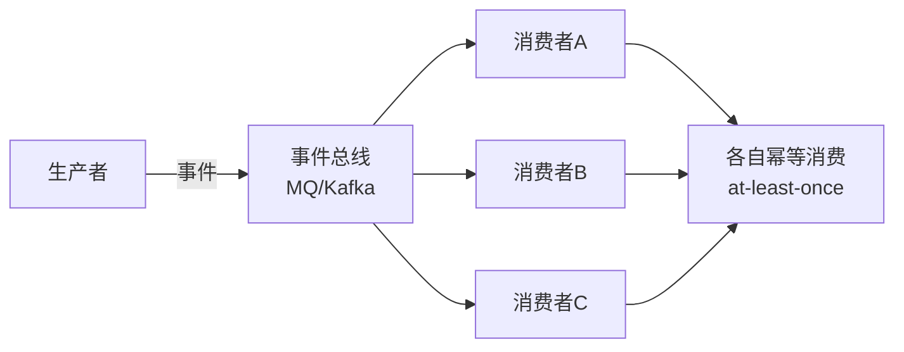
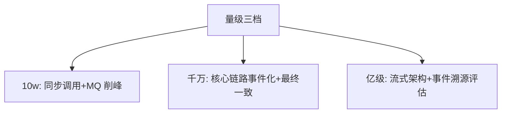

# 从零开始认识事件驱动架构系列导读

> 从「调用」到「事件」不只是换一种消息中间件——是架构因果关系的反转。这个系列从零建立 EDA 的完整心智模型：事件建模、投递语义、最终一致性的代价与治理。

## 一句话摘要

EDA 的四个地基概念：事件建模（命令 vs 事件 vs 消息）、投递语义（at-least-once 与幂等的必然组合）、最终一致性（读模型与补偿）、事件溯源（可选进阶）。10w 档「同步调用+重试」够用，千万档事件化拆解耦合，亿级档流式架构与事件溯源登场。

## 篇目规划（L1-L4，ADR-0012 方向=子目录）

| 篇目/层 |
|---|
| L1 入门层（本层 6 篇） · 1 什么是事件驱动 / 2 事件建模三概念 / 3 投递语义与幂等 / 4 最终一致性与读模型 / 5 事件总线选型 / 6 方法论总结 |
| L2 特性层 · 深入理解事件机制系列：事务消息与本地消息表 / 消费幂等与去重 / 事件版本与演化 |
| L3 专题层 · EDA 亿级实战：事件驱动的大促削峰全景 / 事件顺序与分区策略 / 死信与补偿体系 |
| L4 整合层 · 从零实现事件总线 Demo（事件发布-订阅-幂等消费最小系统） |

**机制定位与取舍**：本方向的每个机制（原理与底层实现）都在篇目里锚定了位置——规划期的取舍是「机制原理优先于操作罗列」，代价是入门读者需要更多耐心，收益是后续每篇的参数与步骤都有原理可归因；架构上各层互为上下游，边界由「机制讲透」与「操作可执行」这条线划分。

## 演进视角

EDA 的演变：企业消息总线（SOA 时代）→ 轻量 MQ → 流式平台（Kafka 生态）→ 事件溯源与 CQRS 的有限落地——每次演变都在回答「耦合怎么再降、吞吐怎么再升」，代价（最终一致的心智负担）始终存在，取舍不变。

## 📌 数据与事实声明

- 本文件为方向骨架规划（篇目标注 ⏳ 待写 / ✅ 已落地），依据 ADR-0012 工程级深度标准与 4 层架构规范；量级与参数数字均为行业认知量级，落篇时以实测替换。

## 📚 参考资料

- 本仓库 Kafka/RocketMQ 系列（总线选型的组件正源）、distributed-transaction 系列（一致性联动）、《Designing Data-Intensive Applications》。
