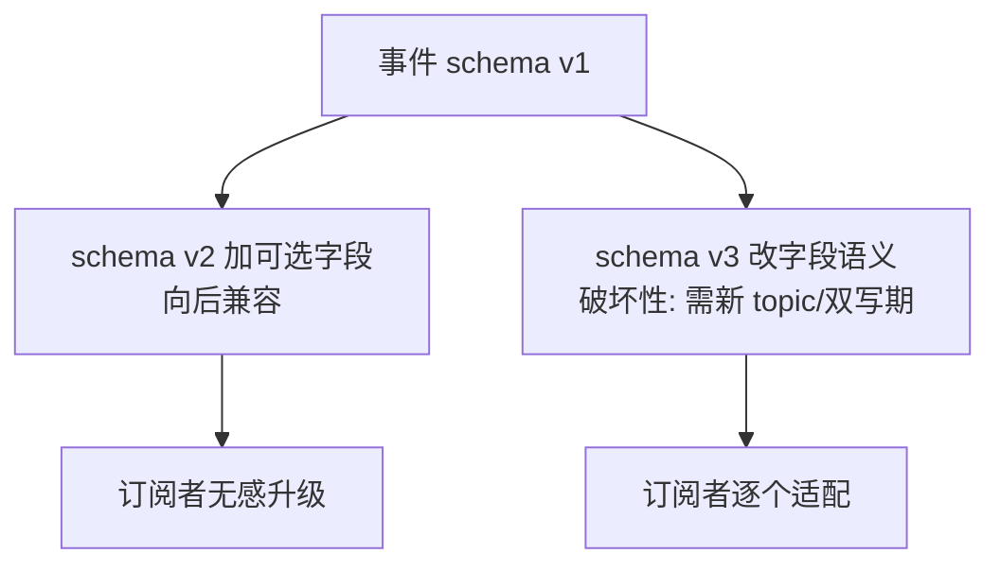
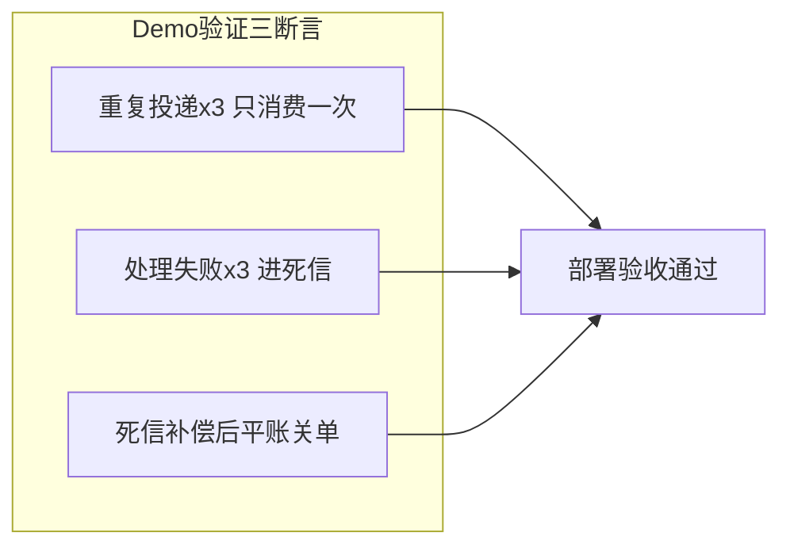
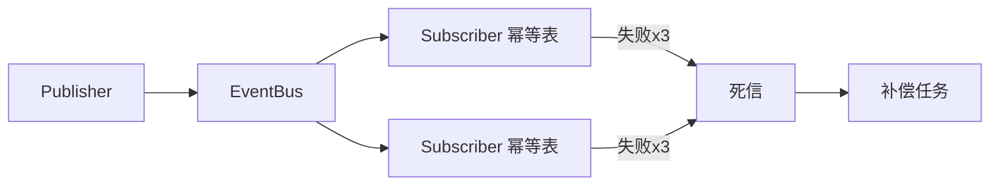
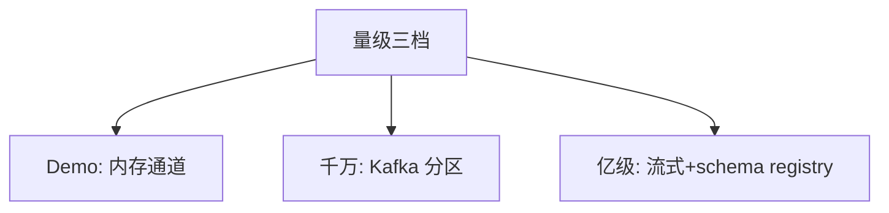
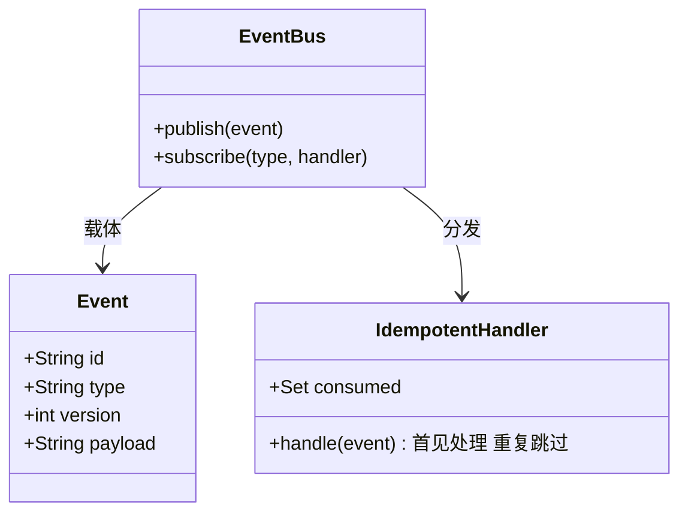

# 从零实现事件总线 Demo

> 整合层 Demo：从零实现最小事件总线（发布-订阅-幂等消费-死信），约 400 行可运行。

## 一句话摘要

Demo 五模块：事件模型（schema 版本化）、总线（通道抽象）、订阅管理、幂等消费、死信与补偿——机制与语言无关，验证标准是「重复投递三次只消费一次 + 死信可补偿」。

## 篇目规划（L1-L4，ADR-0012 方向=子目录）

| 篇目/层 |
|---|
| Demo 主篇 · 最小事件总线（步骤/代码/验证/三档 roadmap） · ⏳ 待写 |
## 篇目状态

| 篇目 | 状态 |
|---|---|
| Demo 主篇 | ⏳ 待写（按 ADR-0012 工程级） |

**机制定位与取舍**：本方向的每个机制（原理与底层实现）都在篇目里锚定了位置——规划期的取舍是「机制原理优先于操作罗列」，代价是入门读者需要更多耐心，收益是后续每篇的参数与步骤都有原理可归因；架构上各层互为上下游，边界由「机制讲透」与「操作可执行」这条线划分。

## 演进视角

从自研总线到标准中间件：Demo 的通道抽象在生产替换为 Kafka/Pulsar——机制不变（幂等/死信/补偿），形态随量级升级。

## 📌 数据与事实声明

- 本文件为方向骨架规划（篇目标注 ⏳ 待写 / ✅ 已落地），依据 ADR-0012 工程级深度标准与 4 层架构规范；量级与参数数字均为行业认知量级，落篇时以实测替换。

## 📚 参考资料

- 特性层《深入理解事件机制系列》、Kafka 官方文档。
