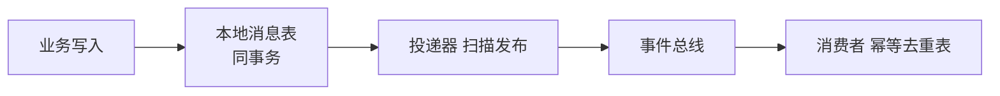
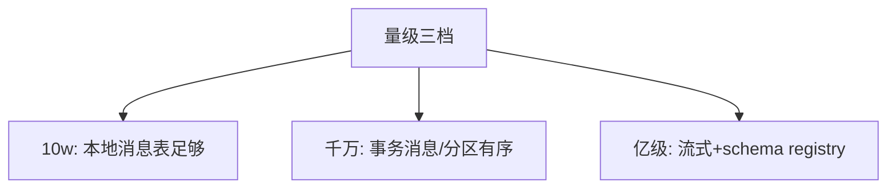
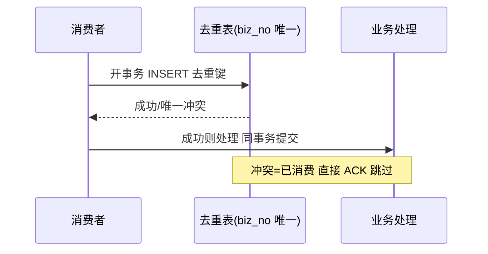

# 深入理解事件机制系列

> 事件机制的特性层：事务消息、消费幂等、事件演化——EDA 从概念到可运行的机制层。

## 一句话摘要

三个机制核心：事务消息与本地消息表（业务写入与事件发布的原子性）、消费幂等（at-least-once 的必然代价的治理）、事件版本演化（schema 变更不破坏消费者）。

## 篇目规划（L1-L4，ADR-0012 方向=子目录）

| 篇目/层 |
|---|
| 篇 1 · 事务消息与本地消息表（含 RocketMQ 事务消息对照） |
| 篇 2 · 消费幂等与去重表（键设计与 TTL） |
| 篇 3 · 事件版本与 schema 演化（兼容性规则） |
## 篇目状态

| 篇目 | 状态 |
|---|---|
| 全部 3 篇 | ⏳ 待写（按 ADR-0012 工程级） |

**机制定位与取舍**：本方向的每个机制（原理与底层实现）都在篇目里锚定了位置——规划期的取舍是「机制原理优先于操作罗列」，代价是入门读者需要更多耐心，收益是后续每篇的参数与步骤都有原理可归因；架构上各层互为上下游，边界由「机制讲透」与「操作可执行」这条线划分。

## 演进视角

事件机制的演变围绕「原子性与顺序」两个难题展开——本地消息表 → 事务消息 → Transactional Outbox 标准化；顺序保证从全局队列退化到分区内有序（吞吐的代价）。

## 📌 数据与事实声明

- 本文件为方向骨架规划（篇目标注 ⏳ 待写 / ✅ 已落地），依据 ADR-0012 工程级深度标准与 4 层架构规范；量级与参数数字均为行业认知量级，落篇时以实测替换。

## 📚 参考资料

- 本仓库 RocketMQ 事务消息篇、Kafka 事务篇、distributed-transaction 系列。
