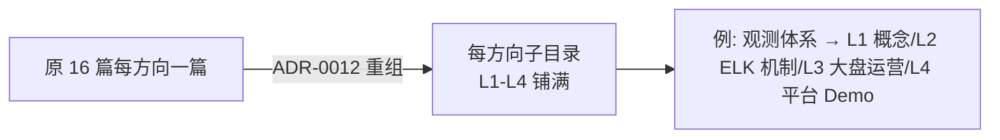
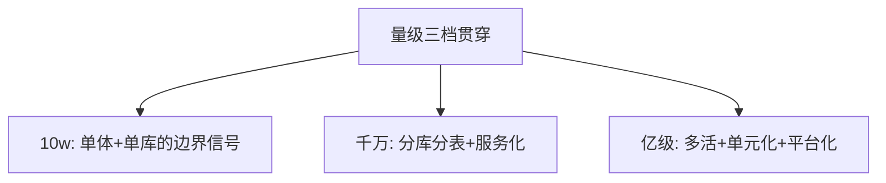

# 大规模架构实战（重组规划）

> large-scale 系列按 ADR-0012 进入重组：现有 16 篇「每方向一篇」将逐方向拆为独立子目录系列，本文是重组路线图与进度表。

## 一句话摘要

重组原则：每个方向（观测/存储选型/迁移/网关防护/发布/稳定性武器库……）拆为独立子目录铺 L1-L4，原 16 篇成为各方向的「专题层首篇」并按工程级标准扩写；已启动：存储架构亿级选型全景。

## 篇目规划（L1-L4，ADR-0012 方向=子目录）

| 篇目/层 |
|---|
| 重组排期 1 · 存储架构亿级选型全景（已有专题篇，扩写至工程级） · ⏳ |
| 重组排期 2 · 观测体系（ELK/指标/告警/值守 拆四层） · ⏳ |
| 重组排期 3 · 流量接入与防护（DNS/网关/防护 拆四层） · ⏳ |
| 重组排期 4 · 发布体系与稳定性武器库（拆四层） · ⏳ |
| 重组排期 5 · 数据面与大数据链路（拆四层） · ⏳ |
| 重组排期 6 · 交易链路决策与接口治理（拆四层） · ⏳ |

**机制定位与取舍**：本方向的每个机制（原理与底层实现）都在篇目里锚定了位置——规划期的取舍是「机制原理优先于操作罗列」，代价是入门读者需要更多耐心，收益是后续每篇的参数与步骤都有原理可归因；架构上各层互为上下游，边界由「机制讲透」与「操作可执行」这条线划分。

## 演进视角

large-scale 的重组本身就是 ADR-0012 的第一个应用案例：从「每方向一篇」到「每方向一域」——重组的过程也是内容从知识描述升级为工程手册的过程。

## 📌 数据与事实声明

- 本文件为方向骨架规划（篇目标注 ⏳ 待写 / ✅ 已落地），依据 ADR-0012 工程级深度标准与 4 层架构规范；量级与参数数字均为行业认知量级，落篇时以实测替换。

## 📚 参考资料

- ADR-0012；本系列专题层原 16 篇（重组素材源）。

## ⚡ 速查卡（大规模架构入门层精选）

| 机制 | 一句话结论（为什么） | 哪里会坏 | 篇目 |
|---|---|---|---|
| 分层全景 | 五层架构（接入/服务/数据/横向/纵向），量级决定每层形态 | 各层不同步演进 | [篇1](./入门层/从零开始认识大规模架构系列/1_大规模架构是什么与分层全景-入门.md) |
| 流量接入 | DNS/CDN/网关/WAF 四道防线顺序不可变 | 网关单点=全站不可达 | [篇2](./入门层/从零开始认识大规模架构系列/2_流量接入与防护-DNS网关CDN-入门.md) |
| 服务层 | 微服务拆分粒度按团队自治定，非技术偏好 | 拆太细=治理成本爆炸 | [篇3](./入门层/从零开始认识大规模架构系列/3_服务层设计-微服务与服务治理-入门.md) |
| 数据层 | 缓存→读写分离→分库分表→异构，渐进演进 | 分片键选错=数据倾斜 | [篇4](./入门层/从零开始认识大规模架构系列/4_数据层设计-分库分表与缓存-入门.md) |
| 稳定性 | MTTR 最短化而非零故障 | 不演练的预案=没有预案 | [篇7](./入门层/从零开始认识大规模架构系列/7_稳定性保障-限流降级与容灾-入门.md) |
| 发布 | 灰度放量+指标验证+自动回滚 | 灰度比例配错=全量发布 | [篇8](./入门层/从零开始认识大规模架构系列/8_发布与变更管理-灰度与回滚-入门.md) |
| FinOps | 标签归集+单位成本+四大杠杆 | 无标签=成本无主 | [篇9](./入门层/从零开始认识大规模架构系列/9_成本与容量规划-FinOps实践-入门.md) |
| 多活容灾 | 三阶路线按 RPO/RTO 定价 | 不演练的容灾=没有容灾 | [篇12](./入门层/从零开始认识大规模架构系列/12_多活与容灾-同城双活与异地多活-入门.md) |

> 金句：大规模架构不是加机器，是分层重构——量级决定架构，架构决定团队，团队决定下一次演进的路径。
