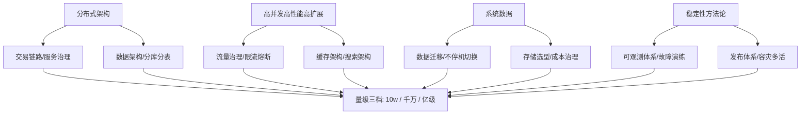
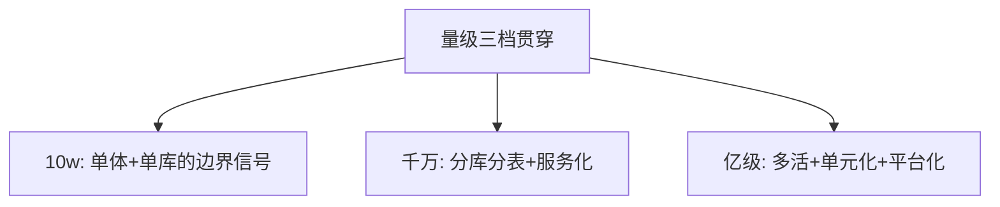

# 大规模架构实战（重组规划）

> large-scale 系列按 ADR-0012 进入重组：现有 16 篇「每方向一篇」将逐方向拆为独立子目录系列，本文是重组路线图与进度表。

## 一句话摘要

重组原则：每个方向（观测/存储选型/迁移/网关防护/发布/稳定性武器库……）拆为独立子目录铺 L1-L4，原 16 篇成为各方向的「专题层首篇」并按工程级标准扩写。

## 全局心智模型

## 四层覆盖全景

| 层 | 系列 | 覆盖维度 | 进度 |
|---|---|---|---|
| L1 入门层 | 从零开始认识大规模架构系列 | 14 篇全维度入门 | 🟢 完成 |
| **L2 特性层** ✨ | 6 个系列 | 每方向深度机制 | 🔴 待补 |
| L3 专题层 | 6 个子目录 | 行业级实战 | 🟡 部分空 |
| L4 整合层 | 从零实现大规模架构 Demo | 全场景 Demo | ❌ 缺失 |

## L2 特性层规划（6 系列）

| 系列 | 覆盖你的维度 | 篇目 |
|---|---|---|
| 深入理解流量治理系列 | 高并发 + 稳定性 | 限流算法/熔断/降级/路由/热点治理 |
| 深入理解数据架构系列 | 系统数据 | 分库分表策略/缓存架构/搜索架构 |
| 深入理解观测体系系列 | 稳定性方法论 | 指标/日志/链路/大盘/告警 |
| 深入理解发布与稳定性系列 | 稳定性方法论 | 灰度/回滚/故障演练/SLO |
| 深入理解成本治理系列 | 分布式架构 | FinOps/资源优化/弹性伸缩 |
| 深入理解交易链路系列 | 分布式架构 | 订单/支付/一致性/幂等 |

## L3 专题层待补（6 个空目录）

| 目录 | 应补内容 |
|---|---|
| 安全与合规 | 零信任/合规/审计实战 |
| 稳定性武器库 | SLO/SLI/SLA + 故障演练 |
| 观测体系运营 | 运营机制 + 告警治理 |
| 团队与工程文化 | 平台工程 + 效能 |
| 千万订单系统实战 | 全链路实战深挖 |
| 数据迁移与不停机切换 | 迁移策略 + 回滚方案 |

## L4 整合层规划

| 篇目 | 内容 |
|---|---|
| 从零实现大规模架构 Demo | 高可用 + 分库分表 + 缓存 + 消息 + 监控 |

## 量级贯穿

## 机制定位与取舍

本方向的每个机制（原理与底层实现）都在篇目里锚定了位置——规划期的取舍是「机制原理优先于操作罗列」，代价是入门读者需要更多耐心，收益是后续每篇的参数与步骤都有原理可归因；架构上各层互为上下游，边界由「机制讲透」与「操作可执行」这条线划分。

## 演进视角

large-scale 的重组本身就是 ADR-0012 的第一个应用案例：从「每方向一篇」到「每方向一域」——重组的过程也是内容从知识描述升级为工程手册的过程。

## 📌 数据与事实声明

- 本文件为方向骨架规划（篇目标注 ⏳ 待写 / ✅ 已落地），依据 ADR-0012 工程级深度标准与 4 层架构规范；量级与参数数字均为行业认知量级，落篇时以实测替换。

## 📚 参考资料

- ADR-0012；本系列专题层原 16 篇（重组素材源）。

## ⚡ 速查卡（大规模架构入门层精选）

|| 机制 | 一句话结论（为什么） | 哪里会坏 | 篇目 |
||---|---|---|---|
|| 分层全景 | 五层架构（接入/服务/数据/横向/纵向），量级决定每层形态 | 各层不同步演进 | [篇1](./入门层/从零开始认识大规模架构系列/1_大规模架构是什么与分层全景-入门.md) |
|| 流量接入 | DNS/CDN/网关/WAF 四道防线顺序不可变 | 网关单点=全站不可达 | [篇2](./入门层/从零开始认识大规模架构系列/2_流量接入与防护-DNS网关CDN-入门.md) |
|| 服务层 | 微服务拆分粒度按团队自治定，非技术偏好 | 拆太细=治理成本爆炸 | [篇3](./入门层/从零开始认识大规模架构系列/3_服务层设计-微服务与服务治理-入门.md) |
|| 数据层 | 缓存→读写分离→分库分表→异构，渐进演进 | 分片键选错=数据倾斜 | [篇4](./入门层/从零开始认识大规模架构系列/4_数据层设计-分库分表与缓存-入门.md) |
|| 稳定性 | MTTR 最短化而非零故障 | 不演练的预案=没有预案 | [篇7](./入门层/从零开始认识大规模架构系列/7_稳定性保障-限流降级与容灾-入门.md) |
|| 发布 | 灰度放量+指标验证+自动回滚 | 灰度比例配错=全量发布 | [篇8](./入门层/从零开始认识大规模架构系列/8_发布与变更管理-灰度与回滚-入门.md) |
|| FinOps | 标签归集+单位成本+四大杠杆 | 无标签=成本无主 | [篇9](./入门层/从零开始认识大规模架构系列/9_成本与容量规划-FinOps实践-入门.md) |
|| 多活容灾 | 三阶路线按 RPO/RTO 定价 | 不演练的容灾=没有容灾 | [篇12](./入门层/从零开始认识大规模架构系列/12_多活与容灾-同城双活与异地多活-入门.md) |

> 金句：大规模架构不是加机器，是分层重构——量级决定架构，架构决定团队，团队决定下一次演进的路径。
> 金句：大规模架构不是加机器，是分层重构——量级决定架构，架构决定团队，团队决定下一次演进的路径。
