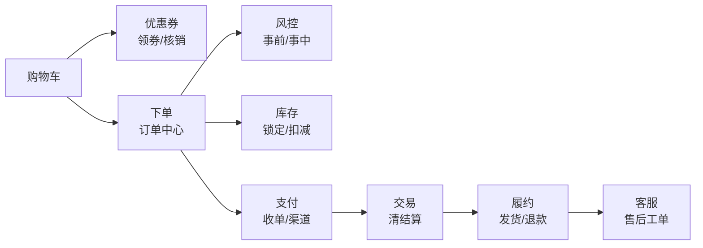

# 大规模架构实战系列导读：业务线 × 四面体全体系

> 用户的原话就是本系列的命题：「支付，下单，库存，订单，购物车，优惠券，风控，交易，等等，几十个链路的分工合作，数据一致性，千万并发，亿级流量，10w QPS，机器，性能，瓶颈，流量发布，服务发布，告警，大盘，DNS，日志，ELK，指标，降级，SLA，熔断，灰度发布，代码合并，1024张表，HBase，ES，大数据，实时订单大盘，后台数据大盘，退款，客服，数据面，基本面，AI治理，AI客服，线上治理。全体系。」——技术架构不是悬空的，它长在业务线上；业务线不是孤立的，它跑在四个面上。

## 一句话摘要

全体系 = **业务面**（购物车→下单→风控→库存→订单→支付→履约→退款→客服，几十个链路的分工与一致性）× **技术面**（千万并发/亿级流量/10 万 QPS/1024 张表/HBase/ES/机器与瓶颈）× **数据面**（实时订单大盘/后台数据大盘/大数据/日志 ELK）× **治理面**（流量发布/灰度发布/代码合并/告警/降级/SLA/熔断/AI 治理/AI 客服/线上治理）——四个面互相咬合，缺任何一面都不是生产级。

## 一、业务面：一笔交易的几十个链路

链路分工的三个层次：**入口链**（购物车/优惠券——读多写少，缓存主导）、**交易主链**（下单/风控/库存/订单/支付——强一致与吞吐的战场）、**后链**（清结算/退款/客服——最终一致与对账主导）。数据一致性按链路分级：主链同步短事务，后链异步长流程 + 对账兜底。

## 二、技术面：量级与基建

量级阶梯：**千万并发**（架构目标）→ **亿级流量**（日 PV，接入层消化）→ **10 万 QPS**（单接口工程极限）→ **1024 张表**（分库分表终态）→ **HBase/ES**（海量存储与检索双引擎）。机器、性能、瓶颈是这条阶梯上的持续战斗——每篇文章的量级前提都从这里出发。

## 三、数据面：看得见的世界

- **实时订单大盘**：交易链路的秒级脉搏（Flink 消费 binlog/MQ → 大屏）——大促指挥部的眼睛
- **后台数据大盘**：经营视角（T+1 为主，数仓产出）——基本面
- **日志（ELK）与指标（Prometheus）**：机器与服务的两个观测平面
- **大数据**：全量数据的最终归宿（数仓分层 ODS/DWD/DWS/ADS）

## 四、治理面：让体系可持续

**发布三件套**：流量发布（新入口放量）→ 灰度发布（金丝雀/百分比切流）→ 代码合并（主干质量门禁）。**稳定性三件套**：告警（分级/收敛）→ 降级（预案/开关）→ 熔断（依赖防护），SLA 是它们的度量契约。**线上治理**：容量水位/慢查询/资源碎片/告警噪音的日常运营。**AI 治理与 AI 客服**：异常检测/根因推荐进入运维链路；智能客服承接售后分流——治理的下一站。

## 五、篇目地图（四面 × 场景）

| 篇 | 场景 | 主面 |
|---|---|---|
| 0 | 本导读：四面体全体系地图 | — |
| 1 ✅ | 千万订单系统从零搭建 | 业务+技术 |
| 2 | **业务线全景：几十个链路的分工与一致性** | 业务面 |
| 3 | 亿级流量接入（DNS→网关→防护） | 技术 |
| 4 | 10 万 QPS 接口工程 | 技术 |
| 5 | 存储兵器谱：1024 张表/HBase/ES 选型 | 技术+数据 |
| 6 | 数据面建设：实时订单大盘与后台大盘 | 数据面 |
| 7 | 大数据链路：从 binlog 到数仓分层 | 数据面 |
| 8 | 接口治理与系统治理 | 治理面 |
| 9 | 发布体系：流量发布/灰度/代码合并 | 治理面 |
| 10 | 观测体系：日志 ELK/指标/告警/大盘 | 治理面 |
| 11 | 稳定性武器库：SLA/降级/熔断（联动 stability 系列） | 治理面 |
| 12 | 早高峰与流量突发 | 技术+治理 |
| 13 | 数据迁移实战 | 技术 |
| 14 | TB 级日志与千万级日增量归档 | 技术+数据 |
| 15 | 1000+ 服务生产级维稳 | 治理面 |
| 16 | AI 治理与 AI 客服：线上治理的下一站 | 治理面 |

## 六、怎么读

- **业务视角读者**：2 → 1 → 6 → 8（业务线全景是理解一切的入口）
- **后端工程师**：1 → 4 → 5 → 12（量级驱动的技术决策）
- **SRE/稳定性**：10 → 11 → 15 → 16（观测→防护→规模→AI）
- **数据工程师**：6 → 7 → 14（数据面三篇）

前置：分布式系统设计入门系列 + 稳定性系列（本系列的治理篇与它们深度联动，不重复展开概念）。

## 📌 数据与事实声明

- 写于 2026-09-11；系列命题与术语来自业务视角设定（业务线/数据面/基本面/AI 治理/线上治理等），量级为场景基准
- 方法论口径：四面体划分（业务/技术/数据/治理）为本系列对行业公开实践的教学归纳
- 免责：各篇方案需按实际业务裁剪

## 📚 参考资料

| 类型 | 标题 | 来源 |
|---|---|---|
| 书 | 《数据密集型应用系统设计》（DDIA） | 公开出版 |
| 书 | 《SRE: Google 运维解密》 | 公开出版 |
| 行业实践 | 电商大促技术体系公开分享 | 公开报道 |
