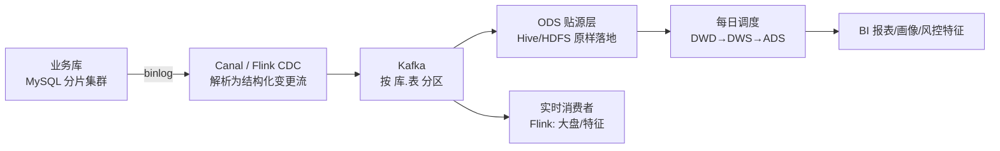
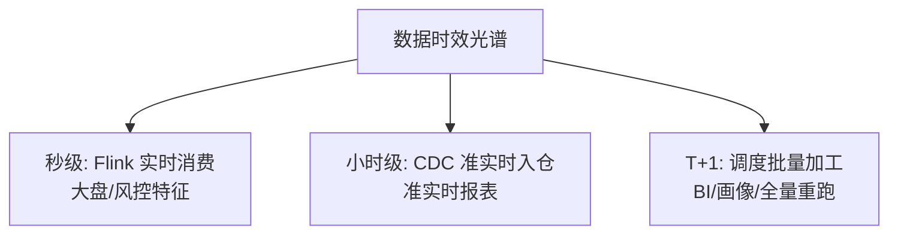

# 大数据链路：从 binlog 到数仓分层的全量数据体系

> 业务库里的每一条变更，如何在分钟级出现在数仓、报表与算法特征里？大数据链路 = **采集（binlog/CDC）→ 传输（MQ）→ 落地（ODS）→ 加工（分层建模）→ 消费（报表/算法/画像）**——它是数据面与治理面的地基：没有可靠的采集链路，大盘、报表、AI 全是空中楼阁。

## 一句话摘要

大数据链路的标准形态：**binlog 订阅（Canal/Flink CDC）捕获业务库变更 → MQ 缓冲与分区 → ODS 贴源落地 → DWD/DWS/ADS 分层加工 → 上游消费（报表/画像/特征）**；纪律三条：ODS 保真不改原数据、下游消费幂等（可重跑）、口径在 DWD 统一定义——链路的可靠性决定整个数据面的可信度。

## 本文核心

**核心机制一句话**：binlog 是业务库变更的「天生事件流」——订阅它比业务代码发消息更可靠（不侵入业务、不遗漏变更），CDC 工具把它变成结构化数据流，喂给数仓与实时计算。

**机制链**：MySQL binlog → Canal/Flink CDC 解析 → Kafka 分区（按表/主键）→ ODS 落地（Hive/HDFS）→ 每日/小时调度加工（DWD 清洗 → DWS 聚合 → ADS 报表）→ 下游消费（BI/算法/画像/风控特征）。

**失效点/边界**：binlog 解析要处理 DDL 变更（表结构变了链路要跟）；全量+增量的一致性衔接（初始化快照 + 增量拼接的断点管理）；数仓跑批延迟（上游依赖链长，一处延迟全链顺延）。

## 一、背景：为什么采集走 binlog 而不是业务发消息

业务代码发消息（双写）有三个先天缺陷：**侵入业务**（每个写操作都要埋消息代码）、**会遗漏**（直接 UPDATE 数据库的运营操作、历史脚本不发消息）、**语义不完整**（消息只有「发生了什么」，binlog 有「数据变成了什么」——before/after 镜像）。

binlog 订阅（CDC，Change Data Capture）的三个优势：**零侵入**（业务代码无感知）、**无遗漏**（数据库所有变更必然写 binlog）、**带前后镜像**（字段级变更可感知）。代价：binlog 解析的工程复杂度（DDL 处理/大事务/格式版本）——Canal/Flink CDC 把复杂度封装了。

> 💡 实战提示：CDC 工具选型看两点——DDL 变更的自动适配能力（加字段链路不断）与断点续传的可靠性（宕机后从位点恢复不丢不重）。这两点决定 CDC 链路的运维成本。

## 二、核心：链路全景与分区设计

**分区设计**：Kafka 按「库.表」分区保证单表变更有序（同一行按主键再分区更细）——订单表变更的顺序性是下游状态机正确消费的前提。**ODS 保真原则**：贴源层原样存储（含 before/after 镜像），不做任何清洗——清洗错了可以重跑，原始数据丢了就没了。

**调度加工（分层）**：调度系统（DolphinScheduler/Airflow）按依赖编排每日/小时任务：DWD 清洗（去重/补维度/口径统一）→ DWS 按主题聚合（人/商品/商户日粒度）→ ADS 应用层供报表。**分层复用是效率核心**：下游报表消费 DWS 而不是各自重扫 ODS——聚合算一次，处处使用。

## 三、机制：可靠性三支柱

**① 不丢：断点与重放**。CDC 位点（binlog offset）定期持久化，宕机后从位点恢复；ODS 层保留原始事件，**任何下游加工错误都可以从 ODS 重跑**——「可重跑」是数据链路可靠性的核心语义（对比业务 MQ：消息消费确认后即删，重放成本高）。

**② 不重：幂等消费**。重跑必然产生重复数据——下游表用「主键覆盖」语义（insert overwrite 按分区覆盖）或去重窗口处理。**幂等不是可选是必须**：数据链路的重跑是常态（口径变更/历史修复都靠重跑）。

**③ 可校验：链路对账**。源库行数 vs ODS 行数（按表按天比对）、关键字段 checksum 比对——**采集链路自己也要被对账**（它是对账体系的数据供给方，自己错了全链错）。

链路的量级形态：万级表变更/秒的峰值（大促下单洪峰）由 Kafka 缓冲削峰，ODS 按天落地的数据量达 TB 级——**量级决定链路的分区数与集群容量，量级翻倍前要先扩链路**。

## 四、实践：典型场景与消费矩阵

| 消费方 | 数据需求 | 时效 | 从哪取 |
|---|---|---|---|
| 实时大盘 | 订单事件流 | 秒级 | Kafka 直接消费（Flink） |
| BI 报表 | 全量明细+聚合 | T+1 | ADS/DWS |
| 推荐画像 | 用户行为明细 | 小时级 | DWD |
| 风控特征 | 实时行为+历史统计 | 秒+T+1 混合 | Kafka + DWS |
| 机器学习 | 全量历史特征 | 离线批量 | 数仓全层 |

**一份数据多种消费**是链路的建设目标——ODS/DWD 建好后，新需求（新报表/新特征）只是「多一个下游消费者」，不再需要新建采集链路。**数据链路的边际成本递减，是它区别于烟囱式建设的核心价值**。

## 与实时大盘的关系

实时大盘（第 9 篇）是本链路的「实时消费者」分支：Flink 既做实时聚合也做 CDC 入仓（Flink CDC 一体化）。两者的分工：大盘要秒级（Kafka 直消）、数仓要全量准确（ODS 重放）——**同一份 binlog，按时效要求分流到不同消费形态**。

## 你们可能会问

**Q1：实时链路（Flink）和离线数仓数据不一致怎么办？**
Lambda 架构的老问题——主流做法：以离线为准做最终口径，实时层标注「近似」；Kappa 架构（纯流式重算）是演进方向但重算成本高。两条腿走路时，**指标口径登记表必须区分「实时口径」与「离线口径」**。

**Q2：新表接入链路要多久？**
标准化流程：binlog 白名单开通 → Kafka topic 创建 → ODS 落地 → DWD 建模——工具化成熟后半天级；没有工具链的团队会拖一周，这是数据平台建设的投资点。

## 追问链与我的判断

**追问链 1**：「binlog 直接进数仓不就行，为什么要 Kafka 中转？」→ Kafka 是「削峰+重放+多消费者」的缓冲层——直连意味着 CDC 工具故障直接影响数仓 → 中转层的成本换的是链路解耦 → **我的判断：数据链路的每一跳都要问「这一跳解耦了什么」，答不出就合并**。

**追问链 2**：「数仓分层这么多层，小团队也要分吗？」→ 分层的本质是「口径治理+复用」，不是层数仪式——两层（ODS+应用层）起步完全可行，报表过 10 张出现重复计算时再引入中间层 → **按痛点加层，不按教科书加层**。

**追问链 3**：「CDC 断了一天，数据怎么补？」→ 位点还在就能重放（ODS 按天分区重跑）→ 位点丢了呢？→ 全量快照重新初始化 + 增量拼接 → **断点管理是 CDC 运维的命门，位点监控要进告警体系**。

## 常见误区

- **误区一：binlog 采集侵入业务需要改代码**。恰恰相反，CDC 的核心价值是零侵入——业务团队无感知
- **误区二：ODS 要清洗后再落地**。ODS 的定义就是贴源保真——清洗在 DWD 做，ODS 脏了无法重跑
- **误区三：数据链路建好就完了**。表结构变更/新增表/下线表都要同步链路变更——链路的运维（DDL 适配/位点管理/延迟监控）是长期工作，监控盲区是链路故障的常见根因

## 自测三问

1. **为什么采集走 binlog 而不是业务双写？**
   - 零侵入、无遗漏、带前后镜像——双写会漏（直改库的操作）且侵入业务；binlog 是数据库变更的完整事件流。

2. **数仓为什么要分层（ODS/DWD/DWS/ADS）？**
   - 分层治理口径与复用：清洗规则在 DWD 唯一、聚合在 DWS 复用、ADS 只做应用——没有分层就是每张报表各自算一遍。

3. **数据链路怎么保证「可重跑」？**
   - ODS 保真存储（原样事件可重放）+ 下游幂等（分区覆盖语义）+ 调度支持断点重跑——任何加工错误都能从 ODS 重来。

## 5W 速记卡

| W | 一句话 |
|---|---|
| What | binlog CDC 采集 → MQ → 数仓分层 → 多消费的数据全链路 |
| Why | 零侵入无遗漏地让业务数据服务于分析/画像/风控 |
| Where | 业务库到数仓/实时计算的完整管道 |
| When | 表结构变更同步链路、断点恢复、每日调度加工 |
| Who | 数据团队建链路管调度，业务方消费数据 |

## 开放问题

- **湖仓一体的落地**：数仓（Hive）与数据湖（Iceberg/Hudi/Paimon）的选型之争仍在演进——湖的灵活性（schema evolution/实时 upsert）与仓的成熟治理各有优势
- **实时数仓的口径一致性**：Flink 实时口径与离线口径的天然漂移（Lambda 架构老问题），流批一体的完全统一仍在路上

## 核心带走

**30 秒复述**：大数据链路 = binlog CDC 零侵入采集 → Kafka 分区有序 → ODS 保真落地 → 分层加工（DWD 口径统一/DWS 复用聚合/ADS 应用）→ 多消费（报表/画像/风控/大盘）；可靠性三支柱：不丢（断点重放）/不重（幂等）/可校验（链路对账）。**失效边界**：ODS 清洗后无法重跑、DDL 未适配断链、链路无延迟监控三处盲区。

## 📌 数据与事实声明

- 写于 2026-09-11；CDC/数仓分层/湖仓概念为行业公开实践与开源项目官方口径（Canal/Flink CDC/Iceberg）
- 免责：组件选型与调度工具按团队基建裁剪

## 📚 参考资料

| 类型 | 标题 | 来源 |
|---|---|---|
| 官方文档 | Flink CDC | ververica.github.io/flink-cdc-connectors |
| 官方文档 | Canal（阿里开源 binlog 订阅） | github.com/alibaba/canal |
| 书 | 《大数据之路：阿里巴巴大数据实践》 | 公开出版 |
