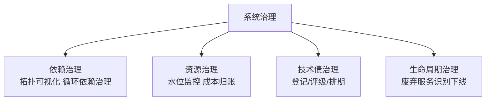
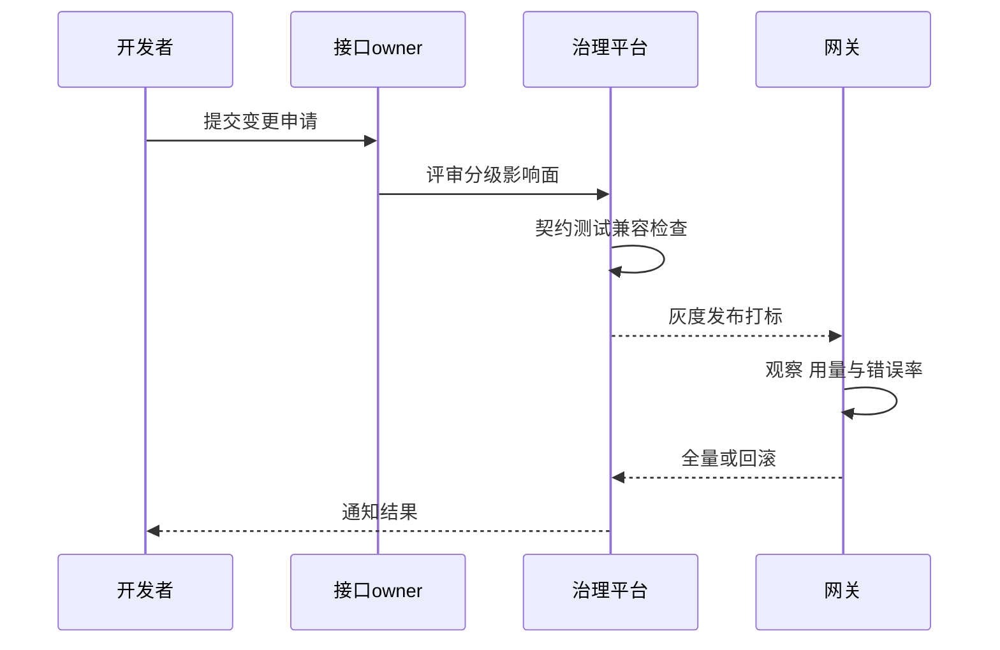
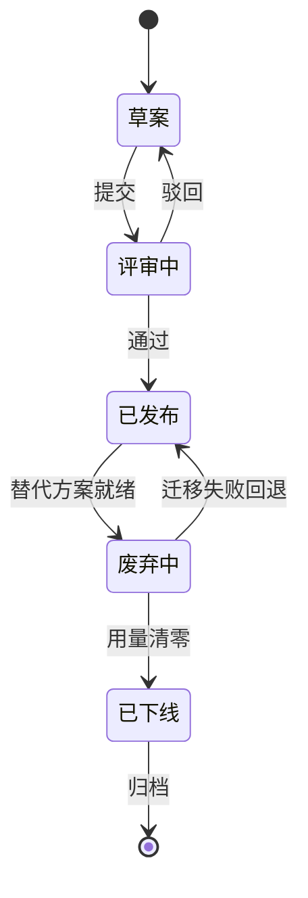

# 接口治理与系统治理：让规模不变成混乱

> 服务的数量会自己长大：今天 50 个服务，明年 300 个。治理回答的问题是——**规模翻倍时，协作成本是线性增长还是失控增长**？接口治理管「服务对外的契约」（谁提供、谁消费、怎么变更），系统治理管「系统自身的健康」（依赖关系、资源水位、技术债、废弃服务）。没有治理的微服务，是分布式单体加了一层网络开销。

## 一句话摘要

接口治理 = **契约生命周期管理**（注册/文档/版本/变更通知/下线流程，每个接口有 owner 与 SLA）；系统治理 = **全景健康运营**（依赖拓扑可视化、资源水位监控、技术债与废弃服务清理、稳定性五问卡点）——治理的本质是把「隐性约定」变成「显性资产」，让每一个新增/变更/废弃都走明路。

## 本文核心

**核心机制一句话**：治理 = 把服务与接口从「代码里的隐式存在」变成「登记在册、有 owner、有 SLA、有生命周期的显性资产」，并用自动化卡点强制执行。

**机制链**：接口注册（API 网关统一暴露 + 文档自动生成）→ 消费关系登记（谁调谁，网关与 trace 数据自动发现）→ 变更走版本与通知（不兼容变更必须升版本+迁移期）→ 依赖拓扑自动绘制 → 废弃检测（零流量服务/接口自动识别下线）→ 评审卡点（新服务过稳定性五问）。

**失效点/边界**：治理靠人工表格 = 必然过期（自动化发现是生命线）；治理过严会拖慢迭代——治理的对象是「契约与边界」，不是「实现细节」。

## 一、背景：没有治理的规模是什么样

微服务化的三年，服务从 50 涨到 300，随后出现的典型症状：

- **接口考古**：一个接口谁提供的？三个团队都说不是自己的；文档在哪？在某个人的离职电脑里
- **调用黑洞**：改了一个接口的返回字段，三个下游静默故障——调用关系没人说得全
- **僵尸服务**：还在运行、还在消耗资源、但已经没有任何流量的服务，没人敢下线（怕背后有人用）
- **重复建设**：三个团队各写了一个「统一鉴权组件」——因为互相不知道

这些症状的共同根因：**服务与接口是隐式的（只存在于代码与部署里），没有被当作需要管理的资产**。治理就是把它们资产化。

## 二、核心：接口治理的五件事

1. **统一暴露**：所有对外接口经 API 网关暴露（自带注册/鉴权/限流/审计）——网关是接口治理的天然基础设施，绕过网关的接口是治理的第一个堵漏对象
2. **文档自动化**：OpenAPI 注解生成文档（不手写）——手写文档必然过期，代码即文档靠工具链
3. **版本纪律**：不兼容变更必须升版本（v1/v2 并行），旧版本给迁移期（3-6 个月）后下线；兼容性检查进 CI（破坏性变更自动识别）
4. **SLA 挂牌**：每个接口标注可用性承诺与限流配额——**没有 SLA 的接口谈不上治理**（无承诺则无验收）
5. **废弃流程**：网关流量数据自动识别零流量接口 → 通知 owner → 公示期 → 下线。**敢下线是治理成熟度的标志**——不敢删的代码会让系统持续膨胀

## 三、机制：系统治理的全景健康

- **依赖治理**：调用拓扑自动绘制（从 trace 数据生成服务依赖图）——循环依赖、跨层调用（下游调上游）、超深调用链（A→B→C→D→E）在图上一目了然。**依赖图是架构评审的基础输入**：新服务上线先看它把依赖图改成了什么样
- **资源治理**：每个服务的水位（CPU/内存/QPS 容量占比）+ 成本归账（哪个团队花多少钱）——**成本可视化的第一天，就会冒出一堆「原来这么贵」的服务**，这是治理最快的 ROI
- **技术债治理**：债要登记（问题/影响面/修复成本）与评级（高/中/低），进入排期而非「以后再说」——技术债不可怕，**不可见的技术债才可怕**
- **生命周期治理**：服务从创建到下线的全程记录（创建时间/owner/最近发布/最近流量）——零流量 + 无 owner 的服务进入废弃流程

> 💡 实战提示：治理落地的第一个月别铺开全部卡点——先上「零流量服务预警」与「接口兼容性 CI 检查」两个最痛的，让团队尝到治理的甜头（拦住真问题），再逐步加码。一上来全面卡点只会收获敌意。

## 四、实践：典型场景与卡点设计

**典型场景**：

- **新服务上线评审**：过「稳定性五问」（SLO/限流/降级/压测/监控）+ 依赖图影响评估 + SLA 挂牌——评审不是官僚流程，是把治理要求前置到设计期
- **接口变更**：CI 兼容性检查 → 网关灰度发布 → 消费方通知 → 观察期 → 全量
- **季度治理体检**：零流量服务清单、无 owner 接口清单、超水位服务清单、技术债排行榜——**治理的输出物是可执行的清单**

**卡点设计（自动化强制的治理）**：治理靠自觉必失败，卡点才是保障——CI 阶段：接口兼容性检查/文档生成检查；上线阶段：网关注册检查/SLA 必填；运行阶段：零流量自动预警。**能用自动化卡住的治理项，绝不依赖人的自觉**（与 check-mechanism 自检思路同源）。

治理颗粒度的取舍是治理设计的第一决策：治理项过多（每个函数都要登记）拖垮迭代速度，过少则失控——平衡点在「契约与边界必管、实现细节放开」，并随规模动态调整。这套治理的代价也要认账：登记与评审消耗工时，卡点偶尔挡住紧急上线——**用可预期的治理成本，换不可预期的故障成本**，是划算的交换。

## 与接口设计规范的区别

接口设计规范（RESTful 风格/错误码/命名）管「单个接口怎么写好」；接口治理管「几百个接口怎么组织、变更、退役」——前者是代码级，后者是资产级。两者都要，但规模化的痛点在后者的治理上。

治理能力的演进与规模同步：早期 Excel 登记服务清单 → 中期 wiki 维护文档 → 成熟期平台自动发现与卡点强制——**治理工具化的每一步，都是被「表格过期」的教训逼出来的**。

## 追问链与我的判断

**追问链 1**：「治理平台建好了，团队不用怎么办？」→ 卡点强制（不登记不能上线）→ 强制引发抵触呢？→ 让治理「顺路」完成（平台自动化，开发者零额外操作）→ **我的判断：治理的体验成本决定它的生死——顺路的治理才可持续**。

**追问链 2**：「接口下线真的有人会忘吗？」→ 会——零流量接口的下线阻力是「万一有人用」的恐惧 → 数据说话：网关零流量 90 天 + 消费方公示期 → 恐惧消除靠证据，不靠勇气。

**追问链 3**：「技术债评级谁说了算？」→ 债务的「利息」由受影响的团队感受，架构组只做评级校准——**技术债的治理权在受害者手里，评级权在架构组手里**，分开才健康。

## 常见误区

- **误区一：治理 = 建个文档站**。文档站是产出物之一，没有自动化发现与卡点的文档站必然过期——治理的核心是流程与卡点
- **误区二：治理是架构组一个团队的事**。架构组定规则与平台，但接口与服务的治理责任在 owner——「我的服务我治理」+ 架构组做裁判与工具
- **误区三：治理越细越好**。治理本身有成本（登记/评审/审计），**治理颗粒度要匹配规模**——50 个服务的治理和 500 个服务的治理完全不同，过度治理在早期是拖累
- **误区四：下线服务有风险就不下**。不动的僵尸服务是安全漏洞与运维负担的藏身处——零流量检测 + 公示期 + 灰度下线，风险可控

## 你们可能会问

**Q1：治理和 Platform Engineering 什么关系？**
平台工程是治理的载体——把治理要求（SLA 挂牌/兼容检查/水位监控）做成平台能力，开发者「顺路合规」而不是「专门合规」——这是治理成本最低的形态。

**Q2：服务太少需要治理吗？**
需要轻量版——接口文档 + 依赖登记 + 季度体检，三件事起步；治理体系随规模升级，但「边界纪律」从第一个服务就要有。

## 工程级深化：治理参数、下线步骤与量级分档

> 治理的难点不是定规范而是「让规范可执行」：接口怎么分级、废弃怎么推进、依赖怎么收敛——全都要落成参数和流程。

### 参数级配置清单（接口与系统治理）

| 配置项 | 默认值 | 10w 级推荐 | 千万级推荐 | 亿级推荐 | 为什么 |
|---|---|---|---|---|---|
| 接口分级 | 无 | 二级 | 三级（P0/P1/P2） | 三级+调用方准入 | 分级决定治理强度：P0 接口变更双人复核，无分级则无差别放行 |
| 废弃观察期 | 无 | 30 天 | 60-90 天 | 90 天+用量清零线 | 观察期给调用方迁移时间，但必须配「用量归零」硬条件而不是到期自动删 |
| 文档覆盖率 | 无 | 60% | 90% P0P1全量 | 100% P0 全量 P1 抽检 | 文档覆盖率当指标管，P0 接口无文档等于裸奔 |
| 依赖上限 | 无 | 无 | 单服务出边低于 15 | 低于 10+扇入预警 | 依赖扇出是复杂度指标，超限强制拆分评审 |
| 元数据新鲜度 | 无 | 季度 | 月度 | 自动采集 | 手工登记的元数据必然过期，亿级靠 CI 自动采集（部署时上报依赖） |
| 治理巡检频率 | 无 | 季度 | 月度 | 周度自动+月度人工 | 巡检是治理的心跳，频率低于腐化速度就永远在追 |
| 兼容性破坏线 | 无 | 口头约定 | 大版本+灰度 | 版本共存+自动检测 | 破坏性变更必须可检测（契约测试），靠自觉的兼容承诺必然违约 |

### 步骤级操作：一个接口的安全下线

前置条件：接口用量数据（调用量、调用方清单）从网关导出，替代方案已上线。

- Step 1 通知：按调用方清单逐一通知，给出现替代接口与迁移文档。验证点：每个调用方有明确确认记录，沉默不等于同意。
- Step 2 打标：接口标记为废弃，响应头与文档同步标注。验证点：调用方开发者在日志与文档两个渠道都能看到废弃提示。
- Step 3 观察：观察期内周报用量曲线给所有调用方。验证点：用量单调下降，对不肯迁移的调用方升级推动（拉其上级）。
- Step 4 熔断演练：用量低于阈值后，先按比例注入 503（如 1%），观察是否还有隐匿调用方。验证点：注入期无业务投诉，隐匿调用方全部现身。
- Step 5 下线：全量 503 一周无投诉后代码下线，网关路由归档。验证点：归档保留路由定义与调用方清单，以备追溯。
- 回退：任何阶段出现重大投诉，撤掉 503 注入恢复全量——下线流程的可回退性依赖「只是打标+注入」，代码没动，随时可退。

### 量级分档下的治理取舍

10w 级（约定大于平台）：二三十个服务的治理靠团队默契 + 一份接口规范文档就够，治理平台在这个量级是负资产。该档位的 Trade-off：规范执行靠人盯，换的是零平台建设成本。

千万级（平台化起点）：服务目录、网关用量统计、废弃打标开始平台化，因为人盯不过来了。该档位的 Trade-off：为治理平台投入一个小团队，换治理动作可量化（覆盖率、新鲜度、超期废弃接口数）。

亿级（治理即基础设施）：契约测试、自动元数据采集、依赖拓扑自动生成成为基础设施；治理指标进工程效能季度汇报。该档位的 Trade-off：治理有了「执法权」（不合规范的变更卡在流水线），代价是流水线成为新的关键路径——治理平台自己的可用性也要被治理。

### 接口变更评审时序

### 状态视角：接口生命周期状态机

「废弃中」到「已发布」的回退边常被漏画：替代方案中途发现缺陷，接口必须能快速恢复正式状态——废弃不是单向门，是可撤销的操作。

### 边界与反方案深推

接口治理最难划的边界是「向后兼容的义务边界」：provider 对 caller 的兼容义务到哪天为止？无限兼容会让接口背着五年的历史包袱，过早停止兼容又砸到还没迁移完的调用方。可执行的答案是「兼容义务与 SLA 等级绑定」：P0 接口承诺跨大版本兼容，P2 接口只承诺一个观察期——义务写进接口分级，而不是靠关系亲疏决定。

反方案推演：「强治理，不合规范的接口直接下线」——被否的原因是治理的目的是收敛风险而不是展示权力，强制下线制造的是「绕开治理」的对抗：团队开始用内部接口、私有协议躲开监管，治理失去可见性才是最大失败。实际采用「违规可见 + 限期整改 + 到期升级」三段式，把对抗变成流程。另一个被否的方案是「接口全自动治理，AI 审查一切」：AI 在风格类问题（命名、文档缺失）上可靠，在语义类问题（这次变更会不会破坏调用方的隐含假设）上远不够，语义审查必须保留人工——自动化负责覆盖面，人负责判断力。

最后一个边界是「治理指标的反身性」：一旦「文档覆盖率」成为考核指标，就会出现为覆盖率而生的低质文档。对策是指标配质量抽查（文档抽检可用性），且治理汇报里同时报「覆盖率」与「抽检合格率」两个数——任何单一指标被考核的时间够长，都会长出针对它的应试行为，治理体系要对自己的指标保持怀疑。

### 治理的失败模式：三个真实形态

形态一：目录粉饰。服务目录覆盖率 100%，但 owner 字段填的是已离职员工的账号——治理指标被「填表」满足，元数据真实率没人查。对策是元数据的活性校验：owner 邮件可达性月度探活，失效即视为无主，走无主处置流程。

形态二：评审形式化。架构评审会平均时长十分钟，全部「通过」——评审变成了流程税。对策是评审分级：低风险变更走模板自审，评审会只审高风险；评审会上必须有一个「专门找茬」的角色，找不到问题的评审记录不予归档。评审的价值密度比评审频次重要得多。

形态三：治理运动化。新领导上任发起治理运动，一个月清理两百个接口，人走政息。治理的可持续性来自「机制化的最小力度」而不是「运动化的最大力度」：每周十分钟自动巡检比一年一次大扫除更能守住底线。

### 治理与研发效率的平衡术

治理强度不是越高越好，它和研发效率是一条滑杆的两端。校准这个滑杆的依据是故障数据：回看过去半年的 P0/P1 事故，凡是「治理缺位导致」的（无评审的破坏性变更、无 owner 的服务无人修复），对应的治理项加强；凡是「治理过度导致」的（评审排队太长，团队绕过流程偷偷上线），对应的治理项简化。治理的松紧度应该由事故数据驱动，而不是由管理偏好驱动——这是治理体系保持「被信任」的关键：团队相信规则是从风险里长出来的，才不会把治理当敌人。

## 自测三问

1. **接口治理的五件事是什么？**
   - 统一暴露、文档自动化、版本纪律、SLA 挂牌、废弃流程——覆盖接口的完整生命周期。

2. **为什么依赖图要从 trace 自动生成？**
   - 人肉登记必然过期；trace 数据是真实调用关系的忠实记录——自动生成的拓扑才是可信的架构现状。

3. **治理的卡点设计原则是什么？**
   - 能自动化卡住的（CI 兼容检查/网关注册检查）绝不依赖自觉；卡点放在「变更发生时」（CI/上线），事后发现成本高十倍。

## 5W 速记卡

| W | 一句话 |
|---|---|
| What | 接口契约生命周期管理 + 系统全景健康运营 |
| Why | 规模翻倍时让协作成本线性而非失控增长 |
| Where | 网关/CI/评审/运行时监控四个治理卡点 |
| When | 50 个服务以上启动治理建设，随规模升级颗粒度 |
| Who | 架构组定规则建工具，服务 owner 负责自身治理 |

## 开放问题

- **AI 辅助治理**：从代码与 trace 自动识别「该拆的服务/该下的接口/重复建设」——AI 治理在异常检测上已有实践，在架构决策辅助上仍是前沿
- **治理的平台化产品**：服务目录/依赖图/SLA 面板的开源组合（Backstage 等）在成熟度上与自研平台仍有差距，选型纠结普遍存在

## 核心带走

**30 秒复述**：接口治理五件事（注册/文档/版本/SLA/废弃）+ 系统治理四支柱（依赖/资源/技术债/生命周期），核心是把隐式约定变成显性资产 + 自动化卡点强制。**失效边界**：人工表格式治理必然过期；绕过网关的接口是漏网之鱼；不敢下线的僵尸服务是治理失败的标志。

## 📌 数据与事实声明

- 写于 2026-09-11；治理框架（服务目录/依赖分析/生命周期）参考 Backstage 等开源平台公开理念
- 行业认知：僵尸服务、接口考古、调用黑洞为规模化微服务的公开复盘高频痛点
- 免责：治理颗粒度与工具选型按团队规模裁剪

## 📚 参考资料

| 类型 | 标题 | 来源 |
|---|---|---|
| 官方文档 | Backstage（服务目录开源平台） | backstage.io |
| 书 | 《Service Mesh 实战》治理章节 | 公开出版 |
| 行业实践 | 大厂服务治理体系公开分享 | 公开报道 |
