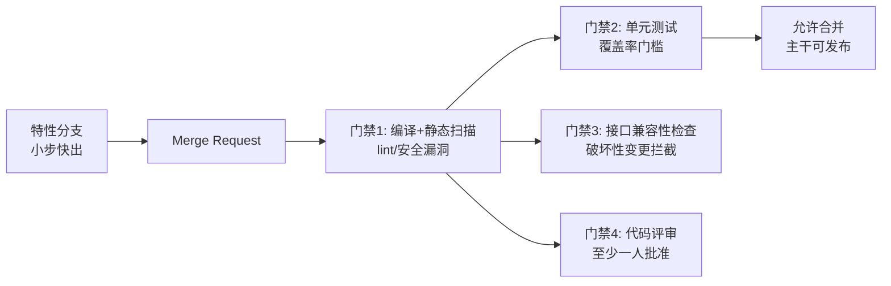
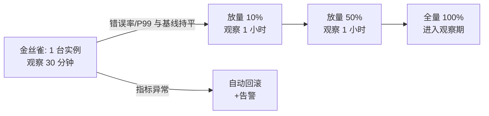

# 发布体系：流量发布、灰度发布与代码合并

> 每一次发布都是一次潜在的故障——行业数据公开共识：相当比例的线上故障由变更引发（发布/配置/基础设施变更）。发布体系的目标不是「发布不出错」（不可能），而是**「任何变更都可控、可观测、可秒回」**：代码合并有门禁，流量发布有灰度，出问题有回滚。

## 一句话摘要

发布体系三段：**代码合并**（分支策略 + CI 门禁：编译/测试/兼容性检查不过不合）→ **发布编排**（灰度发布：金丝雀 1 台 → 按批次百分比放量 → 全量，每批次之间有观察窗口与指标校验）→ **流量发布**（新服务的入口放量：白名单 → 内部 → 1% → 全量）——配套两件事：**回滚预案**（发布即准备好回滚，5 分钟内完成）与**发布窗口纪律**（大促冻结、低峰发布、避开周五）。

## 本文核心

**核心机制一句话**：发布的安全性 = 合并门禁（拦截代码问题）× 灰度放量（控制爆炸半径）× 秒级回滚（兜底），三段任何一个缺失，发布都是赌博。

**机制链**：代码合并（MR + CI 门禁：编译/单测/接口兼容性/安全扫描）→ 构建产物（不可变制品，环境只传配置不传制品）→ 灰度发布（金丝雀实例 → 观察窗口指标对比 → 批次放量）→ 全量 → 观察期；任一批次指标异常（错误率/P99 对比基线）→ 自动暂停或回滚。

**失效点/边界**：灰度只能暴露「按比例出现」的问题——全量才出现的问题（容量/缓存竞争/数据量级）灰度发现不了，需要全链路压测补充；回滚的前提是「向前兼容」的数据库变更纪律（先加字段后删字段）。

## 一、背景：变更引发的故障形态

发布引发的故障有三类典型形态：

- **代码 Bug**：新逻辑的错误——灰度的小流量先撞上它
- **容量冲击**：新代码更耗资源（内存泄漏/慢查询），全量后容量不足——灰度 1 台发现不了
- **兼容性断裂**：新版本依赖新字段/新接口，但下游还没升级——发布顺序错了就故障

三类的防线不同：代码 Bug 靠 CI 门禁 + 灰度；容量冲击靠压测 + 发布后指标守护；兼容性靠**变更编排纪律**（数据库变更先向后兼容：加字段→代码适配→再删旧字段，三步走）。没有一套流程能防住所有形态——**发布体系是分层防线**。

## 二、核心：代码合并的门禁

**分支策略的取舍**：主干开发（Trunk-Based，分支存活 <3 天，特性开关控制未完成功能）优于长生命周期特性分支——长分支的合并地狱是规模化的必经之痛。特性开关让「代码合并」与「功能发布」解耦：代码先上主干，功能开关关闭，发布时只开开关——**部署与发布是两件事**。

**门禁的纪律**：红灯不合（覆盖率降了不合、接口破坏性变更不合）——门禁一旦「特殊情况手动放行」，就会演变成「常态放行」。例外要走特批流程且留痕。

## 三、机制：灰度发布的编排

**灰度的三个关键设计**：

1. **批次与观察窗口**：金丝雀 1 台 → 10% → 50% → 全量，每批次之间有观察窗口（发布后前 15 分钟是错误高发期）；批次间**对比基线**（本次版本 vs 上一版本的错误率/P99），「指标对比」比「人肉感觉」可靠
2. **自动暂停与回滚**：错误率超基线阈值（如 2 倍）自动暂停放量，超严重阈值自动回滚——自动化的价值在凌晨的发布（人反应不过来）
3. **流量切分方式**：按实例比例（简单）、按用户尾号（体验一致性好）、按 header 灰度（内部员工先试）——按用户灰度保证同一用户的请求一致性，是面向 C 端的首选

**回滚的纪律**：**发布即回滚准备**——发布前验证回滚命令可执行（回滚演练）、数据库变更向后兼容（新代码兼容旧数据，回滚代码才不会炸）。回滚时间目标：5 分钟内完成（超过 5 分钟的「回滚」不叫回滚叫二次故障）。

> 💡 实战提示：发布清单模板化——每次发布前过一遍「发布单」：变更内容/影响范围/灰度计划/回滚条件/值守人。发布单不是形式，是强制「发布前思考回滚」的载体。

## 四、实践：典型场景

- **大促冻结期**：前两周代码冻结（只允许 Bug 修复类发布），配置变更走审批——发布窗口纪律
- **多服务联动发布**：接口变更涉及上下游——按依赖顺序发布（先下游后上游，向下兼容），或走特性开关解耦
- **紧急修复发布**：跳过部分流程（如跳过灰度直接全量）的「紧急通道」要留，但要事后补评审——紧急通道的滥用要治理

## 发布策略怎么选（何时用哪种）

常规迭代用批次灰度（金丝雀→10%→50%→全量）；紧急修复走快速通道（跳过部分灰度，保留回滚验证，事后补评审）；新架构/新依赖用白名单先行（内部员工→种子用户）。**变更风险越高，灰度周期越长**——发布策略按风险定节奏。

## 与配置变更的关系

发布体系不只管代码：**配置变更与代码发布同级别管控**（第 3 篇的「运营改配置 = 无测试上线」教训）——配置中心也要有灰度（配置先推 1% 实例）、审计（谁改的）、回滚。很多团队代码发布纪律严明、配置变更裸奔——后者引发的故障占比并不低。

## 你们可能会问

**Q1：灰度期间新旧版本并存，数据兼容怎么保证？**
数据库变更先行（expand 阶段新字段已就位），新旧版本读写都兼容——兼容性纪律是灰度的前提，没有它灰度本身就是故障源。

**Q2：回滚后 Redis 里的新版本数据怎么办？**
发布涉及「数据格式变更」时回滚要评估缓存兼容——解法是新数据用新 key（版本前缀），回滚后旧版本读不到新 key 自然回源旧逻辑，缓存按 TTL 自然过渡。

## 追问链与我的判断

**追问链 1**：「发布观察窗口 30 分钟，大促前 200 次发布怎么办？」→ 大促前两周冻结 + 只允许热修——**发布频率与业务节奏的冲突，靠日历纪律解决而不是靠压缩观察窗口**。

**追问链 2**：「灰度 10% 的用户反馈不好但指标正常，发不发？」→ 指标是滞后信号，反馈是先行信号——**我的判断：灰度的意义一半在指标一半在「给改进留时间」；反馈差的版本，指标再好也要缓**。

**追问链 3**：「门禁这么多，紧急修复来不及怎么办？」→ 紧急通道（跳过部分门禁 + 事后补评审）——但紧急通道的使用记录要月度审计，**滥用紧急通道的团队要复盘其常态质量**。

## 常见误区

- **误区一：灰度是万能保险**。灰度只能暴露按比例出现的问题——容量冲击、数据量级问题要靠全链路压测补充；灰度 + 压测才是完整防线
- **误区二：发布后看 5 分钟没事就完事**。内存泄漏类故障要数小时才显形——发布后 24 小时的观察期（指标对比基线）不可省
- **误区三：回滚是失败**。回滚是预案的正常执行——把回滚当失败的团队，会在该回滚时犹豫，小故障拖成大事故；**敢回滚的团队才配做发布**
- **误区四：数据库变更和代码一起发**。不向后兼容的 DB 变更让回滚失效——变更纪律：expand（加字段/双写）→ migrate（数据迁移）→ contract（删旧字段）三阶段，任何阶段可独立回滚

## 自测三问

1. **发布三段防线分别拦截什么？**
   - 合并门禁拦代码问题（编译/测试/兼容）；灰度放量控制爆炸半径（1 台先撞）；回滚兜底（5 分钟内恢复）。缺任何一段都是赌博。

2. **为什么部署与发布要解耦（特性开关）？**
   - 解耦后代码合并高频小步（降低合并风险），功能发布独立控制（开关随时开/关）——发布变成「配置操作」而不是「部署动作」。

3. **数据库变更为什么要向后兼容三阶段？**
   - expand→migrate→contract 让每个阶段都可独立回滚；一步到位的变更（直接删旧字段）让回滚必然失败——回滚能力建立在变更纪律上。

## 5W 速记卡

| W | 一句话 |
|---|---|
| What | 合并门禁 + 灰度编排 + 秒级回滚的发布三段体系 |
| Why | 变更是故障主要来源——发布体系把变更风险工程化 |
| Where | 全部服务与配置变更 |
| When | 常态灰度发布；大促冻结；紧急修复走紧急通道 |
| Who | 开发提交，CI 门禁拦截，SRE/值班守护放量 |

## 开放问题

- **灰度的智能化**：自动放量依据「指标对比基线」，但阈值设置仍靠经验——自适应灰度（按指标置信度自动调节批次）是演进方向
- **微服务联动发布的编排**：几十个服务联动的发布顺序编排（依赖拓扑驱动）工具化程度仍低，联调与发布顺序人工协调成本高

## 核心带走

**30 秒复述**：发布三段防线——合并门禁（编译/测试/兼容性/评审，红灯不合）、灰度编排（金丝雀→批次放量，指标对比基线，异常自动回滚）、秒级回滚（5 分钟目标，发布即准备回滚）。**失效边界**：门禁手动放行成常态、灰度发现不了容量问题（要压测补充）、DB 变更不向后兼容让回滚失效——三条都是变更事故的经典形态。

## 📌 数据与事实声明

- 写于 2026-09-11；「变更引发故障」的行业占比与灰度/回滚实践为 SRE 公开口径
- 免责：CI/CD 工具与分支策略按团队规模裁剪

## 📚 参考资料

| 类型 | 标题 | 来源 |
|---|---|---|
| 书 | 《Accelerate》（DevOps 状态报告的方法论） | 公开出版 |
| 官方文档 | Feature Flag（特性开关）实践 | martinfowler.com/articles |
| 行业实践 | 大厂发布体系公开分享 | 公开报道 |
