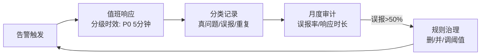
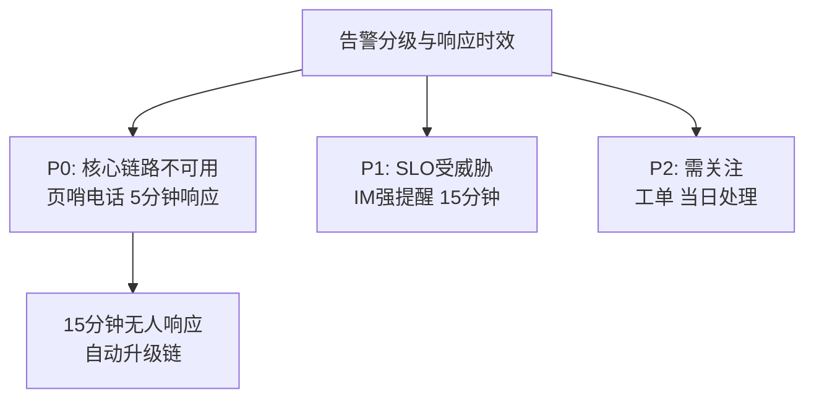
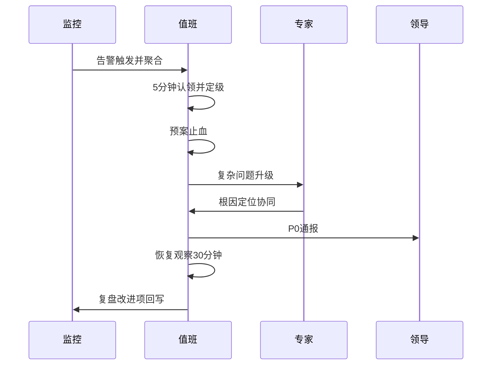
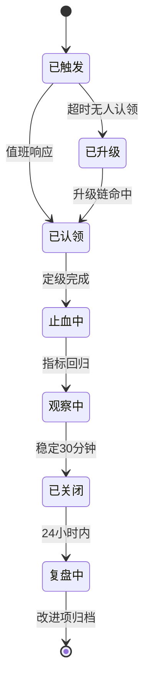

# 观测体系运营：ELK、指标、告警与值守的常态化

> 工具装好只是观测体系的起点——ELK 集群会膨胀、告警会泛滥、值班会疲惫。观测体系的「运营」阶段要回答：日志怎么管成本、告警怎么治理噪音、值班怎么可持续。这一篇讲观测体系从「建成」到「用好」的运营化。

## 一句话摘要

观测体系运营的四个常态：**日志分级管理**（ERROR 全量/INFO 采样/按 traceId 检索，TB 级日志的成本纪律）、**指标分层看板**（系统/应用/业务三层 + 大盘联动）、**告警治理**（分级/收敛/审计，误报率超 50% 即治理信号）、**值班可持续**（轮转/升级链/演练支撑/疲劳管理）——观测体系的成熟标志：**告警越来越少、越来越准，值班越来越从容**。

## 本文核心

**核心机制一句话**：观测体系的运营 = 让数据有成本纪律（日志分级）、让信号有信噪比（告警治理）、让人有可持续性（值班体系）——工具是固定资产，运营才是流动的价值。

**机制链**：日志按级别采样进 ELK（traceId 检索）→ 指标三层看板（系统/应用/业务）→ 告警分级触发（P0 页哨/P1 强提醒/P2 工单）→ 值班响应（升级链兜底）→ 周期审计（误报率/漏报复盘）反哺规则。

**失效点/边界**：ELK 存储无限膨胀的成本失控；告警疲劳后真告警被忽略（观测体系失效的头号形态）；值班疲劳引发响应迟缓——三者都是「运营」问题，工具解决不了。

观测体系从建到用的演进路径（规模越大，腐化越快）：日志从「单机 grep」到「集中 ELK」到「云原生存储分层」，指标从「脚本看」到「Prometheus 全家桶」，告警从「邮件」到「分级页哨」——工具代际一直在换，**腐化与治理的循环从未消失**，因为腐化的根源（只加不减）是组织行为不是工具。

## 一、背景：观测体系为什么会「腐化」

观测体系的腐化是渐进且必然的（不运营就腐化）：

- **日志膨胀**：服务越加越多、日志级别越打越随意——ELK 集群从 3 台涨到 30 台，查询却越来越慢
- **告警泛滥**：每个故障复盘都「加一条告警」，半年后日均 500 条告警，值班员开始批量忽略——**告警疲劳让观测体系失效**
- **指标孤儿**：埋了上千个指标，看板只有 20 个有人看

腐化的根源：**采集和告警是「加法」操作（加起来容易），而治理是「减法」操作（删东西要担责任）**——没有定期的减法机制，加法必然失控。运营的本质就是把减法制度化。

## 二、核心：日志的分级成本管理

**日志分级的保留策略**（TB 级日志的成本纪律，第 5 篇归档的观测层应用）：

| 级别 | 保留 | 理由 |
|---|---|---|
| ERROR | 全量 30 天 + 归档 1 年 | 排障刚需，复盘追溯 |
| WARN | 全量 7 天 | 弱信号，趋势分析 |
| INFO | 采样 10% · 7 天 | 量大价值低，采样保 traceId 链路完整 |
| DEBUG | 不采集（开发期本地） | 生产开 DEBUG 是纪律违规 |

**traceId 检索的保障**：INFO 采样后 traceId 链路会断——解法是「关键路径日志不采样」（下单链路的入口/出口/外部调用三处日志全量保留），采样只对高重复的低价值日志。**采样策略按日志的业务价值分层，而不是一刀切**。

**ELK 的成本治理**：索引生命周期管理（ILM：热节点 7 天 → 温节点 30 天 → 冷归档/删除）；字段治理（禁打大字段全文索引——一个 10KB 的请求体全文索引 = 成本灾难）；按团队归账（各业务的日志存储成本可查——**成本可视化的第一天就会有团队主动清理日志**）。

## 三、机制：告警治理的运营闭环

**月度告警审计的四个数字**：总告警数、真故障数、误报率、平均响应时长——**误报率 > 50% = 告警体系失效信号**（值班员已开始忽略），治理动作：删规则/并同类/调阈值/加条件。告警治理的目的不是减少告警，是**让每条告警都值得响应**。

**告警治理的三个具体动作**：删（半年没响应过或从未是真故障的规则）、并（同类聚合：10 台机器同时 CPU 高只报 1 条聚合）、调（阈值按历史分布动态校准）。

## 四、实践：值班体系的可持续

ELK 部署怎么选：日志量日增 100GB 以下可用单集群分节点角色；以上按「写入/查询/冷存」分层部署或直接评估云托管——**自建到一定规模后的人力成本反超托管**，这个交叉点要每半年重估一次。

**值班的制度设计**：

- **轮转**：主值 + 副值双人（主值响应，副值兜底升级），周轮转避免疲劳累积
- **升级链**：P0 告警 15 分钟无人响应自动升级到上级——升级链是值班的责任兜底
- **交接**：值班日志（本周告警/故障/未决事项）结构化交接，不留口头记忆
- **补偿与认可**：夜间值班的调休与补偿要明确——值班可持续是体系可持续的前提

**典型场景**：大促值班（指挥部集中值守 + 告警分级收紧）、日常值班（自动化优先，人工兜底）、节假日（值班表提前公布 + 应急联系人升级链）。

> 💡 实战提示：告警审计用「响应率」一票否决——一条规则连续两个月触发 20 次零响应，直接删除；数据不撒谎，零响应说明没人认为它是问题。

**起步路径**：告警分级（P0/P1/P2）→ 值班表与升级链 → 月度告警审计 → 日志成本治理——从「告警分了级、有人负责响应」起步，运营化逐步加深。

观测运营的核心取舍是「灵敏 vs 安静」：告警越灵敏越早发现故障，但误报越多；越安静值班越从容，但漏报风险越大——**SLO 燃烧率告警模型（多窗口多燃烧率）正是为这对取舍设计的折中方案**。

## 你们可能会问

**Q1：指标用 Prometheus，日志用 ELK，链路用什么？**
链路推荐 OpenTelemetry 标准接入（厂商中立）+ 后端任选（SkyWalking/Jaeger/商用 APM）——三支柱用统一标准接入，避免厂商锁定后互相不通。

**Q2：值班排班谁来做、按什么原则？**
SRE 负责排班机制（轮转/升级链/补偿），业务 owner 进值班序列——「谁的服务谁值班」，平台团队兜底 P0。

## 与稳定性系列的关系

观测体系运营是稳定性七环节中「可观测」（第 7 篇）的运营态延伸：建设期把三支柱装好，运营期让它们持续有效——告警审计的输入正是「每次故障是否被监控先发现」的检验结果。**观测体系的健康度 = 稳定性体系的感知能力**。

## 追问链与我的判断

**追问链 1**：「告警误报率高，删规则不怕漏报吗？」→ 删的是「从未是真故障」的规则——漏报风险用「多窗口燃烧率告警」补（SLO 模型）→ **删与补是一对，只删不补是从治理噪音走向观测盲区**。

**追问链 2**：「日志采样 10%，排障时正好采样漏了怎么办？」→ 关键路径日志不采样（入口/出口/外部调用），采样只对高重复低价值日志——**采样的单位是「日志类型」不是「全局比例」**。

**追问链 3**：「值班疲劳为什么不靠加人解决？」→ 加人分摊响应但噪音总量不变——**噪音治理（删/并/调）才是源头解，加人只是稀释**。

## 常见误区

- **误区一：ELK 集群扩容解决日志问题**。膨胀的根源是日志打法随意（大字段全文索引/DEBUG 上生产）——扩容治标，分级治理治本
- **误区二：告警多说明监控做得好**。告警多而不可行动 = 观测体系失效——「告警数 vs 真故障数」的比例才是质量指标
- **误区三：值班是消耗，没有产出**。值班记录与告警审计是稳定性改进的最真实输入——把值班观察沉淀为治理动作，值班就从消耗变成生产

## 工程级深化：观测参数、值守步骤与量级分档

> 观测体系的运营含量高于建设含量：参数定义「系统看什么」，值守流程定义「人怎么响应」。这一节给两边的参数表和 runbook。

### 参数级配置清单（观测与值守）

| 配置项 | 默认值 | 10w 级推荐 | 千万级推荐 | 亿级推荐 | 为什么 |
|---|---|---|---|---|---|
| 指标采集间隔 | 15s | 15s | 10s | 核心指标 5s | 间隔越细发现越快但存储成本越高，只给核心链路买细粒度 |
| 日志保留 | 7 天 | 7 天 | 14 天 | 30 天热+1年冷 | 排障窗口与合规窗口决定保留期，冷数据用便宜存储兜底 |
| 日志采样 | 全量 | 全量 | INFO 采样 ERROR 全量 | 按 trace 采样 | 全量 INFO 日志在亿级是存储灾难，按 trace 采样保留链路完整性 |
| 告警响应 SLA | 无 | 15 分钟认领 | 5 分钟认领 | P0 1 分钟+自动升级 | 认领时长是值守的第一指标，无人认领的告警等于没发 |
| 告警噪音率 | 无 | 低于 30% | 低于 20% | 低于 10% | 噪音率超过三成，值班就会开始忽略告警——告警信任一旦丢失重建极慢 |
| 告警收敛窗口 | 无 | 5 分钟 | 3 分钟 | 1 分钟+聚合 | 同源告警聚合成一条，收敛是把 100 条告警变成 1 个事件 |
| 值班轮换 | 每周 | 每周单人 | 每周双人 | 双人+升级链+挂库 | 亿级双人值班是底线，升级链防「值班的人被淹没」 |
| 复盘 SLA | 无 | P0 3 天 | P0 3 天 P1 7 天 | 全量复盘归档 | 复盘过期等于事故白出，SLA 挂在流程上而不是自觉上 |

### 步骤级操作：新服务接入观测 + 值班响应流

接入（前置条件：服务有健康检查端点、日志格式符合规范、关键业务埋点清单经评审）：

- Step 1 指标接入：注册采集目标，配置核心指标（QPS/错误率/P99/资源水位）默认大盘。验证点：大盘四类指标有数据，与真实流量对得上。
- Step 2 日志接入：日志接入采集管道，字段规范化（trace_id 必传）。验证点：任意一条错误日志能通过 trace_id 关联到整条链路。
- Step 3 告警配置：从模板克隆告警规则（而不是从零写），调整阈值。验证点：演练注入一次错误，告警按预期触发且只触发聚合后的一条。
- Step 4 值班挂载：服务挂到对应值班组，升级链配置完整。验证点：无人认领演练中，告警按升级链逐级通知。
- 回退：告警误报率过高时先「降级为提醒」而不是直接关规则——保留规则生命周期，修好阈值再恢复，直接关闭的告警规则几乎不会有人记得重新打开。

值守响应流（前置条件：告警触发且已认领）：

- Step 1 定级：按影响面（全站/单服务/单用户群）定 P0-P2。验证点：定级在认领后 5 分钟内完成，宁可先高后降。
- Step 2 止血优先：先执行预案止血（扩容、降级、切流），根因后置。验证点：止血动作有预案编号，不是临场发明。
- Step 3 根因定位：止血后按「变更时间线 → 依赖拓扑 → 指标下钻」三步走。验证点：先查「过去 2 小时改了什么」，八成事故来自变更。
- Step 4 恢复确认：核心指标回归基线后持续观察一个周期。验证点：恢复不是「告警消了」，是「指标稳定在基线 30 分钟」。
- Step 5 复盘归档：24 小时内出复盘初稿，改进项带 owner 与 deadline。验证点：改进项进跟踪表，下月巡检核销。

### 量级分档下的观测取舍

10w 级（三件套够用）：指标 + 日志 + 一条值班群就是全部，链路追踪可以先不上。该档位的 Trade-off：跨服务问题靠「看日志猜链路」，分钟级定位可接受。

千万级（链路追踪上线）：微服务数量让「猜链路」失效，全链路追踪成为刚需；告警开始平台化收敛。该档位的 Trade-off：为 trace 付出采样成本与埋点规范成本，换定位时间从小时级到分钟级。

亿级（观测平台化 + SLO 驱动）：观测自身成为平台（统一指标规范、日志成本治理、告警 SLO 看板）；值守从「盯告警」升级为「盯错误预算」。该档位的 Trade-off：观测平台的研发与成本本身可观测、可治理——观测吃掉 5-10% 的机器成本是行业常态（行业认知），它必须像业务一样证明自己的价值。

### 告警处理时序：从触发到复盘

### 状态视角：告警事件生命周期

「已升级」状态是值守体系的自我保护：告警无人认领时不应该静静等着，超时自动升级才能保证 P0 永远有主——升级链的每一级响应时长要写进 SLA 并演练。

### 边界与反方案深推

观测运营的第一边界是「告警的职责边界」：告警只负责「发现问题」，不负责「定位问题」——一条告警里塞满诊断信息，值班反而会读不完。实践里的分界是：告警通知三行以内（什么坏了、多严重、预案编号），诊断细节放链接里点开看。违反这条边界的告警，认领速度反而更慢。

反方案推演：「用告警数量考核监控质量，越少越好」——被否的原因是它会催生「该报不报」的藏告警行为，漏报的代价远大于噪音。正确的度量是噪音率与漏报率一起看，且漏报（事后复盘发现的「当时居然没告警」）一票算十票。另一个被否的方案是「全自动根因定位，值班只做确认」：AI 在重复性故障上有不错的命中率，但新形态故障的归因还是人——值班的意义恰恰是处理「系统没见过的事」，全自动化的正确姿势是「AI 处理已知形态、人处理未知形态」，而不是裁掉人。

成本是观测运营最现实的边界：日志存储是无底洞，全量保留的账单增长比业务增长快（日志量随服务数与调试 detailed 程度超线性增长）。有效的边界手段是「按保留期分价」：热数据贵、温冷数据自动降级到廉价存储，且删除策略写进接入模板——观测成本必须「结构化地省」，而不是领导看到账单后一刀切砍采样率，后者伤害的是排障能力。

### 值守的文化边界

告警文化有个隐蔽的拐点：当值班人员开始说「这个告警不用管」的时候，观测体系实际上已经死亡——规则还在跑，注意力已经离开。所以噪音治理不是「删规则」而是「重建信任」：每条规则要么修到值得被看，要么下线；「放着不管」的中间态不允许长期存在。

另一个文化边界是「复盘的追责边界」：复盘一旦滑向追责，下一个故障的第一反应就是隐藏证据而不是快速升级。可执行的护栏是复盘报告不进绩效档案、复盘会上只允许问「系统为什么让这个错误成为可能」而不允许问「谁干的」——追责指向系统设计的复盘才有生命力，指向个人的复盘只会教会大家沉默。

### 观测体系的年度体检

观测体系自身需要年度体检，体检项有四个：告警规则有效率（触发后需要行动的比例，低于七成即超标）；trace 覆盖率（核心链路的采样完整性）；大盘决策引用率（值班是否真的在看）；观测成本占机器成本比（趋势是否失控）。体检的意义在于「观测的债是无声的」：采样率悄悄降过、规则悄悄失效过、大盘悄悄没人看过，这些都不会以事故的形式暴露，只会在下一次大故障时集中兑现——那时才发现定位链路的三块拼图早就不在了。

### 值守交接的一个细节

交接班不是「有事我叫你」，而是结构化的三行：当前在处理的告警与预案状态、过去一班触发过但已关闭的事件、以及观察中的疑点（指标没坏但也没完全对齐的东西）。疑点交接是三行里最有价值的一行——没被交接的疑点会在下一班被当成「本来就这样」。交接写进值班文档模板，五分钟完成，省下的是下一班重新建立上下文的半小时。

## 自测三问

1. **TB 级日志的成本纪律是什么？**
   - 分级保留（ERROR 全量/INFO 采样/DEBUG 不采集）+ ILM 生命周期 + 字段治理（大字段不全文索引）+ 按团队归账。

2. **告警治理的触发信号与动作？**
   - 误报率 > 50% 即治理：删无响应规则、并同类、按历史分布调阈值——目标是每条告警都值得响应。

3. **值班体系怎么可持续？**
   - 主副双人轮转 + 升级链兜底 + 结构化交接 + 补偿认可——值班疲劳是体系失效的头号人为因素。

## 5W 速记卡

| W | 一句话 |
|---|---|
| What | 日志分级成本管理 + 告警治理闭环 + 值班可持续体系 |
| Why | 观测体系不运营必然腐化——告警疲劳与日志膨胀是渐进的慢性病 |
| Where | ELK/指标平台/值班体系的日常运营 |
| When | 日志成本月审、告警治理月审、值班周轮转 |
| Who | SRE 运营平台与审计，值班人响应与反馈 |

## 开放问题

- **告警治理的智能化**：规则治理删得掉明显噪音，智能降噪（告警聚类/根因收敛的 AI 方案）在头部团队试点但通用方案未成熟
- **可观测成本的平台化归账**：日志/指标/链路的按团队成本核算与预算管控，平台化程度参差

## 核心带走

**30 秒复述**：观测体系运营四常态——日志分级成本管理（ERROR 全量/INFO 采样/traceId 链路全量）、指标分层看板（系统/应用/业务 + 大盘联动）、告警治理闭环（分级/可行动/月度审计，误报率 >50% 即失效）、值班可持续（轮转/升级链/交接/补偿）。**失效边界**：告警疲劳让真告警被忽略、日志无限膨胀让 ELK 慢到查不动、值班疲劳让响应迟缓——三个失效都源于「只加不减」的运营缺失。

## 📌 数据与事实声明

- 写于 2026-09-11；告警疲劳、日志成本膨胀为 SRE 社区公开共识痛点；ILM/采样比例为行业经验口径
- 免责：ELK 部署形态与阈值按团队日志量与预算裁剪

## 📚 参考资料

| 类型 | 标题 | 来源 |
|---|---|---|
| 书 | 《SRE: Google 运维解密》Monitoring / Being On-Call 章 | 公开出版 |
| 官方文档 | Elasticsearch ILM（索引生命周期管理） | elastic.co |
| 行业实践 | 告警治理公开分享 | 公开报道 |
