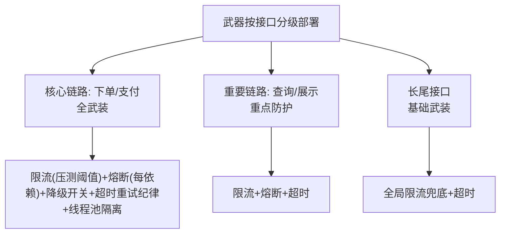
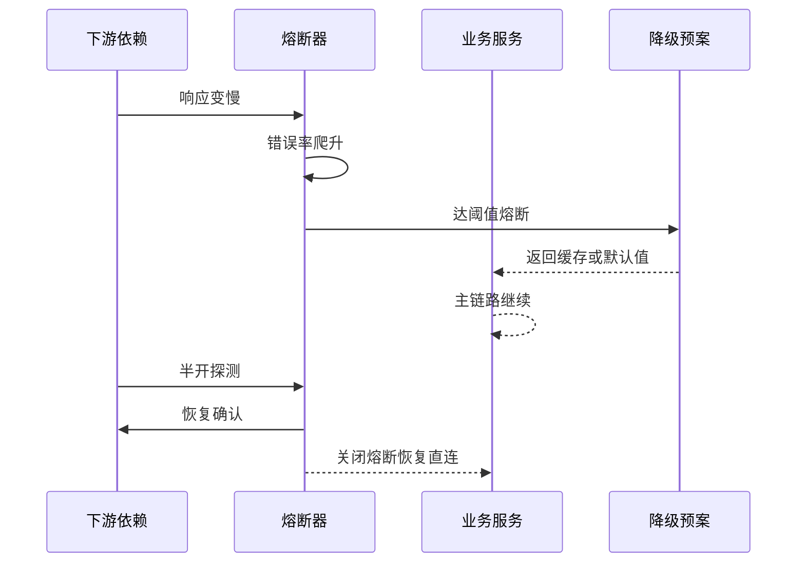
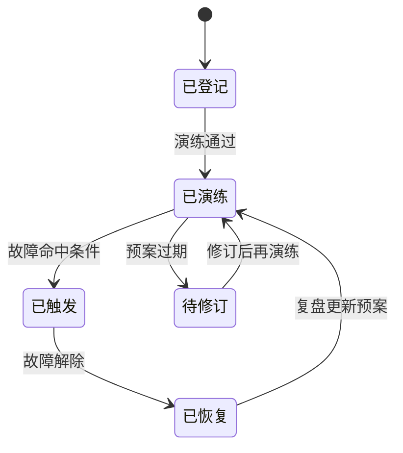

# 稳定性武器库：SLA、降级与熔断的场景化部署

> 限流、熔断、降级、超时、重试、隔离的原理与机制，稳定性系统性建设系列已经完整讲透（七环节 + 流量防护三件套）。本篇不重复原理，讲**大规模实战的武器部署地图**：在千服务、百依赖、几十个场景的真实系统里，这些武器怎么分级部署、怎么挂预案、怎么与 SLA 联动。

## 一句话摘要

稳定性武器的场景化部署 = **按接口分级配武器**：核心链路（下单/支付）全武装（限流+熔断+降级开关+超时重试纪律+隔离），旁路依赖（推荐/评论/积分）轻武装（熔断+静默降级），长尾接口基础武装（限流+超时）——**武器不是越多越好，是按「挂了的代价」配置**；SLA 是武器部署的依据：承诺越高，武装越重。

## 本文核心

**核心机制一句话**：稳定性武器的部署依据是「接口分级 × 依赖角色」——核心链路的每个外部依赖独立配熔断+降级，旁路依赖统一降级开关，长尾接口保底限流；SLA 定了武器的响应标准（触发阈值、恢复目标）。

**机制链**：接口分级（核心/重要/长尾）→ 每级配置武器包 → 每个外部依赖标注「挂了的影响 + 降级动作」（预案卡片）→ SLA 与错误预算联动触发 → 演练验证部署有效性（稳定性系列第 8 篇）。

**失效点/边界**：武器配置了没演练 = 纸面防御；全系统一个统一阈值 = 忽略依赖差异；核心链路降级 = 体验损失换可用（要显式定义「核心不可降」边界）。

## 一、背景：武器泛滥与武器缺失的两极

实战中两极并存：有的团队任何接口都上全套（限流+熔断+降级+隔离，配置几百行）——维护成本爆炸，真故障时没人说得清哪个配置起作用；有的团队只上了入口限流——下游一挂全站陪葬。**两极的共同根因：没有按「挂了的代价」分级部署**。

**接口分级的两个判定问题**（稳定性系列第 5 篇的深化应用）：挂了影响资金吗？挂了阻断主流程吗？——双「是」= 核心（重兵）；一「是」= 重要（重点防护）；双「否」= 长尾（基础武装）。

## 二、核心：分级武器包



**核心链路的全武装清单**（以「创建订单」为例）：

- 入口限流（压测容量的 80%）+ 用户维度子限流（防单用户刷）
- 每个外部依赖独立熔断（风控/库存/优惠券三个熔断器，互不传染）
- 每个熔断器配降级预案（风控挂→走事后风控放行；优惠券挂→订单不带券创建，券解冻）
- 超时纪律（全链路预算制，第 4 篇）+ 重试纪律（幂等才重试）
- 线程池/信号量隔离（与每个下游的调用独立）

**旁路依赖的轻武装**：统一「降级总开关」（配置中心动态下发，大促前主动关闭旁路）+ 熔断兜底（挂了快速失败不影响主流程）——推荐挂了商品页不显示推荐位，这个降级开关大促前主动关闭。

## 三、机制：SLA 与武器的联动

SLA 不只是对外的承诺文本——它是**武器部署的度量契约**：

| SLA 要素 | 联动的武器 |
|---|---|
| 可用性承诺 99.95% | 限流阈值（保住容量）+ 熔断（防传染）+ 多活切换 |
| 延迟承诺 P99 200ms | 超时预算制 + 依赖的 RT 监控告警 |
| 错误预算 | 预算烧完冻结发布（发布纪律联动） |

**SLA 驱动的部署逻辑**：承诺 99.95%（月不可用 21 分钟）→ 每月错误预算 21 分钟 → 预算的 70% 留给「计划内变更风险」、30% 留给「意外故障」→ **预算分配决定各依赖的熔断灵敏度与降级开关的优先级**。SLA 越严的接口，武器越重、演练越频——武器部署从 SLA 推导，不从感觉推导。


## 四、实践：预案卡片（武器使用说明书）

每个核心依赖一张「预案卡片」，故障时值班照卡执行：

```
┌─ 依赖: 库存服务 ────────────────────────┐
│ 挂了的影响: 无法下单（核心阻断）          │
│ 自动防护: 熔断(10s窗口/50%阈值) + 降级    │
│   → 降级行为: 走「预占库存」模式(异步校验) │
│ 止血动作: ①切备用库存服务 ②开启排队模式   │
│ ③无预案时: 临时关闭下单,公告引导          │
│ 恢复确认: 库存对账任务跑绿 + 压测通过     │
└──────────────────────────────────┘
```

> 💡 实战提示：武器配置「少而验过」胜过「多而没测」——十个没演练过的熔断器，不如三个真按过开关的降级预案。

**预案卡片的纪律**：每张卡片在混沌演练中真实验证过（第 8 篇——演练验收预案）；卡片随架构演进更新（演练时发现 SOP 过时就是演练的价值）。

武器何时用哪件的速查：流量超容量 → 限流；下游错误率高 → 熔断；熔断后 → 降级；单次调用慢 → 超时；失败可重试 → 退避重试；资源互拖 → 隔离——**按故障形态选武器，而不是全套都上**。

## 与稳定性系列的关系

本篇是稳定性系列（限流/熔断/降级/超时重试/隔离五篇）的**大规模部署地图**——原理在那边、部署在这边。读法：先读 stability 系列懂武器原理，再用本篇的分级部署表落地到真实系统。

## 追问链与我的判断

**追问链 1**：「熔断阈值为什么是 50% 不是 30%？」→ 30% 在网络抖动场景误熔断率过高（正常抖动即可达 20-30%），50% + 最小请求数 20 是「反应够快且误触发可容忍」的起步平衡点——**阈值是压测与演练的数据产物，不是拍的标准值**。

**追问链 2**：「降级开关平时关闭，怎么保证故障时能用？」→ 季度演练真按一遍 + 开关连接自动化测试——**没按过的降级开关 = 没有降级**，这是演练篇的第一课。

**追问链 3**：「核心链路不能降级，那核心依赖挂了就死等？」→ 死等是排队模式（用户等待但保数据正确）——**「不降级」不等于「不处理」，排队/限流/引导都是核心链路的合法武器**。

## 常见误区

- **误区一：武器配置是工程团队的自由发挥**。武器部署的核心输入是「接口分级 + SLA」——没有分级共识的武器配置，要么过度要么不足
- **误区二：降级只在大促时配置**。故障随机发生，降级开关必须**平时就在线且可验证**（季度演练真按一遍）
- **误区三：武器部署后不需要运营**。依赖在变、阈值在漂、预案在过时——武器库要随架构演进季度盘点

## 你们可能会问

**Q1：新的依赖还没压测过，武器怎么配？**
保守起步：熔断阈值放宽（宁可慢触发不误触发）+ 限流按预估流量的一半 + 降级预案先写文档——压测后校准收紧。未知依赖的武器从「宽松防御」起步。

**Q2：武器配置谁维护？**
配置即代码（限流/熔断规则进版本库），变更走评审——「谁的服务谁维护武器」，SRE 审计部署合理性（季度盘点）。

## 工程级深化：武器参数、演练步骤与量级分档

> 稳定性武器的参数要「平时写好、战时照做」：熔断阈值、降级开关、SLA 目标——每一个都应该是演练过的数字而不是拍脑袋的承诺。

### 参数级配置清单（稳定性武器）

| 配置项 | 默认值 | 10w 级推荐 | 千万级推荐 | 亿级推荐 | 为什么 |
|---|---|---|---|---|---|
| SLA 目标（核心链路） | 99.9% | 99.9% | 99.95% | 99.99% | 每抬一个 9，冗余成本大约翻倍（行业认知），SLA 是成本承诺不是口号 |
| 错误预算 | SLA推导 | 月度 | 月度 | 周度核算 | 错误预算烧完自动冻结非核心变更——把 SLA 变成运营机制 |
| 熔断错误率阈值 | 50% | 50% | 40% | 30% | 依赖越关键阈值越紧，早熔断早保住主链路 |
| 熔断恢复探测 | 10s | 10s | 5s | 5s+少量探测 | 探测流量占比必须限制，恢复期风暴是二次事故的温床 |
| 降级预案覆盖 | 无 | P0 依赖全有 | P0P1 全有 | 全有+自动触发 | 有预案的故障叫「演练」，没预案的故障叫「事故」 |
| 预案演练频率 | 无 | 季度 | 月度 | 周度混沌 | 不演练的预案等于没有——演练验证的是「开关真的能关」 |
| 限流水位线 | 无 | 80% 容量 | 70% | 60%+分级 | 水位线越低越早自我保护，但要配「拒绝策略」的业务话术 |
| 容量冗余 | 20% | 30% | 50% | 100%（峰值系数） | 冗余是花钱买时间，峰值系数按大促模型定而不是按日常 |

### 步骤级操作：降级预案接入与故障演练

预案接入（前置条件：依赖强弱清单完成，每个 P0 依赖有明确的降级语义——返回缓存、默认值还是拒绝）：

- Step 1 预案编码：降级逻辑写进代码配开关，开关接配置中心。验证点：开关支持灰度（按比例、按用户），不是全局一刀切。
- Step 2 预案登记：预案进稳定性台账（编号、触发条件、影响面、恢复动作）。验证点：台账与代码开关一一对应，无「代码有开关台账没有」。
- Step 3 演练验证：预发环境注入依赖故障，验证降级自动触发。验证点：降级后主链路成功率保持，用户侧文案符合预期。
- Step 4 生产演习：生产环境低峰期真演习（先预案后故障注入）。验证点：演习有回滚开关且 5 分钟内可全部还原。
- 回退：演习失败（降级没触发或触发错误）立即停演习修复预案——带病预案比没预案更危险，它给人虚假的安全感。

### 量级分档下的稳定性取舍

10w 级（熔断 + 限流两件套）：这一档「限流 + 熔断 + 一个值班群」覆盖 90% 场景，SLA 用口头承诺。该档位的 Trade-off：故障恢复靠人力，恢复时长波动大，但量级下影响可控。

千万级（预案体系 + 错误预算）：降级预案全量登记并演练，错误预算机制上线，变更与稳定性开始挂钩。该档位的 Trade-off：错误预算冻结机制会挡住业务需求——这正是它的作用，稳定性第一次有了对业务说「不」的机制化理由。

亿级（混沌工程 + 单元隔离）：故障注入常态化（每周混沌演练），单元化让爆炸半径可控，SLA 分层到业务级。该档位的 Trade-off：混沌演练本身可能触发真实事故（注入与真实故障难以区分），需要灰度注入 + 一键停止 + 演练窗口三重保护。

### 故障自愈时序：依赖抖动的自动处置



### 状态视角：降级预案生命周期



「待修订」是台账的健康度指标：超过 6 个月没演练过的预案自动进入待修订——预案和代码一样会腐化，依赖变了预案没变，战时按旧预案操作就是二次事故。

### 边界与反方案深推

稳定性工程的第一边界是「降级的业务语义边界」：技术上可以把推荐服务降级成返回空列表，但「首页没有商品」对用户等于故障——降级动作必须经过业务语义审查：降级后用户看到什么、能不能完成核心动作、会不会引发次生投诉。没有业务参与的降级预案，技术上成功、业务上事故。

反方案推演：「全面熔断，任何依赖抖动都自动隔离」——被否的原因是熔断有误伤成本：对非关键依赖的激进熔断会让页面「缺胳膊少腿」成为常态，用户感知的可用性反而下降。熔断强度应该按依赖等级分层：强依赖熔断要快，弱依赖抖动优先用超时放宽与重试扛。另一个被否的方案是「SLA 承诺越高越好」：99.99% 与 99.9% 之间的成本差不是线性的，冗余、多机房、自动化切换全都要钱，SLA 是商业承诺应该回到商业逻辑里定——技术团队把各档成本摆出来，承诺让业务与法务去签。

混沌工程还有一个微妙的边界：「演练事故」与「真实事故」的区分。注入故障的标识必须贯穿监控与告警（演练标签随 trace 传播），否则值班把演练当真实事故处理、或者反过来把真实故障当演练忽略，两个方向的误判都发生过（行业认知）。混沌演练的流程成本（审批、标签、一键停止、复盘）占了它总成本的大头，省这些流程的团队，最后都省出了事故。

### 多视角圆桌：一次降级开关的启用决策

**场景**：某天大促预热，推荐服务 RT 从 50ms 涨到 2 秒，购物车主链路被拖慢。**值班 SRE**：推荐是弱依赖，预案里有「推荐降级返回热门榜单」，建议立即启用。**开发 owner**：降级后转化率会掉，大促预热期掉转化谁负责？**SRE 回应**：不降级，购物车打开超时的转化率掉得更狠——两害相权，且降级是可逆的，推荐恢复即刻切回。**业务值班**：认可降级，但要求数据侧盯住「降级期间的转化率基线」，恢复后做对比复盘。**架构复盘**：这次争论暴露了「弱依赖降级的业务代价」从没被量化过——预案里写了怎么降，没写降了的代价，导致启用决策每次都要现场拉扯。

改造：每个降级预案补「代价预估」字段（历史降级期的转化影响数据），值班决策从「现场辩论」变成「照单执行」。稳定性预案的完备度，取决于启用它需要多少次现场讨论。

### 深层追问链

追问一：熔断会不会把正常依赖误杀？——会。错误率窗口内的少量超时（网络抖动）累积到达阈值就触发熔断，下游其实已经恢复。缓解手段是提高统计窗口的样本量下限（样本不足不熔断）、半开探测快速恢复、以及「熔断事件」通知下游 owner 复盘——熔断器不承诺零误杀，它承诺「误杀的恢复时间短」。

追问二：SLA 99.95% 怎么换算成工程动作？——一年不可用预算是 4.4 小时，季度预算约 66 分钟。把预算分给变更窗口、依赖故障、基础设施抖动三类，每类消耗单独记账——错误预算的真正用法是「分配」，分配完才发现「光变更就烧掉八成预算」，于是变更频率治理自动成为优先项。SLA 到工程动作的翻译器就是预算分配表。

追问三：预案写了但演练时发现开关根本关不动怎么办？——这正是演练的价值：配置中心开关在应用本地缓存了旧值、开关灰度没覆盖全部实例、开关接口本身依赖被降级的那个服务——每一类都是真实出现过的问题（行业认知）。所以预案演练的标准动作是「全链路走一遍」，包括「关开关的这个动作本身」的依赖检查。开关依赖被它保护的链路，是预案设计里最隐蔽的单点。

### 一次预案失效的复盘式推演

某次依赖故障触发了预想的降级，但降级后系统仍然雪崩——排查发现降级返回的「默认值」来自一个本地缓存，缓存未命中时要回源一次配置服务，数十万请求同时回源把配置服务打挂了，配置服务又恰好是网关路由的依赖，连锁反应把故障面扩大。教训写成一条设计铁律：降级路径上的每一个动作（读默认值、写标记、发事件）都必须比主路径更轻，任何「降级时要依赖另一个服务」的设计都是把第二次故障埋进第一次故障的处置流程里。降级路径的依赖审计，从此成为预案评审的固定项。

### 你们可能会问

问：熔断参数各家框架默认值不同，听谁的？——框架默认值是「通用安全值」，不是「你的业务最优值」。阈值的最终依据是两条线：依赖的 P99 基线（抖动多少算异常）与主链路的超时预算（降级必须赶在超时之前）。参数评审就是把默认值校准到这两条线上，校准过程本身比结论更有价值——它会逼着团队去确认「依赖的基线到底是什么」，而这正是很多团队答不上来的问题。

问：稳定性投入的边界在哪里？什么时候算过度设计？——判断标准是「故障场景是否真实出现过或推演得出」。为出现过的场景建预案是必要投入，为想象中的场景建三层防护是过度设计。稳定性的账要按「场景发生概率 x 影响面」算期望值，期望值排序决定投入顺序——稳定性和成本一样，是一个预算分配问题。

## 自测三问

1. **武器按什么分级部署？**
   - 按「挂了的代价」给接口分级（核心/重要/长尾），核心全武装、旁路轻武装、长尾基础武装——SLA 承诺决定武装重量。

2. **预案卡片必须包含哪些内容？**
   - 影响面、自动防护（熔断阈值/降级行为）、止血动作清单、恢复确认标准——且每张卡片经过演练验证。

3. **SLA 与武器怎么联动？**
   - SLA 定承诺 → 错误预算定分配 → 预算分配决定熔断灵敏度与降级优先级——武器部署从 SLA 推导。

## 5W 速记卡

| W | 一句话 |
|---|---|
| What | 按接口分级部署限流/熔断/降级/隔离的武器地图 |
| Why | 武器泛滥与武器缺失两极都有害——分级部署是平衡 |
| Where | 全部对外接口与外部依赖调用 |
| When | 部署后常态在线，季度演练验证，大促前加固 |
| Who | 架构定分级标准，owner 按级配武器，SRE 验证演练 |

## 开放问题

- **武器配置的平台化**：限流/熔断/降级的配置分散在各服务，统一武器控制面（集中配置+生效验证）的平台化程度参差
- **AI 自适应武器**：根据实时流量与错误率自动调节熔断阈值/限流值（自适应防护）在头部团队试点，误动作风险与可解释性仍是难题

## 核心带走

**30 秒复述**：武器部署 = 接口分级（核心/重要/长尾，按挂了的代价）× 分级武器包（核心全武装/旁路轻武装/长尾基础武装）× SLA 联动（承诺决定灵敏度）+ 预案卡片（演练验证过才有效）。**失效边界**：不演练的预案是纸面防御；统一阈值忽略依赖差异；核心链路乱降级换体验。

## 📌 数据与事实声明

- 写于 2026-09-11；武器模式（限流/熔断/降级/隔离）原理详见 stability 系列，本篇为部署地图
- 行业认知：「变更与故障预案未验证」为公开复盘高频结论；分级部署为行业共识口径
- 免责：具体武器参数以各团队压测与演练结果为准

## 📚 参考资料

| 类型 | 标题 | 来源 |
|---|---|---|
| 系列 | stability 系统性建设系列（同仓库，七环节） | _internal 配套 |
| 书 | 《Release It!》第 2 版（稳定性模式全集） | 公开出版 |
| 书 | 《SRE: Google 运维解密》 | 公开出版 |
