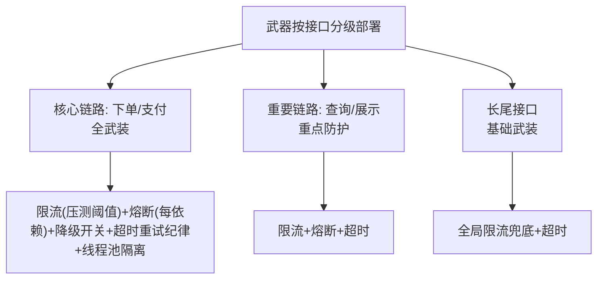

# 稳定性武器库：SLA、降级与熔断的场景化部署

> 限流、熔断、降级、超时、重试、隔离的原理与机制，稳定性系统性建设系列已经完整讲透（七环节 + 流量防护三件套）。本篇不重复原理，讲**大规模实战的武器部署地图**：在千服务、百依赖、几十个场景的真实系统里，这些武器怎么分级部署、怎么挂预案、怎么与 SLA 联动。

## 一句话摘要

稳定性武器的场景化部署 = **按接口分级配武器**：核心链路（下单/支付）全武装（限流+熔断+降级开关+超时重试纪律+隔离），旁路依赖（推荐/评论/积分）轻武装（熔断+静默降级），长尾接口基础武装（限流+超时）——**武器不是越多越好，是按「挂了的代价」配置**；SLA 是武器部署的依据：承诺越高，武装越重。

## 本文核心

**核心机制一句话**：稳定性武器的部署依据是「接口分级 × 依赖角色」——核心链路的每个外部依赖独立配熔断+降级，旁路依赖统一降级开关，长尾接口保底限流；SLA 定了武器的响应标准（触发阈值、恢复目标）。

**机制链**：接口分级（核心/重要/长尾）→ 每级配置武器包 → 每个外部依赖标注「挂了的影响 + 降级动作」（预案卡片）→ SLA 与错误预算联动触发 → 演练验证部署有效性（稳定性系列第 8 篇）。

**失效点/边界**：武器配置了没演练 = 纸面防御；全系统一个统一阈值 = 忽略依赖差异；核心链路降级 = 体验损失换可用（要显式定义「核心不可降」边界）。

## 一、背景：武器泛滥与武器缺失的两极

实战中两极并存：有的团队任何接口都上全套（限流+熔断+降级+隔离，配置几百行）——维护成本爆炸，真故障时没人说得清哪个配置起作用；有的团队只上了入口限流——下游一挂全站陪葬。**两极的共同根因：没有按「挂了的代价」分级部署**。

**接口分级的两个判定问题**（稳定性系列第 5 篇的深化应用）：挂了影响资金吗？挂了阻断主流程吗？——双「是」= 核心（重兵）；一「是」= 重要（重点防护）；双「否」= 长尾（基础武装）。

## 二、核心：分级武器包



**核心链路的全武装清单**（以「创建订单」为例）：

- 入口限流（压测容量的 80%）+ 用户维度子限流（防单用户刷）
- 每个外部依赖独立熔断（风控/库存/优惠券三个熔断器，互不传染）
- 每个熔断器配降级预案（风控挂→走事后风控放行；优惠券挂→订单不带券创建，券解冻）
- 超时纪律（全链路预算制，第 4 篇）+ 重试纪律（幂等才重试）
- 线程池/信号量隔离（与每个下游的调用独立）

**旁路依赖的轻武装**：统一「降级总开关」（配置中心动态下发，大促前主动关闭旁路）+ 熔断兜底（挂了快速失败不影响主流程）——推荐挂了商品页不显示推荐位，这个降级开关大促前主动关闭。

## 三、机制：SLA 与武器的联动

SLA 不只是对外的承诺文本——它是**武器部署的度量契约**：

| SLA 要素 | 联动的武器 |
|---|---|
| 可用性承诺 99.95% | 限流阈值（保住容量）+ 熔断（防传染）+ 多活切换 |
| 延迟承诺 P99 200ms | 超时预算制 + 依赖的 RT 监控告警 |
| 错误预算 | 预算烧完冻结发布（发布纪律联动） |

**SLA 驱动的部署逻辑**：承诺 99.95%（月不可用 21 分钟）→ 每月错误预算 21 分钟 → 预算的 70% 留给「计划内变更风险」、30% 留给「意外故障」→ **预算分配决定各依赖的熔断灵敏度与降级开关的优先级**。SLA 越严的接口，武器越重、演练越频——武器部署从 SLA 推导，不从感觉推导。


## 四、实践：预案卡片（武器使用说明书）

每个核心依赖一张「预案卡片」，故障时值班照卡执行：

```
┌─ 依赖: 库存服务 ────────────────────────┐
│ 挂了的影响: 无法下单（核心阻断）          │
│ 自动防护: 熔断(10s窗口/50%阈值) + 降级    │
│   → 降级行为: 走「预占库存」模式(异步校验) │
│ 止血动作: ①切备用库存服务 ②开启排队模式   │
│ ③无预案时: 临时关闭下单,公告引导          │
│ 恢复确认: 库存对账任务跑绿 + 压测通过     │
└──────────────────────────────────┘
```

> 💡 实战提示：武器配置「少而验过」胜过「多而没测」——十个没演练过的熔断器，不如三个真按过开关的降级预案。

**预案卡片的纪律**：每张卡片在混沌演练中真实验证过（第 8 篇——演练验收预案）；卡片随架构演进更新（演练时发现 SOP 过时就是演练的价值）。

武器何时用哪件的速查：流量超容量 → 限流；下游错误率高 → 熔断；熔断后 → 降级；单次调用慢 → 超时；失败可重试 → 退避重试；资源互拖 → 隔离——**按故障形态选武器，而不是全套都上**。

## 与稳定性系列的关系

本篇是稳定性系列（限流/熔断/降级/超时重试/隔离五篇）的**大规模部署地图**——原理在那边、部署在这边。读法：先读 stability 系列懂武器原理，再用本篇的分级部署表落地到真实系统。

## 追问链与我的判断

**追问链 1**：「熔断阈值为什么是 50% 不是 30%？」→ 30% 在网络抖动场景误熔断率过高（正常抖动即可达 20-30%），50% + 最小请求数 20 是「反应够快且误触发可容忍」的起步平衡点——**阈值是压测与演练的数据产物，不是拍的标准值**。

**追问链 2**：「降级开关平时关闭，怎么保证故障时能用？」→ 季度演练真按一遍 + 开关连接自动化测试——**没按过的降级开关 = 没有降级**，这是演练篇的第一课。

**追问链 3**：「核心链路不能降级，那核心依赖挂了就死等？」→ 死等是排队模式（用户等待但保数据正确）——**「不降级」不等于「不处理」，排队/限流/引导都是核心链路的合法武器**。

## 常见误区

- **误区一：武器配置是工程团队的自由发挥**。武器部署的核心输入是「接口分级 + SLA」——没有分级共识的武器配置，要么过度要么不足
- **误区二：降级只在大促时配置**。故障随机发生，降级开关必须**平时就在线且可验证**（季度演练真按一遍）
- **误区三：武器部署后不需要运营**。依赖在变、阈值在漂、预案在过时——武器库要随架构演进季度盘点

## 你们可能会问

**Q1：新的依赖还没压测过，武器怎么配？**
保守起步：熔断阈值放宽（宁可慢触发不误触发）+ 限流按预估流量的一半 + 降级预案先写文档——压测后校准收紧。未知依赖的武器从「宽松防御」起步。

**Q2：武器配置谁维护？**
配置即代码（限流/熔断规则进版本库），变更走评审——「谁的服务谁维护武器」，SRE 审计部署合理性（季度盘点）。

## 自测三问

1. **武器按什么分级部署？**
   - 按「挂了的代价」给接口分级（核心/重要/长尾），核心全武装、旁路轻武装、长尾基础武装——SLA 承诺决定武装重量。

2. **预案卡片必须包含哪些内容？**
   - 影响面、自动防护（熔断阈值/降级行为）、止血动作清单、恢复确认标准——且每张卡片经过演练验证。

3. **SLA 与武器怎么联动？**
   - SLA 定承诺 → 错误预算定分配 → 预算分配决定熔断灵敏度与降级优先级——武器部署从 SLA 推导。

## 5W 速记卡

| W | 一句话 |
|---|---|
| What | 按接口分级部署限流/熔断/降级/隔离的武器地图 |
| Why | 武器泛滥与武器缺失两极都有害——分级部署是平衡 |
| Where | 全部对外接口与外部依赖调用 |
| When | 部署后常态在线，季度演练验证，大促前加固 |
| Who | 架构定分级标准，owner 按级配武器，SRE 验证演练 |

## 开放问题

- **武器配置的平台化**：限流/熔断/降级的配置分散在各服务，统一武器控制面（集中配置+生效验证）的平台化程度参差
- **AI 自适应武器**：根据实时流量与错误率自动调节熔断阈值/限流值（自适应防护）在头部团队试点，误动作风险与可解释性仍是难题

## 核心带走

**30 秒复述**：武器部署 = 接口分级（核心/重要/长尾，按挂了的代价）× 分级武器包（核心全武装/旁路轻武装/长尾基础武装）× SLA 联动（承诺决定灵敏度）+ 预案卡片（演练验证过才有效）。**失效边界**：不演练的预案是纸面防御；统一阈值忽略依赖差异；核心链路乱降级换体验。

## 📌 数据与事实声明

- 写于 2026-09-11；武器模式（限流/熔断/降级/隔离）原理详见 stability 系列，本篇为部署地图
- 行业认知：「变更与故障预案未验证」为公开复盘高频结论；分级部署为行业共识口径
- 免责：具体武器参数以各团队压测与演练结果为准

## 📚 参考资料

| 类型 | 标题 | 来源 |
|---|---|---|
| 系列 | stability 系统性建设系列（同仓库，七环节） | _internal 配套 |
| 书 | 《Release It!》第 2 版（稳定性模式全集） | 公开出版 |
| 书 | 《SRE: Google 运维解密》 | 公开出版 |
