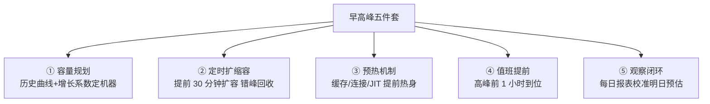
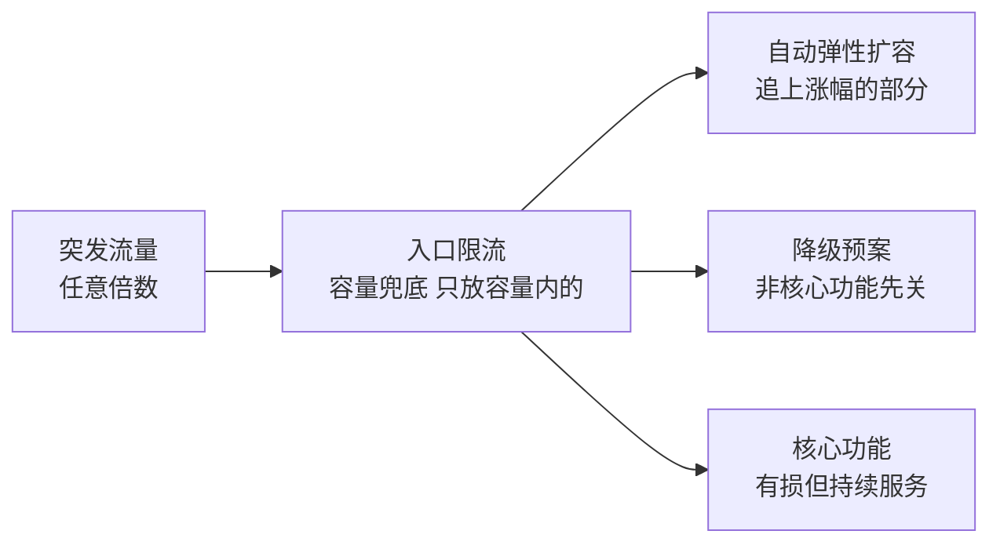
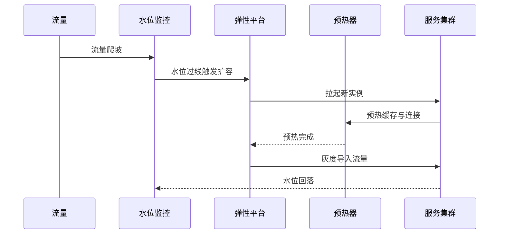
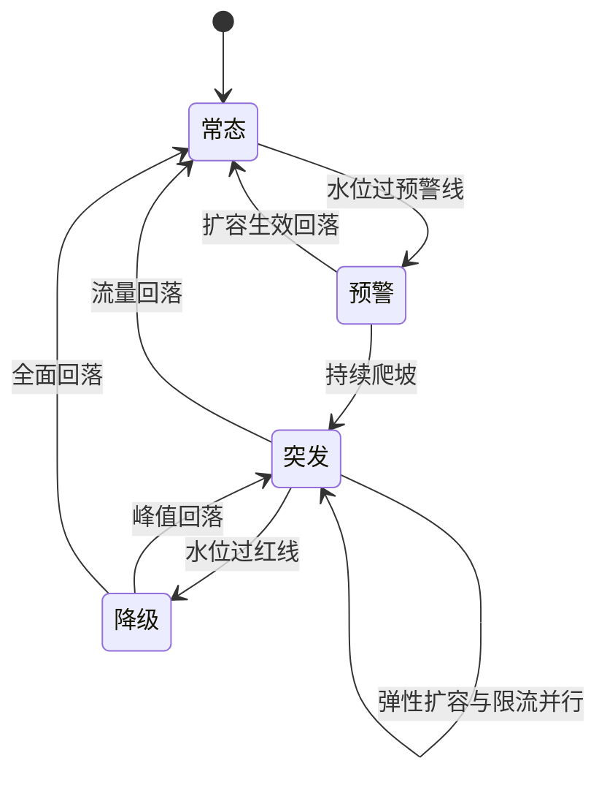

# 早高峰与流量突发治理：可预测与不可预测的洪峰应对

> 流量洪峰分两种：**早高峰**（每天 8-10 点定时脉冲，可预测、可预案、可预热）与**流量突发**（热搜/裂变/攻击，不可预测、不可预案、只能靠弹性与纪律）。两者的架构应对完全不同——用「可预测的打法」应对突发，或用「突发的运气」解释早高峰事故，都是同一个错误：没有区分两种洪峰。

## 一句话摘要

早高峰治理 = **确定性工程**（历史曲线 → 容量提前规划 → 定时预热 → 定时扩缩容 → 值班提前到位）；流量突发治理 = **弹性与纪律**（全链路限流兜底 → 自动弹性扩容 → 降级预案 → 应急响应）——可预测的靠「准备」，不可预测的靠「韧性」；两者共享的前提：容量压测是真实的、限流是配置好的、预案是演练过的。

## 本文核心

**核心机制一句话**：洪峰应对 = 容量上限（压测定的）+ 流量整形（预热/削峰/限流）+ 弹性供给（扩缩容）的组合——早高峰靠「提前把系统顶到能扛」，突发靠「让系统在超载时有损但不崩」。

**机制链**：流量曲线建模（早高峰用历史曲线，突发用限流兜底）→ 容量冗余策略（早高峰定时扩容，突发自动弹性）→ 预热机制（缓存预热/连接预热/JIT 预热）→ 超载时的有损服务（限流/降级，衔接稳定性武器库）→ 洪峰后回收与复盘。

**失效点/边界**：预热的遗漏（缓存冷启动在洪峰第一秒击穿）；弹性扩容的速度追不上流量上涨速度（扩容要 5 分钟，流量 1 分钟到顶）；突发时的人肉决策混乱（没有预案的指挥）。

## 一、背景：两种洪峰的画像

**早高峰**（可预测脉冲）：通勤时段的集中访问——打车 7:30-9:30 峰值可达日常 10 万+ QPS 的数倍，外卖 11:30-13:00、资讯 App 8:00-9:00。特征：**每天发生、曲线形态稳定、可预测度 90%+**。它的洪峰是「业务节奏」，不是异常。——打车 7:30-9:30、外卖 11:30-13:00、资讯 App 8:00-9:00。特征：**每天发生、曲线形态稳定、可预测度 90%+**。它的洪峰是「业务节奏」，不是异常。

**流量突发**（不可预测）：明星事件/热点营销/病毒式裂变/甚至爬虫攻击——**任何时刻、任意倍数、无预告**。特征：涨幅剧烈（10 倍起）、形态未知（可能集中在某个接口）。

两者的架构含义截然不同：早高峰可以「按曲线精确准备」，突发只能「靠韧性与纪律兜底」——**混淆两者是容量事故的常见根因**（按早高峰的准备应对突发，或为突发无上限囤资源）。

## 二、核心：早高峰治理五件套

1. **容量规划**：用「上周同日曲线 × 增长系数」推算今日峰值，对照容量水位（<50% 健康）决定扩容——**容量规划的本质是用昨天的曲线给今天买保险**
2. **定时扩缩容**：HPA 定时任务（8:00 扩到日间规格，22:00 缩回夜间规格）——比响应式弹性更可靠（响应式有滞后，早高峰的斜率会让弹性追不上）
3. **预热机制**：缓存预热（开抢前把热数据批量加载进 Redis/本地缓存）、连接预热（数据库连接池提前建满）、JVM 预热（流量渐增而非猛灌，让 JIT 完成热点编译）——**冷启动是洪峰第一秒击穿的头号原因**
4. **值班提前**：高峰前 1 小时值班到位、告警阈值收紧、预案卡片在手
5. **观察闭环**：每日报表对比「预估 vs 实际」——预估误差持续为正（总差 20%）就修正系数，让预估越来越准

预热与弹性的取舍也值得一记：预热越充分洪峰越平滑，但预热窗口占用了容量成本；弹性越激进容量越省，但扩容滞后与误扩的风险上升——**两者的平衡点由业务对洪峰损失的容忍度定价**。

## 三、机制：流量突发的韧性设计

突发无法预测，只能让系统「被超载时有损但不崩」：

**韧性四件套**（全部平时预置，突发时自动生效）：

1. **全链路限流兜底**：入口限流是最后防线——突发流量无论多少倍，进系统的不超过容量上限（阈值来自压测，第 7 篇）
2. **自动弹性扩容**：HPA 按指标自动加实例——弹性追得上是惊喜，追不上有限流兜底（弹性是增益不是依赖）
3. **降级预案自动/手动生效**：非核心功能先降级（推荐/评论/积分），为核心功能腾资源
4. **应急响应机制**：突发即故障隐患——告警、值班、指挥体系立即启动（稳定性系列第 9 篇）

**突发的复盘闭环**：每次突发后复盘——是哪个接口先崩？限流是否按预期生效？扩容是否追上？**突发复盘的最大产出是「下次早高峰的容量模型修正」**——突发的教训会反哺可预测的规划。

> 💡 实战提示：预热清单要「演练化」——把缓存 key 集合、连接池配置、JIT 触发路径写成预热脚本并纳入发布流程，洪峰来之前跑一遍；预热的完整性只能靠演练验证，靠记忆必然遗漏。

## 四、实践：典型场景

- **早高峰打车**：运力与服务器双重预热（司机提前上线引导 + 服务扩容 + 排队机制平滑需求）
- **外卖午高峰**：分时段营销（11:00 前优惠引导错峰）、商家出餐能力联动限流
- **热搜突发**：热点话题页面静态化 + 独立部署隔离（热点崩了自己不崩）+ 临时 CDN 加速
- **裂变活动**：活动入口独立域名独立集群（与主站隔离）+ 发券五道防线（第 5 篇）

## 与限流、容量篇的配合

本篇是限流（第 2 篇）与容量（第 6 篇）在「时间维度」的应用：限流管「超过容量的部分怎么办」，容量管「上限是多少」，本篇管「什么时候会有洪峰、怎么准备」——三种洪峰应对的完整拼图：可预测（预热+定时扩容）、不可预测（限流+弹性+预案）、长期（容量规划随业务演进）。

## 你们可能会问

**Q1：早高峰的容量冗余会不会浪费？**
会有一部分——所以用「定时扩缩容」（高峰前扩、平峰缩回）把冗余成本限定在高满时段；混合云弹性（突发借公有云容量）是进一步的成本优化方向。

**Q2：突发的第一分钟应该做什么？**
按预案：确认是哪类突发（业务热点/攻击/上游重试）→ 网关限流收紧到当前容量 → 非核心降级预案拉起 → 通报值班与业务——**先控住「进来的量」，再判断「为什么来」**。

## 追问链与我的判断

**追问链 1**：「定时扩容的曲线错了怎么办？」→ 响应式弹性兜底（定时扩容为主，HPA 兜尾）→ 两者打架呢（定时已扩 HPA 又加）？→ HPA 的目标值按定时扩容后的水位设 → **定时与响应式不是二选一是分层配合**。

**追问链 2**：「突发的流量要不要全放进来限流慢慢处理？」→ 看接口——读接口可排队（用户可等），写接口排队积压会过期作废（下单有效期）→ **我的判断：突发时「读可排队、写要快拒」，拒绝的写请求引导到低峰（发放排队券）**。

**追问链 3**：「突发复盘为什么必须反哺早高峰模型？」→ 突发暴露的是「容量模型的盲区」（哪个环节先到顶）——**突发的教训不进容量模型，下次早高峰同样会炸**。

## 常见误区

- **误区一：弹性扩容能解决一切洪峰**。扩容有滞后（拉起实例+注册+预热要分钟级），斜率陡的洪峰追不上——弹性之上必须有入口限流兜底
- **误区二：预热只是缓存的事**。预热包含缓存、连接池、JIT、甚至「业务预热」（提前执行一次关键路径让懒加载生效）——任何「第一次执行很慢」的路径都是洪峰死穴
- **误区三：突发复盘只看根因不看容量模型**。突发暴露的容量短板要反哺早高峰的容量模型——「这次突发都扛住了，早高峰没理由挂」

## 工程级深化：突发治理参数、扩容步骤与量级分档

> 突发流量的治理是「提前量」的工程学：水位线、预热、弹性扩容的每一步都要抢在用户感知之前完成。

### 参数级配置清单（突发流量治理）

| 配置项 | 默认值 | 10w 级推荐 | 千万级推荐 | 亿级推荐 | 为什么 |
|---|---|---|---|---|---|
| 扩容触发水位 | 70% CPU | 70% | 60% | 50%+多信号 | 水位越低启动越早，但误扩容浪费钱；多信号（CPU+队列+延迟）降误报 |
| 扩容速度 | 手动 | 分钟级手动 | 秒级自动 | 秒级+预热 | 弹性伸缩的生效时间必须短于流量爬坡时间，否则扩容追着流量跑 |
| 实例预热时间 | 无 | 30s | 60s | 120s+流量爬坡 | 冷实例直接接满流量会因 JIT、缓存、连接池未热而批量超时 |
| 队列长度上限 | 无限 | 有限 | 有限+快速失败 | 按预算秒数 | 队列是延迟放大器，排队秒数=队列长度/吞吐，超过体验阈值就该拒绝 |
| 削峰填谷窗口 | 无 | 无 | MQ 削峰 | 削峰+优先级队列 | 削峰把瞬时写压力摊平，但引入延迟，只对容忍延迟的业务用 |
| 热点识别 | 无 | 无 | 实时 TopN | 实时+自动隔离 | 热点 SKU/商户识别延迟决定处置速度，秒级识别才来得及隔离 |
| 大促容量系数 | 无 | 1.5 倍 | 3 倍 | 按风险定+预案压测 | 系数来自历史大促回放，拍脑袋的系数要么浪费要么翻车 |
| 降级预案联动 | 无 | 手动 | 半自动 | 水位触发自动 | 自动联动要极度保守：宁可晚 10 秒人工确认，不可误降核心链路 |

### 步骤级操作：大促容量保障

前置条件：大促流量模型（峰值 QPS、时长、业务构成）确认，历史同级别大促数据可回放。

- Step 1 容量推演：按流量模型推演各层容量（接入、服务、缓存、DB），找最短板。验证点：全链路压测到目标系数 1.2 倍，短板清单有明确扩容方案。
- Step 2 预热扩容：提前扩容到预估峰值容量，执行缓存预热与连接预热。验证点：扩容后全链路水位低于 40%，预热任务核销完毕。
- Step 3 值班就位：大促指挥部成立，各域值班到岗，预案翻一遍。验证点：每个 P0 预案的执行人知道自己的开关在哪。
- Step 4 峰值值守：按分钟级水位大盘监控，触发线到即执行预案。验证点：升级链顺畅，15 分钟内决策到执行。
- Step 5 回落缩容：流量回落后分批缩容，保留缓冲层。验证点：缩容后水位不反弹，成本报表记录本次弹性成本。
- 回退：预案执行引发新问题，5 分钟内可整体回退（预案开关全开全关演练过）——大促中的每一次预案执行都要「可撤销」优先于「可执行」。

### 量级分档下的突发治理取舍

10w 级（冗余容量 + 手动扩容）：买够冗余 + 一个能凌晨扩容的值班，弹性平台可以缓建。该档位的 Trade-off：为 1% 的峰值时间养 30% 的冗余机器，钱花在简单上。

千万级（自动弹性 + 削峰）：HPA 类自动伸缩 + MQ 削峰成为标配，预热纳入发布与扩容流程。该档位的 Trade-off：自动扩容的误触发与冷启动超时是新的故障源，弹性行为本身要被压测。

亿级（流量整形 + 热点隔离常态化）：入口按优先级整形（核心交易 > 内容浏览 > 后台任务），热点自动识别隔离，弹性跨机房调度。该档位的 Trade-off：流量整形让「公平排队」变成「按业务价值排队」，长尾业务在高峰期体验下降——这是明码标价的取舍，要与业务方提前对齐。

### 突发流量处置时序

### 状态视角：系统流量等级状态机

「预警」档是给自动化留的操作窗口：常态直接跳突发意味着只有一次处置机会，预警档的存在让系统在真正突发前就完成扩容与预热——从容是提前量换来的。

### 边界与反方案深推

突发治理的第一边界是「削峰的延迟边界」：MQ 削峰把瞬时写压力摊平的代价是处理延迟，秒杀场景用户可以等三秒出结果，但库存预占延迟三秒意味着超卖风险窗口——削峰只能用于「结果可异步确认」的环节，强实时环节（库存校验）必须硬扛或前置校验，削峰的适用边界是业务容忍度而不是技术能力。

反方案推演：「无限弹性，流量来了就扩」——被否的原因有两层：资源层，冷启动与库存现货让「无限」不存在，跨可用区甚至跨云弹性的供应链延迟以分钟计；应用层，扩容后的新实例要预热（缓存、连接池、JIT），盲目弹性会在高峰期制造一批「冷实例接满流量」的次生超时。所以突发治理的正确姿势是「预案为主、弹性为辅」：可预测的早高峰靠提前扩容与预热，真正的黑天鹅靠限流与降级保核心——弹性解决可预测的波动，预案解决不可预测的尖峰，两个工具别互相替代。

另一个边界是「限流拒绝的体验设计」：被限流的用户看到什么？白屏、报错、还是「当前排队人数较多」？排队页是把拒绝体验化的一种产品方案，但它有自己的成本（排队服务的容量、黄牛绕过、公平性争议）——限流不是纯技术动作，它的每一个参数（阈值、拒绝策略、提示文案）都是产品决策，技术方案评审里应该有业务方的签字。

### 你们可能会问

问：早高峰是可预测的，为什么不直接常备容量？——常备容量意味着为每天两个高峰时段支付全天机型的钱，弹性扩容的成本优势随峰谷比拉大而放大；但弹性的生效延迟（拉起、预热、接入）是分钟级，追不上突发。实际答案是「混合」：可预测高峰提前弹性（成本省了），不可预测尖峰靠冗余与限流兜底（时间买了）。

问：限流阈值怎么在不伤害正常用户的前提下确定？——从容量倒推（拐点的七成）只是起点，真正的阈值要用「正常用户画像」校准：单用户正常请求速率分布的 P99 乘以安全系数，就是单用户维度的合理上限。阈值不是拍出来的，是「容量上限」与「用户行为分布」两条线的交点。

### 突发治理的演练机制

突发预案的生命力在演练频率：每月一次「模拟早高峰」（回放真实流量曲线打预发），每季一次「黑天鹅演习」（随机砍掉一个容量单元看连锁反应）。演练暴露的问题按「预案、容量、自动化」三类归口：预案问题改文档，容量问题进预算，自动化问题修代码。突发治理的成熟度，等于最近一次真实突发里「按预案执行的比例」——每次突发都是一次突然袭击的考试，平时演练就是在押题。

### 容量冗余的会计学

冗余容量怎么记账决定了它在组织里的命运：记在「稳定性成本」科目里，每次预算审查都会被砍；记在「峰值收入的必要成本」里，它就是大促 GMV 的直接投入。同样的机器，两种记账方式对应两种生存状态——这就是为什么成熟团队把容量冗余写进大促预算而不是写进运维预算，让花钱的理由和赚钱的逻辑对齐，冗余才砍不动。

## 自测三问

1. **早高峰和流量突发的应对本质区别？**
   - 早高峰可预测，靠精确准备（曲线推容量/定时扩容/预热）；突发不可预测，靠韧性与纪律（限流兜底/自动弹性/降级预案）。

2. **为什么早高峰要「定时扩容」而不是「自动弹性」？**
   - 早高峰斜率陡，响应式弹性有滞后追不上；曲线已知时定时扩容（提前 30 分钟）比被动响应可靠。

3. **预热为什么是洪峰第一秒的死穴？**
   - 冷缓存/冷连接/未 JIT 的代码在洪峰第一秒集中暴露——预热把「第一次执行的成本」提前到流量来之前。

## 5W 速记卡

| W | 一句话 |
|---|---|
| What | 可预测脉冲（早高峰）与不可预测突发（弹性+纪律）的两套洪峰应对 |
| Why | 流量洪峰是稳定性体系的高频考试，两种题型两套解法 |
| Where | 入口层/核心服务/容量体系 |
| When | 早高峰每日应对；突发随时应对；洪峰后复盘反哺 |
| Who | SRE 主导预案与扩容，业务配合营销节奏同步 |

## 开放问题

- **突发流量的自动识别与自动防护联动**：识别（什么算异常流量）与防护（自动切预案）的完全自动化仍在演进——人工判断仍是最后一环
- **成本与容量的动态平衡**：为突发囤的容量平时闲置——混合云弹性（突发时借公有云）是方向但跨云调度成熟度有限

## 核心带走

**30 秒复述**：早高峰是确定性工程——历史曲线定容量、定时扩缩容、预热三件套（缓存/连接/JIT）、值班提前、日日校准；流量突发是韧性工程——限流兜底、自动弹性、降级预案、应急响应。两者的共享前提：容量真实（压测）、限流配置好、预案演练过。**失效边界**：冷启动击穿、弹性追不上斜率、用早高峰的准备应对突发——三条都是洪峰事故的经典形态。

## 📌 数据与事实声明

- 写于 2026-09-11；早高峰曲线与突发倍数为场景化教学口径；预热与弹性实践为行业公开共识
- 免责：具体扩容参数与预热清单按业务曲线裁剪

## 📚 参考资料

| 类型 | 标题 | 来源 |
|---|---|---|
| 书 | 《SRE: Google 运维解密》 Managing Load / Emergency 章 | 公开出版 |
| 行业实践 | 大厂早高峰与大促容量保障公开分享 | 公开报道 |
| 官方文档 | HPA（Kubernetes 自动扩缩容） | kubernetes.io/docs |
