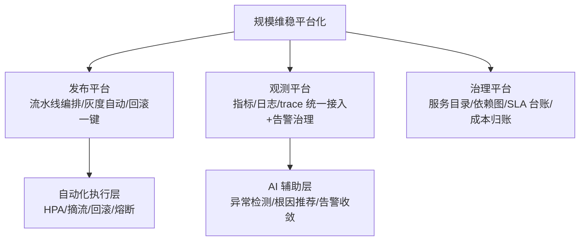
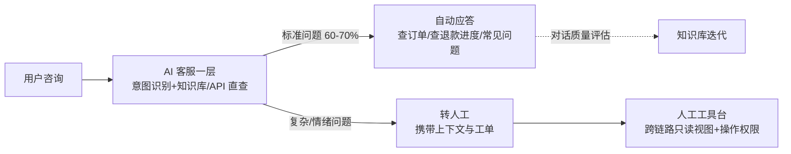

# 1000+ 服务的生产级维稳与 AI 治理：规模时代的全体系收拢

> 1000+ 服务是什么概念？任何「逐个检查」的人工动作都不可行了——一次全链路发布涉及 30 个团队，一个根因排查要穿过 8 层依赖，一份服务清单打印出来是十几页 A4。本篇收拢全体系：规模时代的维稳靠**平台化、自动化、AI 辅助**三条腿——并把「AI 治理与 AI 客服」（用户命题的最后一站）放进这幅地图。

## 一句话摘要

1000+ 服务的维稳 = **平台化**（发布/观测/治理的平台化让规模成本摊薄）+ **自动化**（扩缩容/摘流/回滚的自动化让人不成为瓶颈）+ **AI 辅助**（异常检测/根因推荐/告警收敛的 AI 进入运维链路）+ **AI 客服**（售后分流的智能化）——规模维稳的核心转变：**从「人守系统」到「系统守系统，人守边界」**。

## 本文核心

**核心机制一句话**：规模维稳的本质是把稳定性体系从「人驱动」升级为「平台驱动」——人工能守 50 个服务，1000 个服务必须让平台承担重复动作（发布/扩缩/告警处置），人只负责判断与边界（架构决策/预案审批/异常裁决）。

**机制链**：服务分级与治理（第 11 篇）→ 平台化承载重复动作（发布平台/观测平台/治理平台）→ 自动化执行（弹性/摘流/回滚）→ AI 辅助决策（异常检测/根因推荐/告警收敛/AI 客服分流）→ 人守边界（审批/裁决/复盘）。

**失效点/边界**：自动化的错误决策放大速度也是自动的（错误自动扩容/自动降级的误动作）；AI 的推荐依赖数据质量与预案库质量——**AI 是副驾驶不是自动驾驶**，人守边界。

服务规模的演进是平台化的最强驱动：50 服务时人工发布可控，200 服务时开始建发布平台，500 服务时观测平台成为刚需，1000 服务时治理平台与 AI 辅助进入运维链路——**平台的每一层都是被规模的痛逼出来的，跳过痛直接建平台会建成无人使用的空中楼阁**。

## 一、背景：1000+ 服务的规模病

千服务规模下，前面所有篇目的动作都会遇到「规模化墙」：

- **发布墙**：日均 200+ 次发布，人工审批与观察不可行 → 发布平台自动化编排
- **观测墙**：日均百万条日志、千级告警——人工治理告警不可行 → AI 收敛与降噪
- **排查墙**：一次根因排查穿 8 层依赖、跨 5 个团队——人工拼时间线不可行 → AI 根因推荐
- **治理墙**：服务清单/依赖图/SLA 台账人工维护必过期 → 平台自动发现

**规模病的解药不是更多人力**（1000 服务配 500 个 SRE 不现实），是**让重复动作平台化、让模式识别 AI 化、让人只做判断**。

## 二、核心：平台化三支柱

**发布平台**：流水线编排（构建→门禁→灰度→全量的自动流转）+ 发布单系统（变更内容/影响面/回滚条件模板化）+ 联动发布编排（依赖拓扑驱动的发布顺序）——发布从「工程师的系列手工操作」变成「平台的受控流程」。

**观测平台**：三支柱统一接入（接一次，指标/日志/trace 全通）+ 告警治理平台（分级/收敛/审计内建）+ 全景看板（服务目录×健康度×SLA 达成率）——观测从「各服务自建」变成「平台统一供给」。

**治理平台**：服务目录（服务/owner/SLA/依赖自动发现）、SLA 台账、成本归账、废弃检测——治理从「Excel 表格」变成「活的数据」。

## 三、机制：AI 治理与 AI 客服（用户命题收拢）

**AI 治理（AIOps）在运维链路的三个落点**：

| 落点 | AI 做什么 | 成熟度 | 人守的边界 |
|---|---|---|---|
| **异常检测** | 指标异常自动识别（替代静态阈值，减少漏报与误报） | 较成熟（头部团队生产使用） | 检测规则的有效性审计 |
| **根因推荐** | 故障时聚合告警/变更/trace，推荐 Top3 可能根因 | 试点期（推荐质量依赖数据完备度） | 推荐仅供参考，人确认 |
| **告警收敛** | 相关联告警自动聚类（一次故障收敛为一条根因告警） | 部分成熟（规则+ML 混合） | 收敛规则的治理 |

**AI 的价值锚点**：运维数据（日志/指标/trace/变更）的规模已远超人力的处理能力——AI 处理「模式识别与海量检索」，人处理「判断与决策」。**AI 治理的定位是压缩 MTTD 与辅助 MTTR，不是替代值班**。

**AI 客服在业务面的部署**（衔接第 2 篇后链）：

**AI 客服的架构要点**：一层 AI 承接高频标准问题（订单查询/退款进度/物流——API 直查即可回答），复杂与情绪问题转人工且**携带完整上下文**（用户不用重复描述）；分流率（AI 承接占比）与转人工满意度是双核心指标。**边界纪律**：涉及资金操作的客服决策（大额退款特批）必须人工——AI 客服是分流器不是决策者。

## 四、实践：典型场景与维稳日历

**典型场景**：

- **千服务发布**：发布平台编排（依赖顺序自动排）+ 灰度自动化 + 发布单集中审批——发布成本随规模摊薄
- **全链路告警风暴**：AI 收敛把 500 条告警聚合成 5 条根因告警——值班员从噪音中解放
- **AI 客服大促值班**：大促咨询量 10 倍，AI 承接 65% 标准问题，人工聚焦复杂 case——客服成本可控
- **例行巡检自动化**：容量水位/证书过期/慢查询/僵尸服务的自动巡检与工单派发

> 💡 实战提示：平台化的第一课是「度量现状」——人工发布的次数/时长、告警响应的平均耗时、人工巡检的工单数，这三个数字是说服公司投平台建设的最好弹药，也是验收平台 ROI 的基线。

**维稳日历**（规模维稳的节奏表）：

| 频率 | 动作 |
|---|---|
| 每日 | 告警响应、大盘巡检、值班交接 |
| 每周 | 告警审计、Action Item 跟进 |
| 每月 | 告警治理、容量水位评审、技术债排行 |
| 每季度 | 全链路压测、故障演练、预案更新、服务目录盘点 |

## 与稳定性系列的关系

稳定性系列是「单系统维稳的方法论」，本篇是「千服务规模的维稳形态」——方法论不变（度量/防护/隔离/容量/观测/演练/应急），但每个环节的载体从「脚本与人工」升级为「平台与 AI」。**规模改变的是执行形态，不是建设逻辑**。

## 你们可能会问

**Q1：1000 服务的依赖图能看得过来吗？**
看不完，也不需要全看——依赖图的价值在「变更影响分析」（改 X 会影响谁，自动圈出下游）与「故障传播路径」，按场景切片查看，不是盯全景。

**Q2：AI 客服用大模型还是传统 NLU？**
主流是分层混合：大模型做意图理解与对话生成（体验好），传统规则/API 做资金类精确操作（可控）——纯大模型直连资金操作在合规与幻觉风险上尚不可行。

## 追问链与我的判断

**追问链 1**：「平台化会不会让业务团队失去灵活性？」→ 平台管「标准动作」（发布流程/观测接入），业务保留「非标空间」（业务逻辑/技术选型白名单内自由）——**平台化的边界是「管标准不管个性」**。

**追问链 2**：「AI 根因推荐错了，工程师照着修出事故谁负责？」→ 推荐仅供参考、人确认执行——责任在人不在 AI，**这正是「AI 是副驾驶」的含义：方向盘永远在人手里**。

**追问链 3**：「1000 服务已经拆了，发现拆多了能合吗？」→ 能——按「变更耦合度」合并（总是同时发布的服务合为一个）——**拆与合都是架构演进常态，「不敢合」和「不敢拆」同属治理失败**。

## 常见误区

- **误区一：服务拆得越细越先进**。1000 个服务的前提是有平台承载——没有平台化能力的团队拆 1000 个服务 = 把单体的问题乘以 1000
- **误区二：AI 治理上线就无人值守了**。AI 推荐根因的准确率依赖数据完备度，误推荐的代价是真故障被误导——AI 是副驾驶，值班与架构判断仍是人的边界
- **误区三：AI 客服是成本削减工具**。分流率至上会牺牲体验（AI 答非所问强行不转人工）——分流率与满意度双指标才是可持续的
- **误区四：平台大而全是起点**。平台按痛点渐进（先发布平台、再观测平台、再治理平台）——一次性建全家桶是失败的常见起点

## 自测三问

1. **1000+ 服务维稳的核心转变是什么？**
   - 从「人驱动」到「平台驱动」：重复动作（发布/扩缩/告警处置）平台化自动化，人只做判断与边界（架构/审批/裁决）。

2. **AI 治理的三个落点与人守的边界？**
   - 异常检测（人审计规则）、根因推荐（人确认）、告警收敛（人治理规则）——AI 压缩 MTTD 辅助 MTTR，不替代值班。

3. **AI 客服的双核心指标与边界？**
   - 分流率（成本）与转人工满意度（体验）双指标；资金操作的决策必须人工——AI 是分流器不是决策者。

## 5W 速记卡

| W | 一句话 |
|---|---|
| What | 千服务规模的维稳体系：平台化 + 自动化 + AI 辅助 |
| Why | 人工守不住千服务规模——重复动作必须平台化，模式识别必须 AI 化 |
| Where | 发布/观测/治理三平台 + 业务后链的 AI 客服 |
| When | 服务数过百即启动平台化，过千 AI 辅助进入运维链路 |
| Who | 平台团队建三平台，业务团队消费，人守判断与边界 |

## 开放问题

- **AIOps 的误动作治理**：AI 自动止损（自动降级/自动扩容）的误动作会被自动放大——AI 决策权限的分级授权（什么级别 AI 可自动执行）仍是行业难题
- **AI 客服的体验天花板**：大模型让 AI 客服能力跃迁，但「情绪识别与共情」的体验上限仍与人工有明显差距——转人工的时机判断是产品核心竞争力

## 核心带走

**30 秒复述**：千服务维稳 = 平台化（发布/观测/治理三平台承载重复动作）+ 自动化（弹性/摘流/回滚自动执行）+ AI 辅助（异常检测/根因推荐/告警收敛/AI 客服分流）+ 人守边界（审批/裁决/复盘）。规模改变执行形态不改建设逻辑。**失效边界**：自动化误动作自动放大、AI 推荐误导故障处置、AI 客服分流率至上牺牲体验——三条都靠「人守边界」兜底。

## 📌 数据与事实声明

- 写于 2026-09-11；平台化/AIOps/AI 客服的成熟度评级为行业公开实践的归纳口径
- 行业认知：变更引发故障占比、AI 客服分流率与满意度双指标为公开分享口径
- 免责：平台选型与 AI 落地程度按团队阶段裁剪

## 📚 参考资料

| 类型 | 标题 | 来源 |
|---|---|---|
| 书 | 《SRE 工作手册》规模化运维章节 | 公开出版 |
| 官方文档 | Backstage / AIOps 实践参考 | backstage.io |
| 行业实践 | 千服务治理与 AIOps 公开分享 | 公开报道 |
