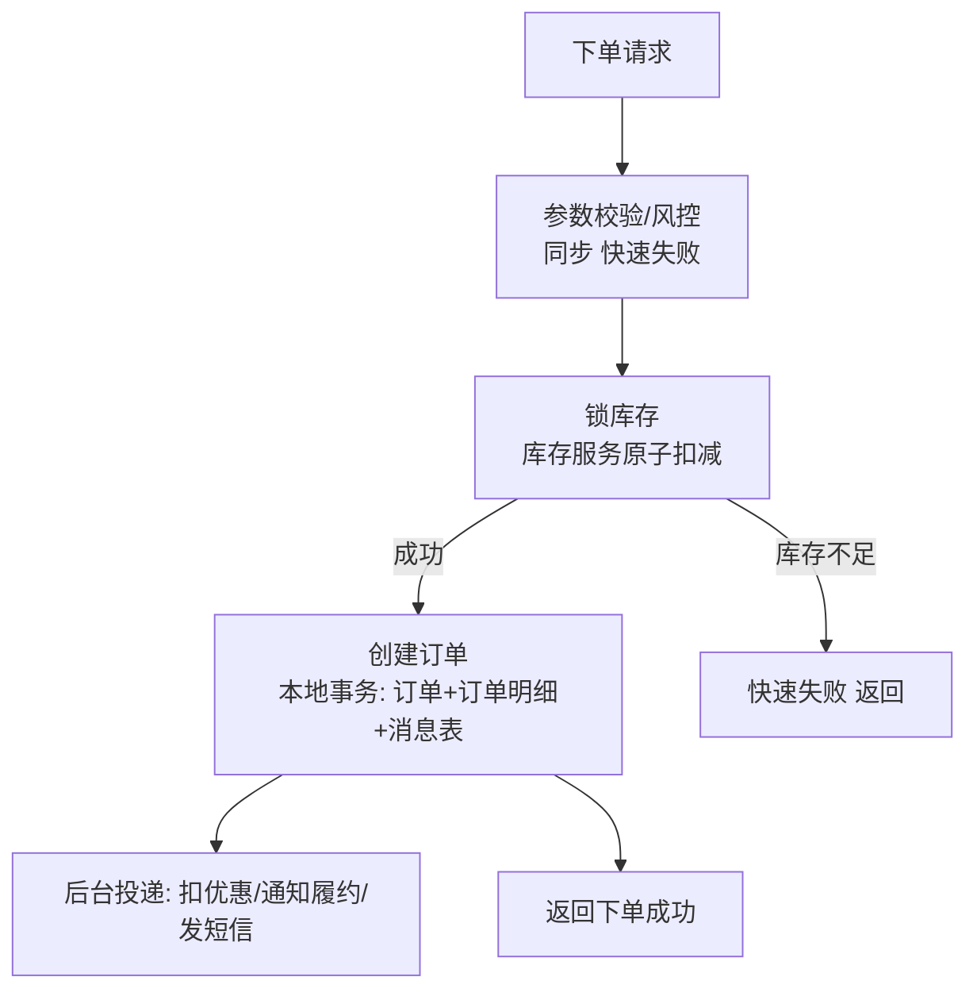
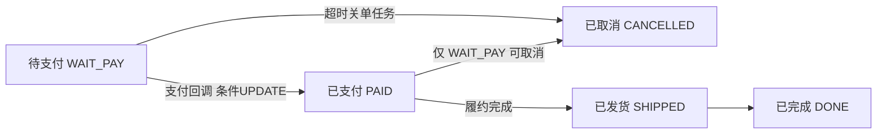
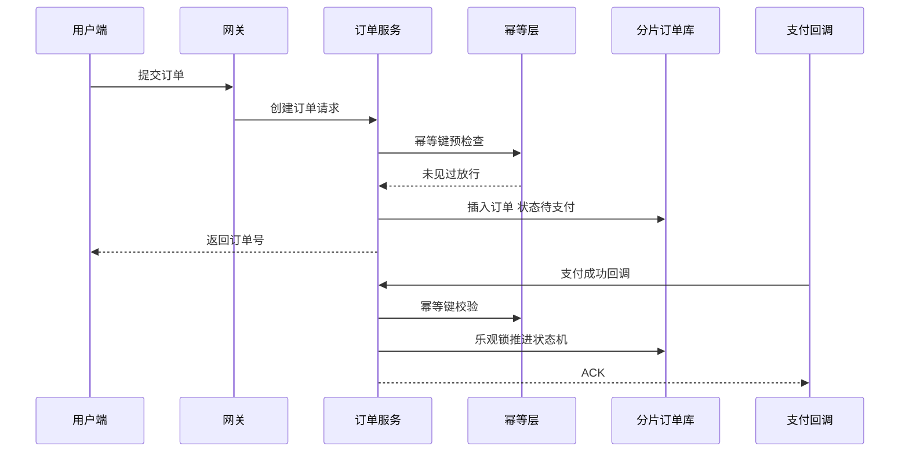
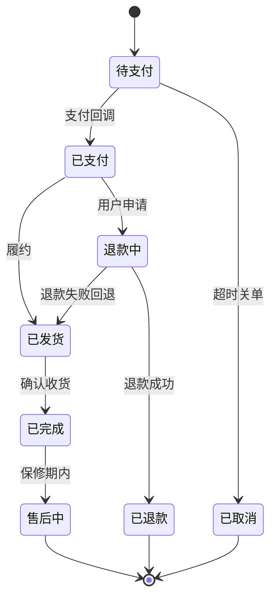

# 千万订单系统从零搭建：分片、状态机与一致性取舍

> 日订单 1000 万（峰值 3 万单/秒）是什么概念？订单表一年 36 亿行，单库单表第一天就是死路。本篇从零做这套架构：分片键怎么选、订单号怎么发、状态机怎么设计、下单链路的一致性怎么取舍、三个查询维度怎么满足——每个决策给候选方案与代价。

## 一句话摘要

日千万订单的架构 = user_id 分片（16 库 64 表）+ 订单号内嵌路由 + 下单同步链最短化（本地消息表最终一致）+ 状态机条件 UPDATE 幂等 + 商家/运营维度 ES 异构——每个决策都有候选对比与代价，量级决定一切。

## 本文核心

**核心机制一句话**：千万订单架构 = 以 user_id 为分片键的水平拆分（写路径线性扩展）+ 异构索引补查询维度（商家/运营维度用 ES/宽表反向覆盖）+ 状态机约束订单生命周期 + 下单链路用「本地事务 + 最终一致」换吞吐。

**机制链**：量级推导（日千万 → 峰值 3 万单/秒）→ 分库分表（16 库 × 64 表，user_id 取模）→ 订单号内嵌分片信息（免路由查表）→ 下单同步链最短化（锁库存→创单，其余异步）→ 状态机驱动幂等 → 买家/商家/运营三维度查询异构到 ES。

**失效点/边界**：user_id 分片后商家维度查询必须异构（跨 16 库聚合不可行）；异构索引有延迟（秒级），对账兜底；分布式事务没有银弹，只有取舍。

## 一、量级前提：数字决定架构

日订单 1000 万的推导链（所有架构决策的前提）：

- **平均写入**：1000 万 / 86400 秒 ≈ **116 单/秒**（平均）
- **峰值写入**：大促集中度按 20% 计（3 小时完成 60% 订单）≈ **5500 单/秒**；爆款开抢瞬间 **3 万单/秒**
- **读取放大**：一笔订单被查询 10-30 次（用户看、商家看、履约看）→ 订单读 **30 万+/秒**
- **数据增长**：日增 1000 万行 → **年 36 亿行**；单表超 2000 万行性能拐点 → 全生命周期需要 **1800+ 张表**

**存储成本与连接维度再补两刀**：年 36 亿行 × 单行 1KB ≈ 36TB/年——单实例存储上限、备份时长、DDL 锁表时长全部爆表；连接数维度，单库连接池上限 ~5000，写入 5500/s 的订单加上查询流量，单库连接池在峰值必然排队。

结论先行：**单库单表在任何环节都不成立**；分库分表从第一天就要做（后补分片的迁移成本是数月级）。还有一个容易忽视的次生决策：**分库分表定了，订单号、时间查询、跨片事务都要围绕它重新设计**——分片是「架构约束的源头」，后面每个决策都从它派生。

## 二、核心决策一：分片键怎么选

**候选方案对比**：

| 方案 | 买家查询 | 商家查询 | 运营查询 | 扩容 |
|---|---|---|---|---|
| user_id 取模 | ✅ 点查直达 | ❌ 广播 16 库 | ❌ 广播 | 好（一致性哈希） |
| order_id 取模 | ❌ 需查路由 | ❌ 广播 | ❌ 广播 | 好 |
| 时间分表 | ✅（近期数据） | ✅（近期） | ✅ | 差（历史冷但仍在） |
| **user_id 分片 + 异构索引** | ✅ | ✅ ES 覆盖 | ✅ 宽表覆盖 | 好 |

**决策：user_id（买家 ID）做分片键 + 异构索引补维度**。理由链：

1. **最高频查询是买家维度**（我的订单）：点查直达单库，性能最优
2. **写路径在同分片**：一个用户的订单全部落同一库——用户维度的事务（查订单+改订单）天然单库
3. **商家/运营维度是异构索引的活**：下单后通过 binlog/CDC 异步同步到 ES（商家维度）与宽表（运营维度），秒级延迟可接受（商家看订单晚 1 秒无感）

**Trade-off 深挖**：异构索引的代价是**一致延迟 + 一套同步设施**（binlog 订阅 → 消息队列 → 索引写入 → 对账兜底）。买家维度查询的实时性换来商家维度的秒级延迟——这笔取舍在电商场景几乎总是对的（商家对秒级延迟不敏感，对查询能力敏感）。

**分片参数怎么定**：16 库 × 64 表 = 1024 张表，单表年均 350 万行（留 5 年余量）。库数 = 预期峰值连接数/单库承载；表数 = 数据量/单表拐点——**表数一次性给足**（表级拆分成本低），**库数按需扩**（扩库要迁移数据）。

## 三、核心决策二：订单号——分片路由的内嵌

订单号不只是唯一标识，**它是路由信息的载体**：

```
订单号 = 时间戳(41bit) + 机器ID(10bit) + 序列号(12bit)   ← 标准雪花
改进：分段嵌入分片位——
[时间 38bit][分片位 10bit][机器 6bit][序列 10bit]
分片位 = user_id 后 10bit → 订单号自带「我在哪个分片」
```

**为什么值得**：买家拿订单号查详情（客服场景），无需先查 user_id 再路由——订单号解析出分片位直达。这是「空间换一次查询」的经典取舍（订单号从 64bit 里的几个 bit 携带路由信息，代价是分片扩容时需要基因法兼容）。

## 四、核心决策三：下单链路的一致性取舍

下单 = 锁库存 + 创订单 + 扣优惠 + 通知履约。跨库跨服务，强一致不可能（也不必要），取舍矩阵：

| 方案 | 一致性 | 吞吐 | 复杂度 | 适用 |
|---|---|---|---|---|
| 2PC/XA | 强 | 差（锁持有久） | 中 | 传统金融封闭场景 |
| TCC | 强（业务级） | 中（三接口开发量） | 高 | 资金类强一致 |
| **本地消息表 + 最终一致** | 最终（秒级） | 好 | 中低 | **订单主链路推荐** |
| 事务消息（RocketMQ） | 最终 | 好 | 中 | 有 RocketMQ 基建 |

**下单主链路的推荐设计**：



关键取舍三点：

1. **同步链只留两步**（锁库存 + 创单）——优惠券核销、履约通知、积分全部异步。同步链每多一步，峰值吞吐按乘法下降，且任一步故障拖垮整个下单
2. **本地消息表保最终一致**：创单与「待投递消息」同一本地事务，后台扫表投递——不引入分布式事务组件，一致性靠消息表的状态机保证
3. **失败补偿而非回滚补偿**：异步步骤失败走重试 + 死信 + 人工兜底，不做反向回滚（优惠券核销失败，重试即可，不必把订单撤掉）

**防超卖是库存服务的事**：原子扣减（`UPDATE stock SET n = n - ? WHERE sku = ? AND n >= ?`）+ 热点商品走 Redis 预扣（异步落库）——热点行的数据库扣减在万级 QPS 下是单行锁灾难，必须上移到缓存层。

## 五、核心决策四：状态机与幂等

订单生命周期是一台显式状态机：**待支付 → 已支付 → 已发货 → 已完成**，外加取消/退款分支。状态机用数据库行级约束落地：

```sql
-- 状态流转必须带前置状态条件——天然幂等且防并发乱序
UPDATE orders SET status = 'PAID', paid_at = now()
WHERE order_id = ? AND status = 'WAIT_PAY';
-- 影响行数 = 0：重复回调/乱序回调，直接忽略
```

支付回调的幂等就靠这一条 UPDATE：回调来两次，第二次影响行数 0，返回成功即可。**状态机的每一条边都有前置条件，乱序与重复天然免疫**——这比「用分布式锁防重」便宜且可靠得多。



这张状态机图的价值在「箭头上的条件」：每条边都是一条带前置状态的条件 UPDATE，非法流转（如 CANCELLED → PAID）在数据库层面就不可能发生——**把业务规则下沉到数据约束，是分布式系统里最便宜的可靠性**。

> 💡 实战提示：分片数定下来后，写一个「分片路由验证脚本」进 CI——随机生成 user_id 断言路由结果，任何人改分片算法都会被测试拦住。路由逻辑出错是分库分表最隐蔽的事故形态。

## 六、事故推演：分片键选错的一年

推演一个常见的错误演进：项目初期订单量小，团队选了 `order_id 取模` 分片（当时「订单号查询多」听起来合理）。一年后：

- 商家后台要查「我的订单」→ 广播 16 库聚合，P99 从 50ms 恶化到 900ms
- 运营报表查全天订单 → 16 库并行扫描，慢查询塞满连接池
- 兜不住的团队开始建 ES 异构——但因为分片键是 order_id，**历史数据重算路由要按 order_id 反查 user_id**，迁移脚本写了两周

> 💡 实战提示：下单接口的压测口径必须包含「库存扣减」——大量团队压测时 mock 掉库存服务，上线后才发现热点 SKU 的行锁才是第一瓶颈。

**根因不是技术，是分片键决策时没有「按查询维度加权」**。分片键选择的完整决策树：列出所有查询维度及频率 → 最高频且强实时的维度做分片键 → 其余维度异构覆盖 → 异构不了的（如全表统计）走数仓。

## 你们可能会问

**Q1：订单和库存扣减不在一个库，怎么保证不超卖不丢单？**
拆开看：库存自身原子扣减保证不超卖；订单创建成功后「扣减失败」的窗口由本地消息表+对账兜底——极端情况下出现「订单存在但库存未扣」，对账任务发现后自动取消订单并退款。最终一致的含义就是「对账兜底是最后一道防线」。

**Q2：为什么不用 MongoDB 这类文档库存订单？**
文档库的写入扩展天然好，但订单的强一致需求（库存联动、资金对账）、事务边界、团队 SQL 能力储备，让关系库+分片仍是主流选择——「换数据库」解决的是模型问题，订单的问题主要是规模问题。

**Q3：分片扩容（16 库 → 32 库）具体怎么操作？**
双写迁移四步：新库开双写 → 历史数据迁移+校验 → 灰度切读 → 停旧写。订单号内嵌分片位的方案要配「扩容位数兼容」设计（这也是分片位只占 10bit、留了余量的原因）。

## 七、四高自查与 Trade-off 总表

| 四高 | 本方案达成度 | 代价 |
|---|---|---|
| 高性能 | 写 3 万/s（同步链两步+热点缓存）；读 30 万/s（分片点查+ES） | 异构索引秒级延迟 |
| 高并发 | 分片线性扩展，扩库扩表路径清晰 | 扩库需数据迁移 |
| 高可用 | 订单库主备 + 消息表投递可重试 + 降级预案（积分/短信可断） | 库级故障影响 1/16 用户 |
| 高扩展 | 表数一次给足，扩库走双写迁移 | 分片位嵌入订单号需扩容兼容 |

## 追问链与我的判断

**追问链 1**：「为什么是 1024 张表？」→ 年增 3600 万行、单表 2000 万行拐点、留 5 年余量 → 3600 万×5÷2000 万 = 9 张起步？不对——**拐点之外还有索引深度与备份窗口**，且大促单日可到日常的 3 倍，所以按「日常年均 ×3 峰值系数」重算 = 27 张 → 再留 2 倍演进余量 = 64-128 张起。我的判断：**1024 张是「分一次管五年」的取整选择**，分一次的成本远高于分两次，宁多勿二拆。

**追问链 2**：「为什么不用 TCC 保证下单强一致？」→ TCC 三接口开发量是普通接口的三倍 → 那为什么资金场景愿意用？→ 因为资金错了不能对账抹平 → 所以判断依据是「错了能不能靠对账补偿」——库存少扣可以补（对账可发现），钱多发回滚成本极高（TCC 值得）。**我的判断：一致性强度跟着「错误的不可逆性」走，不跟着「数据重要性」走。**

**追问链 3**：「热点商品 Redis 预扣，Redis 挂了怎么办？」→ 降级到 DB 匀速扣 → 那 DB 扛不住怎么办？→ 限流排队 → 用户体验呢？→ 排队页。**每一层防线都有代价，架构者的责任是把代价显式化后做选择，而不是宣称有银弹。**

#2 业务线全景


## 常见误区

- **误区一：一开始不分库，等大了再说**。分库分表的后补迁移是数月级工程（双写/回填/切流），且带着流量做——**量级可预期时，第一天就分**
- **误区二：分片键选「写入均匀」的维度**。order_id 写入最均匀，但查询维度全废——分片键为最高频查询服务，均匀性靠基因法/加盐微调
- **误区三：下单链路追求全同步**。同步链每加一步，峰值吞吐乘法下降、可用性乘法下降——能用最终一致的步骤全部异步化
- **误区四：状态流转用 if 判断**。散落的 if 无法防乱序与并发；数据库条件 UPDATE 的状态机是幂等的结构化解法

## 工程级深化：参数、步骤与量级分档

> 设计决策讲完，这一节把它压到可执行层：参数怎么配、上线怎么走、量级变了怎么调。所有默认值以社区主流版本为参考，落地前以自己压测为准（行业认知）。

### 参数级配置清单（下单链路）

| 配置项 | 默认值 | 10w 级推荐 | 千万级推荐 | 亿级推荐 | 为什么 |
|---|---|---|---|---|---|
| 分片总数（orders） | 16 | 16 | 64 | 256+ | 分片数决定单表行数上限，扩容翻倍成本高，一次到位比事后翻倍便宜 |
| 单表容量水位 | — | 500 万行 | 300 万行 | 200 万行 | 行数越大 B+ 树越深，索引维护成本非线性上升，提前预留迁移余量 |
| 分片键 | user_id | user_id | user_id | user_id | C 端查询 90% 按人查；商户维度走异构索引，不与主链路抢路由 |
| 连接池 maxPoolSize | 10 | 20 | 30-50 | 50+分实例 | 连接数是 DB 第一瓶颈，超配只换排队不换吞吐，靠分实例摊 |
| 幂等键 TTL | 24h | 24h | 48h | 72h | 覆盖支付回调最长重试窗口，TTL 内重复请求直接短路返回原结果 |
| 状态机乐观重试次数 | 3 | 3 | 5 | 5 | 乐观锁冲突是正常流量特征，重试 3 次覆盖 99% 冲突，更多只是放大写放大 |
| 下单超时预算 | 800ms | 500ms | 300ms | 200ms | 下单是入口链路，预算要留给下游，入口超时必须小于页面可感知阈值 |
| MQ 发送重试 | 2 | 2 | 3 | 3 | 配合本地消息表，重试是兜底不是保障，保障靠对账 |

### 步骤级操作：从容量评估到灰度上线

前置条件：容量预估报告（峰值 QPS、年增长）、分片键选型评审通过、ShardingSphere 接入测试环境回归通过。

- Step 1 容量推演：按「峰值 QPS x 订单行大小 x 保留周期」算出 3 年总量，除以单表水位得出分片数。验证点：分片数是 2 的幂，路由取模无热点倾斜。
- Step 2 影子表验证：测试环境按生产分片数建表，灌入模拟数据，跑全量读写用例。验证点：`EXPLAIN` 每条核心 SQL 都命中分片键，无全路由广播。
- Step 3 灰度接入：线上新流量按白名单用户切到新链路，老链路保留双写。验证点：双写对账任务差异数为 0，连续观察 3 天。
- Step 4 切读：读流量按 1% - 10% - 50% - 100% 四批切换，每批观察核心接口 P99 与错误率一个高峰时段。验证点：切流后订单查询成功率与老链路持平。
- Step 5 演练扩容：在预发演练一次「翻倍扩容」（16 到 32），验证一致性哈希或翻倍扩容方案的停写窗口。验证点：窗口内写入有明确阻塞提示，数据迁移校验和一致。
- 回退：任何一步验证不过，切回老链路白名单全量，双写不停——回退成本在方案设计期就要压到一条开关命令。

### 量级分档下的参数与取舍

10w 级（单库可扛）：这个量级最容易犯的错是「提前过度设计」。单库 16 分片、无异构索引，靠缓存加索引就能稳住；此时引入 HBase 或宽表引擎纯属增加故障面。该档位的 Trade-off 是：架构简单换人力效率，把预算留给监控。

千万级（必须分库分表）：主链路开始怕慢查询与大事务。参数上把超时预算收紧、幂等 TTL 拉长、对账频率提上去。该档位的 Trade-off 是：为查询多维化引入异构存储（ES 宽表），接受「双写一致性」这个新问题域。

亿级（分片数翻倍也扛不住的那天）：写热点从「库」下沉到「行」，单一爆款订单行会成为局部热点。该档位要么上单元化（按地域/业务线切独立闭环），要么把订单主链路与支付回调链路物理隔离。Trade-off：单元化换爆炸半径可控，代价是跨单元对账与全局路由复杂度翻倍。

### 关键链路时序：下单到支付回调



### 状态视角：订单主状态机



状态机两个工程细节：一是所有变更必须带前置状态（乐观锁），并发回调只允许一个胜出；二是「退款失败回退到已发货」这类逆向边必须显式建模——漏了它，退款失败的单据会永远卡在中间态。

## 自测三问

1. **为什么分片键选 user_id 而不是 order_id？**
   - 最高频且强实时的查询是买家维度，user_id 分片让写路径与买家查询单库闭环；商家/运营维度低频且容忍秒级延迟，用 ES/宽表异构覆盖。

2. **下单为什么用本地消息表而不是 TCC？**
   - 订单主链路是「自建服务间的最终一致」，秒级延迟可接受——本地消息表无第三方框架依赖、吞吐好；TCC 的强一致成本（三个接口+空回滚）只在资金类必要。

3. **防超卖为什么在缓存层做？**
   - 热点商品扣减是单行锁灾难（万级 QPS 全在等一行锁）；Redis 预扣把热点分散到内存，异步落库消化——数据库只承担削峰后的匀速写入。

## 5W 速记卡

| W | 一句话 |
|---|---|
| What | user_id 分片 + 订单号内嵌路由 + 状态机 + 本地消息表的订单架构 |
| Why | 日千万订单下，单库不可行、查询维度需异构、一致性需取舍 |
| Where | 电商/交易平台的订单中心 |
| When | 量级可预期日百万以上时，第一天就分库分表 |
| Who | 交易/订单团队主导，库存/优惠/履约团队配合异步契约 |

## 开放问题

- **跨分片事务的边界**：用户改地址（涉及订单+用户两库）这类低频跨片操作，走服务层补偿还是引入分布式事务框架——各厂答案不一
- **分片扩容的自动化**：双写迁移工具链（广度/一致性校验/切流）产品化程度参差，万级表规模的自动扩容仍在演进

## 核心带走

**30 秒复述**：千万订单 = user_id 分片（16 库 64 表）+ 订单号内嵌分片位 + 下单同步链最短化（锁库存+创单，其余异步本地消息表）+ 状态机条件 UPDATE 保幂等 + 商家/运营维度 ES/宽表异构。**失效边界**：分片键不按查询维度选 = 一年后广播查询拖死全库；异构索引延迟无对账兜底 = 商家看到的世界会撒谎。

## 📌 数据与事实声明

- 写于 2026-09-10；量级前提（日千万订单/峰值 3 万单秒）为场景设定基准
- 行业认知：分库分表参数、单表 2000 万行拐点、本地消息表模式为行业公开实践口径（各厂技术分享）
- 免责：具体分片数与阈值需按实际业务压测裁剪

## 📚 参考资料

| 类型 | 标题 | 来源 |
|---|---|---|
| 书 | 《数据密集型应用系统设计》（DDIA）Partition 章 | 公开出版 |
| 行业实践 | 电商订单分库分表公开分享 | 公开报道 |
| 官方文档 | ShardingSphere 分片策略 | shardingsphere.apache.org |
