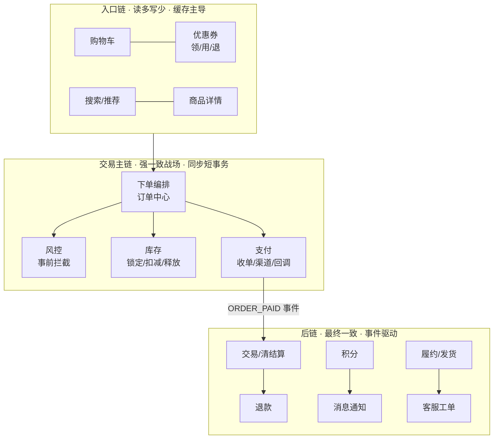

# 业务线全景：几十个链路的分工、协作与数据一致性

> 用户命题原话：「支付，下单，库存，订单，购物车，优惠券，风控，交易，等等，几十个链路的分工合作，数据一致性」——本篇就是这句话的展开：一笔交易从购物车到退款，穿过几十个服务，每个链路管什么、不管什么、彼此怎么协作、一致性怎么分级。这是全体系地图的业务面，也是其余各篇的骨架。

## 一句话摘要

业务线的分工哲学 = **每条链路只做自己的领域**（订单不管支付、支付不管库存），通过**事件**而非调用来协作（下单成功发出事件，优惠券/积分/履约各自订阅）；一致性按链路分级——交易主链（下单/库存/支付）同步短事务，后链（清结算/退款/积分）异步最终一致 + 对账兜底；几十个链路不是几十个孤岛，是**一张由状态机与事件流织成的网**。

## 本文核心

**核心机制一句话**：链路分工靠领域边界（own 单一数据、暴露能力而非数据库），协作靠事件驱动（主链同步调用的数量压到最少），一致性靠分级（强一致/最终一致/对账兜底三层契约）。

**机制链**：用户动作 → 入口链（购物车/优惠券，读缓存）→ 交易主链（下单编排：风控→锁库存→创单→支付，同步短事务）→ 事件广播（ORDER_PAID）→ 后链消费（清结算/积分/履约/消息）→ 对账闭环（T+1 全量校验）。

**失效点/边界**：跨链路查库（绕过领域边界）是腐化起点；事件乱序/丢失没有兜底对账 = 后链数据漂移；主链追求过度强一致 = 吞吐崩塌。

## 一、全景：一笔交易穿过的几十个链路

**三段式的量级差异**：入口链承接亿级流量（PV 口径，缓存扛 95%+）；交易主链承接千万级并发（订单量口径，数据库与一致性的战场）；后链承接订单量但允许秒~分钟级延迟（异步消化）。**流量越往深处走越窄、越需要一致性**——这个漏斗形状决定了每段的架构形态。

## 二、入口链：购物车与优惠券

**购物车**的架构要点是「读多写少 + 可容忍」：加购/改数量的写入 QPS 高但丢失一两条可容忍（用户体验型数据）。设计取舍：存储用 Redis Hash（用户维度一个 key，TTL 半年）而非数据库——写入路径短、无分片焦虑；代价是持久性弱（Redis 故障恢复窗口内的变更丢失），业务上可接受（购物车丢一条不是事故）。

**优惠券**是入口链里唯一要「认真对账」的：领券（库存有限，防超发）与核销（资金相关，防重复用）。防超发的手段与库存同构（原子扣减 + Redis 预扣）；核销与订单的关联走主链（下单时冻结、支付后核销、取消后解冻）——**优惠券的价值流转必须在主链有一致性保障，发出去的优惠不能凭空消失**。

> 💡 实战提示：购物车最常见的故障不是技术是产品口径——「加购价与结算价不一致」的投诉，根因是购物车缓存的价格快照与下单时实时价之间没有明确的时效契约。架构上要定死：**购物车只做展示价，下单必取实时价**，差价在结算页显式提示。

## 三、交易主链：下单编排

主链是几十个链路的「总指挥」，也是一致性问题的集中营。**下单编排的标准动作序列**：

**分工边界逐个说清**（这是「几十个链路分工合作」的核心）：

| 链路 | 它拥有什么（Own） | 它对外承诺什么（API） | 它坚决不做什么 |
|---|---|---|---|
| 订单中心 | 订单数据与状态机 | 创建/查询/取消订单 | 不碰库存不碰钱 |
| 风控 | 规则引擎与黑名单 | 事前评分（放行/拦截/人审） | 不改订单内容 |
| 库存 | 库存数据与扣减 | 锁定/扣减/释放（幂等） | 不感知订单含义 |
| 支付 | 渠道对接与支付单 | 收单/回调/查询支付状态 | 不改业务订单状态（回调驱动订单自己改） |
| 优惠券 | 券数据与核销规则 | 冻结/核销/解冻 | 不管订单优惠怎么算价 |

**「Own 单一数据」是分工的第一原则**：库存数据只有库存服务能写，订单中心想改库存只能调它的 API——任何「绕过去直接 UPDATE 别人的表」都是腐化的起点（也是数据一致性的第一个破口）。

**反向依赖治理**：支付回调改订单状态？错——支付只发「支付成功事件」，订单中心消费事件后**自己**更新自己的状态机。这条纪律的价值在大规模时显现：支付渠道从 3 个换到 8 个，订单中心零改动。

## 四、数据一致性的三层契约

几十个链路的一致性不是一个答案，是三层契约按场景分配：

| 层 | 契约 | 手段 | 适用 |
|---|---|---|---|
| **强一致（同步短事务）** | 操作成功即一致 | 单库事务 / TCC | 库存扣减、订单创建、支付单 |
| **最终一致（事件驱动）** | 秒~分钟级达成 | 消息表+MQ+幂等消费 | 积分、通知、履约、搜索索引 |
| **对账兜底（T+1 校验）** | 不一致必被发现 | 全量对账+差错处理 | 资金、券、库存三方核对 |

**为什么主链不全用强一致**：分布式强一致（2PC/TCC）的吞吐代价在峰值场景不可承受——3 万单/秒 × TCC 三阶段 = 数据库连接与锁的乘法灾难。**分层取舍：钱和货（库存/支付/订单本体）强一致或准强一致；衍生数据（积分/消息/索引）最终一致；一切以对账兜底**。对账是这套体系的最后一道防线，也是唯一能发现「所有环节都正常但组合起来不对」的机制。

**事件可靠性的一致性语义**：事件驱动最怕丢消息与乱序。标准解法：本地消息表（业务与事件同事务落库）+ 消费端幂等（事件 ID 去重）+ 按订单号分区有序（同一订单的事件进同一分区，串行消费）。

## 五、后链：退款、客服与清结算

**退款**是主链的逆过程，但比下单复杂：资金原路退回（渠道异步）、库存回补（可能超时不可回）、优惠券解冻（可能已过期）——**每个回滚步骤都有「补偿不了」的分支**，所以退款是状态机+人工兜底最重的链路。架构上退款单独立建模（不是订单的一个字段），与原订单通过事件关联。

**客服**是业务面的最后一环，也是用户侧的「兜底界面」：工单系统对接订单/支付/物流数据（只读视图 + 跨链路操作权限）。**AI 客服的分工位置**：一层承接高频标准问题（查订单/查物流/退款进度，API 直查）+ 二层转人工（工单+上下文携带）。AI 客服的价值指标不是「替代多少人」而是**分流率与转人工满意度**——这决定它是成本中心还是体验资产。

**清结算**（交易链路）与订单解耦最彻底：T+1 按渠道对账文件核销流水——它是数据面的重度消费者，也是对账兜底体系的建设者。

链路协作形态的演进史值得记一笔：早期单体（函数调用=一切强一致）→ SOA/微服务（HTTP 直调，链式同步）→ 事件驱动（订阅解耦，最终一致成主流）→ 编排+Saga（长事务标准化）——**每次演进都在「一致性强度」与「链路解耦」之间重新找平衡点**。

## 六、事故推演：一个一致性破口的传播

场景：大促晚 8 点，运营在后台改价，同时大量用户下单。

1. 改价服务直接 UPDATE 了商品库的价格表（**绕过了商品服务的领域边界**——改价逻辑图省事直连库）
2. 商品服务内存缓存未失效（它不知道数据被改了），购物车与详情页还是旧价
3. 下单取实时价（正确设计）——**结算页价格与下单价格不一致**的投诉爆发
4. 客服没有「查缓存与库的差值」工具，定位耗时 40 分钟，期间投诉升级

根因链：**绕过领域边界直改数据 → 缓存失效机制失效 → 价格双轨**。修复不只是加缓存刷新——是把改价收编回商品服务的 API（数据只有一个写入者）。这个事故的普适教训：**几十个链路的一致性，第一敌人不是技术是「绕过边界的捷径」**。

## 七、四高自查

| 四高 | 达成手段 | 代价 |
|---|---|---|
| 高性能 | 入口链缓存扛量，主链同步最短化 | 缓存一致性窗口 |
| 高并发 | 链路水平扩展 + 事件削峰 | 异步链路延迟 |
| 高可用 | 链路隔离 + 降级预案（入口链可降级静态化） | 后链堆积需消化 |
| 高扩展 | 领域边界清晰 → 单链路独立扩容 | 跨链路查询要走聚合层 |

## 你们可能会问

**Q1：几十个链路，团队怎么对应组织？**
康威定律在起作用：链路边界 ≈ 团队边界——每个链路一个 owner 团队（数据+API+SLA 一体）；跨链路的协调靠架构组定的契约（事件规范/对账规范），不靠会议。

**Q2：小团队做不到几十个链路怎么办？**
链路是逻辑边界，不要求物理拆分——单体里的模块化包结构同样能守住 Own 边界；等规模到了再物理拆，边界已经练好了。先有边界纪律，再有服务拆分。

**Q3：事件那么多，怎么管得住？**
事件注册中心（schema 版本化）+ 消费端幂等规范 + 对账兜底——事件与 API 一样是契约，需要版本管理与文档治理。

## 常见误区

- **误区一：链路分工 = 多建服务**。服务数量不等于分工质量——Own 边界清晰才是；一个 Own 不清的微服务比单体更糟（分布式单点）
- **误区二：全部强一致才安全**。强一致的吞吐代价在峰值场景是灾难；分层一致性 + 对账兜底才是生产答案
- **误区三：事件驱动了就不用对账**。事件会丢、会乱序、消费会 Bug——对账是唯一能发现「组合性错误」的机制
- **误区四：退款是下单的逆函数**。每个回滚步骤都有补偿不了的分支（券过期/渠道关单），退款必须独立建模带人工兜底

## 追问链与我的判断

**追问链 1**：「购物车为什么不上数据库，丢了不怕资损吗？」→ 购物车丢失丢的是体验不是钱 → 那优惠券丢了也不怕？→ 不行，券是资金属性 → **同一入口链，按「丢了值多少钱」分存储等级**——这是分级思维的第一次落地。

**追问链 2**：「订单中心 Own 订单，那退款单谁 Own？」→ 退款独立建模（不是订单的子状态）→ 为什么不能做成子状态？→ 退款的资金流、渠道交互、人工介入复杂度远超订单字段——**复用订单状态机表达退款，是把十种复杂度塞进一个字段**。我的判断：退款必须独立域，这是用无数次复盘换来的共识。

**追问链 3**：「几十个链路，事件会不会爆炸成 spaghetti？」→ 会——所以事件也要治理（schema 注册/消费关系登记/对账覆盖），事件驱动的反面不是回到同步调用，是**事件也要有边界纪律**。

## 自测三问

## 自测三问

1. **「Own 单一数据」为什么是分工第一原则？**
   - 数据只有一个写入者 = 一致性责任唯一可归属；多个写入者 = 缓存、对账、追溯全部失控（改价事故的根因）。

2. **一致性三层契约怎么分配？**
   - 钱和货（主链）强一致/准强一致；衍生数据（后链）事件驱动最终一致；一切以 T+1 对账兜底。

3. **支付回调为什么不能直接改订单状态？**
   - 支付只发事件，订单消费后自己改——保持「订单状态只有订单中心能写」，渠道扩展时订单零改动。

## 5W 速记卡

| W | 一句话 |
|---|---|
| What | 几十个业务链路的领域分工 + 事件协作 + 分层一致性 |
| Why | 亿级流量与千万并发下，单体式协作（到处直调直改）不可扩展 |
| Where | 电商/交易平台全链路 |
| When | 服务化拆分时按 Own 边界定链路 |
| Who | 每条链路的 owner + 架构组定协作契约 |

## 开放问题

- **跨链路查询的聚合层**：订单详情页要拼 8 个链路的数据——BFF 聚合还是宽表反范式，各有代价，规模决定选型
- **一致性契约的验证自动化**：三层契约目前靠评审+对账事后发现，「契约测试」能否在 CI 阶段拦截跨链路违规（如直连他人库）仍在探索

## 核心带走

**30 秒复述**：业务线全景 = 入口链（缓存）/交易主链（同步短事务+状态机）/后链（事件+对账）三段漏斗；分工第一原则「Own 单一数据」；一致性三层契约（强一致给钱货、最终一致给衍生、对账兜底一切）。**失效边界**：绕过领域边界的捷径（直改他人库）是一致性第一破口；没有对账的事件驱动会静默漂移。

## 📌 数据与事实声明

- 写于 2026-09-11；链路清单与分层为本系列对电商交易公开实践的教学归纳
- 行业认知：本地消息表/幂等消费/分区有序为公开工程实践；对账兜底为资金类系统共识
- 免责：具体链路划分按业务实际裁剪

## 📚 参考资料

| 类型 | 标题 | 来源 |
|---|---|---|
| 书 | 《数据密集型应用设计》（DDIA）第 7-9 章 | 公开出版 |
| 书 | 《领域驱动设计》Eric Evans | 公开出版 |
| 行业实践 | 电商交易链路公开分享 | 公开报道 |
