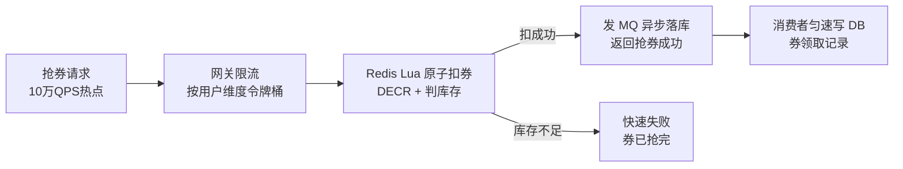
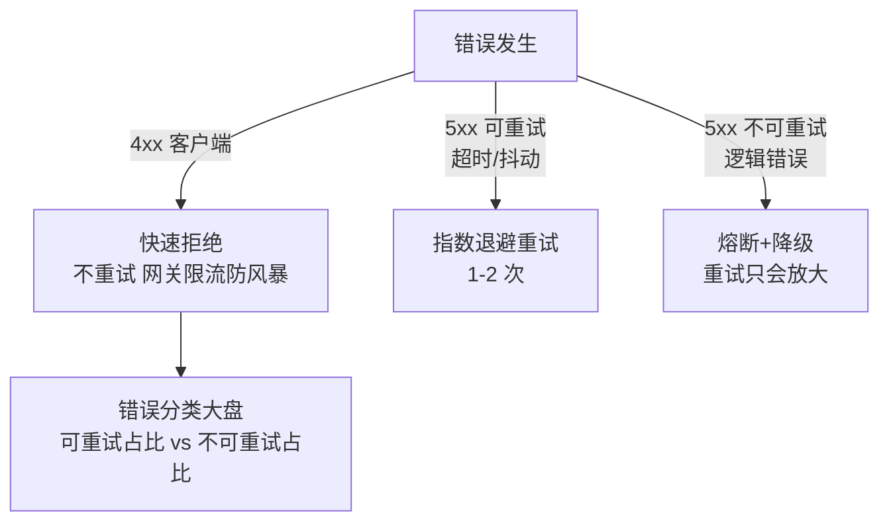

# 交易链路技术决策全景：同步异步、事务选型、 RPC 与 REST、错误处理与快速恢复

> 用户命题原话：「技术面感觉深度一点，并且结合业务，RT，99线，降级处理，数据治理，数据一致性，哪些是同步，哪些是异步，mq，redis，抢优惠券，哪些有事务，用什么事务，哪些走大数据，运营实时变更优惠券配置的风险，服务风险治理。哪些走rpc,哪些走rest，网络400怎么办，500怎么办，核心链路然后处理，非核心链路然后处理，然后快速回复。」——本篇把这笔账算清楚：交易链路上每一个技术选择，都有明确的决策表和代价。

## 一句话摘要

交易链路的技术决策是一张张决策表的串联：**RT 预算倒推同步链长度**（99 线 500ms 意味着同步只留 3 步）、**同步/异步按「用户感知 + 资金属性」划分**、**事务按数据归属选型**（单库事务/TCC/本地消息表各管一段）、**RPC 内网 REST 跨界**、**400 客户端修 500 服务端救**、**核心链路保命非核心链路让路**、**配置变更是高危操作要走灰度**——每个决策不是原则口号，是带数字与方案的对照表。

## 本文核心

**核心机制一句话**：一切技术决策从 RT 预算出发倒推——预算决定同步链长度，同步链决定事务边界，事务边界决定一致性层级，一致性层级决定降级与恢复策略。

**机制链**：99 线目标（500ms）→ 延迟预算分配（每环节限额）→ 同步链最短化（3 步）→ 剩余全部异步（MQ/本地消息表）→ 每段选事务（单库/TCC/无）→ 错误分级处理（4xx/5xx/超时）→ 降级预案挂核心链路 → 配置变更灰度 → 快速恢复三板斧。

**失效点/边界**：99 线不达标先查同步链长度（最长的一步往往是外部调用）；异步链故障靠对账不靠祈祷；配置实时变更是「没有发布流程的发布」，风险等同上线。

## 一、RT 与 99 线：预算倒推一切

**为什么是 P99 不是平均值**：平均值会被快请求稀释——1000 个请求里 990 个 50ms、10 个 5 秒，平均 99ms「看起来优秀」，但那 10 个 5 秒的用户已经在投诉了。**99 线刻画的是最差 1% 用户的真实体感**，交易系统对它的承诺就是 SLA 的核心条款。

**下单链路的 RT 预算表**（目标：P99 ≤ 500ms）：

| 环节 | 预算 | 性质 | 超预算的处理 |
|---|---|---|---|
| 网关+鉴权 | 20ms | 同步 | 无状态水平扩展 |
| 风控事前 | 50ms | 同步 | 规则引擎内存化，超时放行走事中 |
| 锁库存 | 80ms | 同步 | Redis 预扣（DB 扣减 P99 200ms+ 不可接受） |
| 创订单（含本地消息表） | 100ms | 同步 | 单库事务，分片后单表小 |
| 优惠券冻结 | 80ms | 同步 | 同库存，热点走缓存 |
| 发起支付参数 | 50ms | 同步 | 本地生成，不外呼 |
| **同步链合计** | **380ms** | | 留 120ms 给网络抖动与 GC |
| 支付回调→状态更新 | 秒级 | 异步 | 用户在收银台，不占下单 RT |
| 积分/通知/索引 | 秒~分钟 | 异势 | MQ 削峰 |

**预算制的纪律价值**：每个环节的预算写进代码评审 checklist——新需求想在下单同步链加一步「调推荐服务拿文案」，预算表上一看：没有预算，砍掉或异步化。**99 线是靠「拒绝加同步步骤」守住的，不是靠优化守住的**。

> 💡 实战提示：RT 大盘按「分段耗时」埋点（网关/风控/库存/订单各一段）——99 线劣化时第一眼看到是哪段超了，而不是对着一个总耗时猜。分段埋点是性能排查的「最先投资项」。

## 二、同步还是异步：按「用户感知 + 资金属性」划分

**决策表**（哪些同步、哪些异步）：

| 步骤 | 用户感知？ | 资金/库存属性？ | 决策 | 载体 |
|---|---|---|---|---|
| 风控校验 | 是（拦单要即时反馈） | 是 | **同步** | RPC |
| 锁库存 | 是（没库存要即时告知） | 是 | **同步**（Redis 预扣） | RPC + Redis |
| 创订单 | 是（要返回订单号） | 是 | **同步**（单库事务） | RPC + DB |
| 优惠券冻结 | 是（价格要算对） | 是 | **同步** | RPC + Redis |
| 支付渠道调用 | 否（跳收银台异步等待） | 是 | **异步**（回调驱动） | HTTP + 回调 |
| 积分发放 | 否 | 弱 | **异步** | MQ |
| 消息通知 | 否 | 否 | **异步** | MQ |
| 搜索/推荐索引更新 | 否 | 否 | **异步** | MQ/binlog |
| 报表/大数据同步 | 否 | 否 | **异步（批量）** | binlog/CDC |

**划分的两条铁律**：① 用户「下一步动作依赖结果」的必须同步（看不到订单号无法去支付）② 资金与库存的**变更本身**必须有同步保障（但保障手段可以是异步对账兜底——见事务节）。其余全部异步——**同步链每少一步，吞吐与可用性都按乘法改善**。

## 三、事务选型：哪里有什么事务

**事务决策表**（用户命题「哪些有事务，用什么事务」的直接答案）：

| 场景 | 数据分布 | 事务选型 | 理由 |
|---|---|---|---|
| 创订单+订单明细+消息表 | 同一分片库 | **单库 ACID** | 分片设计的红利：主数据天然同库 |
| 库存扣减（DB） | 库存库 | **单行条件 UPDATE** | 原子性由行锁保证，防超卖的本质 |
| 支付单创建 | 支付库 | **单库 ACID** | 支付域内闭环 |
| 订单↔库存（跨域） | 跨库 | **无分布式事务**——补偿模式 | 先扣库存后创单，失败则释放（反向补偿） |
| 订单↔优惠券（跨域） | 跨库 | **冻结-确认两阶段**（业务级） | 冻结=同步预占，支付成功后核销=异步确认 |
| 资金入账（交易域） | 跨服务 | **TCC** | 真资金流，Try-Confirm-Cancel 三接口强保障 |
| 积分/通知（后链） | 跨服务 | **本地消息表+MQ** | 最终一致足够，吞吐优先 |
| 全链路兜底 | — | **T+1 对账** | 发现一切「组合性不一致」 |

**核心洞察：分布式事务在这个体系里几乎没有位置**——不是技术做不到，是**分片与领域设计让 90% 的强一致需求退化成了单库事务**（订单主数据同库），剩下 10% 用补偿/两阶段业务语义/对账覆盖。**好的架构让事务问题消失，而不是解决事务问题**。

## 四、MQ 与 Redis：两个异步/加速基座的分工

**MQ 管异步解耦**：削峰（大促瞬间 3 万单/秒写入，消费端匀速 5000/秒消化）、广播（ORDER_PAID 事件，积分/通知/索引各自订阅）、重试与死信（消费失败退避重试，超限进死信人工处理）。**选型口径**：RocketMQ（事务消息+顺序消息成熟）是交易场景主流；Kafka 重日志流。

**Redis 管热点加速**：库存预扣（`DECR` 原子操作扛热点行）、优惠券库存（同构）、购物车存储（Hash 结构）、会话与幂等键。**纪律**：Redis 是加速层不是真相源——预扣结果异步落 DB，宕机恢复后以 DB 为准对账。**「Redis 挂了怎么办」的答案永远是：降级到 DB 直扣（吞吐下降但不中断）+ 对账修复**。

**抢优惠券的完整方案**（用户点名场景，热点风暴的典型）：

三层设计的关键取舍：Redis 层扛住了「万级 QPS 打一行 DB 锁」的灾难；MQ 层把瞬时洪峰转成 DB 可消化的匀速写入；**用户体验上抢券是同步的（立即知道结果），数据落库是异步的（秒级）**——这就是「同步异步划分」在抢券场景的落地。

## 五、RPC 还是 REST：内网与跨界的分界

| 维度 | RPC（Dubbo/gRPC） | REST（HTTP+JSON） |
|---|---|---|
| 性能 | 长连接+二进制，P99 快 3-5 倍 | 短连接+文本，开销大 |
| 契约 | IDL 强类型，代码生成 | OpenAPI，弱约束 |
| 适用 | **内网服务间高频调用** | **对外/跨团队/第三方** |

**决策**：内网交易链路（下单调库存/风控）全 RPC——P99 预算不容 HTTP 开销；对外网关与第三方（支付渠道回调、开放平台）REST——通用性与穿透性优先。**灰区是跨团队内网调用**：大团队内部仍 RPC（注册中心互通），小团队边界用 REST（避免 IDL 依赖扩散）。

## 六、网络 400 与 500：错误处理的纪律

**400（客户端错误）怎么办**：参数错/鉴权失败/幂等冲突——**不重试、不告警（除非量突增）、快速拒绝带明确错误码**。400 的风暴形态是「客户端 Bug 或恶意请求」，处理手段是网关层按来源限流，不是服务端修复。**例外**：429（限流）要配合 Retry-After 让客户端退避。

**500（服务端错误）怎么办**：分两种命运——**可重试的**（超时/依赖抖动）：客户端指数退避重试 1-2 次；**不可重试的**（NPE/逻辑错误）：重试只会放大，直接熔断降级。服务端的纪律：500 必须带 traceId 进日志与响应（用户报障时能秒定位），错误分类大盘区分「可重试/不可重试」占比——**不可重试占比上升 = 代码质量问题，可重试占比上升 = 容量或依赖问题**，两者的响应动作完全不同。

**核心链路的 500**：下单链路 500 → 立即触发熔断检查（是单点还是全局）→ 全局则切降级（如下单排队模式：请求进 MQ，前端轮询结果）→ 告警 P0。**非核心链路的 500**：积分服务挂 → 熔断 + 静默降级（积分补发）→ 告警 P1，用户无感。**分级不是不修，是修复优先级与用户感知的分级**。

## 七、运营实时变更优惠券配置的风险（用户点名场景）

**场景还原**：大促进行中，运营发现优惠券门槛配错了，要在后台实时改成「满 199 减 100」。这个动作的风险面：

1. **生效瞬间的一致性**：正在下单的用户，冻结按旧规则、核销按新规则——**中间态订单的两头不一致**
2. **缓存双轨**：券配置缓存在各服务本地，变更推送有窗口期——A 服务用新配置、B 服务用旧配置
3. **无回滚测试**：配置变更没有经过发布流程的测试环节，等于「没有测试的上线」

**治理方案（三层）**：

- **变更窗口纪律**：大促期间冻结配置变更（与大促预案同级的纪律）；日常变更走审批+灰度（先 1% 流量用新配置）
- **版本化与生效语义**：配置带版本号，订单创建时**锁定配置版本**——冻结用 v1，核销也用 v1，规则变更不影响存量订单
- **变更审计与回滚**：谁改的/改了什么/影响哪些在途订单，全部可查；一键回滚到上一版本

**这个场景的普适教训**：**运营后台的「保存」按钮，本质上是一次没有发布流程的代码上线**——服务风险治理必须把配置变更纳入与代码发布同级的管控（灰度/审计/回滚），这是「服务风险治理」最容易被忽视的一块。

同步异步划分的演进视角：早期架构「能同步就同步」（简单直观）→ 规模上来后「能异步就异步」（吞吐倒逼）→ 当前的精细化「按用户感知与资金属性逐项裁决」——**演进方向不是极端化，是决策依据从直觉变成表格**。

## 八、快速恢复：故障时的三分钟

**快速恢复的优先级序列**（比定位更重要）：

1. **第 0-1 分钟：止血**——按预案执行：最近有发布？立即回滚。依赖故障？熔断+降级。容量不足？扩容+限流收紧
2. **第 1-3 分钟：通报与指挥**——应急群拉起、定级、业务方通报（每 15 分钟节奏）
3. **第 3 分钟后：定位与根治**——trace 按影响订单号追链路、日志取证、根因修复

**支撑快速恢复的平时基建**：降级开关清单（每季度演练真实按一遍）、回滚演练（发布流程含 5 分钟回滚验证）、预案卡片（每个核心链路一张「挂了怎么办」卡片，值班人手一份）。**快速恢复的本质是把决策前置到故障前——故障时刻只执行，不思考**。

## 九、四高自查

| 四高 | 本篇手段 | 代价 |
|---|---|---|
| 高性能 | RT 预算制+Redis 热点加速+RPC 内网 | 分段埋点维护成本 |
| 高并发 | 同步链最短+MQ 削峰+抢券三层 | 异步链路秒级延迟 |
| 高可用 | 错误分级+核心/非核心降级+快速恢复 | 降级期间有损服务 |
| 高扩展 | 领域内单库事务（分片红利） | 跨域一致性靠补偿与对账 |

## 你们可能会问

**Q1：为什么下单不用事务消息（RocketMQ Transactional Message）？**
可以用，且与本地消息表语义等价——选型看基建：已有 RocketMQ 且运维成熟，事务消息少维护一张表；否则本地消息表零额外依赖。两者的本质都是「业务与消息的原子性」。

**Q2：Redis 预扣和 DB 落库之间宕机，券会超发吗？**
预扣成功但落库前宕机——恢复后 Redis 里已扣（不会超发），落库靠消息补齐（可能晚到）。极端场景（Redis 数据丢失）以 DB 为准对账，多发的走负向冲正——**超发靠「预扣原子性」防，丢发靠「对账」补**。

**Q3：99 线偶尔抖到 600ms 要紧吗？**
看持续性与占比——偶发抖动（GC/网络）是常态，SLO 允许预算内消耗；持续劣化才是信号，先查同步链最长段，再看依赖 P99 传染。

## 常见误区

- **误区一：99 线靠优化守住**。优化是防守的最后手段；**拒绝往同步链加步骤**才是主防线——每加一步都要过预算表
- **误区二：所有跨服务操作都要分布式事务**。分片与领域设计让 90% 强一致退化为单库事务；先改设计再上框架
- **误区三：500 一律重试**。不可重试的 500（逻辑错误）重试只会放大故障；先分类再决策
- **误区四：配置变更是低风险操作**。运营实时改配置 = 无测试上线——灰度/版本锁定/审计一个不能少

## 追问链与我的判断

**追问链 1**：「99 线 500ms 的预算，为什么给库存 80ms 这么多？」→ 库存是主链唯一「必须真实落库」的强操作 → 那为什么不把库存也 Redis 化缩短到 20ms？→ 预扣已经是 Redis，这里是异步落库的匀速写 → **追问到底层：80ms 买的是「缓存与 DB 的最终一致速度」，不是扣减本身的速度**。

**追问链 2**：「TCC 太重、2PC 太慢，那资金入账到底怎么办？」→ 我的判断：**资金入账用「单库事务 + 凭证表」**——把跨服务的资金流拆成「各域内单库事务 + 全局凭证号串联」，对账以凭证号为锚——这是交易系统的经典解，比任何分布式事务框架都经过验证。

**追问链 3**：「运营改券配置真的有那么危险？」→ 改错门槛=资损（满 100 减 99 一小时卖光）→ 那加审批不就行了？→ 审批解决「改错」，解决不了「改对但与其他活动叠加冲突」——**配置的组合爆炸才是真正的风险面**，所以版本锁定 + 在途订单隔离是必需而非过度设计。

## 自测三问

## 自测三问

1. **下单同步链为什么只有三步？**
   - RT 预算倒推：99 线 500ms 减去网络与 GC 余量，只够风控+锁库存+创单；其余用户不感知或可补偿的全部异步。

2. **订单和库存跨库，为什么不用 TCC？**
   - 库存扣减本身原子（单行条件 UPDATE），失败即快速失败无需回滚；补偿模式（释放锁定的反向操作）比 TCC 三接口便宜得多——事务选型按数据分布与失败代价，不按「看起来更安全」。

3. **400 突增和 500 突增分别说明什么？**
   - 400 突增：客户端 Bug/恶意流量——查调用方与网关限流；500 突增：再分可重试（容量/依赖）与不可重试（代码）——响应动作完全不同。

## 5W 速记卡

| W | 一句话 |
|---|---|
| What | 交易链路的同步异步/事务/RPC-REST/错误处理/配置风险决策全景 |
| Why | 每个「怎么选」都有数字依据与代价对照，不靠感觉 |
| Where | 下单/抢券/支付回调/配置变更全场景 |
| When | 链路设计与新需求评审时对照决策表 |
| Who | 链路 owner 维护决策表，架构组审预算 |

## 开放问题

- **RT 预算的自动校验**：分段埋点数据能否自动对比预算表超限告警（「预算 CI」）——手工对照不可持续
- **配置变更的爆炸半径计算**：变更影响面（多少在途订单/多少缓存节点）能否事前自动评估，仍是工具链空白

## 核心带走

**30 秒复述**：RT 预算倒推一切——同步链三步（风控/锁库存/创单）、事务按数据归属（单库 ACID 为主+补偿/TCC 分场景+对账兜底）、RPC 内网 REST 跨界、400 客户端修 500 分类救、核心链路保命非核心让路、配置变更是无测试上线要走灰度。**失效边界**：往同步链加步骤不查预算表；跨库就上分布式事务框架；运营改配置不锁版本。

## 📌 数据与事实声明

- 写于 2026-09-11；RT 预算数字为教学量级口径，实际按业务 SLA 校准
- 行业认知：本地消息表/补偿模式/抢券三层结构为电商交易公开实践共识
- 免责：MQ/Redis 选型以团队基建为准

## 📚 参考资料

| 类型 | 标题 | 来源 |
|---|---|---|
| 书 | 《数据密集型应用设计》（DDIA）事务与一致性章 | 公开出版 |
| 书 | 《Release It!》第 2 版 | 公开出版 |
| 行业实践 | 电商大促链路技术公开分享 | 公开报道 |
