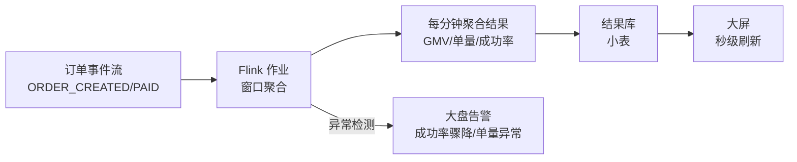
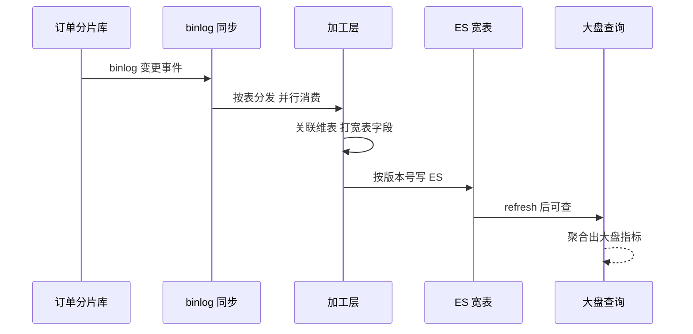
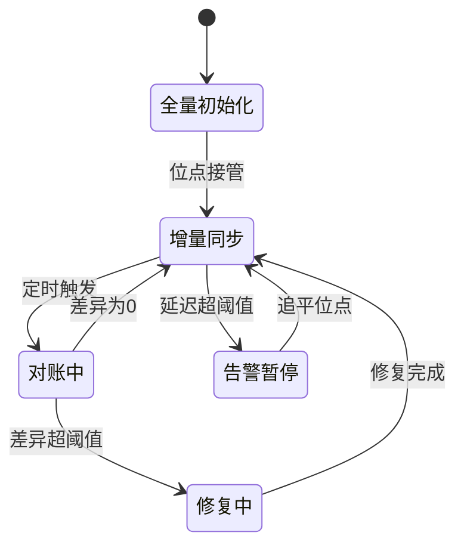

# 1024 张表之后：多维查询、缓存、大盘与全链路日志

> 用户命题原话：「大盘呢，全链路日志呢，异步，缓存，分表，1024表，用户怎么查询，商家怎么查询，表怎么数据，什么维度」——分库分表解决的是写入扩展，但它立刻制造三个新问题：三类人（用户/商家/运营）各怎么查？实时大盘从哪取数？出问题时日志怎么串起来？本篇把数据从落库到消费的完整链路讲透。

## 一句话摘要

1024 张表的世界里，**每类查询走自己的路**：用户查询走分片键直达（订单号/用户 ID 路由到单表）、商家与运营查询走异构索引（binlog→MQ→ES/宽表，秒级延迟换查询自由）、大盘走流式聚合（Flink 消费 MQ 实时算，不查业务库）；全链路日志靠 traceId 贯穿（网关生成→逐层透传→ELK 聚合检索）；缓存三层布置（本地/Redis/CDN）各挡一类流量——**写入一条路，查询千万条路，每条路都有自己的数据副本与时效契约**。

## 本文核心

**核心机制一句话**：分片库是「写入的真相源」，一切查询需求（多维/大盘/日志）都从 binlog/事件派生独立的数据副本——CQRS 思想：写模型保一致与吞吐，读模型按消费场景各自建模。

**机制链**：订单写入分片库 → binlog 采集 → MQ 广播 → 三个消费方向：ES（商家/运营多维查询）、宽表/数仓（报表与基本面）、Flink（实时大盘）→ 缓存层在查询路径上再挡一道路由 → traceId 串联全链路日志进 ELK。

**失效点/边界**：异构副本有延迟（秒级），商家看「刚刚的订单」要等同步；大盘是聚合近似（窗口语义），对账以库为准；ES 索引膨胀要靠冷热与生命周期管理。

## 一、表怎么设计：维度与结构

**订单主表的字段组织**（分片表设计的四个纪律）：

```sql
CREATE TABLE order_0063 (
  -- 身份维度
  order_id      BIGINT PRIMARY KEY,        -- 订单号（内嵌分片位）
  user_id       BIGINT NOT NULL,           -- 分片键
  -- 业务维度
  status        TINYINT NOT NULL,          -- 状态机（数字枚举）
  amount        DECIMAL(16,2) NOT NULL,    -- 金额（DECIMAL 不用 FLOAT）
  seller_id     BIGINT NOT NULL,           -- 商家 ID（冗余，异构同步用）
  -- 时间维度
  created_at    DATETIME NOT NULL,
  updated_at    DATETIME NOT NULL,
  -- 冗余与扩展
  buyer_name    VARCHAR(64),               -- 冗余快照（下单时点的，不 JOIN 用户库）
  extra         JSON,                      -- 低频字段收拢
  KEY idx_user_time (user_id, created_at)  -- 用户查询的唯一索引
)；
```

**四个设计纪律**：

1. **索引只为分片键服务**：`(user_id, created_at)` 一个联合索引覆盖 95% 查询——分片表里给非分片键建索引意义有限（还是要扫所有表）
2. **快照冗余代替跨库 JOIN**：买家昵称、商品标题下单时冗余进订单——跨 16 库 JOIN 不可行，**冗余是分片世界的正常态**（代价：用户改名后订单显示旧名——业务上「下单时点快照」反而更正确）
3. **低频字段 JSON 收拢**：发票信息、扩展属性进 extra——避免加字段 DDL 停 1024 张表（分片表的 DDL 是 1024 倍成本）
4. **状态用数字枚举**：TINYINT + 代码层枚举映射，存储与索引效率

**维度答案一句话**：订单表的维度 = 身份（order_id/user_id/seller_id）+ 业务（status/amount）+ 时间（created_at）——**所有查询需求先映射到维度，再决定走哪条查询路径**。

## 二、用户怎么查询：分片键直达

用户侧查询的全部形态：「我的订单列表」（按时间倒序）、「订单详情」、「按状态筛选」（待付款/待收货）——**全部以 user_id 开头**，正好是分片键：

```
查询路径：user_id → 路由计算(hash % 1024) → 直达 1 张表 → 索引 idx_user_time
性能：点查 P99 < 10ms（单表数据量小，索引直达）
```

**缓存挡在最前**：订单详情查询先过 Redis（key = order_id，TTL 随状态：进行中 5 分钟/已完成 1 小时），命中率 60%+——**用户的订单查看有强烈的重复性**（下单后反复刷新），缓存直接消化。列表页不缓存（翻页多态），靠分片点查本身够快。

**「客服代查」场景的弯路**：客服只有订单号没有 user_id——这就是 #1 篇「订单号内嵌分片位」的价值：解析订单号的分片位直达，不需要先查 user_id 映射表。

## 三、商家怎么查询：ES 异构索引

商家后台的查询形态完全不同：「我的店铺今天的订单」「按商品筛选」「按状态发货」——**以 seller_id 开头**，而分片键是 user_id：跨 1024 张表聚合不可行。

**答案：异构索引（ES）**：


**同步链路的关键设计**：

- **消费顺序**：按 order_id 分区串行（同一订单的变更不乱序）
- **幂等**：文档 _id = order_id，重复消费自然覆盖
- **延迟口径**：库变更到 ES 可查，P99 < 3 秒——商家看「刚刚的订单」晚 3 秒，业务无感
- **文档字段**：订单全字段 + 商品明细扁平化 + 冗余维度（类目/品牌）——**为查询设计文档，不为存储规范设计**（反范式是 ES 的正确姿势）

**商家查询的性能分工**：ES 管多维筛选（按商品/状态/时间的任意组合），查出 order_id 列表后**回分片库取详情**（ES 文档可能滞后 3 秒，详情以库为准）——列表快、详情准，两级查询各取所长。

## 四、运营怎么查询：宽表与数仓

运营的查询更重：「全平台昨日 GMV」「某类目销售排名」「渠道转化漏斗」——这些是**全量聚合**，ES 也会被拖垮，走**数仓**：binlog → ODS（贴源层）→ DWD（明细宽表）→ DWS（轻度聚合）→ ADS（报表）。T+1 为主（基本面），实时需求（大促指挥）走下一篇的实时大盘。

**三类人的查询路径总表**：

| 谁 | 查什么 | 路径 | 时效 | 引擎 |
|---|---|---|---|---|
| 用户 | 我的订单 | user_id → 单表直达 | 实时 | 分片库+Redis |
| 客服 | 订单号查详情 | 订单号解析分片位 → 直达 | 实时 | 分片库 |
| 商家 | 店铺订单多维查 | seller_id → ES 异构 | 秒级 | ES（详情回库） |
| 运营 | 全量报表 | 数仓分层 | T+1 | 数仓 |
| 指挥部 | 实时大盘 | 流式聚合 | 秒级 | Flink |

## 五、实时大盘：不查库的取数哲学

**实时订单大盘的核心决策：不查业务库**——1024 张表上做「每分钟全平台订单量/GMV」的聚合查询，等于定时对全库发起扫描风暴。

**流式架构**：



**设计要点**：Flink 消费订单事件流（不是查库），1 分钟滚动窗口聚合，结果写一张小表（每分钟一行），大屏轮询这张小表——**聚合压力在流上预付，查询路径轻如普通点查**。大盘的第二个价值是**异常检测的前哨**：单量环比骤降 30% 自动告警（可能是支付通道挂了的第一个信号——比用户投诉早 10 分钟）。

**后台数据大盘（基本面）**：经营视角的 T+1 报表（流量/转化/复购/类目），数仓 ADS 层产出——与实时大盘的分工：**实时大盘管「现在正不正常」，基本面大盘管「生意做得怎么样」**。

## 六、全链路日志：traceId 串起一切

**全链路的定义**：一笔下单从前端点击 → 网关 → 下单服务 → 风控/库存/优惠券（RPC）→ 支付回调 → 消息消费——**横跨 6+ 服务、3 种中间件**。任何一个环节出问题，没有全链路日志就是「各服务分别 grep 然后人肉拼时间线」。

**traceId 的贯穿纪律**：

- **网关生成**：请求进网关时生成 traceId，随 RPC 框架的隐式传参逐层透传（Dubbo attachment / HTTP header）
- **MQ 也要传**：消息体带 traceId，消费端延续——异步链路不断链（这是最容易断的一环）
- **日志必须打**：每服务入口/出口/外部调用三处必须带 traceId——没有 traceId 的日志等于没打

**ELK 的角色**：所有服务的日志统一采集（Filebeat）→ Kafka 缓冲 → Logstash 解析 → ES 存储 → Kibana 检索。**排查一笔订单的完整动作**：拿订单号 → 查 ES 订单索引或库拿到 traceId → Kibana 按 traceId 检索 → 该笔请求的全部日志按时间序呈现——**从「用户报障」到「看到全链路日志」应该在 1 分钟内**。

> 💡 实战提示：日志量是 TB 级时（#14 篇展开），全量进 ES 成本爆炸——分层策略：ERROR 全量 30 天、INFO 采样 7 天、traceId 关联的请求日志按需保留。**日志的保存策略是成本设计，不是运维默认值**。

## 七、异步与缓存的层级全景

**异步的三层消费**（binlog/事件派生）：ES 索引（秒级，查询用）、Flink 聚合（分钟窗口，大盘用）、数仓批量（T+1，报表用）——**同一份事件流，三个消费者各自建副本**，互不拖累（一个消费者故障不影响其他）。

**缓存的三层布置**：

| 层 | 位置 | 挡什么 | 失效策略 |
|---|---|---|---|
| CDN | 最外 | 静态资源/商品图片 | 版本号 |
| Redis | 服务前 | 订单详情/商品信息/热点 key | TTL+事件失效 |
| 本地缓存 | 进程内 | 配置/字典/不变数据 | 短 TTL+变更推送 |

**缓存一致性口径**：订单这类「变更不频繁但读取频繁」的数据，事件驱动失效（支付成功事件 → 删缓存 → 下次读回源）；**不追求缓存与库强一致，追求「最终一致 + 失效窗口可预期」**。

从演进视角看查询架构：单库时代「一个库扛所有查询」→ 读写分离「从库扛读」→ 分片时代「异构副本扛多维」→ 流式时代「大盘不查库」——**每次演进都在把「查询压力」从写入路径上剥离**，写模型越来越纯粹，读模型越来越多样。

## 八、四高自查

| 四高 | 手段 | 代价 |
|---|---|---|
| 高性能 | 用户查询单表直达+缓存挡量；商家 ES 多维 | ES 秒级延迟 |
| 高并发 | 读路径按消费者分 replicas（库/ES/数仓各自扩展） | 三套数据设施成本 |
| 高可用 | 查询路径独立（ES 挂不影响下单；库挂 ES 还能查列表） | 数据修复复杂度 |
| 高扩展 | binlog 派生架构天然可加新消费者 | 每个消费者的延迟与一致性要各自治理 |

## 你们可能会问

**Q1：ES 和数仓都在消费订单数据，为什么不统一成一套？**
查询语义不同——ES 要秒级多维筛选（倒排索引），数仓要全量重计算（列式存储）；一套引擎两头都不最优。代价是两套管道，但消费者隔离的价值更大。

**Q2：商家说「刚出的订单查不到」怎么办？**
这是异构延迟的预期行为（秒级）——产品口径标注「数据可能有几秒延迟」；真要实时，详情页按订单号回源分片库（列表 ES、详情库）的两级设计就是为这个。

**Q3：冷数据（三年前的订单）还放 ES 吗？**
不放——ES 索引按月滚动 + 生命周期策略（热 3 月/温 1 年/冷归档 HBase/删 3 年）；历史订单查询走归档存储，商家后台默认只查近一年。

## 追问链与我的判断

**追问链 1**：「ES 延迟 3 秒，商家不能接受怎么办？」→ 先问业务：商家看单的时效敏感度真是秒级吗？→ 履约场景要 30 秒内可见（分片库直查可保）→ 真要秒级多维？→ 加大 ES 集群与同步吞吐（成本翻倍）→ **我的判断：大多数「要实时」的诉求在追问后变成「要准」——准走库、快走 ES，两级查询就是答案**。

**追问链 2**：「Flink 大盘的数字和财务对不上谁负责？」→ 实时口径是近似（窗口语义），T+1 对账以库为准——**大盘标注「实时近似口径」是架构者的诚实**，把近似数字当准确数字用才是事故。

**追问链 3**：「为什么 traceId 要进 MQ？改造成本不小。」→ 异步链路的故障占比随业务异步化持续上升 → 不改造的代价是「故障排查到 MQ 就断线」→ **我的判断：traceId 全链贯通是可观测的及格线，不是加分项**。

## 常见误区

- **误区一：分片库上做商家查询（跨片聚合）**。1024 张表 scatter-gather，P99 秒级起步还拖垮写入——商家维度从第一天就要走异构
- **误区二：大盘查业务库**。定时全量聚合 = 定时扫描风暴——流式预聚合是不查库哲学的落地
- **误区三：traceId 只在同步链传**。MQ 不传 traceId，异步段日志断链——排查到「消息消费」就瞎了
- **误区四：ES 当真相源**。ES 文档有秒级延迟，**详情与资金操作以库为准**——ES 是查询加速层不是数据主人

## 工程级深化：同步参数、接入步骤与量级分档

> 1024 张表之后，查询问题的本质变了：不是「SQL 怎么优化」而是「数据怎么流动」。这一节给出异构链路的参数表与接入 runbook。

### 参数级配置清单（异构同步与查询）

| 配置项 | 默认值 | 10w 级推荐 | 千万级推荐 | 亿级推荐 | 为什么 |
|---|---|---|---|---|---|
| ES 分片数 | 1 | 3 | 6-12 | 按索引滚动 | 分片数写入时定死，改分片=重建索引；用滚动索引预留扩展 |
| ES 副本数 | 1 | 1 | 1-2 | 2 | 副本换读吞吐与容错，但写放大翻倍，按读压力配 |
| ES refresh_interval | 1s | 1s | 5s | 10-30s | 刷新越频繁写入成本越高；大盘场景秒级延迟可接受就别开 1s |
| binlog 同步并行度 | 1 | 2-4 | 8-16 | 16+分实例 | 并行度受同一行变更顺序约束，按表维度切分并行比行级并行安全 |
| 全量校验频率 | 周 | 周 | 天 | 小时（抽样） | 全量对账贵，亿级用抽样对账 + 差异触发全量 |
| trace 采样率 | 100% | 100% | 10% | 1% + 全量错误 | 全量采样成本线性涨，错误必须 100% 保采，正常流量采样 |
| 宽表字段上限 | — | 50 | 100 | 按查询域拆索引 | 宽表不是越宽越好，字段数决定 mapping 复杂度与更新放大 |
| 查询超时 | 5s | 3s | 1-2s | 1s + 预聚合兜底 | 大盘查询必须快失败，慢查询挤占集群资源比失败本身更伤 |

### 步骤级操作：新业务数据接入异构查询链路

前置条件：源表 binlog 已开 ROW 格式、同步组件（Canal/Flink CDC 类）资源就绪、ES 集群容量评估通过。

- Step 1 定义宽表：按「最高频的 3 个查询场景」反推字段清单，宁窄勿宽。验证点：每个字段有明确消费方，无人消费的字段不入宽表。
- Step 2 全量初始化：源表快照导入 ES，记录位点。验证点：源表与 ES 计数一致，checksum 抽样一致。
- Step 3 增量接管：从全量位点启动 binlog 消费，验证更新顺序。验证点：同主键乱序更新有版本号仲裁，后写覆盖不成立时按版本回退。
- Step 4 对账上线：配置计数对账 + 抽样字段对账任务。验证点：连续 3 天差异数为 0 或差异自动修复闭环。
- Step 5 查询切流：大盘查询按百分比从老查询路径切到宽表，观察 P99 与命中率。验证点：切流 100% 后老路径保留两周再下线。
- 回退：对账差异突增立即暂停增量消费，修复后从断点位重放——位点是回退的生命线，位点丢了只能重新全量。

### 量级分档下的查询架构取舍

10w 级（单库 + 从库够用）：这个量级多维查询用「从库 + 多个二级索引」就能覆盖，上 ES 是为 1% 的场景引入一整条同步链路。该档位的 Trade-off：慢查询偶发可忍，链路复杂度不可忍。

千万级（1024 张表的起点）：分表后跨表查询物理失效，异构链路成为必选项。该档位必须回答「哪 20% 的查询模式值得建宽表」——宽表按查询模式建，不按表结构建。Trade-off：接受分钟级同步延迟，换多维毫秒级查询。

亿级（宽表也扛不住的时候）：单索引写入瓶颈显现，方案从「一个宽表」演进为「按查询域拆多索引 + 预聚合」。该档位的大盘指标必须预计算（流式聚合落 ClickHouse 类引擎），ES 只承担明细检索。Trade-off：预聚合损失下钻灵活性，需要预判维度组合。

### 数据流动时序：从 binlog 到大盘查询



### 状态视角：同步链路健康状态机



延迟告警线建议设为「大盘可接受延迟」的一半：延迟到 30 秒就告警，而不是等用户看到大盘数字不对再发现——同步链路的延迟是渐进恶化的，等它可见时已经晚了。

### 边界与反方案深推

异构链路最锋利的边界是「版本升级窗口」：ES 滚动升级期间写入可能被拒绝，同步链路必须有重试与断点续传，否则升级一次就丢一次数据。反方案是「查询引擎自己扛一切」——用分布式 SQL 引擎直接扫分片库，省掉同步链路，被否掉的原因是跨 1024 张表的聚合查询在数据库层没有执行下推能力，扫描成本随分片数线性放大，亿级数据下响应时间不可接受。同步链路的复杂度不是白付的，它买的是查询层的独立扩缩容。

另一个高频争议是 trace 采样：全量采样派说「丢一秒的 trace，排障就断链」，采样派说「全量的存储成本够再建一套监控」。折中解是错误与慢请求保底全采、正常流量按比例采、采样决策在入口一次做出（下游跟随上游决策，保证整条链路要么全采要么全丢）——链路完整性靠的是「决策一致」而不是「比例高」。

## 自测三问

1. **用户、商家、运营的查询分别怎么路由？**
   - 用户：user_id 分片直达单表；商家：seller_id 走 ES 异构（binlog→MQ→ES）；运营：全量聚合走数仓分层。三类人三条路，互不干扰。

2. **实时大盘为什么不查库？**
   - 1024 张表的定时聚合 = 扫描风暴。Flink 消费事件流预聚合，查询落在一张分钟级小表——聚合成本在流上预付。

3. **traceId 断链最常发生在哪？**
   - MQ 边界——同步链 RPC 框架自动传，消息体不带 traceId 消费端就断。纪律：消息体必须带，消费端第一件事是恢复上下文。

## 5W 速记卡

| W | 一句话 |
|---|---|
| What | 分片后的多维查询路由 + 异构索引 + 实时大盘 + 全链路日志 |
| Why | 写入扩展的代价是查询复杂度——每类查询要自己的副本与路径 |
| Where | 订单/交易数据的全生命周期消费 |
| When | 分库分表设计时同步设计查询路径（不是出了问题再补） |
| Who | 存储团队建管道，各消费方（ES/大盘/数仓）自治 |

## 开放问题

- **异构副本的一致性度量**：库与 ES 的延迟 P99 < 3 秒是「目标」，如何持续监控与告警延迟劣化（消费堆积）——各厂工具化程度不一
- **查询路径的自动路由**：能否按查询条件自动判定走库还是 ES（路由中间件智能化），减少人工约定

## 核心带走

**30 秒复述**：1024 表后查询分流——用户分片直达、商家 ES 异构、运营数仓、大盘 Flink 流式（不查库）；缓存三层（CDN/Redis/本地）按数据特性失效；traceId 从网关贯穿到 MQ 消费端，ELK 一分钟出全链路。**失效边界**：跨片聚合查询、大盘扫库、MQ 断 traceId、ES 当真相源——四条都是高代价弯路。

## 📌 数据与事实声明

- 写于 2026-09-11；CQRS/异构索引/流式大盘为行业公开实践口径；延迟量级（ES P99 3 秒内）为教学基准
- 免责：ES/Flink/数仓选型按团队基建裁剪

## 📚 参考资料

| 类型 | 标题 | 来源 |
|---|---|---|
| 书 | 《数据密集型应用设计》（DDIA）第 5-6 章（复制/分区） | 公开出版 |
| 官方文档 | Elasticsearch: Time series data streams | elastic.co |
| 行业实践 | 电商订单异构查询公开分享 | 公开报道 |
