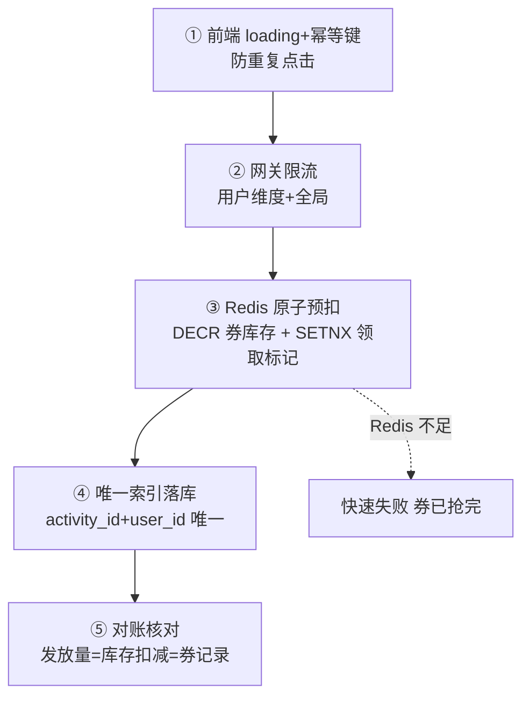
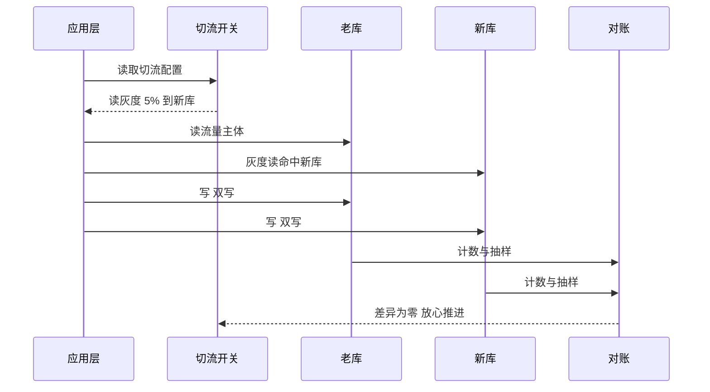
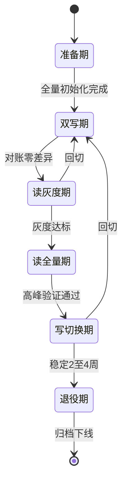

# 业务发展与数据迁移：不停机迁移、发券一致性与防资损体系

> 业务命题原文：「业务发展。技术面。数据迁移，比如优惠订单表是64，在业务发展中，不停机迁移，然后4千万优惠券，1个小时，40万用户如何发完，每个人一张，不多不少，整个链路数据一致性，从前端loading开始，到整个后端链路治理。特别是，资金，账务，文件对账，防资损和稳定性的事前，事中，事后。整个链路的业务面，技术面，基础面，数据面，构建字段的数据，哪些数据一致性，哪些不需要，大表治理，用户亿级订单查询。」——本篇把这四件事一次讲透：64 表不停机迁 128 表、四千万券一小时每人一张不多不少、资金账务文件三方对账防资损（事前/事中/事后）、大表治理与亿级订单查询。

## 一句话摘要

业务发展带来两场硬仗：**数据迁移**（64 表 → 128 表不停机，双写→回填→校验→灰度切流四步，每步可回滚）与**发券一致性**（四千万券一小时发完，每人一张不多不少——前端 loading 防重复点击、唯一索引做最终防线、Redis 预扣扛热点、MQ 异步落库、三方对账兜底）；资金/账务/文件对账的防资损体系按事前（校验/预算锁定）、事中（幂等/限流/实时监控）、事后（对账/差错/复盘）三层布防——**「不多不少」不是靠一个组件，是整条链路的合力**。

## 本文核心

**核心机制一句话**：数据增长的两道应对——存量靠不停机迁移（四步法每步可回滚），增量靠一致性设计（每张券的领取是「恰好一次」）；防资损 = 事前锁预算、事中幂等限流、事后三方对账，三层缺一不可。

**机制链**：业务发展 → 表容量触顶（迁移）与活动规模升级（发券）→ 迁移走四步法（双写/回填/校验/切流）→ 发券走五道防线（loading→网关限流→Redis 原子预扣→唯一索引→对账）→ 资损防护三层（事前/事中/事后）→ 沉淀为大表治理与亿级查询的常态化机制。

**失效点/边界**：双写期间禁止 DDL 与数据订正单边执行；「不多不少」的对账口径要三方一致（活动/券记录/账务）；无责抢券场景的黑产聚集要有事中风控。

## 一、命题拆解：四件事一张网

| 命题 | 量级/约束 | 所属面 | 核心矛盾 |
|---|---|---|---|
| 优惠订单表 64 → 不停机迁移 | 64 表容量触顶 | 技术/基础面 | 迁移风险 vs 业务连续 |
| 四千万券 1 小时发完 | 每人一张不多不少 | 业务/技术面 | 恰好一次 vs 万级瞬时 QPS |
| 资金/账务/文件对账 | 防资损 | 数据面 | 三方一致性 |
| 大表治理/亿级订单查询 | 历史数据膨胀 | 数据面 | 数据增长 vs 查询性能 |

四件事的共同前提是**业务发展**：量级涨了，64 表余量耗尽要扩、发券规模升到四千万要扛、历史数据堆成大表要治——**架构的应对必须跟随业务发展的节奏，且全程不停机**。

迁移工具链的演进也值得一提：从早期「mysqldump + 停机窗口」的原始形态，到 pt-online-schema-change 的在线 DDL，再到 today 的双写+回填+校验平台化产品（ShardingSphere Scaling 等）——**迁移的工程化程度随业务规模一起升级**，但四步法的骨架十年未变。

## 二、数据迁移：64 表 → 128 表不停机四步法

**为什么迁**：业务发展使订单量提前透支 64 表的五年余量（单表年增 60 万行 × 活动峰值放大），按单表 2000 万行的性能拐点倒推，必须翻倍到 128 表。**不停机是硬约束**——交易系统停机迁移的成本（业务损失+用户感知）远高于迁移复杂度。

**第一步：开双写**（以旧库为准）。所有写入同时落旧库与新库——**旧库成功即成功**，新库失败只告警不阻断（新库还没承担流量，坏了不影响业务）。双写期纪律：**禁止在新库单边执行 DDL 与数据订正**——任何单边操作都会让两库分叉，分叉的修复成本是重迁。

**第二步：历史数据回填 + 校验**。存量数据（几亿行）按 user_id 分批搬（限速执行，避免打爆旧库从库）；校验三层：行数比对、checksum 抽样比对、关键业务字段全量比对（订单状态/金额）。校验工具要**可重跑**——跑一半挂了从断点继续，而不是从头再来。

**第三步：灰度切读**。按 user_id 尾号灰度：1% 用户先读新库 → 观察 24 小时 → 10% → 50% → 100%。灰度的意义不是「怕新库挂」，是**用真实流量验证新库的数据正确性**——任何一条「查不到订单/金额不对」的反馈都能定位到具体尾号批次，影响面可控。

**第四步：切写 + 回收**。写入主源从旧库切到新库（旧库转双写中的从位），观察一周后旧库转只读归档，双写代码下线。**每一步都有回滚预案**：切读可回、切写可回（切写后回滚要把切写窗口的增量补回旧库）——回滚预案没演练过的迁移不要开始。

> 💡 实战提示：迁移窗口避开大促与业务高峰（提前至少一个月、避开月末结算）；迁移期间变更冻结（代码发布/配置变更都可能引入双写不一致的新变量）。

## 三、发券一致性：四千万券一小时，每人一张不多不少

**命题拆解**：四千万张券、1 小时窗口、40 万用户每人限领一张——平均 111 券/秒不高，但**整点开抢的瞬时脉冲可达万级 QPS**；真正的核心矛盾不是吞吐，是「**不多不少**」：不多发（库存精确、每人一张不重复）、不少发（发完即止、不丢券）。

**前端：loading 从第一个字节就开始**。抢券按钮点击后立即置灰 + loading 动画（防重复点击产生重复请求）；前端请求带**幂等键**（用户 ID+活动 ID 的组合在请求头透传）——前端防线挡掉 80% 的重复点击，但它只是体验层，**真正的防重在后端**。

**网关：用户维度限流**。单用户 10 QPS（脚本刷券的防火墙）、全局限流按券库存量级设定——入口先把明显异常的流量挡掉。

**服务端：五道防线保证「不多不少」**：

- **③ Redis 原子预扣**：券库存预加载进 Redis（4000 万个令牌），领取用 Lua 脚本原子执行「DECR 库存 + SETNX 领取标记（user_id+活动 ID）」——**DECR 保证不多发**（减到 0 再减为负即失败），**SETNX 保证每人一张**（已领取则返回已领）。万级瞬时 QPS 全部由 Redis 原子操作消化
- **④ 唯一索引落库**：MQ 异步落库时，券记录表上 `(activity_id, user_id)` 唯一索引是防重的**最终防线**——即使 Redis 层出现极端并发穿透（理论上 Lua 原子不会，但防御纵深），数据库唯一索引兜住重复插入
- **⑤ 对账**：活动结束后三方核对——**发放量（Redis 扣减数）= 券记录条数 = 账务核销预算**。任何一边对不上就是资损信号

**「不少发」的另一半**：1 小时窗口结束时若还有余量（领不完是常态），不是事故——「不少发」指的是**不放出去的券不能丢**（活动结束余量回收进预算池）与**发出去的券记录不丢**（MQ 落库的可靠性由本地消息表/重试保证）。

**Trade-off 深挖**：Redis 预扣与 DB 唯一索引之间有微小窗口（预扣成功但落库前用户记录被 DB 唯一键拒绝——如黑产撞库边缘场景），处理是「落库失败回补 Redis 库存 + 记录异常审计」——**宁可极端场景下把券还回池子，不让重复领券发生**。

## 四、防资损体系：资金、账务、文件对账的三层布防

**什么是资损**：发出去的券/红包/补偿超出应有范围（超发、重发、黑产套利、错误配置批量发放）——**每一分资损背后都有一个「系统允许了不该允许的操作」**。防资损按事前/事中/事后三层布防：

| 阶段 | 手段 | 例子 |
|---|---|---|
| **事前** | 预算锁定、校验规则、风控白名单 | 发券活动先锁预算池（总额硬上限）；单用户/单设备限领规则上线前评审；黑产账号库拦截 |
| **事中** | 幂等、限流、实时监控 | 领取幂等（上文五道防线）；**实时监控异常信号**——单账号高频领取、同设备多账号聚集、发放速率突增 |
| **事后** | 三方对账、差错处理、复盘 | 文件对账（渠道/账务文件 vs 平台记录）、差错自动冲正、资损复盘进预案 |

**资金、账务、文件三方对账的机制**：

- **平台记录**：券/红包的发放与核销流水（业务库）
- **账务记录**：财务系统的成本入账（预算科目）
- **渠道文件**：外部渠道（支付渠道/卡券供应商）的 T+1 对账文件

三方核对（以订单/券 ID 为 key 的交叉比对）发现的差错分三类处理：**单边账**（一方有另一方无 → 补记或冲正）、**金额不符**（按账务为准调整业务侧）、**无法解释的差额**（挂账 + 专项调查——不可强行轧平）。**对账频率分级**：资金类 T+1 必对，高危活动准实时（分钟级增量对账），一般业务 T+1。

**事中风控的实时性要求**：资损的事后对账是「发现损失」，事中监控才是「阻止损失」——发放速率、账号聚集度、核销地域分布三个实时指标，异常即熔断活动（自动暂停发放 + 人工复核）。**大促发券活动必须配一个「一键暂停」开关**，且这个开关要演练过。

## 五、哪些数据要一致性，哪些不需要（字段与数据分级）

不是所有数据都配得上强一致——**按「错了的代价」给数据分级**：

| 分级 | 数据 | 一致性要求 | 代价容忍 |
|---|---|---|---|
| **资金级** | 支付流水、券核销、账务 | 强一致/准强一致 + 对账 | 零容忍，逐笔校验 |
| **交易级** | 订单状态、库存 | 准强一致（最终一致+对账） | 低容忍，分钟级修复 |
| **体验级** | 购物车、浏览历史、推荐 | 最终一致 | 丢一条无感 |
| **展示级** | 商品缓存、评价数、浏览量 | 弱一致（缓存 TTL 即可） | 误差常态存在 |

**构建字段时的应用**：订单表冗余的买家昵称是「展示级」（下单时点快照，改名不追溯）；订单金额是「资金级」（DECIMAL + 对账）；优惠券核销标记是「资金级」（唯一索引+状态机）；购物车的勾选状态是「体验级」（Redis 丢了就算了）。**给每个字段标一致性等级，是数据治理里最便宜也最有效的一张表**——它决定了哪些字段要事务、哪些要校验、哪些随便。

## 六、大表治理与用户亿级订单查询

**大表治理三板斧**（订单表年 36 亿行后的常态机制）：

1. **冷热分层**：热数据（3 个月内，占查询 95%+）留在分片表；温数据（3 个月-2 年）转历史库（同构 MySQL 低配实例）；冷数据（2 年+）归档 HBase/对象存储——**在线库只保留被查询的数据**，表瘦了索引才有效
2. **归档不停服**：按 created_at 批量搬 + 双写校验（同迁移四步法的微缩版）；归档后在线库执行分区清理（DROP PARTITION 秒级，比 DELETE 百万行安全一个量级）
3. **查询路由**：应用层按时间范围路由（近 3 月走在线库，历史走归档查询接口）——用户查三年前的订单要能查到（归档接口），但默认列表只查近期

**用户亿级订单查询**（全平台口径）的场景拆解：单用户亿级订单不存在（单用户上限几千单，分片表点查无忧）；**亿级是全平台总量**——运营/分析的亿级查询全部走异构（ES/数仓，第 4 篇路径），**在线分片库只为「单用户维度」的实时查询服务**。分清「单用户查询」与「全平台查询」，就分清了在线库与离线系统的职责边界。

## 七、四面体自查

| 面 | 本篇覆盖 |
|---|---|
| 业务面 | 发券活动（营销业务）、退款/客诉的反向链路（券发错的售后处理） |
| 技术面 | 迁移四步法、五道防线、Redis/MQ/唯一索引的技术选型 |
| 基础面 | 迁移窗口的资源预留、Redis/DB 容量、归档存储介质 |
| 数据面 | 三方对账、数据分级、冷热分层、字段一致性等级表 |

## 你们可能会问

**Q1：四千万券一小时只来四十万用户，剩下的券怎么办？**
活动余量在窗口结束后回收进预算池（账务侧冲正），或按运营策略延长窗口——关键是「余量回收」要有流程，不能放着不管（预算占用是资损视角的问题）。

**Q2：双写期间新旧库性能都受影响吗？**
写路径多一跳（旧库成功后异步写新库，同步链不增加延迟），读全部走旧库——迁移期性能损耗可控；压测一次迁移中的峰值表现是标准动作。

**Q3：迁移完成后旧库的数据还要吗？**
保留一个观察期（两周只读），确认新库零问题后转归档或下线——「迁移完成」的标志是新库稳定承担全量读写，而不是切换动作做完。

## 追问链与我的判断

**追问链 1**：「双写迁移期间，数据订正为什么要双写脚本？」→ 订正旧库不订正新库=分叉 → 那订正脚本同时写两边不就行了？→ 订正逻辑如果依赖旧库结构，新库结构演进后脚本失效 → **我的判断：双写期的数据订正是高风险操作，能推迟到迁移后的一律推迟**。

**追问链 2**：「Redis 预扣了但用户没支付，券怎么办？」→ 预扣锁定（SETNX 标记）+ 未支付超时释放 → 谁来释放？定时任务扫过期标记 → **抢券的「不多不少」里最难的是「不多」的回收侧**——发放有五道防线，回收同样需要状态机。

**追问链 3**：「三方对账发现差异，为什么不能自动轧平？」→ 自动轧平会把「系统缺陷导致的错误」掩盖成「账面平了」→ **我的判断：对账的差异必须人工裁决后才能处理——自动轧平消灭的不是差异，是发现缺陷的机会**。

## 常见误区

- **误区一：不停机迁移 = 一次切换**。它是四步法数周的过程，每步可回滚——把迁移当「切换动作」的团队都交过学费
- **误区二：防重靠前端置灰**。前端 loading 只是体验层，脚本绕过它轻而易举——唯一索引与 Redis 原子操作才是防线
- **误区三：对账是财务的事，技术只出数据**。对账的差错处理（冲正/补记/挂账）需要技术实现，对账发现的问题往往指向系统缺陷——**对账是技术体系的一部分，不是财务的 Excel**
- **误区四：数据都要强一致**。一致性有成本，按「错了的代价」分级——资金级零容忍、体验级随便丢，混为一谈是最大的浪费

## 工程级深化：迁移参数、切流步骤与量级分档

> 不停机迁移的全部工程含量都在「参数」与「步骤」里：双写开关怎么配、切流分几批、回切窗口留多长。这一节是迁移 day 的操作手册骨架。

### 参数级配置清单（迁移与切流）

| 配置项 | 默认值 | 10w 级推荐 | 千万级推荐 | 亿级推荐 | 为什么 |
|---|---|---|---|---|---|
| 双写模式 | 关 | 迁移期开 | 迁移期开 | 迁移期开 + 优先写新库 | 双写是迁移的保命符；亿级加「优先写新库」让新库数据更早成为权威源 |
| 对账频率 | 天 | 小时 | 15 分钟 | 5 分钟 + 准实时流对账 | 对账频率决定不一致的暴露窗口，资损类数据必须最短窗口 |
| 灰度切流步长 | — | 10% | 5% | 1% 起步 | 步长越细爆炸半径越小，但观察成本越高，按业务容忍度定 |
| 每批观察时长 | 1h | 1h | 一个高峰时段 | 24h 含一次高峰 | 观察必须覆盖至少一个流量高峰，否则灰度数据不可信 |
| 回切触发线 | — | 错误率 1% | 差异率 0.01% | 差异率 0.001% | 触发线要写成数字写进预案，临场讨论触发条件等于没有预案 |
| 停写窗口 | 无 | 不允许 | 秒级允许 | 秒级 + 预告 | 不停机迁移的底线是不停写；万不得已的停写必须提前预告业务方 |
| 老库保留期 | 30 天 | 30 天 | 90 天 | 180 天 | 老库下线前是最后的回退手段，保留期按数据恢复成本定 |

### 步骤级操作：四阶段切流

前置条件：双写开启且对账连续 3 天差异为 0、新库容量压测达标、回切预案演练过一次。

- Step 1 读灰度：按用户尾号或白名单把读流量切到新库，从 1% 起步。验证点：新库读 P99 与老库持平，无路由错误导致的「查不到单」。
- Step 2 读全量：灰度无异常后读流量 100% 切新库，老库读保留但降级为备用。验证点：观察一个完整高峰，订单查询成功率不降。
- Step 3 写切换：写流量切新库，双写反转为「主写新库、异步补老库」。验证点：写入成功率与新库主从延迟达标，对账依然为零差异。
- Step 4 老库退役：写切换稳定 2-4 周后，老库转只读归档，到期下线。验证点：归档数据可查可恢复，下线评审通过。
- 回退：任何阶段触发回切线，执行反向切流（读先回、写后回），双写保持到回退稳定——这就是双写必须保留到最后一刻的原因：它是唯一让回退变成「一条开关」的机制。

### 量级分档下的迁移取舍

10w 级（可停机窗口方案）：如果业务允许凌晨半小时停写，直接停写迁移是最便宜的方案，双写灰度那一整套在这个量级是过度工程。该档位的 Trade-off：用一次凌晨加班换一整套迁移基建。

千万级（必须不停机）：双写 + 对账 + 灰度切流成为标准路径，工程重心在对账系统本身——对账不准，切流就是盲切。该档位的 Trade-off：为迁移临时搭建的对账能力沉淀为常设能力，迁移结束不拆。

亿级（迁移常态化）：这个量级不会有「一次性迁移」，扩容翻倍、机房搬迁、单元化改造轮番上演。该档位把迁移做成产品：切流平台、对账平台、回滚预案全部平台化。Trade-off：平台研发成本高，但把每次迁移的人肉风险变成了可演练的流程。

### 切流时序：双写下的读写切换次序

### 状态视角：迁移阶段状态机

回退边必须画进状态机：读灰度期和写切换期都能退回双写期，但读全量期之后回退成本陡增——这就是「读全量到写切换之间」要放最长观察窗口的原因。

## 自测三问

1. **「每人一张不多不少」靠什么保证？**
   - 不多：Redis Lua 原子预扣（库存减到 0 即失败）+ 唯一索引（activity_id+user_id）兜重复；不少：发完即止（DECR 到 0）+ 落库消息可靠 + 三方对账。五道防线各挡一类风险。

2. **双写期间最危险的操作是什么？**
   - 单边 DDL 或单边数据订正——两库分叉后的修复是重迁级成本。双写期纪律：变更冻结，所有订正双写脚本化。

3. **为什么资金对账必须三方（平台/账务/渠道文件）？**
   - 两方对账只能发现「记录不一致」，三方交叉才能发现「组合性资损」（平台记录对但渠道少退了一笔）——资损的隐蔽形态恰恰在组合处。

## 5W 速记卡

| W | 一句话 |
|---|---|
| What | 不停机迁移四步法 + 发券五道防线 + 资损三层布防 + 大表治理 |
| Why | 业务发展必然带来迁移/放量/大表三件事，每件都要体系化应对 |
| Where | 优惠订单表、发券活动、订单历史库 |
| When | 容量触顶即迁、活动上线即三层布防、大表季度治理 |
| Who | SRE/DBA 主导迁移，营销/风控/财务共建防资损 |

## 开放问题

- **双写迁移的自动化平台**：四步法目前靠脚本+人工执行，双写/校验/切流的平台化产品（数据库迁移工装）各厂自建程度不一
- **黑产对抗的攻防升级**：发券的事中风控是持续对抗（设备指纹/行为分析/图关系），规则永远在追赶——AI 风控的误杀率与漏杀率的平衡仍是核心难题

## 核心带走

**30 秒复述**：业务发展的两场硬仗——存量迁移走四步法（双写/回填/校验/灰度切流，每步可回滚，双写期变更冻结）；增量发券走五道防线（loading/网关限流/Redis 原子预扣/唯一索引/对账）保证每人一张不多不少。防资损三层：事前锁预算、事中幂等限流实时监控、事后资金账务文件三方对账。**失效边界**：双写期单边操作 = 重迁；防重只做前端 = 裸奔；对账只两方 = 组合性资损隐形。

## 📌 数据与事实声明

- 写于 2026-09-11；命题量级（64 表迁 128/四千万券/40 万用户/1 小时）为业务设定基准
- 行业认知：双写迁移四步法、Redis 预扣+唯一索引防重、资金三方对账为电商/金融公开实践共识
- 免责：迁移与发券的具体阈值按业务实测裁剪

## 📚 参考资料

| 类型 | 标题 | 来源 |
|---|---|---|
| 书 | 《数据密集型应用设计》（DDIA）第 5 章（复制与一致性） | 公开出版 |
| 官方文档 | ShardingSphere 数据迁移（Scaling） | shardingsphere.apache.org |
| 行业实践 | 大厂不停机迁移与防资损公开分享 | 公开报道 |
