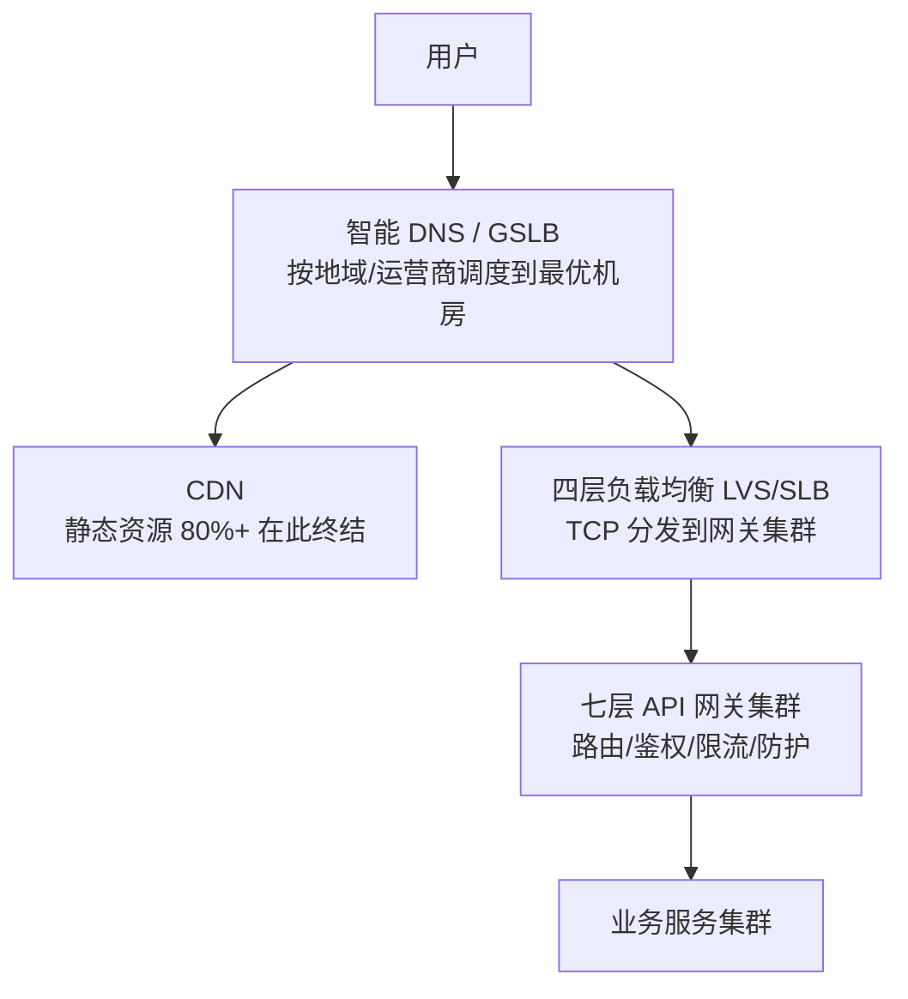
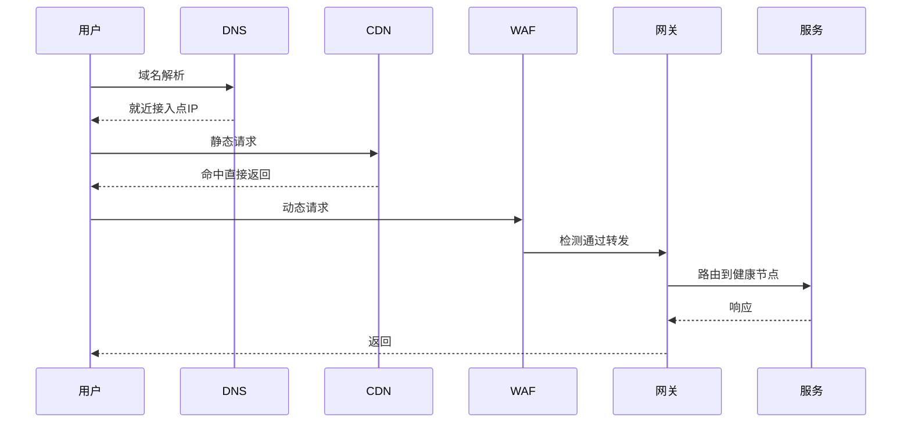
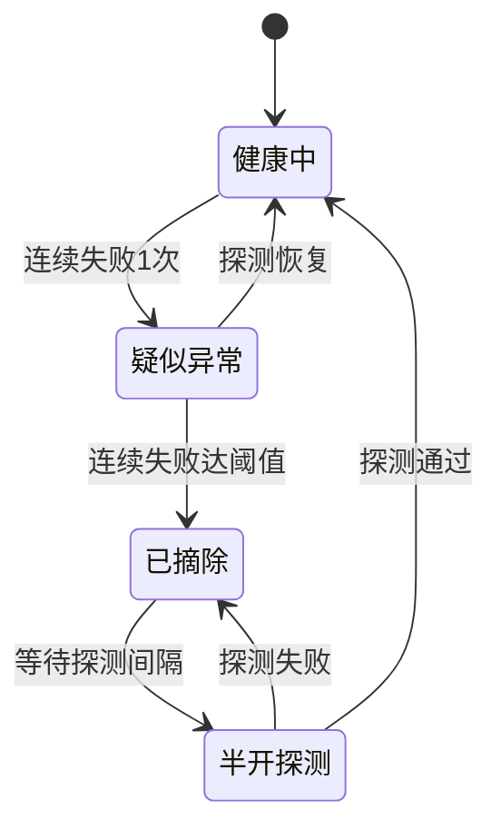

# 亿级流量接入架构：从 DNS 到网关的流量入口设计

> 亿级日 PV 的流量入口是什么形态？日均 1 亿 PV，峰值系数按 5-10 倍计——入口层要稳稳接住 **10 万+ QPS 的瞬时洪峰**，还要在机房故障时把流量引到活着的机房。本篇从 DNS 一路讲到网关防护，把「流量进来的第一公里」设计清楚。

## 一句话摘要

亿级流量接入 = 三层漏斗：智能 DNS（机房调度，TTL 60-300 秒）+ CDN（终结 80% 静态 PV）+ LVS/网关集群（路由/鉴权/限流的集中卡点）——高可用核心是 L7 健康检查与自动摘流，任何一层的故障都要能在分钟级被引导到健康处。

## 本文核心

**核心机制一句话**：流量入口 = DNS（机房级调度）→ LVS/SLB（负载均衡）→ 网关集群（路由/鉴权/限流）三层漏斗，每层都有健康检查与摘流能力——**入口层的设计目标是：任何一层出问题，流量都能在分钟级被引导到健康的地方**。

**机制链**：域名解析（智能 DNS 按地域/运营商调度）→ CDN 挡静态 → 四层 LB 分发 → 七层网关（路由/限流/鉴权）→ 下游服务集群；每一层的故障切换依赖健康检查 + 摘流机制，DNS 的 TTL 决定机房级切换的速度上限。

**失效点/边界**：DNS TTL 太长导致切流不生效（最经典的入口事故）；网关是全局单点风险——网关集群本身要能水平扩展且自身高可用；健康检查的探测口径不对会误摘健康节点。

## 一、量级前提：入口层要接住多少

- 日均 1 亿 PV → 平均 **1200 QPS**，按日常峰值系数 5 倍 = 6000 QPS
- 大促瞬时：预约用户整点涌入，**10 万+ QPS 瞬时脉冲**
- 静态资源占 PV 的 80%+（图片/CSS/JS）——这部分**不该到源站**，CDN 的职责

入口层的设计目标由此确定：稳态 6000 QPS 常态承载、瞬时 10 万 QPS 不崩、机房级故障分钟级切换、所有防护在流量进入业务系统**之前**完成。

## 二、核心：入口三层漏斗

**第一层：DNS 与智能调度**。域名解析是流量的总开关：智能 DNS（GSLB）按用户地域与运营商返回最近的机房入口（华东用户回华东机房）。**DNS 的两个关键参数**：TTL（解析结果的缓存时长）决定切换速度——TTL 300 秒意味着机房切换最慢 5 分钟才全量生效；解析记录的健康检查（部分 DNS 服务商提供）决定故障时能否自动切。

**第二层：CDN 与静态终结**。80% 的 PV 是静态资源，CDN 边缘节点直接消化——源站只服务动态请求。CDN 回源也要限流配置（回源风暴会打穿源站）。

**第三层：LVS/SLB + 网关集群**。四层 LB（LVS/云 SLB）做 TCP 级分发到网关集群；七层 API 网关（自研或 Nginx/Kong/APISIX）做路由、鉴权、限流、协议转换——网关是业务流量的「总闸门」，限流/熔断的第一现场。

## 三、机制：健康检查与摘流——入口的高可用核心

**健康检查的探针口径是最容易出错的细节**：只探「进程活着」（TCP 端口通）不够——进程活着但依赖挂了的「假活」节点照样接流量。正确姿势是**L7 探针打真实轻接口**（如 /healthz 内部检查 DB 连接、关键依赖），探针失败即摘流。反过来，探针也不能太重（探针本身压垮服务）。

**摘流与恢复的自动化**：LB 健康检查自动摘/自动回流是基础；更进阶的是「服务自摘」——服务发现自己依赖故障时主动向 LB 反注册（比等 LB 探测更快）。摘流必须与告警联动：**节点被摘的那一刻就要有人知道**，否则静默摘到只剩一台才暴露就是事故。

## 四、实践：典型场景与决策表

**DNS 切换的事故推演**（最经典的入口事故）：机房 A 着火需要切机房 B——运维改 DNS 解析指向 B 机房，但用户端还在访问 A：因为 **TTL 内的本地 DNS 缓存不会过期**。TTL 设了 24 小时的域名，切换生效要等最长 24 小时——这不是切换方案，是等待方案。正确姿势：**入口域名 TTL 保持 60-300 秒**（牺牲一点解析性能换切换能力），机房切换靠 DNS + 更快手段（客户端配置中心下发、HTTPDNS）组合完成。

**网关自建还是云托管（决策表）**：

| 维度 | 自建网关（APISIX/Kong/自研） | 云托管网关 |
|---|---|---|
| 定制性 | 插件自研自由 | 限于厂商能力 |
| 运维成本 | 自己扛（升级/扩容/安全补丁） | 厂商托管 |
| 多云绑定 | 无 | 厂商锁定 |
| 适合 | 有平台团队的中大型 | 快速起步/中小团队 |

**决策**：日亿级 PV 的团队基本都有平台团队，自建（APISIX 系）为主——网关是稳定性与治理的核心卡点，定制能力（限流策略/灰度切流/协议扩展）必须握在自己手里。

> 💡 实战提示：接入层每层的容量与摘流状态要有一张「入口大盘」——DNS 当前解析分布、LB 后端健康数、网关 QPS/限流触发数。入口层是全局单点风险最高的层，看不见 = 裸奔。

**大促扩容的接入层预案**：网关集群按 10 万 QPS 预扩容（网关无状态，扩容快但要 LB 配置同步）；接入层限流阈值按压测更新；**接入层的容量是全链路的第一道闸**——它崩了所有防护都失去意义。

网关自建与托管的取舍再补一刀：托管网关省下的运维人力，要对比「定制能力受限」的隐性成本——限流策略、灰度切流、私有协议这些治理核心恰恰是托管产品最不可能为你定制的部分。

## 五、典型场景

- **多机房多活入口**：智能 DNS 按地域调度 + 机房健康检查自动切换（TTL 60 秒）+ HTTPDNS 绕过运营商劫持
- **大促瞬时脉冲**：CDN 预热静态资源、网关限流阈值提前调整、非核心接口提前降级腾容量
- **防攻击**：WAF 在网关层拦截（SQL 注入/CC 攻击），黑白名单动态下发——防护在流量进入业务系统之前完成

接入架构的演进史就是流量的增长史：单机 Apache → Nginx 反向代理 → LVS 集群 → 智能 DNS+多机房+云 CDN——**每一代演进都是被量级逼出来的**，今天的入口三层漏斗是亿级流量的标配形态。

## 与稳定性系列的关系

入口三层就是稳定性七环节里「流量防护」的最外圈：网关限流（第 2 篇限流的网关层）、健康摘流（隔离思想的接入层落地）、大促预案（演练的对象）。本篇与稳定性系列互为表里：**那里讲方法论，这里讲流量第一公里的具体实现**。

## 你们可能会问

**Q1：网关层限流和服务内限流会不会重复建设？**
不重复——网关限全局维度（IP/用户/粗粒度接口），服务内限精细维度（按业务语义/下游保护）；两层是互补的纵深，不是重复。

**Q2：HTTPS/TLS 握手的性能开销怎么处理？**
TLS 1.3（1-RTT 握手）+ 会话复用（session resumption）+ 证书在 LB 层终结（网关内部走 HTTP）——接入层设计把 TLS 成本消化在最外层。

## 追问链与我的判断

**追问链 1**：「TTL 60 秒，切换期间用户请求还是失败怎么办？」→ DNS 只是切换手段之一——配合 HTTPDNS（客户端绕运营商解析）+ 配置中心下发 + 客户端重试，把切换粒度从「分钟」压到「秒」→ **单手段都有盲区，入口切换是组合拳**。

**追问链 2**：「网关集群自己挂了怎么办？」→ 网关无状态多实例 + LB 健康摘流 → 那 LB 挂了呢？→ LVS 主备 + 机房级多活 → **追问到最底层就是成本问题：入口每一层的高可用都在花钱，冗余到哪一层是风险与成本的权衡**。我的判断：入口层冗余的投入产出比最高（它保护的是全部流量），该花的钱不能省。

**追问链 3**：「CDN 回源风暴为什么不打掉 CDN？」→ 回源是 CDN 边缘节点到源站——风暴打的是源站 → 所以回源限流是保护自己而非保护 CDN → **视角转换：CDN 对用户是服务者，对源站是客户端**。

## 常见误区

- **误区一：DNS TTL 设长省解析**。TTL 长解析快、DNS 压力小，但故障切换能力被锁死——入口域名 TTL 必须短，内部域名可以长
- **误区二：健康检查探 TCP 就够**。TCP 通 ≠ 服务可用，假活节点是幽灵故障的常见来源——L7 真实探针
- **误区三：网关只做路由转发**。网关是限流/鉴权/灰度/防护的集中卡点——只做转发的网关浪费了它「全局视角」的位置价值
- **误区四：CDN 回源不限流**。CDN 未命中时的回源风暴会打穿源站——回源限流与源站保护是 CDN 接入的必配项

## 工程级深化：接入参数、上线步骤与量级分档

> 流量接入层的工程含量全在「参数联动」：DNS TTL、网关超时、健康检查、限流阈值互相耦合，一个配错整条链路放大。这一节给接入层的参数表与 runbook。

### 参数级配置清单（流量接入层）

| 配置项 | 默认值 | 10w 级推荐 | 千万级推荐 | 亿级推荐 | 为什么 |
|---|---|---|---|---|---|
| DNS TTL | 600s | 300s | 60-120s | 60s | TTL 决定故障切流的生效速度，但过短放大 DNS 查询量，60s 是流量与敏捷的平衡点 |
| 网关连接超时 | 5s | 3s | 1-2s | 1s | 接入层超时必须小于下游，否则网关先堆积连接成为瓶颈 |
| 网关读超时 | 30s | 10s | 5s | 3s | 长尾请求占用连接的成本随流量放大，早失败早重试 |
| 健康检查间隔 | 5s | 3s | 2s | 1s | 摘除坏节点的速度上限；探测过密又是伪流量，需按节点数算成本 |
| 熔断摘除阈值 | 3 次 | 3 次 | 2 次 | 2 次 | 连续失败次数达到即摘除，摘错可自动恢复，摘慢了拖垮全池 |
| WAF 检测深度 | 全量 | 全量 | 全量 | 分层（入口轻检+内层深检） | 全量深检的 CPU 成本在亿级不可承受，检测下沉分层 |
| 单 IP 限流 | 关 | 基础阈值 | 动态阈值 | 动态 + 设备指纹 | 静态阈值挡不住分布式攻击，量级越大越要动态基线 |
| HTTPS 会话复用 | 开 | 开 | 开 + session ticket | TLS1.3 + 0-RTT 评估 | 握手成本在亿级 QPS 下是真实的 CPU 账单，复用率是核心指标 |

### 步骤级操作：新域名接入生产

前置条件：证书申请完成、容量评估（峰值 QPS x 峰值系数）、下游服务限流阈值已配置。

- Step 1 接入网关：配置域名路由规则与上游服务组，先切 1% 测试流量。验证点：路由命中正确上游，trace 连续，无证书告警。
- Step 2 配置防护：WAF 规则集选型（宽松起步）、CC 防护阈值、黑白名单。验证点：用测试请求验证 WAF 拦截与放行行为符合预期，无误杀正常流量。
- Step 3 压测验证：按预估峰值 1.5 倍压测，观察网关 CPU、连接数、上游 P99。验证点：网关自身不是瓶颈（CPU 低于 60%），瓶颈出现在下游才算接入层合格。
- Step 4 切流放量：DNS 或权重调整分批放量（10% - 50% - 100%），每批观察一个高峰。验证点：放量期间错误率平稳，连接池无耗尽。
- Step 5 配置固化：把域名配置纳管进配置库，变更走评审。验证点：配置漂移检测开启，手工改动会被告警。
- 回退：放量期间异常，权重回调到 0 并保留原链路——新域名接入必须与老链路并行到 100% 稳定一周后，老链路才允许下线。

### 量级分档下的接入取舍

10w 级（网关即全部）：一个 Nginx/网关集群 + WAF 托管服务就够了，DNS 智能解析可以不上。该档位的 Trade-off：故障切流靠人工改 DNS 的几分钟延迟可接受。

千万级（多机房起步）：DNS 智能解析 + 多机房网关成为标配，故障切流从人工变自动（健康检查驱动 DNS 摘除）。该档位的 Trade-off：接受多机房数据同步的复杂度，换机房级故障的分钟级切换。

亿级（边缘下沉）：静态内容下沉 CDN/边缘节点，动态请求按单元就近接入；接入层容量按「可丢弃设计」——入口优先保交易，非核心流量在网关层主动降级。该档位的 Trade-off：入口「不公平」，核心流量享受最高优先级，长尾服务在极端流量下被牺牲。

### 接入层时序：一次请求的完整入口链路

### 状态视角：节点健康状态机

「疑似异常」这一档的存在感来自一个教训：直接摘除会把「网络抖动」当「节点死亡」，造成健康节点被误杀的雪球。先降权再摘除，摘除动作才有容错。

### 边界与反方案深推

接入层最容易被忽视的边界是「DNS 的全球生效时间」：TTL 配 60 秒不等于 60 秒全量生效，各地递归 DNS 与客户端缓存会让切流窗口拉长到十几分钟，紧急切流时这个尾巴就是故障时长。所以亿级接入的故障切换从不把宝押在 DNS 上，而是网关层按权重秒级摘除——DNS 只承担机房级、计划内的流量调度。

反方案推演：「全站上 Anycast 就不用管就近接入了」——被否的原因是 Anycast 解决的是入口可达性，解决不了机房后端的数据 locality，跨机房回源的延迟还是要在应用层处理，Anycast 只是接入层众多拼图的一块而不是替代品。另一个被否的方案是「在 WAF 层做业务限流」：防护层拿不到登录态与业务上下文，业务维度的精准限流必须下沉到应用层，防护层只做 IP 与指纹维度的粗筛——每层做每层能拿到信息的事，越权配置注定失效。

CC 攻击与正常秒杀的区分是接入层的经典难题：两者都是「同一接口瞬间高并发」，误杀秒杀用户的事故比被攻击更疼。可用的区分信号是行为特征（有登录态、有浏览路径、请求间隔分布）而非单纯阈值，这要求防护层与应用层共享画像数据——防护不再是一个独立的盒子，而是链路里的一环。

### 多视角圆桌：接入层的一次扩容决策

**开发视角**：网关超时再收紧一档吧，现在下游慢请求会把网关连接占满。但前端同学马上反对：收超时意味着弱网用户支付查询会被掐断，转化率数据刚刚好起来。**SRE 视角**：连接堆积是真实风险，但更好的解法不是收全局超时而是按接口分级——支付查询给长超时，内容浏览给短超时，网关按路由配超时而不是一刀切。**业务视角**：大促前两周任何接入层参数变更都进冻结期，现在能做的只有演练与预案。**架构视角**：这次的争论暴露了接入层缺「按业务分级」的路由模型，值得进下一季度的规划。

四个视角都有道理，决策的落点是「分级超时 + 大促后评审全局收紧」——接入层的参数变更从来不是纯技术决策，它是技术约束与业务节奏的谈判。

### 常见误区辨析

误区一：CDN 命中率越高越好。命中率 95% 提到 98% 的边际成本可能是翻倍的缓存策略复杂度，而最后 3% 往往是长尾动态内容，强行缓存命中率会引入内容新鲜度问题。正确的目标是「静态资源命中率达到平台上限」而不是「全站命中率最大化」。

误区二：限流阈值一次配好永远不变。流量结构会漂移（新业务上线、渠道结构变化），半年前的阈值今天可能既限不住异常也放不住正常。阈值要跟着容量评估的节奏季度复审，接入层的限流配置是「活文档」。

误区三：健康检查通过就是服务正常。健康检查只探「进程活着」，探不出「依赖挂了」「线程池满了」「慢查询堆积」——接入层摘除决策需要多层信号（进程 + 依赖 + 延迟水位），只信 ping 类检查的摘除机制会留下「活着但不可用」的僵尸节点。

### 一次真实的接入层事故复盘式推演

某次大促预热，运营配置了新的分享落地页，页面引用了未压缩的 4MB 主图，移动端用户进入页面的并发下载把 CDN 回源带宽打满，动态请求（下单）被挤占同一条带宽——表象是「下单变慢」，实际是「静态资源挤占动态资源」。定位耗时四十分钟，因为监控里 CDN 带宽与网关延迟分属两套视图，没人第一时间把它们放在一起看。这次事故沉淀了三条规则：静态与动态流量在接入层就做带宽隔离；CDN 回源带宽进值班大盘；运营侧上线的落地页纳入轻量检查（图片体积、请求数）。事故本身不深，但它揭示了接入层的本质：所有流量的「公用走廊」，任何一种流量形态的变化都会以意想不到的方式挤占别人。

## 自测三问

1. **入口域名 TTL 为什么要短？**
   - TTL 决定 DNS 切换的生效速度上限：TTL 300 秒 = 机房切换最慢 5 分钟全量生效；入口域名 60-300 秒是切换能力的底线。

2. **健康检查为什么用 L7 探针？**
   - TCP 探活只能证明进程在，不能证明服务可用——探真实轻接口（含依赖检查）才能识别「假活」节点。

3. **网关为什么值得自建？**
   - 网关是限流/灰度/防护的全局卡点，定制能力（切流策略/协议扩展）决定治理能力的上限——有平台团队时自建收益大于托管省下的运维。

## 5W 速记卡

| W | 一句话 |
|---|---|
| What | DNS/CDN/LB/网关三层漏斗 + 健康摘流的流量入口体系 |
| Why | 流量第一公里崩了，后面所有设计失去意义 |
| Where | 亿级 PV 服务的接入层 |
| When | 常态承载 + 大促扩容 + 机房切换全场景 |
| Who | 接入/SRE 团队建设，业务按网关规范接入 |

## 开放问题

- **HTTPDNS 与传统 DNS 的边界**：绕过运营商 LocalDNS 的劫持与调度不准，但客户端 SDK 的覆盖率决定其只能作为补充
- **网关 Serverless 化**：按请求计费的托管网关（云厂商趋势）与自建网关的长期竞争，团队规模是分水岭

## 核心带走

**30 秒复述**：流量入口三层漏斗——智能 DNS（机房调度，TTL 60-300 秒保切换能力）→ CDN（80% 静态终结）→ LVS+网关集群（路由/限流/防护集中卡点）；高可用核心是健康检查（L7 真实探针）与自动摘流。**失效边界**：TTL 锁死切换能力、假活节点接流量、CDN 回源风暴打穿源站——三条都是入口层的经典事故。

## 📌 数据与事实声明

- 写于 2026-09-11；量级（亿 PV/10 万 QPS 瞬时）为场景设定基准；TTL/健康检查实践为行业公开口径
- 免责：LVS/网关产品选型按团队基建裁剪

## 📚 参考资料

| 类型 | 标题 | 来源 |
|---|---|---|
| 官方文档 | APISIX 网关（路由/插件/健康检查） | apisix.apache.org |
| 书 | 《Site Reliability Engineering》Load Balancing 章 | 公开出版 |
| 行业实践 | 大厂多机房接入公开分享 | 公开报道 |
