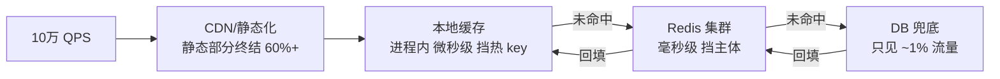
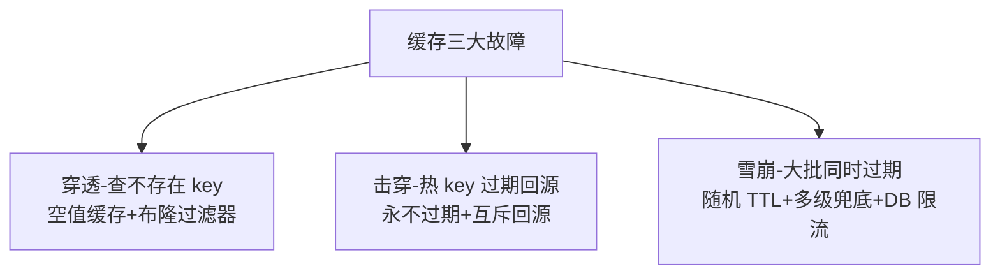
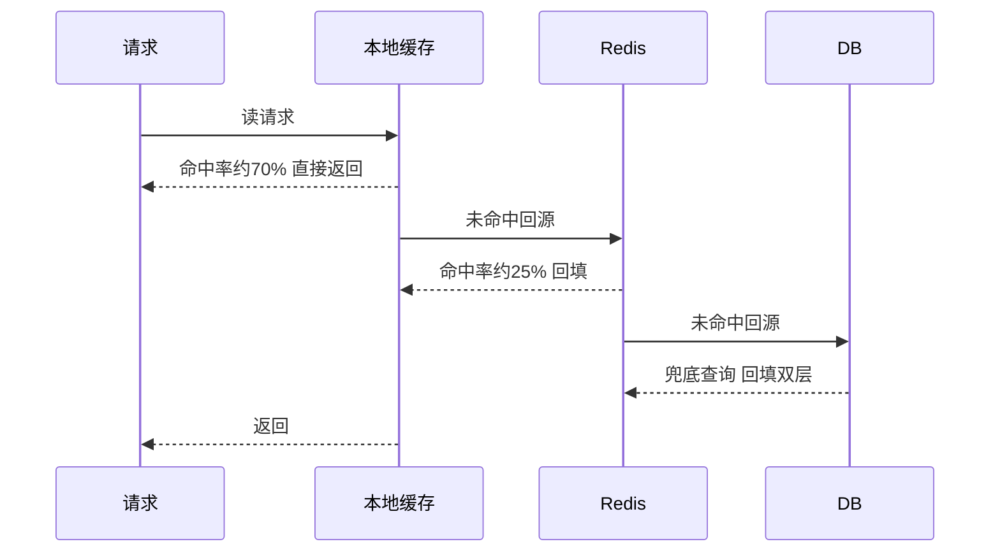
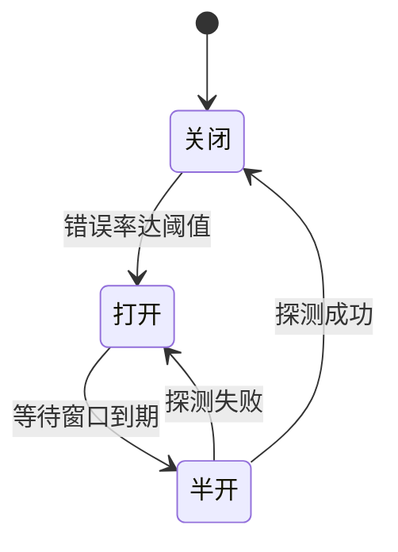

# 10 万 QPS 接口工程：单接口性能极限的架构设计

> 单接口 10 万 QPS——商品详情页、秒杀倒计时、热点活动页的真实形态。这个量级下，一次数据库查询都是灾难、一个锁都是瓶颈、一次缓存穿透都是事故。本篇讲清楚：10 万 QPS 的接口怎么分层消解流量、热点 key 怎么处理、机器怎么算、瓶颈怎么找。

## 一句话摘要

10 万 QPS 读接口 = 三级缓存流量漏斗（CDN/静态化终结 60% → 本地缓存挡热 key → Redis 集群挡主体 → DB 只见 1%）+ 无状态水平扩展（约 30 台）+ 穿透/击穿/雪崩三类故障的预置防护——命中率是生命体征，瓶颈是第一个到顶的资源。

## 本文核心

**核心机制一句话**：10 万 QPS 读接口 = **多级缓存把 DB 流量压缩到千分之一**（CDN 挡静态 → 本地缓存挡热 key → Redis 挡主体 → DB 只兜底 1%），配合无状态水平扩展——性能极限不是单机优化出来的，是「流量层层消化」的架构结果。

**机制链**：RT 分解（10ms 内完成 → 缓存命中是唯一路径）→ 三级缓存（本地 μs 级/Redis ms 级/DB 底线）→ 命中率即容量（99% 命中 = DB 只见 1000 QPS）→ 热点 key 特治（本地缓存+打散）→ 压测验证每个环节的上限。

**失效点/边界**：缓存一致性窗口（数据更新到缓存刷新之间读到旧值）；本地缓存的集群不一致窗口；缓存层故障时的穿透保护必须预置。

## 一、量级前提：10 万 QPS 意味着什么

- **瞬时形态**：秒杀倒计时类接口的脉冲特性——开抢前 1 秒从 1 万飙到 10 万
- **单机现实**：一个读接口单机极限约 3000-8000 QPS（取决于逻辑复杂度与序列化成本）→ 10 万 QPS 需要 **15-30 台 + 冗余**，且必须无状态水平扩展
- **DB 红线**：MySQL 单实例安全读 1-2 万 QPS——**10 万 QPS 直达 DB = 秒挂**。结论：DB 只能见到压缩后的流量，缓存体系是这类接口的主体架构

## 二、核心：三级缓存的流量漏斗

**第一级：CDN 与静态化**。商品详情这类「内容为主」的接口，把页面静态化推 CDN——10 万 QPS 中六成以上根本不出 CDN 边缘。动态部分（价格/库存）单独异步加载，主文档静态化。

**第二级：本地缓存（进程内）**。Caffeine/Guava Cache，微秒级访问、无网络开销。它是**热点 key 的特效药**：万级 QPS 打同一个 Redis key 时，单分片 Redis 就是瓶颈——本地缓存命中后这个 key 的 Redis 压力趋近于零。代价：集群内各节点的本地缓存有秒级不一致窗口（失效靠短 TTL + 变更消息推送）。

**第三级：Redis 集群**。毫秒级访问，主体流量的承载层。Redis 集群分片部署（防单分片热点）、按业务隔离（详情缓存与库存预扣分开集群）——缓存是共享资源，隔离原则（第 5 篇）同样适用。

**命中率的数学**：三级命中 99% → DB 只见 1000 QPS（安全）；命中率掉到 95% → DB 见 5000 QPS（告警）；掉到 90% → 1 万 QPS（逼近红线）。**缓存命中率就是这类接口的「生命体征」，必须监控 + 告警**。

## 三、机制：缓存三大故障的预置防护

缓存体系有三个经典故障形态，**防护必须预置**（故障时再想就晚了）：

| 故障 | 形态 | 预置防护 |
|---|---|---|
| **穿透** | 查不存在的 key，缓存永不命中，全打 DB | 空值缓存（不存在的 key 存短 TTL 空值）+ 布隆过滤器 |
| **击穿** | 热 key 过期瞬间，万级请求同时回源 DB | 热 key 永不过期 + 互斥锁回源（一个请求回源，其余等待） |
| **雪崩** | 大批 key 同时过期，DB 瞬时过载 | 过期时间加随机抖动 + 多级缓存兜底 + DB 限流自保 |

三者的共同哲学：**DB 是最后的底线，不是第一线的战士**——任何「缓存失效 → DB 兜底」的路径，都要设计成「兜得住」的形态（DB 限流自保：宁可拒绝部分请求，不让 DB 崩掉带走全站）。

## 四、实践：性能工程的清单与瓶颈定位

**性能工程清单**（10 万 QPS 接口的代码级纪律）：

- **无状态**：会话外置（Redis）、文件不落本地——水平扩展的前提
- **池化**：DB 连接池/HTTP 连接池/Redis 连接池全部预建——连接建立是隐藏的毫秒级开销
- **批量**：N 次小查询合并为 1 次批量（Redis MGET、批量 RPC）——RT 预算的最大杀手是「循环单查」
- **异步**：非响应必需的操作（日志/埋点/通知）全部异步
- **序列化**：JSON 序列化是 CPU 大头——热点接口用更轻的序列化（protobuf/精简字段）

**瓶颈定位的方法论**：压测加压 → **第一个到顶的资源就是瓶颈**（CPU 满？线程池满？Redis 带宽？带宽网卡？）→ 解决它 → 继续加压 → 下一个瓶颈——容量是「最短板」决定的，性能优化是「逐个消灭短板」的迭代。分段埋点（网关/应用/缓存/DB 各段耗时）让瓶颈定位从猜变成看。

> 💡 实战提示：压测时要在「生产等比缓存预热」后压——冷缓存压出来的 QPS 是幻觉（前 80% 请求全在回源），真实容量必须以热态为准。

**机器数的算法**：10 万 QPS ÷ 单机实测 5000 QPS = 20 台 + 50% 冗余 = **30 台**（容量篇的公式在单接口尺度的应用）。冗余的意义：发布滚动时剩余机器扛全量 + 单机故障不降级。

## 五、典型场景

- **商品详情**：静态化 + 价格库存异步加载（最经典的 10 万 QPS 接口）
- **秒杀倒计时**：纯静态 + CDN（连服务端都不用，时间戳由前端校准）
- **热点活动页**：本地缓存 + 热点 key 多副本打散（key 加随机后缀存多份）
- **App 首页 feed**：Redis 集群 + 本地缓存 + 预计算（把计算提前到离线做）

## 与容量、限流篇的配合

容量篇的「压测定容量」在单接口尺度的落地就是基准压测；限流篇的「阈值 = 崩溃容量 80%」在 10 万 QPS 接口上是保命的——**压测 → 容量数字 → 限流阈值 → 缓存命中率告警，四件事构成这个接口的完整防护闭环**。

## 你们可能会问

**Q1：本地缓存和 Redis 能不能只留一个？**
不能互相替代——本地缓存挡热 key（无网络开销）但集群不一致；Redis 一致性好但有网络成本与单分片热点。热 key 场景两者都要（本地挡尖峰、Redis 保底）。

**Q2：10 万 QPS 的写接口呢？**
写接口的天花板低一个量级（要一致性），思路从「缓存消解」换成「队列缓冲+批量落库」——读写接口是两套工程，不能套用。

## 追问链与我的判断

**追问链 1**：「命中率 99% 够了吗？」→ DB 还要承受 1000 QPS → 1000 QPS 对 DB 是安全线吗？→ 单实例 1-2 万，是 → 那 99.9% 呢？→ DB 见 100 QPS，更安全但缓存的边际成本上升 → **命中率不是越高越好，是「DB 安全线」反推的最低要求**。

**追问链 2**：「热 key 打散成多副本，数据一致性怎么办？」→ 多副本存的是「准静态数据」（商品标题/配置），TTL 1-5 秒的容忍窗口 → 数据强变的 key 打散反而危险 → **我的判断：热 key 打散前先问「这个 key 的数据多久变一次」——变的快的不能靠多副本，要靠本地缓存短 TTL**。

**追问链 3**：「本地缓存不一致窗口 5 秒，业务能接受吗？」→ 分场景——价格不能容忍（走 Redis 强一致读），标题可以（本地缓存）→ **每个字段标「一致性容忍度」，缓存的层级选择跟着字段走**。

## 常见误区

- **误区一：先优化单机再扩容**。单机优化有天花板（序列化/内核网络栈），10 万 QPS 的第一性原理是「分布式消解」——先分层消解流量，再谈单机调优
- **误区二：缓存命中率 99% 就安全**。要看绝对值：99% 命中下 DB 见 1000 QPS 没问题，但**缓存层故障时 100% 流量瞬间打向 DB**——穿透/击穿/雪崩的防护才是「安全」的完整定义
- **误区三：本地缓存数据更新不及时就弃用**。秒级不一致窗口对多数读场景可接受（商品标题/配置类）——用「业务可容忍的一致性窗口」换「热 key 的极限性能」，是划算的取舍

## 工程级深化：性能参数、压测步骤与量级分档

> 10 万 QPS 接口工程的核心是把「每一层都别成为瓶颈」写成参数。这一节给单接口的性能参数表与压测调优 runbook。

### 参数级配置清单（高并发接口）

| 配置项 | 默认值 | 10w 级推荐 | 千万级推荐 | 亿级推荐 | 为什么 |
|---|---|---|---|---|---|
| Web 容器线程数 | 200 | 200-400 | 按压测定 | 按压测定 | 线程不是越多越快，上下文切换成本在千线程级反噬吞吐，用压测找拐点 |
| 数据库连接池 | 10 | 20 | 20-50 | 分实例摊 | 连接数 x 实例数必须小于 DB max_connections，留 20% 管理余量 |
| 本地缓存容量 | — | 热点 1 万键 | 10 万键 + 容量上限 | 分片本地缓存 | 本地缓存解决热点读，容量失控变 Full GC 元凶 |
| 本地缓存 TTL | — | 1-5s | 1-3s | 1s | 本地缓存容忍短暂不一致，TTL 越短一致性越好但命中率越低 |
| Redis 连接池 | 8 | 16 | 32 | 32+分片 | Redis 单实例连接上限有限，池大小与实例数联动规划 |
| 熔断窗口错误率 | 50% | 50% | 40% | 30% | 高并发下错误传导快，阈值收紧换更快止损 |
| 接口超时预算 | 1s | 500ms | 300ms | 200ms | 入口预算被下游瓜分，入口自身逻辑预算通常只剩 30% |
| 限流算法 | 计数器 | 滑动窗口 | 令牌桶 | 令牌桶+队列 | 计数器有临界突刺，令牌桶平滑但实现复杂，按流量形态选 |

### 步骤级操作：压测调优五步

前置条件：压测环境与生产同构（至少容量 1:10）、监控大盘就绪（CPU/连接池/GC/P99）、压测流量模型经业务方确认。

- Step 1 基准压测：单接口从 1000 QPS 阶梯加压到目标值，记录每档 P99 与资源水位。验证点：找到「吞吐不再线性增长」的拐点，拐点即当前架构容量。
- Step 2 瓶颈定位：拐点处抓火焰图 + 慢 SQL + 连接池水位。验证点：瓶颈定位到具体一层（CPU/锁/IO/连接池），有数据支撑而非猜测。
- Step 3 单点优化：按定位结果优化（加缓存、改索引、调池、减序列化）。验证点：单点优化后重压，拐点上移至少 30%，否则优化方向存疑。
- Step 4 稳定性压测：目标值 1.2 倍持续压 4 小时，观察内存泄漏与连接泄漏。验证点：4 小时后内存与连接数曲线平稳，无持续增长。
- Step 5 容量标定：把最终拐点写进容量登记表，设为扩容触发线的 70%。验证点：值班手册更新，水位到触发线的告警路径演练通过。
- 回退：压测环境结论与生产不符（经常发生），以生产灰度单接口压测为准；任何优化回退以「配置回滚」为粒度，不做代码级回退。

### 量级分档下的性能取舍

10w 级（单集群纵向优化）：这一档的杠杆是缓存与池化参数，架构不动。该档位的 Trade-off：本地缓存引入「短暂不一致」——商品价格晚 1 秒更新可接受，库存就不行，哪些数据能进本地缓存要逐个判定。

千万级（读写分离 + 多级缓存）：DB 读成为瓶颈，读走缓存 + 从库，写靠异步化削峰。该档位的 Trade-off：接口返回从「强一致」退到「最终一致」，产品语义要同步改（「已下单」代替「已确认库存」）。

亿级（单元化 + 热点隔离）：单集群无论怎么调参都有上限，按业务维度切单元，热点 SKU 单独隔离部署。该档位的 Trade-off：为 1% 的热点建独立部署单元，运维对象数量翻倍——但这 1% 拖垮的是 100%。

### 请求路径时序：多级缓存的命中次序

### 状态视角：熔断器状态机

半开期只放行少量探测请求（建议 5-10 个）：全量放行的半开等于把恢复期的雪崩再演一遍——下游刚恢复就迎来 100% 流量，二次熔断几乎必然。

### 边界与反方案深推

高并发接口的第一边界是「缓存一致性的时间窗」：本地缓存 TTL 一秒，意味着最多一秒内不同实例看到不同价格——这个窗口对商品展示无害，对下单就是事故，所以下单必须回源强一致读，展示层才允许缓存。边界划在「用户能否感知不一致并因此受损」，而不是「技术上能不能做到一致」。

反方案推演：「全链路异步化，接口立刻返回受理中」——吞吐上限最高，但下单场景被否掉：用户提交订单后要立刻看到订单号与支付入口，受理中语义迫使用户轮询，转化率会跌。最终形态是「入口同步、尾货异步」：库存预占同步完成给确定感，真正扣减与履约异步执行。另一个被否的方案是「换更高配的机器扛」：单机性能挖到头也就两三倍收益，而架构级优化（缓存、异步、批量）是十倍量级——垂直扩展的钱要花在水平方案证明瓶颈不在架构之后。

压测与生产的偏差是这档接口工程最需要敬畏的边界：压测环境没有真实的长尾用户网络、没有真实的缓存冷热分布、没有真实的数据倾斜，压测结论永远比生产乐观两到三成（行业认知），容量规划必须给这个偏差留系数，而不是相信压测报告的天花板。

### 多视角圆桌：缓存引入后的不一致之争

**开发视角**：本地缓存 TTL 一秒，价格变更传播最慢一秒，可接受。**业务视角**：大促改价是运营主动行为，改价后前台还显示旧价一秒，用户按旧价下单会怎样？**开发回应**：下单回源强一致读，按新价结算，旧价只是展示层残留。**SRE 视角**：那展示价与结算价不一致本身会不会引发客诉？比「下单失败」更难处理的客诉就是「价格欺诈」感知。**架构结论**：展示价与结算价的差异窗口必须收敛到「结算页强制刷新」，即用户进入结算页时拉一次实时价——一致性分层做到「用户提交前强制对齐一次」，而不是追求全程一致。

这场争论的产出是一条通用原则：缓存不一致的容忍度不是技术指标，是用户感知与资损风险的函数。价格类容差异但要「结算前对齐」，库存类不容忍差异要走强一致，文案类容差异且无需对齐——三类数据三种策略，写成接入清单而不是逐次争论。

### 深层追问链

追问一：线程池调大为什么吞吐反而降？——线程超过 CPU 核数的合理倍数后，上下文切换成本吞掉并行收益，同时每个请求持有更多内存，GC 压力上升，尾延迟被 GC 停顿拉长。线程数的最优值只能压测逼近，公式只能给起点。

追问二：Redis 已经很快，为什么还要本地缓存？——Redis 快在服务端，但网络往返（RTT 加序列化）在 1 毫秒量级，10 万 QPS 下这 1 毫秒乘以调用量就是真实的机器成本与延迟预算；本地缓存把热点读压到微秒级，代价是引入实例间不一致窗口——它不是性能优化，是「用一致性换容量」的架构决策。

追问三：压测达标了，为什么高峰还是抖？——压测是均匀流量，生产是突发叠加（定时任务、缓存批量过期、上游重试风暴同时到达）。抖动的常见根因是「同步的周期性事件」：让缓存过期时间加随机抖动、让定时任务错峰，就能消掉大半「莫名抖动」——生产系统的稳定性问题，一半是「同步化」问题。

### 一次容量误判的复盘式推演

某接口日常 2 万 QPS，大促预估 8 万，按拐点 12 万的压测结论直接放量。大促当晚 5 万 QPS 开始抖动，定位发现瓶颈根本不在接口本身：接口依赖的一个「只读」配置服务被同公司另一个团队的大促活动同步放量，共享的 Redis 集群先到容量拐点。这次教训写进了容量流程：容量评估必须包含「共享依赖的容量归属」——你的压测只能证明「你到 12 万没问题」，证明不了「别人同时放量时你到 8 万没问题」。共享依赖的容量要按「峰值叠加模型」评估，并在容量登记表里显式列出共享方与协商结果。

## 自测三问

1. **10 万 QPS 为什么必须多级缓存？**
   - DB 单实例安全读 1-2 万 QPS；无缓存的 10 万直达等于秒挂。多级缓存把 DB 流量压缩到 1%，层级间微秒到毫秒的访问成本递增。

2. **缓存穿透/击穿/雪崩怎么区分与防护？**
   - 穿透=查不存在的 key（空值缓存+布隆过滤器）；击穿=热 key 过期瞬间回源（永不过期+互斥回源）；雪崩=大批同时过期（随机 TTL）。三者都要**预置防护**。

3. **瓶颈怎么定位？**
   - 压测加压，第一个到顶的资源即瓶颈（分段埋点让「看」替代「猜」）；解决后继续加压迭代——容量由最短板决定。

## 5W 速记卡

| W | 一句话 |
|---|---|
| What | 多级缓存 + 无状态扩展 + 性能工程清单的单接口极限设计 |
| Why | 10 万 QPS 下，一次 DB 查询都是事故，一层缓存都是防线 |
| Where | 商品详情/秒杀/热点活动页等读重接口 |
| When | 单接口 QPS 上万即启动缓存分层设计 |
| Who | 接口 owner 负责，SRE 配合压测与容量 |

## 开放问题

- **本地缓存的集群一致性**：消息推送失效有延迟与丢失可能——分布式一致性快照（如版本号协商）的通用方案仍是空白
- **自动化的瓶颈巡检**：分段埋点数据齐备后，「瓶颈自动识别 + 扩容建议」的智能化是性能工程的下一段演进

## 核心带走

**30 秒复述**：10 万 QPS = 多级缓存流量漏斗（CDN 60% → 本地缓存挡热 key → Redis 挡主体 → DB 见 1%）+ 无状态水平扩展（30 台）+ 三大缓存故障预置防护（穿透/击穿/雪崩）。命中率即生命体征；瓶颈 = 第一个到顶的资源；机器数 = 压测实测 + 50% 冗余。**失效边界**：缓存层故障无穿透防护、循环单查、有状态部署——三条都是 10 万 QPS 场景的经典死法。

## 📌 数据与事实声明

- 写于 2026-09-11；单机 QPS/命中率量级为教学基准，实际以压测为准
- 行业认知：穿透/击穿/雪崩三态与布隆过滤器防护为行业公开共识口径
- 免责：缓存产品与序列化选型按团队基建裁剪

## 📚 参考资料

| 类型 | 标题 | 来源 |
|---|---|---|
| 官方文档 | Caffeine Cache（W-TinyLFU 淘汰算法） | github.com/ben-manes/caffeine |
| 书 | 《数据密集型应用设计》（DDIA）第 6 章分区 | 公开出版 |
| 行业实践 | 大厂热点 key 治理公开分享 | 公开报道 |
