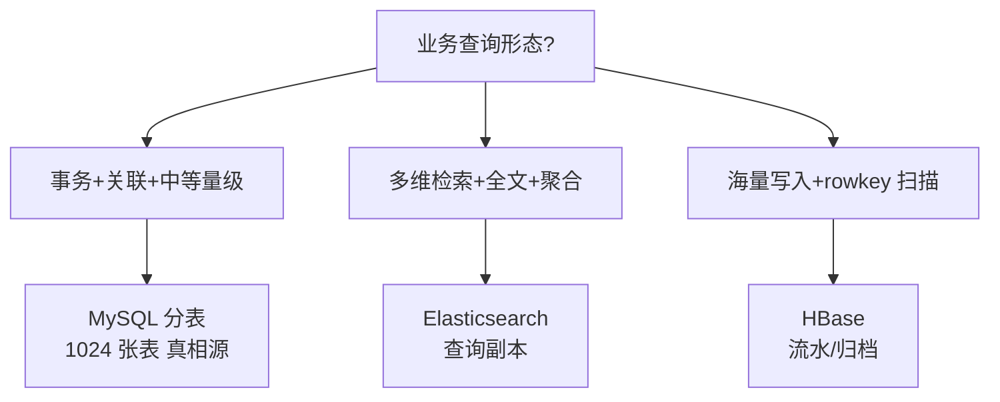
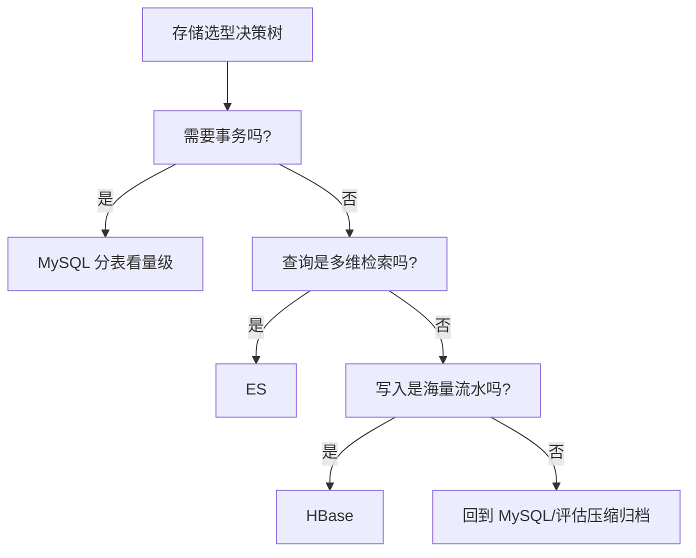

# 存储兵器谱：1024 张表、HBase 与 ES 的选型决策

> MySQL 分表、HBase、ES 是大规模系统的三大存储兵器：MySQL 管事务与关联查询，HBase 管海量写入与宽表扫描，ES 管全文检索与多维聚合。三者的能力边界极其清晰——**选错兵器的代价不是慢，是架构级返工**。本篇给出能力矩阵、决策树与混用姿势。

## 一句话摘要

存储选型三问：**读写比例**（MySQL 强一致读写/ES 读重检索/HBase 写重扫描）、**查询形态**（事务点查/多维检索/宽表扫描）、**数据量级**（亿级以下 MySQL 分表、十亿级 ES/HBase）——1024 张 MySQL 表管订单真相源，ES 管多维查询副本，HBase 管流水与历史归档；三者通过 binlog/事件流保持最终一致。

## 本文核心

**核心机制一句话**：三大存储的分工由底层引擎决定——MySQL 的 B+ 树擅长事务与范围点查，ES 的倒排索引擅长全文与多维检索，HBase 的 LSM 树擅长海量写入与 rowkey 扫描——**引擎结构决定能力边界，能力边界决定选型**。

**机制链**：业务查询形态分析 → 匹配引擎结构（B+ 树/倒排/LSM）→ 真相源定 MySQL（事务需求）→ 查询副本定 ES（binlog 同步）→ 流水归档定 HBase（写多读少）→ 最终一致靠对账兜底。

**失效点/边界**：ES 不是数据库（无事务、近实时），HBase 不是查询引擎（只有 rowkey 查询高效），MySQL 分表后多维度查询受限——三者都不能越界使用。

## 一、背景：三种引擎的底层结构决定一切

**MySQL（B+ 树）**：叶子节点有序链表——范围查询与事务点查的天生强者；但写入要维护树结构（页分裂），亿级单表索引膨胀后写入与查询双双退化。**适合：强一致事务 + 中等量级 + 关联查询**。

**ES（倒排索引）**：每个字段分词后建「词 → 文档列表」的倒排链——任意字段组合筛选都是索引查询，聚合分析原生支持；但无事务、写入要建索引（近实时，1 秒可见）、深度分页性能差。**适合：多维检索 + 全文搜索 + 聚合分析**。

**HBase（LSM 树）**：写入先落内存表再批量刷盘（Log-Structured Merge）——**写入吞吐极高**（顺序写盘），rowkey 点查与扫描高效；但只有 rowkey 一个索引，非 rowkey 查询全表扫。**适合：写多读少 + 海量流水 + rowkey 维度的存取**。

## 二、核心：订单场景的三兵器部署

以订单数据为例（第 1 篇的延伸），三兵器各管一段：

| 引擎 | 存什么 | 为什么是它 | 写入路径 |
|---|---|---|---|
| **MySQL 1024 表** | 订单主数据（状态机/金额/明细） | 事务 + 强一致 + 关联（订单-明细同库） | 业务直写（真相源） |
| **ES** | 订单查询文档（商家/运营维度） | 多维筛选 + 全文 + 聚合 | binlog→MQ→异步 |
| **HBase** | 订单流水/操作日志/历史归档 | 日增千万行写入 + rowkey（订单号/用户+时间）扫描 | binlog/MQ 异步 |

**典型查询的路由**：用户查订单 → MySQL（分片直达）；商家筛选订单 → ES；风控查用户全部操作流水 → HBase（rowkey = userId + 时间倒序）；财务对账 → MySQL/数仓。**每类查询在架构设计时就分配了引擎，运行时按维度路由**。

## 三、机制：选型决策树与混用纪律

**混用纪律**（多引擎共存的一致性规则）：

1. **真相源唯一**：每份数据只有一个写入真相源（订单在 MySQL），其余引擎是派生副本——副本可重建，真相源不可替代
2. **同步走标准管道**：binlog → MQ → 消费写入派生引擎（幂等消费，按主键覆盖）
3. **一致性分级**：ES 秒级延迟可接受、HBase 分钟级可接受（流水场景）——每个副本定义「时效契约」
4. **对账兜底**：派生副本与真相源定期比对（count/关键字段），不一致重建该分片

> 💡 实战提示：存储选型写「一页纸决策记录」——查询形态/数据量级/一致要求/淘汰条件四行，半年后回看就知道当时的假设是否还成立；选型文档比选型结果更值钱。

## 四、实践：典型场景与容量要点

- **订单多维查询**：MySQL 真相源 + ES 副本（第 4 篇详述）
- **用户操作流水**（浏览/点击/接口调用日志）：HBase（rowkey = userId 反转 + 时间戳，天然按用户聚合扫描）——日增亿条的流水只有 LSM 扛得住
- **历史订单归档**：2 年以上冷数据 → HBase 或对象存储（第 5 篇大表治理的归档落地）
- **商品搜索**：ES 独立索引（与订单索引分开集群，避免互相拖累——存储隔离原则）

**容量要点**：ES 的索引生命周期管理（热-温-冷-删四阶段，热节点 SSD、冷节点 HDD）；HBase 的 region 预分裂（避免写入热点）；MySQL 分表的 DDL 成本（1024 张表的字段变更是 1024 倍执行——**加字段前先想清楚**，低频字段进 JSON）。

## 与 MySQL 分表的配合（什么时候还加引擎）

分表（1024 张）解决「写入扩展」，但**解决不了查询维度问题**——商家维度、全文检索这些需求是分表的天然盲区，ES 的引入不是过度设计是必然。同理，流水类数据（操作日志）放进 MySQL 分表会挤占交易数据的资源——HBase 的引入是「数据分级存储」的落地。**判断顺序：先分表（事务+量级），再按查询与数据形态加引擎**——顺序反了就是为技术找场景。

## 你们可能会问

**Q1：分表和上 ES 的先后顺序？**
先分表（写入扩展是生存问题）后 ES（查询体验是进化问题）——但 ES 的设计要在分表设计时同步规划（同步字段/维度），否则回补成本高。

**Q2：HBase 能替代 MySQL 吗？**
不能——HBase 无事务无二级索引，只适合流水型数据。它 MySQL 的补充（承接海量流水），不是替代。

## 追问链与我的判断

**追问链 1**：「TiDB 这类分布式数据库能替代 MySQL+中间件吗？」→ 理论上能（HTAP+自动分片）→ 那为什么大厂还自建分片？→ 极致性能与成熟度：分库分表方案经过十年验证，TiDB 在极端写入场景仍有差距 → **我的判断：新项目中量级（日千万以下）可以评估 TiDB；存量巨量系统的迁移收益低于风险**。

**追问链 2**：「ES 文档建模用嵌套还是扁平？」→ 扁平化（明细打平进文档）检索快但聚合维度受限，nested 保结构但查询慢 → 订单场景明细多为展示不参与复杂聚合 → **扁平化为默认，nested 是特例**。

**追问链 3**：「HBase 的 rowkey 设计错了怎么办？」→ rowkey 是 HBase 唯一的索引，设计错 = 重写数据 → 所以 HBase 建模的第一原则是「先设计查询再设计 rowkey」——**LSM 的自由只给了写入，查询的自由要用 rowkey 设计买**。

## 常见误区

- **误区一：ES 当数据库用**。无事务、近实时、深度分页差——ES 是检索引擎，管理类系统（要事务）硬上 ES 是架构事故
- **误区二：HBase 当万能存储**。只有 rowkey 高效——非 rowkey 查询要建二级索引（Phoenix）或异构 ES，建模成本远高于 MySQL
- **误区三：多引擎数据用定时任务同步**。分钟级延迟 + 批量失败重试复杂——binlog 实时管道（Canal/Flink CDC）是标配，定时同步只适合 T+1 场景
- **误区四：一个引擎扛所有**。「MySQL 能扛为什么要 ES」的质疑在量级翻倍后消失——引擎的能力边界是物理结构决定的，不是参数调优能突破的

## 自测三问

1. **三大引擎的结构差异决定了什么？**
   - B+ 树强事务与范围查、倒排索引强多维检索、LSM 强海量写入——结构决定能力边界，选型先分析查询形态。

2. **多引擎并存怎么保证一致？**
   - 真相源唯一（MySQL）+ binlog 标准管道同步 + 幂等覆盖 + 时效契约（各副本定义延迟上限）+ 定期对账。

3. **什么数据适合 HBase？**
   - 写多读少、rowkey 维度存取、海量流水（操作日志/消息记录/历史归档）——非 rowkey 查询需求先想清楚再选。

## 5W 速记卡

| W | 一句话 |
|---|---|
| What | MySQL 分表 + ES 检索 + HBase 流水的三兵器存储体系 |
| Why | 引擎底层结构决定能力边界，单一引擎无法覆盖大规模系统的全部查询形态 |
| Where | 订单/流水/日志/搜索等大规模数据场景 |
| When | MySQL 分表之后按查询与数据形态补引擎 |
| Who | 存储团队定管道与规范，业务方按维度路由查询 |

## 开放问题

- **HTAP 的成熟度**：TiDB 类 HTAP 数据库宣称「一套引擎覆盖 OLTP+OLAP」，但 extreme scale 下与「MySQL+ES 专业分工」的成熟度对比仍在演进
- **存储成本的自动化优化**：冷热分层的迁移策略靠人工规则，成本感知的自动分层（按访问频率自动降冷）是演进方向

## 核心带走

**30 秒复述**：存储三兵器按引擎结构分工——MySQL（B+ 树）管事务真相源、ES（倒排）管多维检索副本、HBase（LSM）管海量流水；binlog 标准管道同步 + 真相源唯一 + 时效契约 + 对账兜底。**失效边界**：ES 当数据库、HBase 非 rowkey 查询、定时任务同步、单引擎扛所有——四条都是选型错误的经典返工。

## 📌 数据与事实声明

- 写于 2026-09-11；引擎结构特性（B+ 树/倒排/LSM）与适用边界为官方文档与行业共识口径
- 免责：版本能力（如 MySQL 8.0 的窗口函数）以官方文档为准

## 📚 参考资料

| 类型 | 标题 | 来源 |
|---|---|---|
| 书 | 《数据密集型应用设计》（DDIA）第 3 章（存储与检索） | 公开出版 |
| 官方文档 | Apache HBase 参考指南 | hbase.apache.org |
| 官方文档 | Elasticsearch Reference | elastic.co/guide |
