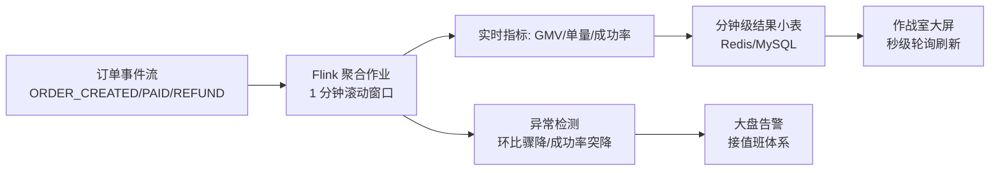
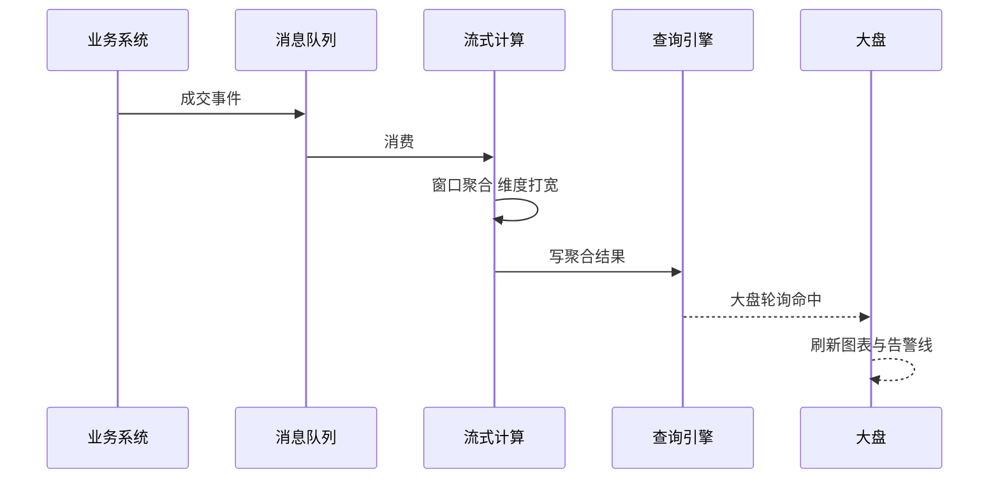
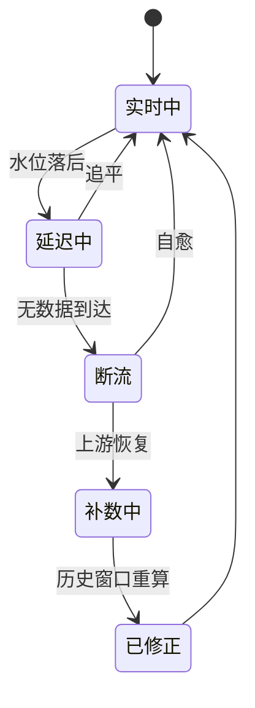

# 数据面建设：实时订单大盘、后台数据大盘与字段级数据治理

> 数据面回答两个问题：**「现在正不正常」（实时订单大盘）**与**「生意做得怎么样」（后台数据大盘/基本面）**——外加一个底层支撑：**字段级数据治理**（哪些数据要一致、哪些不需要、每个字段的口径归谁管）。大促指挥部的眼睛与经营层的仪表盘，都长在这条数据面上。

## 一句话摘要

数据面双大盘体系：**实时订单大盘**走流式链路（订单事件 → Flink 窗口聚合 → 分钟级小表 → 大屏），管「现在正不正常」（单量/GMV/支付成功率的秒级脉搏 + 异常自动告警）；**后台数据大盘**走批式链路（binlog → 数仓分层 → ADS 报表），管「生意做得怎么样」（转化漏斗/复购/类目分析的 T+1 视角）；两者共享字段级数据治理的底座——指标口径唯一、数据分级一致、责任到人。

## 本文核心

**核心机制一句话**：实时大盘不查业务库（流式预聚合，聚合压力在 Flink 上预付），后台大盘不连业务库（数仓分层隔离，分析流量与交易流量物理隔开）——**数据面的一切设计都遵守「不拖累交易链路」的第一原则**。

**机制链**：订单事件流（binlog/MQ）→ Flink 实时聚合（大盘）与 CDC 入仓（数仓）双消费 → 实时大盘管异常前哨（成功率骤降自动告警）→ 后台大盘管经营分析（漏斗/复购/类目）→ 字段级治理定口径与分级（资金级/交易级/体验级/展示级）。

**失效点/边界**：实时大盘是聚合近似（窗口语义，对账以库为准）；Flink 作业故障时大盘断更（要有降级：切离线补算）；指标口径不统一（同一指标两套数）是数据面最隐蔽的故障。

## 一、背景：数据面的两个消费场景

**场景一：大促指挥部的实时大盘**。大促当晚，作战室大屏上：实时 GMV 曲线、每分钟订单量、支付成功率、各机房流量分布——**每一秒的异常都要在 1 分钟内被看见**。它的技术形态：流式计算 + 秒级刷新大屏。

**场景二：经营分析的后台大盘**。运营每周看：转化漏斗（浏览→加购→下单→支付）、复购率、类目结构、渠道 ROI——**T+1 的准确性比实时性重要**。它的技术形态：数仓分层 + BI 报表。

两个场景的技术路线完全不同（流式 vs 批式），但共享同一个数据源（订单事件流）与同一个治理底座（指标口径）。**不共享的部分是隔离纪律：分析查询永远不碰交易库**（第 4 篇的不查库哲学在数据面的完全体）。

## 二、核心：实时订单大盘的架构

**设计要点四个**：

- **窗口与口径**：滚动窗口（每分钟出数）+ 水位延迟容忍（事件迟到 2 分钟内计入）——大盘口径与财务口径的差异要显式声明（实时口径是近似，准确数以 T+1 对账为准）
- **聚合前置**：所有统计在 Flink 内完成，落库的是聚合结果（每分钟一行）——大屏查询是单行点查，轻到极致
- **异常前哨**：大盘不只是给人看的——**单量环比骤降 30%、支付成功率跌破阈值自动触发告警**（支付通道挂了往往先表现为成功率下降，比用户投诉早 10 分钟）
- **降级预案**：Flink 作业挂了大盘断更——预案是「切离线补算 + 大屏标注数据延迟」，断更本身也要告警

## 三、机制：后台数据大盘与数仓分层

**数仓分层的治理意义**：每层有明确的职责与质量标准——ODS 保真（不改原数据）、DWD 统一口径（清洗规则唯一）、DWS 复用聚合（避免每个报表重算全量）、ADS 直供报表。**没有分层的数仓 = 报表各自取数各自算，同一指标三套数字**——这是数据面最常见的组织病。

**后台大盘的典型指标族**：流量（PV/UV/渠道）、转化（漏斗各步转化率）、交易（GMV/客单价/退款率）、复购（新老客结构/复购周期）——每个指标都要登记「口径定义 + 负责人 + 更新频率」，这是字段级治理在指标层的延伸。

## 四、实践：字段级数据治理（构建字段的数据怎么管）

用户命题「构建字段的数据，哪些数据一致性，哪些不需要」的体系化答案——**字段治理登记表**（每个核心表的字段登记四件事）：

| 登记项 | 内容 | 例子（订单表） |
|---|---|---|
| 一致性等级 | 资金级/交易级/体验级/展示级 | amount=资金级；buyer_name 冗余=展示级 |
| 口径 owner | 谁定义、谁解释 | amount 的口径=实付金额（不含运费），owner=交易组 |
| 生命周期 | 保留多久、何时归档 | 订单明细保留 3 年在线，之后归档 |
| 上游依赖 | 字段从哪来、什么频率同步 | seller_id 从商品服务事件同步（秒级） |

**治理的三个高频问题**：① 同一字段两套口径（GMV 含不含退款？）→ 口径登记表唯一裁决；② 字段没人认得（历史遗留字段）→ 无 owner 字段定期清理；③ 一致性等级缺失导致「体验级数据用了强一致代价」→ 分级评审（新字段上线时标注等级）。

**数据分级的一致性落地**（第 5 篇的分级表在治理层的执行）：资金级字段走对账兜底、交易级走最终一致+监控、体验级走缓存容忍——**分级不是文档，是每张表的每个字段都有对应的保障机制**。

## 五、实践：典型场景与起步路径

**典型场景**：

- **大促作战室**：实时大盘 + 告警联动 + 各链路负责人驻场——数据面在极端场景的集中验收
- **经营周会**：后台大盘的核心指标周环比——数据面的常态输出
- **数据质量月报**：对账差异、指标口径冲突、无 owner 字段清理——数据治理的例行体检

> 💡 实战提示：指标命名规范先行——「业务域_指标名_口径」格式（trade_gmv_paid）+ 登记表，比事后治理省十倍力气；命名混乱的指标体系是数据面的最大技术债。

**起步路径**：先核心指标监控（支付成功率/单量）→ 实时大盘（Flink 单作业起步）→ 数仓分层（ODS→DWD 先立）→ 字段治理登记表 → BI 报表体系。**从「看见核心链路」起步，不要一上来建数据中台**。

数据面的演进有清晰的代际：Excel 报表时代（人工取数）→ BI 工具时代（自助报表但仍直连业务库）→ 数仓分层时代（口径统一与分层复用）→ 实时化时代（Flink 流式 + 湖仓一体探索）——**每一代的驱动力都是业务对「更快、更准、更全」的数字的要求**。

## 与监控告警的区别

监控（稳定性系列第 7 篇）管「系统指标」（QPS/P99/错误率），数据面大盘管「业务指标」（GMV/单量/转化）——**系统全绿但业务病了**（比如支付渠道静默失败）只有业务大盘能发现。两层互补，缺一不可。

## 你们可能会问

**Q1：Flink 作业挂了大盘断更，怎么办？**
两道预案：Flink 开启 checkpoint（恢复后从断点重放补数）；极端情况切「离线补算」（T+1 用数仓回填缺失窗口）+ 大屏标注「数据延迟」。断更本身要告警——监控自己的监控。

**Q2：小团队需要数仓分层吗？**
分层是治理思想不绑定规模——核心表 5 张以内可以扁平化；一旦报表超过 10 张或出现「同指标不同数」，就是启动分层的信号。分层的目的（口径统一+复用）在任何规模都成立。

## 追问链与我的判断

**追问链 1**：「大盘数字和财务对不上，算谁的错？」→ 都没错——实时口径（流式近似）与财务口径（精确对账）本来就有差异 → 那要大盘干嘛？→ 大盘管「趋势与异常」，财务管「精确结算」——**用途不同，口径必须分开声明**。

**追问链 2**：「指标口径冲突为什么不能数据团队拍板？」→ 「有效订单」的定义涉及业务规则（退款算不算？线下核销算不算？）——**口径是业务共识，数据团队只是翻译者**；强行拍板的结果是报表没人信。

**追问链 3**：「字段分级登记表谁维护？」→ 每个字段的 owner 维护、数据平台托管登记、季度审计——**我的判断：没有 owner 的字段等于没有治理**，宁可有 owner 但登记简陋，不要登记精美但无主。

## 常见误区

- **误区一：实时大盘直接查业务库**。定时聚合 = 对 1024 张表发起扫描风暴（第 4 篇的不查库哲学）
- **误区二：大盘指标随手定**。没有口径登记的指标会演化成「同屏多套数」——大屏上两个 GMV 数字不一样是治理事故
- **误区三：数仓分层是数据团队的内部事务**。分层的口径定义需要业务方深度参与（什么是有效订单？退款算不算 GMV？）——口径是业务共识，不是技术决定
- **误区四：数据治理 = 建文档**。登记表不联动机制（分级不落地保障、无 owner 不清理）就是废纸——治理的关键在「登记项有对应的自动化执行」

## 工程级深化：大盘参数、接入步骤与量级分档

> 大盘的工程含量在「延迟预算的分配」：从业务发生到指标上屏，每一跳允许花多少毫秒，写进参数才算数。

### 参数级配置清单（实时大盘链路）

| 配置项 | 默认值 | 10w 级推荐 | 千万级推荐 | 亿级推荐 | 为什么 |
|---|---|---|---|---|---|
| 端到端延迟预算 | 无 | 60s | 10s | 3-5s | 预算决定技术选型：分钟级用离线任务，秒级必须流式，预算先于方案 |
| 流式窗口大小 | — | 1 分钟 | 10s | 1-5s | 窗口越小乱序处理成本越高，延迟与准确性在这里对赌 |
| 水位线延迟 | 窗口的20% | 10s | 5s | 2s | 水位线是「等乱序数据的耐心」，等太久大盘延迟涨，等太少指标会翻 |
| checkpoint 间隔 | — | 60s | 30s | 10s | 间隔越长故障恢复重放越多，秒级大盘的重放预算必须小 |
| 埋点采样率 | 100% | 100% | 10%-100%按事件 | 核心全量+长尾采样 | 传输与计算成本随采样率线性涨，核心成交事件必须全量 |
| 预聚合维度数 | — | 低于 5 维 | 3-5 维 | 按大屏固定 | 每多一个维度组合，聚合结果量级乘法增长，亿级只算固定维度 |
| 查询引擎缓存 | 关 | 开 | 开+预热 | 开+预热+降级快照 | 大盘刷新是周期性风暴，预热让高峰查询不打爆底层 |
| 断流告警延迟 | 无 | 5 分钟 | 1 分钟 | 30s | 大盘最怕的不是数字错而是「没数字」，断流必须先于用户发现 |

### 步骤级操作：新指标接入实时大盘

前置条件：业务事件埋点规范评审通过、指标口径文档（分子分母、去重键、时间戳取哪个环节）经数据与业务双确认。

- Step 1 口径对齐：把指标口径写成文档，业务与数据双签。验证点：口径文档含「不统计什么」，边界比定义更重要。
- Step 2 埋点上报：按规范埋点，测试环境验证事件到达。验证点：测试事件在流式作业中被正确解析，字段无缺失。
- Step 3 双跑对数：新指标与老口径（或人工口径）双跑 3 天。验证点：双跑差异可解释（延迟、口径边界），差异率收敛到可接受线。
- Step 4 上屏接线：指标写入查询引擎，配置大盘图表与告警线。验证点：刷新周期内数据更新，图表空值有明确语义（零还是未到）。
- Step 5 值班交接：断流告警、口径问题答疑路径写入值班手册。验证点：演练一次人为断流，告警按预期触发。
- 回退：口径错误立即下线新指标并标注「数据不可信」——错误的指标比没有指标危害大，回退动作是「摘掉」而不是「修着用」。

### 量级分档下的大盘取舍

10w 级（准实时就够）：这一档「分钟级聚合 + 数据库轮询」就能撑起大盘，流式框架可以先不上。该档位的 Trade-off：大促时大盘晚一分钟更新可接受，省下的是整条流式链路的运维成本。

千万级（必须流式）：业务要求秒级感知成交波动，Lambda 或纯流式成为必选。该档位的 Trade-off：接受流式作业的 7x24 运维成本（反压、乱序、checkpoint 失败），换决策秒级可见。

亿级（大盘分层）：总大盘秒级流式，明细下钻走预聚合 + OLAP 引擎，运营自助分析走离线 T+1。该档位的 Trade-off：承认「一个大盘服务所有场景」不存在，按决策时效分层（作战大盘/经营日报/自助分析），每层用便宜的技术。

### 大盘链路时序：从成交到上屏

### 状态视角：数据质量状态机

「已修正」状态必须在大盘上可见：补数重算过的历史窗口要打标记，否则运营会拿着修正前后的两版数字来问「哪个是真的」——数据可信度是靠透明度挣的。

### 边界与反方案深推

大盘建设的第一边界是「指标口径的时间归属」：一笔 23:59:58 支付成功、00:00:03 写入流水的订单，算昨天还是今天？事件时间与处理时间的取舍不定义清楚，日环比永远对不齐，业务方与数据方的「数字对不上」事故大多源于此。结论是把时间戳在埋点环节就锁死为业务发生时间，流式窗口按事件时间划分，迟到数据进修正窗口——口径的边界必须在链路最上游解决。

反方案推演：「大盘直查明细库，所见即所得」——被否的原因是亿级明细的即席聚合根本撑不住大盘的周期刷新，直查路线在数据量过千万后必然被迫加预聚合，与其被逼着改不如一开始就分层：作战层预聚合、分析层即席查询、对账层批处理，各层各司其职。另一个被否的方案是「一套指标服务所有角色」：运营要的是转化漏斗、管理层要的是 GMV 趋势、值班要的是成功率水位，三套诉求强行塞进一面大屏，结果是每类用户都要在无关信息里找自己的数字——大屏按角色分面，不是设计问题，是信息架构问题。

最后是「大盘的失效成本」边界：值班期间大盘是决策依据，大盘数据错了比大盘挂了更危险——挂了大家知道去查日志，错了大家会基于错误数字做扩容与降级决策。所以核心指标必须有第二来源交叉验证（如抽样回查明细库），对账差异超阈值自动在大盘上打「数据存疑」标——可观测体系的自身可信度，也要被观测。

### 你们可能会问

问：大盘做得这么重，为什么不直接让运营用即席查询工具自助分析？——自助分析解决「探索」，大盘解决「值守」。值班场景要的是秒级、固定口径、零学习成本的一屏，即席查询的高灵活度在紧急时刻全是负担。两者并存且互补：大盘上每个数字旁边放「下钻到即席分析」的入口，值守与探索就接上了。

问：指标口径变更怎么管理？——口径变更有版本号，大盘展示时标注口径版本，新旧口径并行输出一个观察期，业务确认后再下线旧口径。口径变更没有并行期直接切换，是「大盘数字突变」事故的头号来源。

### 大盘的运营节奏

大盘不是建完就结束的资产，它有运营节奏：每周核对一次「无人消费的指标」（连续四周无人查看的图表下线），每季度做一次「口径年检」（指标定义与业务现实是否还匹配）。大盘的信息密度和服务的代码一样会腐化，下线无人使用的指标与上线新指标同样重要——一块越堆越满的大屏，最终会变成谁都不看的墙纸。大盘运营的北极星指标只有一个：值班与业务决策时，「先看大盘」的比例。这个比例上升，说明大盘在真实决策链路里；下降，说明它已经变成装饰品。

## 自测三问

1. **实时大盘为什么不查业务库？**
   - 大盘的聚合查询会对 1024 张表发起周期性扫描风暴，拖垮交易链路；Flink 流式预聚合把计算成本预付在流上，查询只碰分钟级小表。

2. **数仓分层（ODS/DWD/DWS/ADS）治理了什么？**
   - 统一口径与复用：ODS 保真、DWD 统一清洗规则、DWS 复用聚合、ADS 直供报表——没有分层就是每张报表各自取数各自算。

3. **字段一致性分级怎么落地？**
   - 每个字段登记一致性等级（资金/交易/体验/展示），等级直接决定保障机制——资金级对账、交易级最终一致+监控、体验级缓存容忍。

## 5W 速记卡

| W | 一句话 |
|---|---|
| What | 实时大盘（流式）+ 后台大盘（数仓）+ 字段级治理的数据面体系 |
| Why | 「现在正不正常」与「生意怎么样」两个问题需要两条独立的数据链路 |
| Where | 大促作战室、经营分析、数据质量治理 |
| When | 实时大盘大促必配；数仓分层在报表超过 10 张时启动 |
| Who | 数据团队建链路，业务方定口径，治理表裁决冲突 |

## 开放问题

- **实时与离线的口径统一**：Lambda 架构（流批两套）的口径漂移是老大难，Kappa 架构（纯流式重算）的成熟度仍不足以全面替代——两套的统一是数据平台长期课题
- **指标治理的自动化**：口径登记靠人维护，指标血缘的自动解析（SQL 血缘分析工具）正在成熟但覆盖率有限

## 核心带走

**30 秒复述**：数据面 = 实时大盘（Flink 流式聚合不查库 + 异常前哨）+ 后台大盘（数仓分层 ODS→ADS + 经营指标）+ 字段级治理（一致性等级/口径 owner/生命周期登记，等级决定保障机制）。第一原则：分析查询永不碰交易库。**失效边界**：口径无登记 = 同屏多套数；分层无业务参与 = 口径漂移；治理无自动化执行 = 废纸。

## 📌 数据与事实声明

- 写于 2026-09-11；数仓分层（ODS/DWD/DWS/ADS）为阿里数据中台公开方法论的行业通用变体
- 行业认知：指标口径冲突与告警噪音为数据面治理高频痛点（公开分享共性）
- 免责：Flink/数仓工具选型按团队基建裁剪

## 📚 参考资料

| 类型 | 标题 | 来源 |
|---|---|---|
| 书 | 《大数据之路：阿里巴巴大数据实践》 | 公开出版 |
| 官方文档 | Apache Flink（窗口与状态管理） | flink.apache.org |
| 行业实践 | 数据中台与指标治理公开分享 | 公开报道 |
