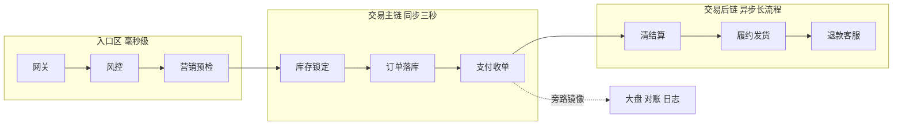
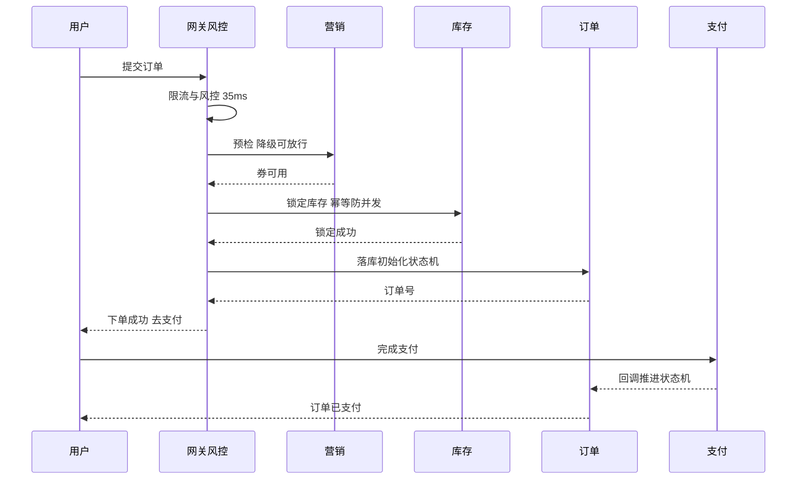
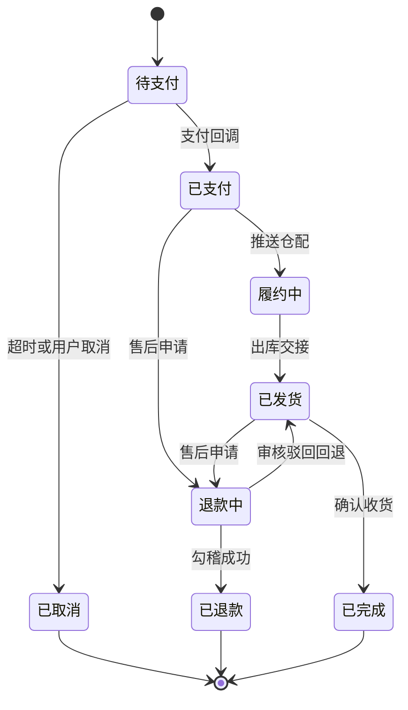
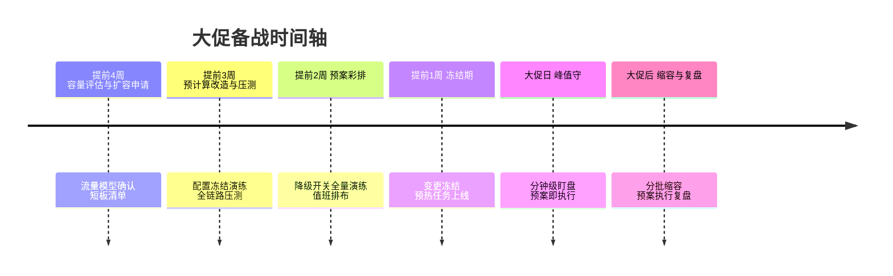

# 千万订单系统实战：一笔订单的全链路生命周期串讲

> 单点决策（分片键、幂等、状态机）在「从零搭建」篇已经讲透，本篇换一条轴：跟着一笔订单从点击到完成走完全程——它经过哪十几跳、每一跳的预算与失败语义是什么、哪里会排队哪里会丢、大促日的它和日常日的它有什么不同。单看每一层都是常识，串起来看才是系统。

## 一句话摘要

一笔订单的旅程 = 入口的毫秒级筛选 + 交易主链的同步短事务 + 后链的异步长流程 + 数据面的旁路镜像——全链路的工程统一命题是「在正确的跳做正确的确认强度」。

## 本文核心

1. **链路的确认强度逐跳递减**——越靠近钱越强一致（同步事务），越往后越异步（最终一致 + 对账），把一致性预算花在最关键的跳上。
2. **每跳都有自己的超时预算**——入口 200ms 的预算被十几跳瓜分，预算表就是重要性排序表；超时预算的传递纪律是「下游严格小于上游剩余」。
3. **大促日的订单链路是「另一个系统」**——降级预案、队列削峰、热点隔离让同一套代码在两种流量形态下呈现出两副面孔。
4. **量级分档**：10 万级一笔订单走完同步链路即可，千万级必须主后链分离 + 削峰，亿级按单元隔离 + 全链路分级保障。

## 一、一笔订单的完整旅程

先看地图。一笔订单从提交到完成，经过四个区域：**入口区**（网关、风控、营销预检）、**交易主链**（库存锁定、订单落库、支付收单）、**交易后链**（清结算、履约发货、退款客服）、**旁路区**（大盘、日志、对账）。主链是用户盯着的那三秒，后链是用户看不见但资损相关的长尾，旁路区与主链共享数据但绝不共享命运——旁路挂了不能影响下单，这是分区的基本纪律。

## 二、逐跳拆解：确认强度与失败语义

**第 1 跳 网关**：只做身份与限流，不做业务。失败语义：限流拒绝要返回「排队稍后再试」而不是裸错误——入口的失败文案是产品的一部分。预算：5ms。

**第 2 跳 风控**：事前风控必须在主链同步路径上（放行或拦截要在这三秒内决定），但风控引擎本身要做到「降级放行」——风控挂了宁可放行低风险交易也不能让全站下不了单。失败语义：超时按「低风险放行 + 事后补审」处理。预算：30ms。

**第 3 跳 营销预检**：券是否可用、活动是否命中——读为主，缓存友好。失败语义：营销预检失败降级为「无优惠可买」，不能挡下单。预算：50ms（缓存命中 10ms 内）。

**第 4 跳 库存锁定**：主链第一处硬一致点——超卖是资损，锁定必须幂等且防并发。方案谱系：数据库乐观锁（量小）、Redis 预扣 + 异步落库（量大）、分桶库存（热点 SKU）。失败语义：锁定失败立即告知「库存不足」，这是唯一允许「快速失败给用户」的主链环节。预算：80ms。

**第 5 跳 订单落库**：分片路由 + 状态机初始化（待支付）。订单号在进入本跳前已生成（分片路由内嵌在订单号里）。失败语义：落库失败要回滚已锁定的库存——反向补偿必须在同一次请求里完成，让用户重试时库存是干净的。预算：100ms。

**第 6 跳 支付收单**：跳出生成支付单、唤起收银台——从这一跳起链路对用户变成异步（用户去支付了）。失败语义：支付有独立的重试与状态机，订单侧只认支付回调。预算：不占主链预算（异步）。

## 二点五、订单的全生命周期状态视图

把逐跳视角折叠成一张状态图，订单的一生是这样的——主链负责从出生到已支付，后链负责从已支付到终点：

这张图上有三条容易被忽视的工程语义：其一，「退款失败回退到已发货」这类逆向边必须显式建模，漏了它退款失败的单据会永久卡在中间态；其二，「待支付到已取消」的超时关单是延迟任务（通常 15-30 分钟），延迟任务的精度与库存释放的时效直接挂钩——关单晚一分钟，热点库存就多缺一分钟；其三，状态机的每一次跃迁都要带「触发事件」审计（谁、什么事件、什么时间），售后纠纷与资损排查全靠这份跃迁流水。

## 二点六、大促备战的时间轴

大促不是当天的事，是一条以周为单位的时间轴——每段窗口有唯一的主题，串行推进：

时间轴的关键纪律是「变更冻结期」的刚性：提前 1 周冻结之后，任何「就改一行配置」的冲动都被流程拦住——大促事故的根因统计里，「冻结期内的小改动」常年占据前排（行业认知）。冻结期要留一个例外通道：安全与资损类紧急修复，双签放行——刚性不等于死板，例外通道的存在让刚性可以被遵守。

## 三、大促日：同一套代码的两副面孔

日常日与大促日，订单链路的参数与预案完全不同：

| 维度 | 日常日 | 大促日 |
|---|---|---|
| 入口限流 | 宽松基线 | 按容量倒推的严格阈值 |
| 营销预检 | 实时计算 | 活动命中预计算进缓存 |
| 库存方案 | 乐观锁 | 热点 SKU 分桶 + 售罄熔断 |
| 非核心跳 | 全开 | 推荐位、积分等降级关闭 |
| 队列 | 短平快 | 削峰队列开足，排队秒数可见 |

大促改造的核心思想是「把实时计算提前到预计算」：活动配置、商品快照、库存分桶都在大促前算好缓存好，峰值时刻只做「读缓存 + 简单校验 + 写主链」。**Trade-off**：预计算的代价是灵活性——大促中改活动配置的生效延迟从秒级变成分钟级（要重新预计算），运营必须接受「大促日的配置是冻结的」这个纪律，临时改需求的冲动要在备战期就管理掉。

## 四、参数级配置清单（订单全链路）

| 配置项 | 默认值 | 10万级推荐 | 千万级推荐 | 亿级推荐 | 为什么 |
|---|---|---|---|---|---|
| 入口总预算 | 500ms | 300ms | 200ms | 150ms | 预算越紧对每跳要求越高，倒逼链路瘦身 |
| 风控超时 | 100ms | 50ms | 30ms | 20ms + 降级放行 | 风控不能成为下单的瓶颈，超时降级是标配 |
| 库存锁定方案 | 乐观锁 | 乐观锁 | Redis 预扣 | 分桶 + 售罄熔断 | 方案跟着热点强度走，不要提前过度设计 |
| 订单落库超时 | 200ms | 150ms | 100ms | 80ms | 落库是主链最重的一跳，预算要给够但要防慢查询 |
| 支付回调重试 | 5 次退避 | 5 次 | 6 次 | 6 次 + 告警升级 | 回调丢失等于丢单，重试加对账双保险 |
| 状态机乐观重试 | 3 次 | 3 次 | 5 次 | 5 次 | 并发回调冲突的正常消化手段 |
| 削峰队列长度 | 无 | 无 | 有限 + 可见 | 按预算秒数 | 队列是延迟放大器，长度换算成排队秒数管理 |
| 反向补偿时效 | 同步 | 同步 | 同步 + 兜底任务 | 同步 + 兜底 + 对账 | 锁定未释放的库存是隐形超卖源 |

## 五、步骤级操作：大促订单链路备战清单

前置条件：大促流量模型确认（峰值系数、时长、业务构成），历史大促数据可回放。

- Step 1 容量推演：全链路压测到目标系数 1.2 倍，找短板。验证点：短板清单每项有扩容或优化方案，无「遗留观察」。
- Step 2 预计算改造：活动配置、商品快照、库存分桶预计算上线。验证点：预热任务核销率 100%，峰值时刻无实时配置查询。
- Step 3 预案翻新：降级预案按大促档位重审（哪些跳在大促日默认降级），翻一遍开关。验证点：每个 P0 预案执行人知道开关位置，演练过一次。
- Step 4 观测加固：订单链路专属大盘（逐跳耗时、逐跳成功率、队列水位），值班到岗。验证点：大促前一次模拟演练，大盘与告警按预期工作。
- Step 5 峰值守与回落：分钟级水位盯盘，触发线即预案；回落分批缩容。验证点：预案执行全记录，回落不反弹。
- 回退：大促中任何预案执行遵循「可撤销优先」——降级开关全开全关演练过，5 分钟内可整体回退。

## 六、事故推演：一次被「旁路」拖垮的主链

一次促销活动中，订单接口 P99 从 150ms 涨到 2 秒，交易主链本身毫无压力——排查发现是旁路区的一个「实时明细大盘」查询直接扫了订单从库，促销期写入暴涨导致从库延迟升高，大盘查询变慢，而大盘服务的连接池被慢查询占满后开始堆积，堆积的连接挤占了同一实例上的订单服务只读操作。修复动作（大盘查询限流 + 迁移到 OLAP 引擎）只用了半天，但暴露的原则值得写进制度：**旁路与主链的故障隔离必须在部署与资源层物理实现**——共享数据库、共享连接池、共享线程池的「逻辑隔离」在流量异常时形同虚设。整改后形成「旁路准入」机制：任何旁路消费（大盘、报表、实验）接入主库流量，必须走独立资源 + 限流准入评审。主链的稳定性预算，永远不要给旁路分母。

## 七、四高自查与 Trade-off 总表

| 维度 | 本篇方案 | 代价 | 反方案 | 为什么不选 |
|---|---|---|---|---|
| 高可用 | 主后旁三区物理隔离 | 资源成本上升 | 全链路同池部署 | 旁路拖垮主链的事故反复发生 |
| 高并发 | 预计算 + 削峰 + 热点分桶 | 灵活性下降（配置冻结） | 纯实时计算 | 峰值时刻实时计算的成本与延迟不可承受 |
| 高一致 | 确认强度逐跳递减 + 对账兜底 | 对账体系成本 | 全链强一致 | 吞吐与延迟不可接受 |
| 高扩展 | 逐跳无状态化 + 预算表 | 预算管理成本 | 依赖单点大机 | 水平扩展是量级演进的唯一出路 |

## 八、你们可能会问

**问：为什么入口预算越大的体系反而要定得越紧？** ——预算是约束不是资源：500ms 预算下每跳都觉得自己可以慢一点，最后串成 3 秒；200ms 预算强迫每一跳回答「你值多少毫秒」——预算紧不紧的判断标准是「能不能逼出每跳的最优解」，而不是「现在实际耗时多少」。

**问：库存方案从乐观锁演进到分桶，能一步到位吗？** ——不建议。乐观锁阶段的并发冲突率、Redis 预扣的准确性验证、分桶的桶大小调优，每一代方案都依赖上一代积累的运营数据（冲突率分布、热点 SKU 名单）。跳代演进等于在没有运营数据的情况下盲调参数——量级没到就享受不到新方案的收益，反而先吃它的复杂度。

**问：支付回调丢了怎么办？** ——三层兜底：支付侧重试（退避多次）、订单侧主动查证（超时未回调的待支付单定时向支付侧查证）、日终对账（资金流水与订单状态勾稽）。查证任务是对账的「轻量前置版」，把「回调丢失」的发现时间从天级压到分钟级——重试解决瞬时故障，查证解决持久丢失，对账兜住一切。

**问：一笔订单的旅程里，哪一跳的故障最贵？** ——按「资损概率 x 修复成本」排序，库存锁定与支付回调并列第一：库存的多锁与漏锁都是直接资损，支付回调的状态错乱产生「付了没单」或「没付有单」。这两跳值得最高的确认强度与最全的测试覆盖——链路的钱袋就握在这两跳手里。
**问：逐跳的失败语义应该由谁定、什么形式沉淀？** ——由「这一跳的 owner」起草、主链 owner 汇总裁决定稿，沉淀为一份两列文档：「这跳超时了业务算成功还是失败」「失败后谁触发补偿」。这份文档的价值在冲突时刻：凌晨三点的故障里，值班没时间开会定义语义，照着文档执行就是了。文档过时的信号是「值班实际处理和文档不一致」——每次故障复盘核对一遍失败语义文档，十分钟的事，省的是下一次整夜的扯皮。

## 九、追问链与我的判断

追问一：全链路优化的第一刀切哪里？——我的判断是「先量预算再动手」：把每一跳的真实耗时打点拉出来，和预算表对照，超预算最多的跳就是第一刀。多数团队的直觉是优化「最复杂的那一跳」，但复杂度和耗时不是一回事——常常是营销预检这类「简单但没做缓存」的跳吃掉了三成预算。数据会纠正直觉，先打点后优化。

追问二：链路的尽头是什么形态？——往 5 年看（行业认知）：主链会越来越短（预计算把判断提前、异步化把确认后移），后链会越来越自动化（履约与客服的规则引擎化），旁路会越来越实时（大盘从分钟级走向秒级）。但「逐跳定义确认强度」这个方法论不会变——变的只是每一跳的实现，不变的是「把钱花在关键确认上」的取舍观。

## 十、常见误区

- **误区一：主链越同步越安全**。全同步的链路延迟是各跳之和，任何一跳抖动直接放大给用户——确认强度分级（关键同步、次级异步）才是又稳又快。
- **误区二：降级只发生在故障时**。大促日的主动降级是「预案内的正常形态」——把降级当成故障处理而不是容量策略，团队会在最需要降级的时刻犹豫不决。
- **误区三：链路打通就完事**。逐跳的失败语义（超时了算成功还是失败、补偿谁触发）比成功路径更需要设计——成功路径是相似的，失败路径各有各的坑。

## 💡 实战提示

- 💡 **给每一跳贴「耗时预算」标签**：监控大盘按预算表展示逐跳实际耗时，超预算的跳自动标红——预算表从文档变成活的告警基线。
- 💡 **反向补偿必须有兜底任务**：同步补偿失败（网络抖动）后的孤儿锁定，靠定时兜底任务扫描释放——没有兜底的同步补偿等于漏斗。
- 💡 **大促前的「降级彩排」**：正式大促前一周做一次全预案彩排（逐个开关开关一遍），既验证开关可用，也让执行人形成肌肉记忆。
- 💡 **旁路准入要签字**：任何新的大盘/报表接入生产库流量，主链 owner 有权否决——准入机制的成本是一次评审，收益是主链稳定性不被蚕食。

## 十一、自测三问

1. 你能画出自己负责链路的逐跳预算表吗？哪几跳现在超预算？
2. 库存与支付这两跳的失败语义（超时、重复、乱序的处理），团队有书面共识吗？
3. 旁路消费接主库流量，你们有准入机制吗？还是「谁想接谁接」？

## 十二、5W 速记卡

| W | 内容 |
|---|---|
| What | 一笔订单从入口到售后的全链路生命周期与逐跳纪律 |
| Why | 单点决策串不成系统，链路视角才能看到预算、隔离与一致性分配 |
| When | 千万级主后链分离 + 削峰；亿级单元隔离 + 分级保障 |
| Who | 主链 owner 守预算与失败语义，旁路消费守准入 |
| Where | 入口区、交易主链、交易后链、旁路区四个故障域 |

## 十三、开放问题

1. AI 实时风控（模型推理进主链）的延迟预算与准确性怎么平衡，推理加速卡值不值得？
2. 全链路灰度（一笔订单在新旧两套链路间路由）的流量染色的运维成本，降到多低才值得常态化？
3. 单元化架构下跨单元订单（用户与库存分属不同单元）的一致性方案，最终会收敛到哪种范式？

## 核心带走

- **核心一句话**：一笔订单的旅程是「在正确的跳做正确的确认强度」——入口毫秒筛、主链三秒硬一致、后链异步对账兜、旁路物理隔离。
- **三个落地锚点**：逐跳预算表、失败语义书面化、旁路准入机制。
- **量级分档**：10 万级全同步够用、千万级主后分离 + 削峰、亿级单元化分级保障。
- **哪里会坏**：预算超支的慢跳、旁路拖垮主链、回调丢失无查证、反向补偿无兜底。
- **最小动作**：本周就能做的三件——拉一次逐跳耗时与预算对照、补齐库存支付两跳的失败语义文档、盘点旁路消费的接入清单。

## 📌 数据与事实声明

- 写于 2026-09-15；订单链路分层、确认强度分级为行业公开实践的教学归纳（行业认知）
- 预算与参数为行业认知口径，按自身链路压测校准
- 事故案例为公开技术社区高频案例模式的匿名化复述

## 📚 参考资料

| 类型 | 标题 | 来源 |
|---|---|---|
| 书 | 《数据密集型应用系统设计》事务与一致性章节 | 公开出版 |
| 行业实践 | 电商大促订单链路公开分享 | 公开报道 |
| 方法论 | 本仓库稳定性系列、大规模架构实战系列关联篇 | 仓库内联动 |
