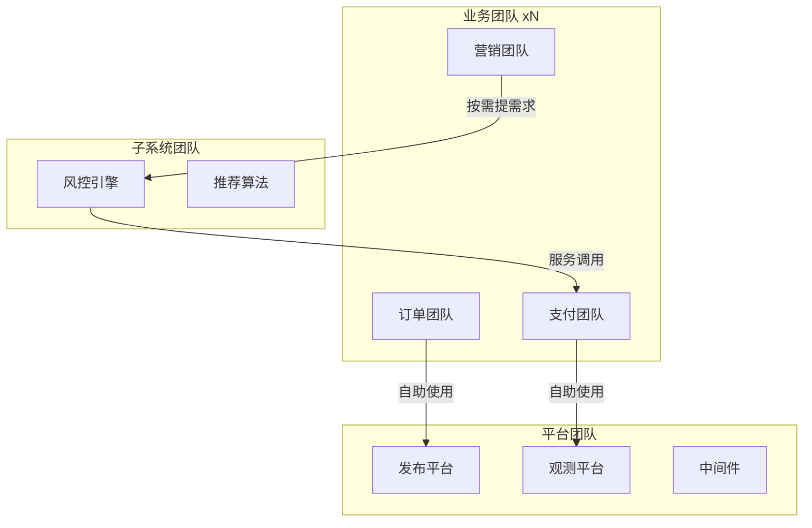
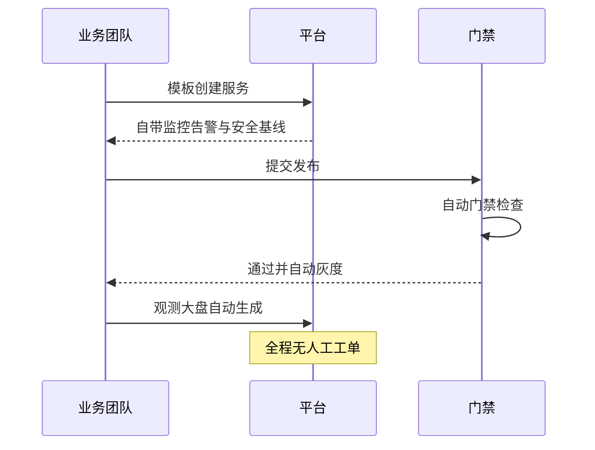
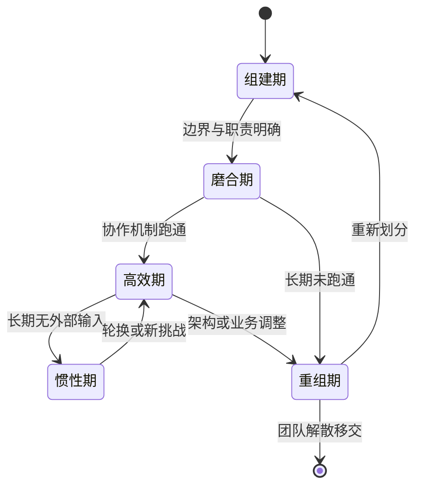

# 团队与工程文化实战：大规模架构的组织面

> 架构问题到了最后都是组织问题：服务边界划不清是因为团队边界没划清，发布慢是因为门禁与考核在打架，稳定性差是因为没人真正拥有它。本篇讲大规模架构的组织面：团队怎么按架构切、平台工程怎么做、效能怎么度量、文化怎么落地成机制——组织设计与架构设计同源，康威定律的双向版本同样成立。

## 一句话摘要

大规模架构的组织解法 = 团队拓扑对齐架构边界 + 平台工程收口通用能力 + 效能量度引导行为 + 文化落成机制——组织形状决定系统形状，反过来系统重构也要配组织重构。

## 本文核心

1. **团队拓扑是架构的因变量也是自变量**——先按架构边界切团队（业务团队/平台团队/复杂子系统团队），团队的交互模式反过来固化架构的边界。
2. **平台工程的本质是「把通用能力产品化」**——平台团队的成功标准是业务团队「愿意用」，不是「被要求用」。
3. **效能度量是行为设计**——你度量什么，组织就优化什么；度量单一指标必然催生应试行为，度量组合要互相制衡。
4. **文化的量级分档**：十人团队靠默契，百人团队靠机制，千人团队靠平台把机制自动化——文化不是口号，是「不依赖具体某个人的运转方式」。

## 一、量级前提：协作成本随规模平方增长

沟通路径随人数平方增长：十人团队 45 条潜在沟通线，百人团队近 5000 条。架构上的服务拆分本质是把沟通成本「编译」成接口契约——但很多团队只拆了服务没拆组织，几十个研发围绕一个共享的「中间件组」排队提需求，系统的微服务化换不来组织的并行化。规模每上一个档，组织形态必须跟着演进：

## 二、核心决策一：团队按什么切

三种切法各有代价，主流答案是组合式（团队拓扑三型）：

**业务团队（stream-aligned）**：对齐业务价值流，端到端拥有一个业务域的服务（如订单团队、支付团队）。目标是最短路径交付业务价值，代价是需要平台兜底通用能力。

**平台团队（platform）**：把业务团队都需要的通用能力（发布、观测、存储中间件、权限）收口成内部产品。平台的用户是业务团队，「客户满意度」是它的北极星。

**复杂子系统团队（complicated-subsystem）**：风控引擎、推荐算法这类需要深度专业且替换周期与业务节奏不同的组件，独立成团减少对业务团队的认知负担。

**Trade-off**：组合式切法的代价是平台团队与业务团队的「供需张力」——平台资源永远不够，业务团队永远觉得平台慢。解法不是取消张力而是给它一个健康形态：平台做「自助化产品」让业务团队自己动手，排队只发生在真正需要平台定制的 20% 需求上。

## 三、核心决策二：平台工程怎么做才不会做成「管控工具」

平台工程的失败形态高度一致：平台按「管控」逻辑建设（审批流、卡点、报表），业务团队被迫使用，然后催生出绕过平台的影子流程。成功的平台工程遵循三条产品原则：

1. **自助优先**：业务团队不开工单、不等排期就能完成的事（自助建服务、自助看监控、自助配告警），绝不做成人工流程。平台的人效杠杆 = （自助完成的操作数 / 平台人工介入数）。
2. **默认值即最佳实践**：平台模板的默认配置就是团队该有的样子（默认带监控、默认带告警、默认安全基线）——把最佳实践藏进默认值，合规不需要自觉。
3. ** paved road 比围墙有效**：默认路径最好走，偏离路径成本递增（要说明理由、要额外审批）——不是不能偏离，是让正确的事成为最省力的事。

**边界**：平台「自助化」的天花板是平台的 API 与文档质量。自助不是「给你个网页自己摸索」，是「API + 模板 + 文档 + 示例」四件套齐全——平台团队要像做开源项目一样做内部平台，把「业务团队用得爽」当产品目标。

## 四、核心决策三：效能度量怎么定才不翻车

DORA 四指标（部署频率、变更前置时间、变更失败率、恢复时长）是行业公认的起点，但直接拿它们做考核必然翻车：考核部署频率就有人为部署而部署，考核失败率就有人不敢发布。度量的正确姿势：

| 原则 | 做法 | 反例 |
|---|---|---|
| 度量团队不度量个人 | 指标用于团队自省与资源决策 | 个人绩效挂指标 |
| 组合制衡 | 速度指标（频率/前置时间）与质量指标（失败率/恢复时长）成对看 | 只报速度不报质量 |
| 趋势重于绝对值 | 团队和自己比，看方向 | 团队之间横向排名 |
| 度量解释权归团队 | 数字异常由团队分析原因 | 领导拿着数字问责 |

**Trade-off**：度量的代价是「被度量的行为」会挤占「未被度量的价值」——代码评审的耐心、文档的更新、新人带教都不在 DORA 里，但它们决定团队能不能持续。解法是定期用定性调研（开发者体验调查）校准定量指标，把「数字好看但团队在流血」的信号捕捉进来。

## 五、参数级配置清单（组织机制）

| 配置项 | 默认值 | 百人级推荐 | 千人级推荐 | 为什么 |
|---|---|---|---|---|
| 团队规模 | — | 5-9 人（两个披萨） | 同左 + 子团队化 | 超过 10 人的团队沟通成本超过产出，宁可拆细 |
| 团队认知负荷上限 | 无 | 明确评估 | 评估 + 调边界 | 团队负责的服务数超过认知负荷是事故温床，「这个团队管多少」要有依据 |
| on-call 轮换 | 无 | 每周单人 | 每周双人 + 升级链 | on-call 是服务拥有权的一部分，不参与 on-call 的团队不是真正的 owner |
| 平台人工响应 SLA | 无 | 2 个工作日 | 1 个工作日 | 平台响应慢是影子流程的起点，SLA 是平台对内的产品承诺 |
| 效能复盘频率 | 无 | 季度 | 月度 | 用数据复盘「流程本身」，流程不迭代就僵化 |
| 技术分享频率 | 自发 | 月度 | 双周 | 知识流动的最低成本机制，频率低于人员流动速度就守不住常识 |
| 服务 ownership 登记 | 无 | 100% 强制 | 自动采集 | 无主服务是组织债的具象化，登记是治理的第一步 |

## 六、步骤级操作：一次团队拓扑调整

前置条件：架构边界图（服务域划分）已经稳定三个月以上——架构还在动的时候调组织，两边都在漂移。

- Step 1 认知负荷盘点：给每个团队列「负责的服务清单 + 意外事件频率」，超负荷团队显性化。验证点：每张清单有团队 leader 确认，不依赖 HR 数据。
- Step 2 边界提案：按「业务价值流 + 认知负荷」起草新边界，每个团队画出「拥有什么/依赖什么」。验证点：依赖图无环，双向依赖是组织设计的红灯。
- Step 3 平台先行：新边界里业务团队需要的能力，平台先补齐（观测模板、发布模板）——先给工具再收职责，顺序反了就是甩锅。
- Step 4 灰度迁移：选一个团队试点两个月，跑通 ownership 移交、on-call 交接、指标基线重建。验证点：试点团队的部署频率与故障恢复时长在新边界下持平或改善。
- Step 5 全量推广 + 回看：按试点模板分批迁移，季度后回看组织健康度（认知负荷分布、协作满意度）。验证点：回看结论写进下一次调整的输入。
- 回退：试点团队指标恶化时回退边界调整——组织调整和发布一样要可回滚，「先试点再全量」就是组织的灰度发布。

## 六点五、团队健康的生命周期视图

组织设计不是一次性画好就结束，团队有自己的生命周期，健康度要在状态流转里看：

两个状态最值得盯着：「惯性期」是高效期的影子——团队稳定运行两年以上没有任何外部输入（新人、新技术、新业务），默默就会进入惯性期，表现为「对系统外的东西失去好奇」，轮换与挑战性任务是最便宜的解药。「磨合期超过两个季度」是边界画错的强信号——健康的团队三个月内应该跑通基本协作，跑不通大概率不是人的问题而是边界的问题，这时候该改的是组织而不是逼团队「再努力融合一下」。

组织复盘时按状态给团队画像：高效期团队占多少、惯性期有几个、磨合期超时的有几个——三个数字比任何满意度问卷都更早告诉你组织是否在健康运转。

## 七、事故推演：一次「没人拥有」的故障

某个公共的优惠券服务出了 P1 故障，恢复用了四小时——排查时的第一问题就是「这个服务谁负责」：原团队半年前解散了，代码移交给了平台组「代管」，平台组只保活着不演进，没人熟悉它的缓存设计，故障时只能读代码救火。复盘的结论不是技术性的：这个服务的存在本身就是组织债——无主服务的每一个技术问题，都是组织问题的延迟爆发。整改：服务目录全量清理无主服务（限期认领或冻结下线）、团队解散必须先完成 ownership 移交评审（流程卡点）、平台「代管」这个状态被废除（要么完整接管要么不接）。这次故障之后团队形成一句口头禅：「服务不会自己变旧，是没有主人的服务才变旧。」

## 八、你们可能会问

**问：业务团队说「平台太慢，我们自己做更快」，怎么办？** ——先看数据：快在哪一步？如果是平台响应慢（工单排队），修平台的 SLA；如果是平台能力缺失，这个需求就是平台的路线图输入。真正危险的回答是放任自流——每个业务团队自建一套发布与监控，三年后组织背上 N 份重复的维护成本。「自己更快」通常是局部正确、全局错误，组织要用总成本数据把这个 trade-off 摆上桌。

**问：跨团队协作里最耗时的对齐会议，能砍吗？** ——能砍一半：把「信息同步型会议」换成异步文档 + 评审，只保留「决策型会议」。判断标准：这个会如果所有人提前读了文档还能开下去，它就不该是会。会议是组织最贵的同步机制，用文档异步化是效能优化里回报最高的动作之一。

**问：新人融入慢，知识都在老人脑子里，怎么破？** ——知识管理靠「最小文档集」而不是大全：每个服务必备三件套（架构图、runbook、FAQ），新人入职第一周的任务就是按文档跑通一次故障演练——文档的问题在演练里暴露，演练反过来逼文档更新。知识传承的机制化程度，决定组织对人员流动的免疫力。

**问：技术债的偿还怎么推动？业务永远排第一优先级。** ——用「债务利息」说话：每次因为技术债导致的故障、每次因为技术债拉长的排期，都记在技术债台账上并换算成天数。业务方拒绝偿还的不是「重构」，是「减少每月三天的事故处理」——把债翻译成业务语言，排期对话才成立。

**问：工程师的职业成长在大平台上会不会被「螺丝钉化」？** ——取决于轮换与纵深机制是否存在：有意识的双向轮换（业务团队到平台、平台到业务）与「从 0 到 1」的机会（新服务、新工具的 owner），螺丝钉化是可以被制度设计对冲的。反过来，小团队全栈成长的代价是深度不足——两种成长的 trade-off 要讲清楚，让个人选而不是组织默认。

**问：组织机制的起步量级怎么定？** ——10 万行代码、十来人的团队，机制最小集只有三样：服务 ownership 登记、on-call 轮换、周度同步——再多的机制在这个量级是负担，默契比流程快。百人规模起，机制清单扩到本篇参数表的全量（认知负荷评估、平台 SLA、效能复盘）。机制跟着量级走，提前铺大机制的组织会被自己的流程拖慢，滞后铺的会被协作成本拖垮——机制建设与规模增长的匹配，本身就是一种架构设计。

## 九、追问链与我的判断

追问一：团队拓扑多久调整一次是健康的？——我的判断是「一年一大看，季度一小看」：季度看认知负荷与协作痛点的信号（不一定要动边界），年度看架构演进是否要求组织响应。调整频率高于年度一次，说明边界从来没画对；三年不动，说明组织在用惯性对抗变化。边界调整本身是高成本操作（信任重建、上下文移交），所以它应该是「低频 + 深思熟虑」的。

追问二：平台团队的规模边界在哪里？——平台团队占研发总人数的比例，行业常见的健康区间是 10-25%（行业认知）。低于 10% 平台必然积压成瓶颈，高于 30% 说明业务团队在萎缩——平台做大是为了让业务团队更强，不是为了自身规模。比例突变（平台快速扩张）通常是「业务团队把不想做的事推给平台」的信号，这时候要警惕的是组织在用招人回避真正的边界设计。

## 十、常见误区

- **误区一：抄大厂的 org chart 就是抄架构**。组织的形态依赖业务形态与人才密度，直接照搬头部公司的团队拓扑，往往水土不服——学的是「按什么原则切」而不是「切出来长什么样」。
- **误区二：效能度量等于排名**。横向排名催生数据美化与内卷，度量是给团队自己的镜子，不是给管理层的鞭子——镜子照见改进点，鞭子只会催生表演。
- **误区三：文化是活动（团建、口号）不是机制**。无责复盘、轮值 on-call、文档优先，这些机制才是文化的实体；离开机制的「文化」是墙上的装饰，考勤不会因此改变。

## 💡 实战提示

- 💡 **先看交互再看边界**：诊断组织问题先画「实际协作图」（谁天天找谁），再对比「应有边界图」——天天跨团队拉群对齐的地方就是边界画错的地方。
- 💡 **平台做减法出口碑**：平台团队每季度下线一个没人用的功能，比上线三个新功能更能赢得信任——减法证明你在乎用户的时间。
- 💡 **ownership 有仪式**：服务移交时办一次 30 分钟的「交接仪式」（架构讲解、runbook 演练、答疑），比邮件转交的存活率高得多——仪式的本质是强制完成知识传递的验证。
- 💡 **把「谁负责」写成一行字**：任何跨团队的系统，都要能在 30 秒内回答「出事找谁」——答不出来就先停下手里的需求，把这一行字补上。

## 十一、自测三问

1. 你负责的服务，「出事找谁」这一行字存在且有人维护吗？
2. 你们团队过去一个月，花在「跨团队等待」上的时间有多少？瓶颈是流程还是平台？
3. 上一次组织调整前，有试点吗？有回退方案吗？

## 十二、5W 速记卡

| W | 内容 |
|---|---|
| What | 团队拓扑 + 平台工程 + 效能量度 + 文化机制化的组织面设计 |
| Why | 沟通成本随规模平方增长，组织形态决定系统形态 |
| When | 百人规模起平台团队必须成立；团队调整一年一大看 |
| Who | 业务团队端到端拥有，平台团队产品化通用能力 |
| Where | 团队边界、平台产品、度量体系、机制文档 |

## 十三、开放问题

1. AI 编程工具普及后，团队的最小规模与认知负荷边界会怎么变？「一个人加一队 AI」的团队拓扑是否成立？
2. 远程与混合办公对知识流动机制的冲击，靠异步文档能补齐多少？
3. 效能量度的下一个范式是什么？DORA 之后，「开发者体验」的度量怎么避免变成新的应试游戏？

## 核心带走

- **核心一句话**：组织形状决定系统形状——团队拓扑对齐架构边界，平台把通用能力变成产品，度量组合引导行为，文化落成机制。
- **三个落地锚点**：ownership 全覆盖、平台自助化、度量组合制衡。
- **量级分档**：十人靠默契、百人靠机制、千人靠平台自动化机制。
- **哪里会坏**：无主服务、平台变成管控工具、度量单一化、组织调整不可回滚。
- **最小动作**：本周就能做的三件——清理服务目录里的无主项、给最痛的跨团队等待设计一个自助入口、把一个信息同步会改成文档评审。

## 📌 数据与事实声明

- 写于 2026-09-15；团队拓扑三型、DORA 指标、平台工程原则为公开方法论（Team Topologies、DORA 报告等公开出版物）
- 量化区间（团队规模、平台占比）为行业认知口径，不同组织差异大，按自身数据校准
- 事故案例为公开技术社区高频案例模式的匿名化复述

## 📚 参考资料

| 类型 | 标题 | 来源 |
|---|---|---|
| 书 | 《Team Topologies》 | 公开出版 |
| 报告 | DORA State of DevOps 年度报告 | dora.dev |
| 书 | 《人月神话》沟通成本章节 | 公开出版 |
| 书 | 《平台工程》相关公开出版物 | 公开出版 |
