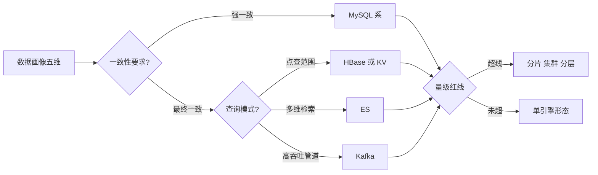
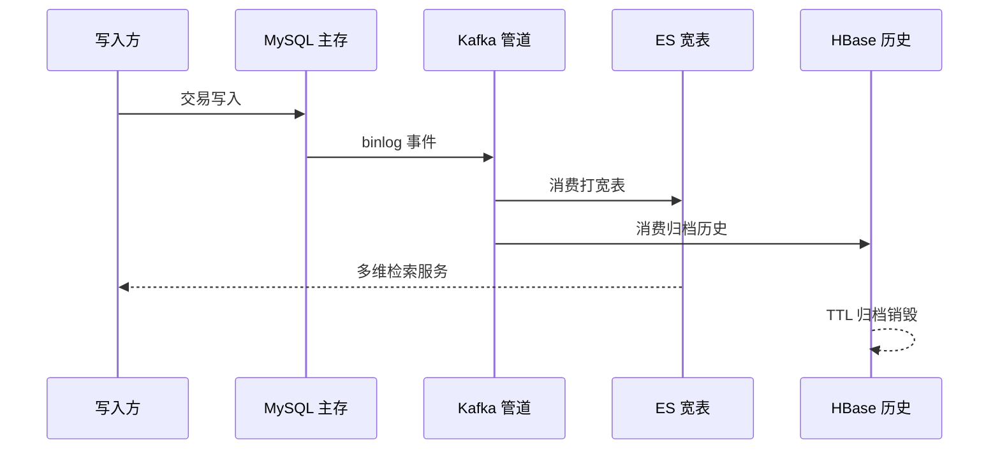
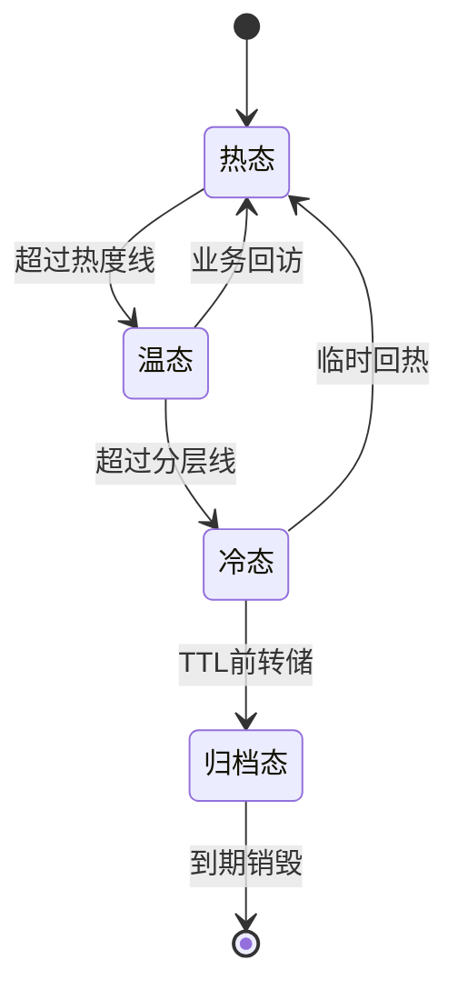
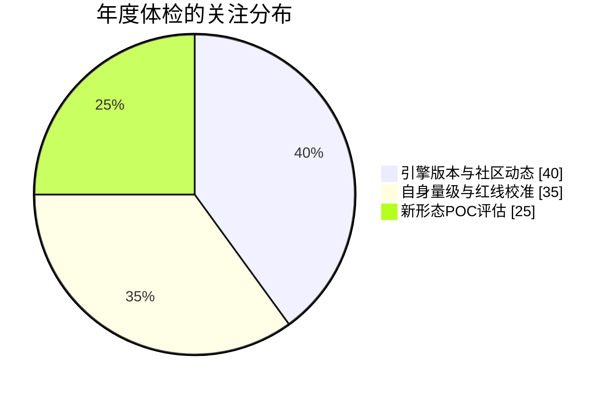

# 存储架构亿级选型全景：四引擎匹配矩阵与决策树

> 存储选型的全部复杂性可以压缩成一句话：把数据的形状对到引擎的舒适区上。本篇给出四大引擎（MySQL/Redis/Kafka/ES）在十万到亿级四个量级下的匹配矩阵、一棵可走的决策树、以及每条选型路线的代价清单——「存储兵器谱」篇讲怎么开选型评审会，本篇讲会上该带着哪张地图。

## 一句话摘要

存储选型 = 数据画像（五维）对引擎舒适区（四引擎）+ 量级红线定形态 + Trade-off 表定价代价——没有全能引擎，只有匹配的形状。

## 本文核心

1. **数据画像五维**：读写比、行宽、增长曲线、查询模式、一致性要求——五维齐了，选型就从「感觉」变成「对表」。
2. **量级红线是形态开关**：十万单库、百万读写分离、千万分库分表 + 集群、亿级分布式全家桶——红线触到才动，不提前过度设计。
3. **每条选型路线都有价签**：强一致吞吐低、最终一致要补偿、宽表查询快但同步链路贵——选型会的本质是把价签摆上桌。
4. **量级分档**：10 万级单引擎覆盖、千万级多引擎分工、亿级存储分层与生命周期管理常态化。

## 一、数据画像：选型的第一动作

任何选型讨论开始前，先把五个维度的数字填出来。没有画像的选型会是观点对撞，有画像的选型会是对表作业：

| 维度 | 关键数字 | 影响的决策 |
|---|---|---|
| 读写比 | 如 20:1 或 1:10 | 读多走缓存与副本，写多走 LSM 系（HBase/Kafka） |
| 行宽 | 平均与 P99 字节数 | 行宽大压行数水位，宽字段考虑拆冷热列 |
| 增长曲线 | 日增与 3 年总量 | 决定分片数、分区策略、TTL 设计 |
| 查询模式 | 点查/范围/多维/聚合 | 点查 KV、多维检索、聚合分析各归其位 |
| 一致性要求 | 强/最终/因果 | 资金强一致，内容最终一致，日志可丢 |

## 二、四引擎舒适区与量级匹配矩阵

### 2.1 舒适区速查

| 引擎 | 舒适区 | 明确的不舒适区 |
|---|---|---|
| MySQL | 事务、点查、小范围查询、强一致 | 海量写入、多维检索、超宽行 |
| Redis | 热点读、计数器、简单结构、微秒延迟 | 大 value、持久化主存、复杂查询 |
| Kafka | 高吞吐管道、削峰、日志流、回放 | 随机读、按业务键检索、低延迟点查 |
| ES | 多维检索、全文、聚合分析 | 强一致写、频繁更新、超高吞吐写入 |

### 2.2 量级红线矩阵（行业认知口径，落地前压测校准）

| 量级 | MySQL | Redis | Kafka | ES |
|---|---|---|---|---|
| 10 万 QPS 级 | 单库主从 | 单机或哨兵 | 单集群 | 3 节点内 |
| 百万级 | 读写分离 | 集群 | 多分区 | 3-5 节点 |
| 千万级 | 分库分表 | 集群 + 读写分离 | 多集群 | 5-10 节点 + 分层 |
| 亿级 | 分布式中间件或 NewSQL | 多集群单元化 | 跨机房复制 | 滚动索引 + 冷热分离 |

红线的读法是「形态开关」而不是「性能判决」：单库主从在百万级依然可能扛得住轻负载，但形态升级的窗口要在红线附近开始评估——等扛不住再动，迁移的窗口就没了。

## 三、典型组合模式与价签

亿级体系的高频组合，每个都有明确的适用与代价：

**模式一：MySQL 主存 + Redis 缓存**（读多写少的交易数据）
价签：缓存一致性治理成本；穿透/击穿/雪崩三件套防护。适用：商品、用户、订单主数据。

**模式二：MySQL 主存 + ES 宽表**（多维检索需求）
价签：双写同步链路 + 对账；分钟级延迟。适用：订单多维查询、运营检索。

**模式三：MySQL + Kafka + 消费者族**（写多 + 多下游）
价签：削峰的延迟、消费组的运维。适用：订单事件分发、数据面镜像。

**模式四：HBase 主存 + ES 检索**（海量写多读少历史数据）
价签：双引擎对账、HBase 运维学习曲线。适用：日志流水、行为轨迹、历史订单。

## 三点五、数据的生命周期：选型不止选引擎，还选「死亡方式」

亿级体系的存储全景还有一条时间轴维度：每份数据从入库那一刻起就该知道自己的降温路径与死亡时间。生命周期是选型的隐藏维度——热数据选性能引擎，冷数据选成本引擎，同一份数据在两个阶段可能住在完全不同的引擎里：

三个工程语义值得展开：其一，「临时回热」是大盘与复盘类业务的保命边——活动复盘总要查三个月前的数据，回热通道的时效（多久能查、查询多慢）要提前写进容量规划而不是临时救火；其二，「归档态」的数据要保留最低可查性（归档不是丢进黑洞），审计与纠纷回查是归档数据存在的意义；其三，TTL 的设计要区分「业务死亡」与「法律保留」——业务上没用的数据可能还有合规保留期，两类时钟取最大值，避免「业务说删就删了、监管来查没有了」。

生命周期与引擎矩阵相乘，才是亿级存储的全景：同一份订单数据，热态在 MySQL 与 Redis，温态进 ES 宽表供检索，冷态沉到对象存储归档——「一个引擎包打天下」的想象在亿级不存在，存在的只有「数据在引擎间的旅程」。

### 组合模式的演进视角

四条组合模式不是并列的选项，更像一条时间线上的四站：体系从「模式一」起步，查询需求长出多维检索时进「模式二」，下游消费方多到写不过来时进「模式三」，历史数据堆出成本压力时进「模式四」——大多数亿级体系最终是四条模式并存的复合体，每条模式服务一类数据形状。回头看这四站的演进会注意到一个规律：每进一站，多出来的都是「同步与对账」这条 invisible 的链路成本——引擎的显性成本（机器）容易看见，链路的隐性成本（人力与故障面）只有在故障时才显形。所以模式升级的决策要按「总拥有成本」算，把对账链路的长期人力折进去，而不是只比引擎的吞吐数字。10 万级团队看完这段可以直接记住结论：你在模式一站，享受它的简单，别提前羡慕后三站的能力——每一站的能力都有它自己的账单。

## 四、参数级配置清单（四引擎红线参数）

| 配置项 | 默认值 | 10万级推荐 | 千万级推荐 | 亿级推荐 | 为什么 |
|---|---|---|---|---|---|
| MySQL 单表水位 | — | 1000 万行 | 500 万行 | 300 万行 | 行数决定 B+ 树深度与 DDL 成本，水位是分表触发线 |
| Redis 单机内存 | — | 低于 25GB | 10-15GB | 10GB 内分片 | 大内存实例主从同步与故障恢复都慢，宁可分片 |
| Kafka 分区数 | — | 按吞吐 | 消费并行度 x2 | 按机房拓扑 | 分区是并行与顺序的基本单位，迁移分区代价高 |
| ES 单分片 | — | 低于 30GB | 10-30GB | 10-20GB | 分片是并行与迁移单位，过大过小都伤 |
| 缓存 TTL | 无 | 按业务 | 分层 TTL | 分层 + 抖动 | 统一过期时间制造同步雪崩，抖动打散过期点 |
| TTL 覆盖率 | 无 | 核心表 | 日志类全量 | 全量强制 | 没有 TTL 的日志类数据必然膨胀成事故 |
| 冷热分层线 | 无 | 无 | 30 天 | 7-30 天 | 分层线按查询频率衰减曲线定，不拍脑袋 |

## 五、步骤级操作：带着地图开一次选型会

前置条件：数据画像五维齐备、候选引擎不超过 3 个、POC 环境就绪。

- Step 1 对表：画像逐维对到引擎舒适区表。验证点：主选引擎至少 4/5 维在舒适区，出区维度有明确代价说明。
- Step 2 定形态：按量级红线矩阵定形态（单库/分片/集群）。验证点：形态预留 3 年增长空间，不按当前量级贴地选。
- Step 3 POC 验证：生产 1:10 数据量灌入，跑核心查询 Top 10 与故障演练。验证点：P99、写入吞吐、kill 节点行为三项达标。
- Step 4 定价签：三年 TCO（硬件 + 人力 + 扩容）与风险清单（运维熟悉度、社区活跃度）。验证点：方案间成本差超过 30% 时明确「用钱换了什么」。
- Step 5 决策归档：决策记录含重审触发条件（量级跨档、引擎大版本、团队变动）。验证点：半年后回看能复原决策上下文。
- 回退：POC 不达标换次选；上线后问题按「双写新引擎灰度回切」退——没有双写能力的存储决策，回退就是停机，这就是评审要保守的原因。

## 六、事故推演：一次「都行」选型的代价

某业务的多维查询场景，团队在 MySQL 全文索引与 ES 之间反复横跳，最终以「先简单」为由选了 MySQL 全文——半年后数据到千万行，全文查询 P99 飙到 8 秒，紧急迁 ES 时才发现三个隐藏成本：同步链路要从零搭（一个月）、历史数据清洗重导（脏数据集中爆雷）、下游五个调用方改造（SQL 语法差异）。整个「补救性迁移」花了两个半月，比当初直接上 ES 多花了一倍时间，还搭上了半个月的查询劣化期。复盘的教训不是「该选 ES」，而是「量级红线评估缺位」：选型时数据画像里写着「日增百万行、三年四十亿」，但没人对红线表——画像做了，对表的动作没做。此后团队的选型模板里，「红线对照」成为必填项：每一个候选都要写明「触线时间」（按增长曲线推算什么时候扛不住），触线时间短于两年的方案直接出局——选型不是选「现在能不能用」，是选「三年内不用搬」。

## 七、四高自查与 Trade-off 总表

| 维度 | 本篇方案 | 代价 | 反方案 | 为什么不选 |
|---|---|---|---|---|
| 高可用 | 形态红线 + 多副本策略 | 冗余成本 | 单点赌稳定性 | 存储单点的故障影响是数据级不是服务级 |
| 高并发 | 舒适区匹配 + 分片预留 | 过渡期容量冗余 | 单引擎扛到死再换 | 被动换引擎的迁移成本是主动选型的数倍 |
| 高一致 | 按一致性要求分级选引擎 | 多引擎并存 | 全部强一致 | 吞吐与成本不可承受，一致性预算要花在刀刃 |
| 高扩展 | 决策记录 + 重审机制 | 归档管理成本 | 一次决策永久有效 | 量级与引擎都在演进，决策必须带 TTL |

## 八、你们可能会问

**问：NewSQL（分布式数据库）会不会让四引擎矩阵作废？** ——会重构其中一角：事务 + 水平扩展的原「MySQL 分库分表 + 中间件」形态正在被 NewSQL 平替，矩阵的「强一致行」要加一列。但矩阵的另一半依然成立：Redis 的微秒热点读、Kafka 的吞吐管道、ES 的多维检索，各自的功能位短期没有替代者。矩阵是活的，每两年重审一次引擎列——这正是「决策带 TTL」的自反应用。

**问：数据画像的五个维度，哪个最容易填错？** ——查询模式。团队经常把「可能出现的查询」当成「真实存在的查询」填进画像，为 1% 的长尾查询选了重引擎。校准方法：从现有慢查询日志与用户行为路径里统计真实查询 Top 20，画像里只写有证据的查询——证据不足的查询需求，标注「待验证」进决策记录，不为想象买单。

**问：多引擎并存的对账成本能压到多低？** ——按「数据级别」分账：资金类逐笔勾稽（贵但必须），交易类抽样对账，日志类计数对账甚至不对账（可丢）。把对账精度当数据属性而不是全局策略，成本能压一个量级——「全局统一对账精度」是典型的过度设计，不同级别的数据配不同强度的对账，才是成本与风险的平衡。

**问：选型会上怎么应对「新引擎难道不香吗」的挑战？** ——用三问接住：生产案例足够多吗（社区成熟度）、我们的运维团队能养吗（人力边界）、三年 TCO 算过吗（总成本）。三问过后仍然成立的候选，值得一个 POC 名额；三问问不住的，写进决策记录当背景——新引擎的价值不需要在会上争，POC 数据会说话。
**问：存储选型在 10 万级小团队应该简化到什么程度？** ——矩阵简化成两行就够：交易主数据用 MySQL（主从加备份），热点读加 Redis——其余引擎在这个量级都是负债。但两条纪律不随量级简化：画像要填（哪怕只有三个维度有数字），触线时间要算（哪怕精度是季度）——小团队选错的代价不是性能是迁移时间，而小团队最缺的恰恰是做迁移的人力。简化的是引擎数量，不简化的是「带着数字做决定」的方法。

## 九、追问链与我的判断

追问一：选型最贵的错误是什么？——不是选错引擎（可以迁），是「为了 1% 的场景引入整个引擎」。每多一个引擎就多一份运维、多一条同步链路、多一类故障域。我的判断标准：新引擎必须服务 ≥20% 的真实查询流量才值得引入，低于这个比例先想想能不能让现有引擎委屈一下——引擎的「少而精」比「多而全」便宜得多。

追问二：为什么决策记录要带「重审触发条件」？——因为选型的正确性是相对于「当时的画像与量级」的，前提变了决策就会过期。重审条件（量级跨档、引擎大版本更替、查询模式迁移）是决策的保质期标签——没有保质期的决策会在三年后变成「没人敢动的祖传配置」，而它的前提早已面目全非。

## 九点五、四引擎的下一步：选型矩阵的年度体检

引擎生态每年都在变，矩阵不是刻在石头上的——给选型体系安排一次年度体检，检查三件事：

第一，引擎版本与社区动态：主用引擎的大版本变更（尤其存储格式与许可证变化）是重审触发条件之一，许可证变更（如几年前的 ES 许可证风波）可能直接影响「能不能继续用」这个前提。第二，自身量级校准：按最新增长曲线重算各存储的触线时间，去年还有两年的余量可能今年只剩三个月——红线是活的。第三，新形态评估：NewSQL、向量引擎、存算分离这些新形态每年给一个 POC 预算配额，不追赶时尚但保持认知刷新——选型体系的生命力在于「每年重新对一次表」，而不是把某年的正确答案供起来。

## 十、常见误区

- **误区一：功能列表等于选型依据**。「这个引擎也支持」和「这个引擎做这件事便宜」是两回事——功能覆盖但形状错配的选型，每个动作都在付错配税。
- **误区二：提前过度设计是稳健**。10 万级上分布式全家桶，买到的是「心理安全」，付出的是成倍的运维与故障面——量级红线没到就升形态，是对红线的否定，红线就失去意义了。
- **误区三：选型一次定终身**。量级、引擎生态、团队构成都在变，正确性有保质期——定期重审的选型才可持续，「祖传配置」是负债不是资产。

## 💡 实战提示

- 💡 **画像先于讨论**：选型会第一张 PPT 是数据画像五维表，没有画像的会直接改期——两小时的会可能因此省下两个月返工。
- 💡 **红线对照必填**：每个候选写「触线时间」，短于两年的方案出局——这条规则把「现在能用」的短视挡在流程外。
- 💡 **少引一个引擎是一份功德**：引入新引擎的门槛定在「服务 20% 以上真实流量」，为长尾场景引入重引擎是负债的开端。
- 💡 **POC 用真实查询**：POC 跑的不是 benchmark 脚本而是生产 Top 20 真实查询——合成基准的冠军经常在真实负载下垫底。

## 十一、自测三问

1. 你负责的核心数据，五维画像填得出来吗？哪一维只有感觉没有数字？
2. 现有存储方案按增长曲线推算，什么时候触红线？触线时的迁移预案是什么？
3. 你所在体系里，有没有「为 1% 场景引入的引擎」？它的真实查询占比算过吗？

## 十二、5W 速记卡

| W | 内容 |
|---|---|
| What | 五维画像 x 四引擎舒适区 x 量级红线的选型决策体系 |
| Why | 没有全能引擎，选型就是把数据形状对到引擎舒适区 |
| When | 千万级多引擎分工、亿级分层常态化；红线触到才升形态 |
| Who | 业务供画像，平台出结论，POC 供证据，决策带 TTL |
| Where | 画像表、红线矩阵、POC 环境、决策记录、对账体系 |

## 十三、开放问题

1. 向量检索与 AI 负载会不会成为存储矩阵的第五个引擎列？现有引擎的向量扩展与专用向量库之争怎么看？
2. 存算分离架构普及后，「量级红线」的形态开关会不会从「引擎形态」迁移到「资源形态」？
3. 多模数据库（一个引擎覆盖关系、文档、检索）的成熟度，何时能真正压缩多引擎并存的对账成本？

## 核心带走

- **核心一句话**：选型 = 画像对表 + 红线定形态 + 价签上桌——每条路线都有代价，决策要带保质期。
- **三个落地锚点**：画像五维先行、红线对照必填、决策记录带重审条件。
- **量级分档**：10 万级单引擎、千万级多引擎分工、亿级分层与生命周期管理。
- **哪里会坏**：画像靠感觉、为长尾引入重引擎、红线到了没准备、决策没有保质期。
- **最小动作**：本周就能做的三件——给核心表填五维画像、按增长曲线算触线时间、盘点现有引擎的真实查询占比。

## 📌 数据与事实声明

- 写于 2026-09-15；引擎舒适区与量级红线为行业认知口径的教学归纳，落地前以自身压测为准
- 量化参数（单表水位、分片大小、TTL）为行业常见配置区间，非官方规定
- 事故案例为公开技术社区高频案例模式的匿名化复述

## 📚 参考资料

| 类型 | 标题 | 来源 |
|---|---|---|
| 书 | 《数据密集型应用系统设计》存储与检索章节 | 公开出版 |
| 书 | 《高性能 MySQL（第 4 版）》规模化章节 | 公开出版 |
| 官方文档 | Redis / Kafka / Elasticsearch 官方文档 | 各官网 |
| 行业实践 | 各大厂存储选型公开分享 | 公开报道 |
