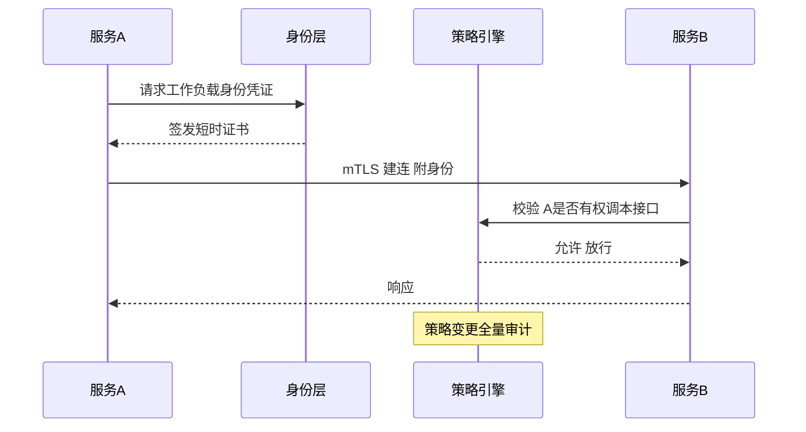
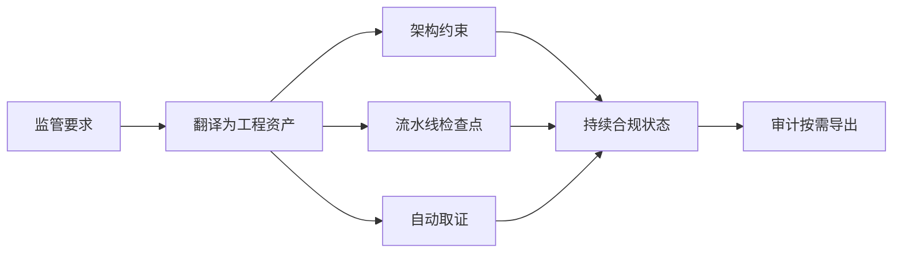
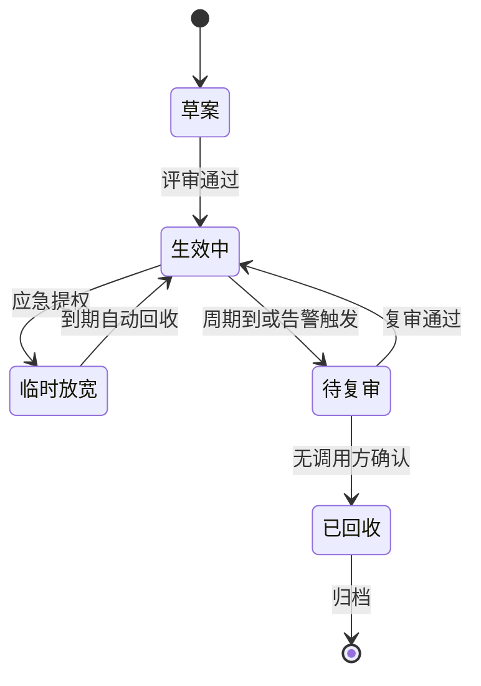

# 安全与合规实战：大规模架构的安全纵深与合规落地

> 规模上去之后，安全问题的性质变了：漏洞影响面从「一个服务」变成「全站」，一次数据泄露的代价从「修复」变成「监管处罚加信任崩塌」。本篇讲大规模架构下的安全纵深怎么设计：零信任怎么落地、数据安全怎么分级、审计怎么成为机制而不是文档——每个决策给代价与边界。

## 一句话摘要

大规模架构的安全 = 零信任的接入面收敛 + 数据安全的分级管控 + 全链路可审计——安全不是一层墙，是一条纵深，攻击者突破任意一层都还有下一层在等它。

## 🎯 本文核心

1. **零信任的本质是「不再有内网可信区」**——服务间调用一样要认证授权，边界从「网络位置」迁移到「身份」。
2. **数据安全的核心动作是分级**——不分级的全量加密等于没有加密：贵、慢、且没人遵守。
3. **合规是工程问题不是法务问题**——等保、个保的要求要翻译成架构约束与流水线检查点，才能持续达标。
4. **安全的量级分档**：10 万 QPS 以内靠规范与扫描，千万级靠纵深与自动化，亿级靠零信任全覆盖与安全基建平台化。

## 一、不同量级的思考：约束驱动的安全投入

10 万 QPS 以下，安全事件的影响半径通常是一个应用；千万级日订单的体系里，一个越权漏洞可能扫过千万级用户数据；亿级流量平台的一次凭证泄露，可以在分钟级内被自动化利用放大成全站事故。量级不是数字标签，是约束的边界——每一档该投入什么、怎么思考，由当期的约束来源决定，解法不能跨档套用：

- **十万级（规范与扫描）**：约束来源是人力约束——安全人力个位数，攻击面以 Web 入口与凭据泄露为主，影响半径有限但「低垂果实」密集。这一档的核心问题是「基础卫生做没做」，而不是「买没买检测产品」。思考方式是「规范驱动」：凭证轮换、权限基线、依赖扫描、年度渗透测试，把行业规范翻译成流水线检查点，就拿到这一档八成的安全效果
- **百万级（东西向浮现）**：约束来源是服务拓扑约束——服务数量到几百个，东西向调用成网，网络分区的信任边界开始失效，横向移动路径指数增长。这一档的核心问题是「横向移动有没有被拦住」，而不是「入口防护够不够强」。思考方式是「检测驱动」：审计与异常检测先行，把「被攻破后多久被发现」从天级压到小时级，检测覆盖优先于阻断强度
- **千万级（纵深与自动化）**：约束来源是数据量级约束——一次越权能触及的数据规模进入千万级，单点突破的期望损失发生质变，同时攻击自动化让人工响应速度彻底跟不上。这一档的核心问题是「纵深与自动化成没成型」，而不是「又补了几个洞」。思考方式是「架构驱动」：零信任覆盖东西向、打标进建表流程、检测响应编排自动化——安全从「一批动作」演进成「一组基建」
- **亿级（平台化与常态化对抗）**：约束来源是对抗强度约束——攻击方同样完成了自动化与平台化演进，防线从静态配置变成持续对抗的过程，单次演练的结论半年就过期。这一档的核心问题是「防线是否保持真实」，而不是「部署了多少控制」。思考方式是「对抗驱动」：红蓝对抗节奏化、常态化轻量注入、安全能力平台化沉淀，让每条业务线以自助方式获得安全水位

思考方式总结：十万级靠「规范兜底」，百万级靠「检测提速」，千万级靠「架构收口」，亿级靠「对抗保鲜」——每一档的约束来自不同的层面（人力/拓扑/数据/对抗），思考方式必须匹配约束来源。解法是思考的产物，不是产品清单的排列。

**自下而上与触发升级**：先测档位再选思考——暴露面数量、敏感数据级别分布、安全人力配比三个实测值决定你实际站在哪一档，不预支上一档的复杂度，也不滞留在下一档的侥幸里。触发升级的信号：服务数量翻倍进入东西向密网、新监管要求落地生效、一次未遂入侵的攻击路径超出当前档位的假设——任一信号出现，思考方式必须随档演进（规范驱动 → 检测驱动 → 架构驱动 → 对抗驱动）。锚点始终是约束来源：人力、拓扑、数据量、对抗强度这些底层约束变了，解法才跟着变——业务翻倍只是信号，约束迁移才是升级的依据。

## 二、核心决策一：零信任怎么落地

零信任的原则一句话：永不信任，始终验证。落地时它翻译成三个工程动作：

**第一，身份先行。** 人有人的身份（SSO + MFA），服务有服务的身份（工作负载身份或证书体系）。没有统一的身份层，零信任的一切都无从谈起。身份层的代价是所有调用多一次验证，吞吐敏感的内部链路用 mTLS 会话复用与本地鉴权缓存把成本压住。

**第二，授权下沉到调用。** 网络位置不再代表信任：同一个 VPC 里的服务 A 调服务 B，照样要过「这个服务身份是否有权调用这个接口」的检查。授权策略集中管理（策略引擎 + 各网关执行），变更可审计。

**第三，默认拒绝。** 新服务的默认状态是「没人能调我」，要通信先显式授权——这条和微服务的「默认开放」文化相反，推行时的阻力不是技术而是习惯。

**Trade-off**：零信任的代价是每一次调用的验证开销与策略管理的复杂度。10 万 QPS 以内可以只在南北向（外部入口）做零信任，东西向靠网络分区；千万级起东西向也必须纳入，否则横向移动（攻破一个点后在内网横扫）无法防御。

## 三、核心决策二：数据安全分级管控

数据分级是数据安全的第一动作，不分级就没有边界：

| 级别 | 定义 | 传输 | 存储 | 使用 | 示例 |
|---|---|---|---|---|---|
| L4 核心 | 泄露即重大资损/法律责任 | mTLS + 双向认证 | 加密 + 独立密钥 | 双人授权 + 全审计 | 支付凭证、身份信息 |
| L3 敏感 | 泄露造成用户伤害 | TLS 强制 | 加密 | 脱敏展示 + 审计 | 手机号、地址、交易明细 |
| L2 内部 | 泄露影响业务竞争 | TLS | 权限管控 | 登录可见 | 订单量、经营数据 |
| L1 公开 | 可对外 | TLS | 常规 | 无限制 | 商品信息、公开公告 |

分级之后的关键工程动作是「按级别自动施加控制」：字段打标进元数据，网关与 SDK 按标签自动脱敏、自动加密、自动审计——分级的价值在于让安全控制变成「数据属性驱动的默认行为」，而不是每个开发现场判断。

**边界**：分级的最大敌人是「打标不全」。新表建出来没人打标，默认按 L1 流转，泄露了才发现是 L4——所以打标必须进建表流程（不打标不允许上线），存量数据靠扫描工具补标。

## 四、核心决策三：合规怎么工程化

合规要求（等保、个保、行业监管）的落地失败模式是「法务给一张 checklist，工程照着做一次，审计前突击补材料」。可持续的做法是把每条合规要求翻译成三类工程资产：

1. **架构约束**：如「L4 数据不出境」翻译成存储路由约束与网关拦截规则。
2. **流水线检查点**：如「敏感数据不得进日志」翻译成 CI 静态扫描 + 日志网关脱敏校验。
3. **持续取证**：如「访问可追溯」由审计平台自动留存，审计时导出即证据——取证自动化让合规从「项目」变成「属性」。

## 五、参数级配置清单（安全纵深）

| 配置项 | 默认值 | 10万级推荐 | 千万级推荐 | 亿级推荐 | 为什么 |
|---|---|---|---|---|---|
| MFA 覆盖 | 管理员 | 全员后台 | 全员 + 变更二次确认 | 全员 + 风险自适应 | MFA 是性价比最高的防线，自适应（异地/新设备触发）平衡体验 |
| mTLS 覆盖 | 无 | 南北向 | 东西向核心链路 | 全量服务间 | 覆盖面决定横向移动的难度，全量覆盖才有零信任的实质 |
| 授权策略刷新 | 5 分钟 | 5 分钟 | 1 分钟 | 秒级推送 | 收权生效速度决定「误授权窗口」长度 |
| 密钥轮换周期 | 90 天 | 90 天 | 30-90 天 | 30 天 + 自动轮换 | 短轮换缩小密钥泄露的暴露窗口，自动化是短轮换的前提 |
| 敏感操作审计保留 | 180 天 | 180 天 | 1 年 | 3 年 | 合规与追溯窗口，按监管要求定下限 |
| 渗透测试频率 | 年度 | 年度 | 半年 | 半年 + 常态化众测 | 人工测试覆盖不了持续变化的攻击面，高频轻量测试补位 |
| 数据打标覆盖率 | 无 | 60% | 95% | 100% 强制 | 覆盖率不到 100% 就存在「无标裸奔」数据，强制是唯一可靠解 |

## 六、步骤级操作：一次安全整改的落地流程

前置条件：资产清单（服务、数据、密钥、权限）完成盘点，整改项按风险排序。

- Step 1 风险评估：按「暴露面 x 数据级别 x 利用难度」给风险排序。验证点：Top 20 风险有编号、owner、deadline。
- Step 2 纵深补强：优先补「检测类」控制（审计、告警）再补「阻断类」控制——检测先上让风险可见，阻断后上减少业务冲击。
- Step 3 权限收敛：按「最小权限」清理存量授权，先收回「明显过大」的（全表权限、超期授权）。验证点：收回后两周无业务故障，证明收敛没有误伤。
- Step 4 应急演练：注入一次凭证泄露场景，验证「检测发现 → 冻结凭证 → 影响面评估」全链路时效。验证点：从告警到冻结在 15 分钟内完成。
- Step 5 常态机制：扫描进流水线、打标进建表、审计自动留存。验证点：下季度审计不再需要「突击准备」。
- 回退：阻断类控制上线误伤业务时，先降级为「告警不阻断」模式观察，修正规则后再恢复阻断——安全控制的回退开关与稳定性的降级开关同等重要。

## 七、事故推演：一次越权扫描的复盘

某平台上线「按订单号查询」接口，订单号是连续自增——外部扫描器遍历订单号拉取他人订单，两小时后被风控的「单用户高频查询他人订单」规则拦下。复盘暴露三层问题：接口设计层，连续 ID 等于把数据地图交给攻击者，应改用不可枚举 ID + 归属校验双层防护；检测层，发现依赖风控规则的「巧合」，接口层没有自己的异常查询基线；流程层，接口上线评审没有数据级别判定环节——「这个接口能查到什么级别的数据」这个问题没人问过。整改动作全部机制化：新接口上线评审增加数据暴露面检查项、连续 ID 强制替换、查询类接口建立基线告警。安全的持续改进来自把每次事故翻译成流程检查点，而不是修补单个接口。

## 七点五、授权策略的生命周期管理

零信任体系运行日久后，最大的隐患不是策略缺失而是策略腐化：临时授权用完没人收、离职人员的权限留在服务账号里、策略之间的冲突没人发现。策略必须有生命周期，像代码一样被 review、被回收。

两个机制细节决定这个状态机是否真实运转：其一，「临时放宽」必须带 TTL，到期系统自动回收而不是提醒人去收——靠人记忆的权限回收必然失败；其二，「待复审」的触发条件里必须有「策略命中异常」（比如一条授权策略半年零调用），零调用的策略不是安全就是腐化，两种情况都该看一眼。

## 七点六、审计与红蓝对抗：让防线保持真实

审计回答「发生了什么」，红蓝对抗回答「防线还在不在」。两者的工程化程度决定安全体系的真实水位：

**审计的三层深度**：接入审计（谁在什么时候访问了什么——网关层自动留痕）、数据审计（敏感字段被谁读走——数据层水印与追踪）、行为审计（管理操作与变更——操作平台化自动记录）。三层缺一层，对应的攻击面就是盲区。

**红蓝对抗的节奏化**：年度大演练 + 季度小演练的组合。大演练验证纵深整体（从钓鱼入口到数据外带的全链路），小演练验证单点（新上的防护规则、新接入的服务）。红队的价值不在于「攻进来」这个结果，而在于攻击路径的报告——每条路径对应一列纵深缺口，转成整改项进跟踪表。

**边界**：红蓝对抗最大的失败模式是「为通过而演练」——蓝队提前知道时间窗口进入战备状态，演练变成了表演。可执行的对策是常态化轻量注入（不定时的钓鱼邮件、不定时的凭证泄露场景），让防护体系始终处于真实状态，大演练只做年度的全面体检。

## 八、四高自查与 Trade-off 总表

| 维度 | 本篇方案 | 代价 | 反方案 | 为什么不选 |
|---|---|---|---|---|
| 高可用 | 安全组件多活部署（策略引擎、身份层） | 成本翻倍 | 单点 + 快速恢复 | 身份层挂了全站不可用，必须多活 |
| 高并发 | 鉴权结果缓存 + 会话复用 | 收权延迟 | 每次调用实时鉴权 | 吞吐不可接受，用秒级收权延迟换 |
| 高一致 | 策略集中单源下发 | 下发链路复杂 | 各服务本地策略 | 本地策略必然漂移，审计不可信 |
| 高扩展 | 策略引擎水平扩展 | 依赖组件多 | 静态规则 | 动态授权是零信任核心，退不回去 |

## 九、你们可能会问

**问：零信任会不会把性能拖垮？** ——南北向全量 + 东西向缓存的混合模式实测开销在个位数百分比（行业认知），真正的成本在策略管理的人力。分阶段落地（先南北向后东西向、先核心链路后全量）让性能与人力成本都可控。

**问：合规这么多要求，工程团队怎么扛得住？** ——把合规翻译成自动化检查点之后，日常增量成本接近零；重的是「第一次翻译」。用「每次审计暴露的问题数」度量翻译质量，问题逐年下降说明翻译在生效。

**问：数据打标谁来打？业务团队没动力怎么办？** ——打标进建表模板与上线门禁，不打标不能上线——把安全动作嵌入已有流程，比另起一套流程有效得多。动力问题的答案是「没有动力，只有门禁」。

**问：已经用了云厂商的安全产品，还需要自建吗？** ——云产品解决通用问题（WAF、DDoS、主机安全），自建的是「业务专属层」：数据打标体系、业务风控规则、内部授权策略。通用买、专属建，边界清晰就不冲突。

**问：安全事件真发生时，第一动作是什么？** ——止血优先于定因：冻结凭证、切断扩散路径、保护证据，然后才是根因。秩序来自预案——「安全应急预案」与稳定性降级预案同等地位，平时演练，战时照做。

**问：安全体系的演进一般分几步？** ——回顾多个体系的成长路径（行业认知），大致三步：第一步是「卫生期」，把凭证管理、权限收敛、补丁基线这些基础卫生做扎实，这一步不性感但消灭的是最常被利用的低垂果实；第二步是「纵深期」，数据分级与零信任分阶段铺开，检测能力先行；第三步是「平台期」，安全能力沉淀为内部平台（策略引擎、打标体系、审计检索），安全团队从「做项目」转向「运营平台」。多数 organization 的真实状态卡在第一步与第二步之间——基础卫生没做完就想去买高级检测产品，钱花了效果有限。

**问：研发团队觉得安全是「找麻烦」，怎么破？** ——把安全动作藏进已有流程而不是新造流程：打标在建表模板里、扫描在流水线里、授权申请在工作流里。研发感知到的应该只是「流程里多了几个必填项」，而不是「安全又来立规矩」。安全体验做到无感，阻力自然消失；每一次让研发「专门为安全跑一趟」的流程设计，都在制造对立。

## 十、追问链与我的判断

追问一：安全投入的度在哪里？——按「资产价值 x 威胁概率」排期望损失，期望损失最高的 20% 场景覆盖掉就拿到 80% 的安全效果；追求零风险的组织会把预算烧在低概率场景，真正的漏洞反而在基础卫生（凭证管理、权限收敛）里。我的判断：基础卫生的优先级永远高于高级防御——它的底层机制是消灭攻击者的最短路径，产品再贵也替代不了。

追问二：为什么「检测」优先于「阻断」？——阻断的控制一旦误伤，业务损失立竿见影，组织会对安全团队失去信任；检测先行让组织看到风险的真实频率，再决定哪里值得阻断。信任是安全团队最贵的资产，要花在前面。

## 十一、常见误区

- **误区一：上了等保就是安全**。合规是底线不是上限，通过等保的系统照样被攻破的案例公开可查。合规达标 + 威胁驱动的持续改进才是完整答案。
- **误区二：加密了就安全**。密钥管理和密文旁路（解密后的日志、缓存）才是薄弱点——加密的价值取决于密钥体系，不在算法本身。
- **误区三：内网是安全的**。横向移动是真实攻击路径，网络位置不构成信任——这正是零信任要纠正的核心认知。

## 💡 实战提示

- 💡 **先收权，再上新**：权限收敛永远优先于新防护产品采购——超期授权是最常被利用的入口，而且修复成本几乎为零。
- 💡 **策略变更走灰度**：授权策略全量下发前先对单个服务灰度验证，一条错误策略可以切断全站调用，它和代码变更一样需要灰度。
- 💡 **给审计日志单独设告警**：审计系统自身被关停或清空是最危险的信号之一，审计链路的自保（只追加、独立存储、异常告警）要先行。
- 💡 **连续 ID 是免费情报**：对外暴露的连续自增 ID 不只是越权风险，还向攻击者直播了你的业务量级——不可枚举 ID 是低成本高收益的改造。

## 十二、自测三问

1. 你的体系里，一个服务被攻破后攻击者能横向移动到哪？有哪些层在拦？
2. 任取一张核心表，你能立刻说出它的数据级别与对应的管控措施吗？
3. 最近一次审计准备花了多少人力？如果答案是「突击一周」，翻译成工程资产欠了多少？

## 十三、5W 速记卡

| W | 内容 |
|---|---|
| What | 零信任 + 数据分级 + 合规工程化的安全纵深 |
| Why | 规模放大风险非线性，人盯防线在亿级失效 |
| When | 千万级日订单起东西向零信任必须启动；打标在建表流程强制 |
| Who | 安全团队建平台与策略，业务团队守门禁与基线 |
| Where | 南北向入口、东西向服务间、数据全生命周期、审计留存 |

## 十四、开放问题

1. 供应链安全（第三方依赖的投毒）目前业界只有缓解没有根治，SBOM + 持续监控能走多远？
2. 隐私计算（联邦学习、多方安全计算）在合规驱动下会不会成为数据协作的默认形态，还是始终停留在特定行业？
3. AI 生成的钓鱼攻击让「人是最薄弱环节」更加成立，安全意识培训的投入产出比怎么度量？

## 🎯 核心带走

- **核心一句话**：安全是纵深不是墙——零信任收敛边界、数据分级驱动管控、合规工程化持续达标。
- **三个落地锚点**：身份先行、打标进流程、检测先于阻断。
- **量级分档**：10 万 QPS 规范扫描、千万级纵深自动化、亿级零信任全覆盖。
- **哪里会坏**：打标不全、策略漂移、审计靠人、阻断误伤烧掉组织信任。
- **最小动作**：本周就能做的三件——凭证轮换检查、存量超期授权清理、新接口评审加数据暴露面检查项。

## 📌 数据与事实声明

- 写于 2026-09-15；零信任、数据分级、合规工程化为行业公开实践的教学归纳（行业认知）
- 量化数字（性能开销、测试频率）为行业认知口径，落地前按自身体系实测校准
- 事故案例为公开技术社区高频案例模式的匿名化复述，非特定公司事件

## 📚 参考资料

| 类型 | 标题 | 来源 |
|---|---|---|
| 标准 | 网络安全等级保护基本要求 | 国家标准公开文本 |
| 标准 | 个人信息安全规范 | 国家标准公开文本 |
| 方法论 | NIST Zero Trust Architecture | nist.gov |
| 书 | 《数据密集型应用系统设计》安全相关章节 | 公开出版 |
