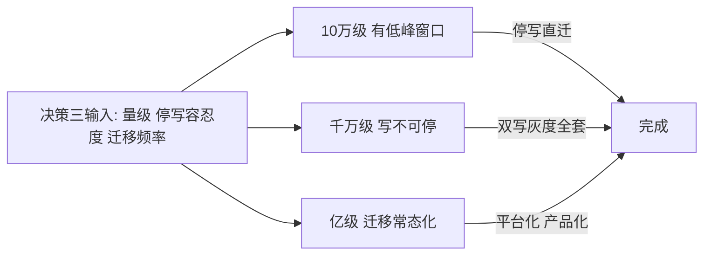
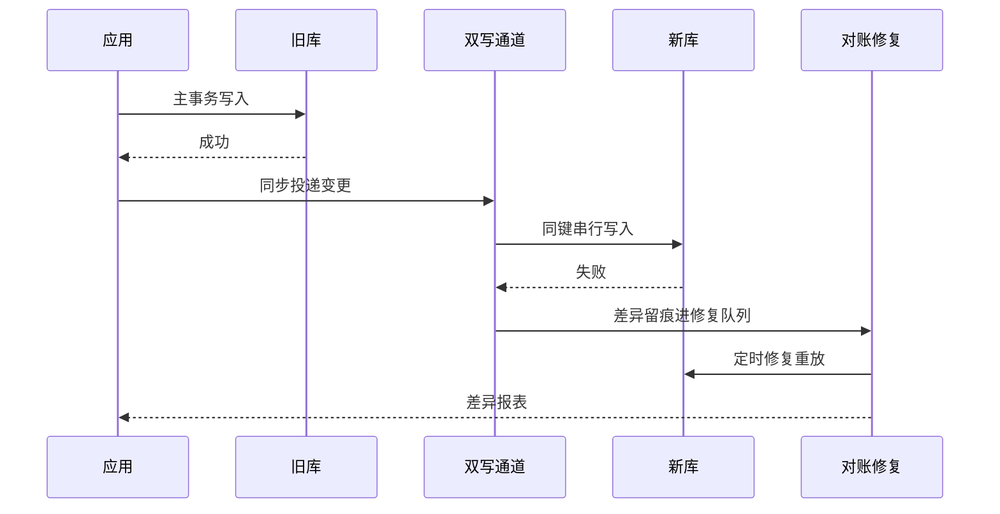
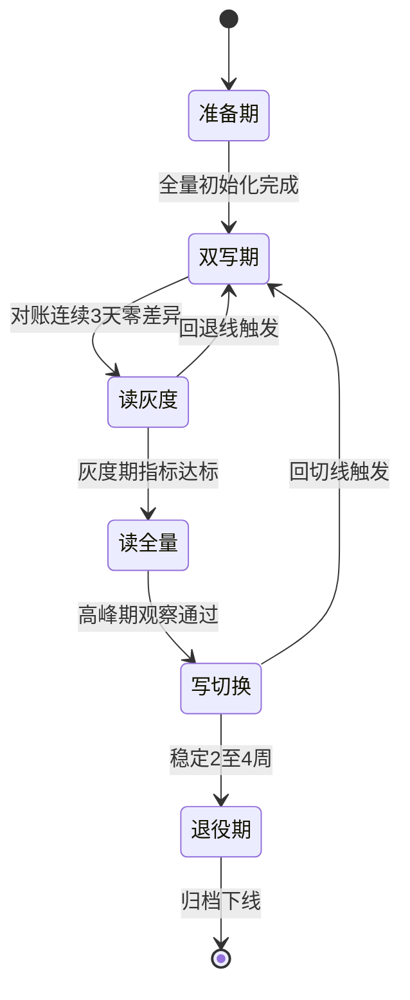
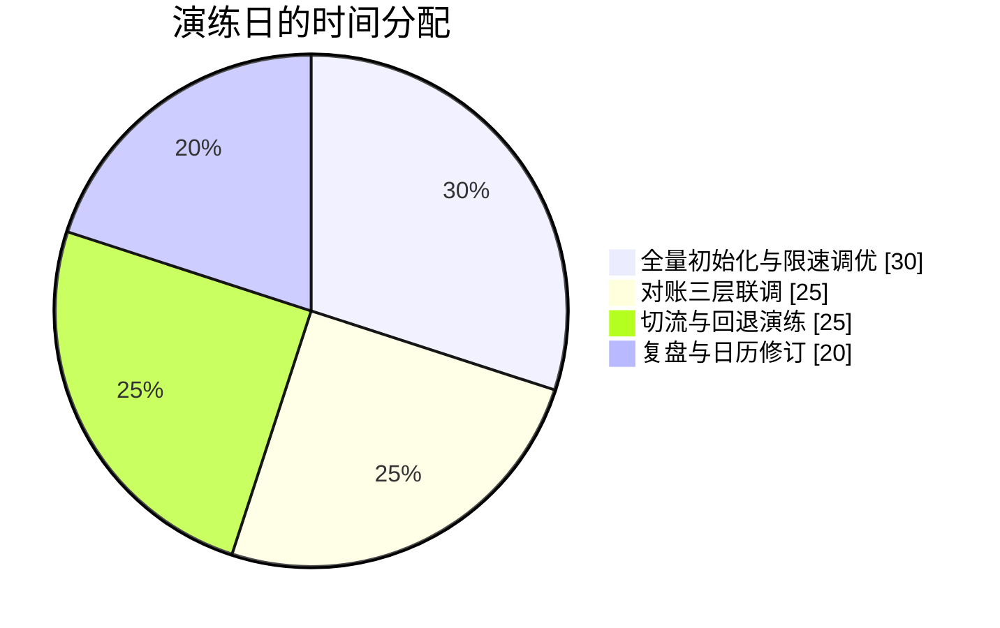

# 数据迁移与不停机切换：从 day-0 到退役的作战日历

> 数据迁移的本质不是搬数据，是管理风险：业务在跑、数据在变、旧系统不能停、新系统要接管。本篇把一次完整迁移拆成 day-0 到 day-N 的作战日历：每个阶段做什么、参数怎么配、出事怎么退、对账系统怎么建——迁移不是项目，是一次「新旧系统共存期的精细化运营」。

## 一句话摘要

不停机迁移 = 双写建立共存 + 全量增量补齐 + 对账建立信任 + 灰度切流验证 + 老库优雅退役——五个阶段各有一套参数与回退线，迁移的风险管理本质是「让每一步都可退、可验、可观察」。

## 本文核心

1. **双写不是方案是基建**——它是唯一让回退变成「一条开关」的机制，从 day-0 开始建，保留到最后一刻。
2. **对账系统是迁移的心脏**——切流的胆量来自对账的零差异记录，对账不准等于盲切；迁移结束对账能力沉淀为常设资产。
3. **切流顺序永远「先读后写」**——读出问题可以秒回，写出问题的恢复成本高一个量级；读全量到写切换之间放最长的观察窗。
4. **量级分档**：10 万级允许停窗直迁，千万级必须双写灰度全套，亿级迁移平台化（切流、对账、回滚全部产品化，迁移变成可反复执行的日常动作）。

## 一、量级前提：迁移策略由量级与容忍度决定

10 万级业务如果凌晨有 30 分钟低峰，停写直迁（停写 → 导数 → 校验 → 切读切写 → 恢复）是最便宜方案，双写那一整套在这个量级是过度工程。千万级日订单业务写不断，双写 + 对账 + 灰度成为唯一正解。亿级体系不会有「一次性迁移」——扩容翻倍、机房搬迁、单元化轮番上演，迁移能力必须平台化，让每次迁移从「项目」降级为「操作」：

## 二、核心决策一：双写怎么设计才不引入新问题

双写听起来简单（写旧库同时写新库），工程上有四个必答题：

1. **同步还是异步？** 同步双写（一个事务里写两个库）一致性强但新库故障会拖垮主链路；异步双写（主库成功后投递到新库）主链路无感但存在窗口期不一致。主流选择：迁移期同步双写（迁移优先级压倒性能），稳定后切异步。
2. **写失败怎么处理？** 旧库成功新库失败：记录差异进对账修复队列，不能阻塞主链路也不能静默丢弃——「失败必留痕」是双写的铁律。
3. **新库数据会不会被旧逻辑污染？** 双写期新库必须对外只读（只接收双写流量），任何新逻辑提前写新库都会破坏对账基线。
4. **双写的顺序敏感吗？** 同一行连续两次更新，到达新库的顺序必须与旧库一致——按主键哈希的并行投递要保证同键串行，版本号仲裁兜底乱序。

**Trade-off**：双写的代价是写放大（每次写变两次）与代码侵入（应用层要感知双写开关）。用「数据同步中间件接管双写」（应用只写旧库，中间件订阅 binlog 同步新库）可以消除代码侵入，代价是多一跳延迟——写入量不大的迁移选中间件方案，写敏感的选应用层双写。

## 三、核心决策二：对账系统怎么建

对账系统三层递进，每层回答一个不同的问题：

| 层级 | 回答的问题 | 手段 | 频率 |
|---|---|---|---|
| 计数对账 | 数据量对不对得上 | 分表分小时计数比对 | 分钟级 |
| 字段对账 | 具体行内容一致吗 | 抽样行全字段比对 + checksum | 小时级 |
| 业务对账 | 业务语义对不对 | 资金类逐笔勾稽（订单-支付-退款三角验证） | 准实时 |

计数对账最快发现「丢数据」，字段对账发现「数据错了」，业务对账发现「数据对但业务状态错」（比如订单状态与支付流水矛盾）——三层缺一层，对应类型的错误就会流到切流之后才爆。**迁移期的对账必须是准实时或小时级**，天级对账在迁移场景等于没有：差异暴露每多一天，修复窗口的变更堆积就多一天。

## 四、核心决策三：切流的节奏与回退线

切流按「读灰度 → 读全量 → 写切换 → 老库退役」四阶段推进，每阶段有明确的进入条件与回退线：

回退线必须是数字而不是感觉：「读错误率高于基线 0.5%」「对账差异率高于万分之一」「新库主从延迟超过 5 秒」——任何一条命中，执行反向切流。回退演练要在读灰度前做一次：验证「回退开关真的能关、回退后老链路真的正常」——没有演练过的回退预案是心理安慰。

**为什么「读全量到写切换」之间放最长观察窗**：读全量之后回退成本陡增（读全量意味着旧库读路径已下线一半），这是最后一次低风险观察机会——至少覆盖一个完整业务高峰加一个平峰，观察新库在两种流量形态下的表现。

## 五、参数级配置清单（迁移作战）

| 配置项 | 默认值 | 10万级推荐 | 千万级推荐 | 亿级推荐 | 为什么 |
|---|---|---|---|---|---|
| 双写模式 | 关 | 迁移期同步 | 迁移期同步 | 同步转异步分阶段 | 同步保一致，亿级用「先同步后异步」平衡窗口期与性能 |
| 对账频率 | 天 | 小时 | 15 分钟 | 5 分钟 + 准实时流对账 | 对账频率决定不一致暴露窗口 |
| 全量初始化限速 | 全速 | 全速 | 限速（避开高峰） | 限速 + 分片错峰 | 全量导数会打爆源库 IO，千万级必须限速 |
| 切流步长 | — | 10% | 5% | 1% 起步 | 步长越小爆炸半径越小，观察成本相应上升 |
| 每批观察时长 | 1 小时 | 1 小时 | 一个高峰 | 24 小时含高峰 | 观察必须覆盖流量形态差异 |
| 回退线 | 无 | 错误率 1% | 差异率 0.01% | 差异率 0.001% | 数字化的回退线写进预案，临场不讨论 |
| 老库保留期 | 30 天 | 30 天 | 90 天 | 180 天 | 老库是最后的回退手段，保留期按恢复成本定 |
| 位点保留 | 7 天 | 7 天 | 7 天 + 监控 | 7 天 + 双活存储 | 位点是增量同步的生命线，丢失等于重新全量 |

## 六、步骤级操作：迁移作战日历（day-0 到 day-N）

前置条件：新旧库 schema 评审通过、容量压测达标、回退预案演练过、对账系统三层全通。

- Step 1（day-0）双写开启：应用层或同步中间件开始双写，新库只读。验证点：双写成功率与新库写入延迟达标，差异留痕机制工作。
- Step 2（day-1 到 day-3）全量初始化：源库快照导入新库（限速避开高峰），完成后增量从位点接管。验证点：全量计数对账一致，增量追平位点。
- Step 3（day-3 到 day-10）对账观察期：三层对账全量运行，目标是连续 3 天零差异。验证点：差异修复闭环时效（发现到修复）低于 1 小时。
- Step 4（day-10 起）读灰度：1% - 5% - 25% - 100% 四批切读，每批观察一个高峰。验证点：每批的读 P99、错误率与老库持平；回退线待命。
- Step 5（读全量稳定一周后）写切换：写流量切新库，双写反转为「主写新库异步补旧库」。验证点：写入成功率、主从延迟、对账依然零差异。
- Step 6（写切换稳定 2-4 周后）退役：老库转只读，保留期满后归档下线。验证点：归档可查可恢复，下线评审通过。
- 回退：读灰度与读全量阶段，一条开关回切老库；写切换阶段回切要「先切写回老库，再处理新库期间的增量」——写切换后的回退成本显著上升，这就是写切换前要最长观察窗的原因。

## 六点五、迁移演练日：把作战日历预演一遍

作战日历写得再细，没预演过就等于没写。成熟的迁移专项会在 day-0 之前安排一次「迁移演练日」：预发环境按生产 1:10 数据量，把全量初始化、对账、切读、回退完整跑一遍。

演练日最高价值的产出通常在复盘段：限速参数在生产量级下是否合理、对账的抽样规则会不会漏掉大表、回退开关从触发到生效的真实耗时——这三个问题的答案会直接改写作战日历的参数。演练暴露的问题数量与迁移质量正相关：演练日一个问题都没暴露，多数说明演练规模不够（数据量太小、链路不全），而不是方案完美——对这种「完美演练」要保持怀疑，把数据量加到生产的一比一再跑一次。

## 七、事故推演：一次差点翻车的写切换

某迁移项目读全量稳定一周后执行写切换，切换 20 分钟后对账报出持续增长的字段差异——排查发现新库的一批「状态更新」被旧库的延迟同步覆盖：双写通道对「同一行的快速连续更新」做了按主键哈希并行，但两个更新的投递跨越了通道重连，顺序颠倒，旧值覆盖了新值。按预案触发回切，写流量切回老库，通道重放修复差异，一小时后恢复。复盘的两个教训：版本号仲裁不该是「兜底」而应该是「默认开启」——乱序不是异常是常态，重连、重试、并行都会制造乱序；写切换的观察窗里必须盯着「差异率曲线的斜率」而不只是绝对值——差异持续增长（斜率为正）与差异固定（历史残留）是两种完全不同性质的信号，前者立即回退，后者可以观察修复。这次之后，「斜率告警」成了所有切流预案的标准配置。

## 八、四高自查与 Trade-off 总表

| 维度 | 本篇方案 | 代价 | 反方案 | 为什么不选 |
|---|---|---|---|---|
| 高可用 | 双写 + 数字化回退线 | 写放大与侵入 | 停机迁移 | 千万级以上停机成本不可接受 |
| 高并发 | 切流分批 + 限速导数 | 迁移周期拉长 | 一次性全量切换 | 爆炸半径不可控 |
| 高一致 | 三层对账 + 版本仲裁 | 对账建设成本 | 只做计数对账 | 字段级与业务级错误会流到切流后 |
| 高扩展 | 迁移平台化沉淀 | 平台研发投入 | 每次迁移临时建 | 亿级迁移常态化，临时方案无法复用 |

## 九、你们可能会问

**问：业务代码不想感知双写，有没有无侵入方案？** ——有：binlog 订阅类同步中间件让应用只写旧库，同步链路自动把变更投递到新库。无侵入的代价是秒级延迟与中间件自身的运维成本，适合写入量适中、schema 变化不频繁的场景。写入量极大或需要严格同步一致的迁移，应用层双写仍然是最可控的选择——两种方案的边界在「延迟窗口对业务对账的影响」。

**问：迁移期间 schema 要变怎么办？** ——迁移期的第一纪律是 schema 冻结：新旧库结构差异在 day-0 之前全部评审完，迁移期内的结构变更一律推迟到迁移完成后。如果业务必须变更，把变更放到「双写 + 对账」都能覆盖的范围内（新增可空字段），涉及结构调整的（改类型、拆字段）一律推迟——迁移期的 schema 变更会让对账基线失效，等于在高速换轮胎时换备胎的规格。

**问：怎么向业务方解释迁移的风险与时间表？** ——用三个数字：业务无感知承诺（读灰度起业务零感知）、最坏情况的恢复时间（任何阶段回退的最长时长，演练得出）、对业务的唯一要求（迁移期 schema 冻结）。业务方关心的不是技术方案是「我需要配合什么、最坏会怎样」——三个数字回答完，迁移就拿到了业务的授权。

**问：迁移结束后这套能力怎么处理？** ——拆开看：双写开关与迁移代码，随老库退役一起清理；对账系统，沉淀为常设数据质量资产（迁移外的日常对账继续用）；切流平台与回退预案模板，进平台资产库供下一次迁移复用。迁移的隐性收益就是这套能力的沉淀——下一次迁移的成本应该比这一次低一半，否则说明这次没有做好沉淀。
**问：迁移方法论这些年有什么演进？** ——过去 5 年的演进主线是「项目能力平台化」：2019 年前后行业里的迁移还是「专项作战」（临时工具、人盯对账、口头回退线）；2022 年前后云厂商与头部公司的迁移产品（DTS 类）成熟，全量增量同步与数据校验成为开箱能力；2025 年以来，分布式数据库的原生在线扩缩容开始吞掉一部分「存储层迁移」的需求。演变的方向对实践者的含义是：同步与校验的「苦力环节」会持续被工具替代，但「切流决策、回退线设计、对账口径定义」这些判断型工作永远是人的——工具吃掉劳动，方法论沉淀判断。

## 十、追问链与我的判断

追问一：迁移里最容易低估的环节是什么？——我的判断是「历史脏数据」。全量初始化跑得通的前提是源数据质量过关：空值、超长、枚举外的脏值在导入时集中爆雷。_day-0 之前加一次「数据体检」（对源数据跑新库的约束校验），把脏数据问题暴露在迁移前而不是导数夜——数据体检的成本只有几小时的脚本，跳过它的事故成本是几个通宵。

追问二：为什么对账能力要常设而不是迁移专用？——因为不一致不是迁移期专属问题：日常的缓存穿透、消息丢失、代码 bug 都会制造数据不一致，只是迁移期把它们集中放大了。迁移是建对账系统的最佳时机（有明确的差异源可以做校准），迁移后这套系统继续回答「数据到底对不对」——数据质量的可观测，和数据面的大盘一样，是长期资产。

## 十一、常见误区

- **误区一：双写等于一致性**。双写只是「有两条写入路径」，一致性靠对账与修复闭环保障——把双写当成一致性本身，是迁移事故的思想根源。
- **误区二：切流越快越好**。压缩观察期省下的几天，会以「切完之后一个月内的暗雷」形式还回来——迁移周期里的观察期不是等待是验证，省不得。
- **误区三：老库可以尽快下线省成本**。老库保留期的存储成本是最便宜的保险——退役后才发现要回查历史数据（纠纷、审计、bug 修复），从归档恢复的成本是保留成本的几十倍。

## 💡 实战提示

- 💡 **先建对账再开双写**：对账系统没上线就开双写，等于蒙眼开车——先让「看得见差异」的能力就位，再制造差异。
- 💡 **回退开关每周点一次**：迁移周期内每周演练一次回退开关（灰度 1% 回退），保证它到关键时刻真的能动——回退能力是肌肉记忆不是文档。
- 💡 **给差异率曲线配斜率告警**：绝对值告警会漏掉「从零开始缓慢增长」的新问题，斜率比绝对值更早暴露「正在发生的错误」。
- 💡 **迁移文档按「天」组织**：day-0 做什么、day-1 到 day-3 做什么——按时间线写的 runbook 比按技术组件写的更容易在高压时执行。

## 十二、自测三问

1. 如果现在要求你的系统做一次存储迁移，双写与对账能力要多久能就位？
2. 你的回退线是数字还是感觉？最近一次演练回退是什么时候？
3. 迁移期间源库出现 schema 变更需求，你的流程里谁来拦？

## 十三、5W 速记卡

| W | 内容 |
|---|---|
| What | 双写 + 对账 + 灰度切流 + 优雅退役的迁移作战体系 |
| Why | 写不可停、数据在变、旧系统不能停——迁移的本质是风险管理 |
| When | 千万级必须双写全套；亿级迁移平台化常态化 |
| Who | 迁移专项组推进，业务方守 schema 冻结，值班盯回退线 |
| Where | 双写通道、对账平台、切流开关、老库归档 |

## 十四、开放问题

1. 数据库厂商原生的高可用切换能力（如分布式数据库的在线扩容）成熟后，「应用层迁移方法论」会不会被基础设施层吞掉？
2. 跨异构引擎迁移（MySQL 到 NewSQL）的语义差异（事务边界、隔离级别）怎么系统性验证而不是逐个踩坑？
3. 迁移平台与数据中台的关系——对账与切流能力最终会长成数据基础设施的一部分吗？

## 核心带走

- **核心一句话**：迁移是共存期的精细化运营——双写建共存、对账建信任、灰度控风险、退役要优雅。
- **三个落地锚点**：双写失败必留痕、回退线写成数字、观察期覆盖双峰。
- **量级分档**：10 万级停窗直迁、千万级双写灰度全套、亿级平台化常态化。
- **哪里会坏**：对账不准盲切、乱序覆盖新值、schema 迁移期变更、老库退役太早。
- **最小动作**：本周就能做的三件——给核心表跑一次数据体检、把回退线写成数字进预案、评估对账系统三层覆盖情况。

## 📌 数据与事实声明

- 写于 2026-09-15；双写、对账、灰度切流为行业公开实践的教学归纳（行业认知）
- 量化参数（对账频率、回退线、保留期）为行业认知口径，按自身业务校准
- 事故案例为公开技术社区高频案例模式的匿名化复述

## 📚 参考资料

| 类型 | 标题 | 来源 |
|---|---|---|
| 书 | 《数据密集型应用系统设计》迁移与一致性章节 | 公开出版 |
| 行业实践 | 各大厂不停机迁移公开分享 | 公开报道 |
| 官方文档 | ShardingSphere 数据迁移指南 | shardingsphere.apache.org |
| 官方文档 | Gh OST 类在线变更工具文档 | 开源项目文档 |
