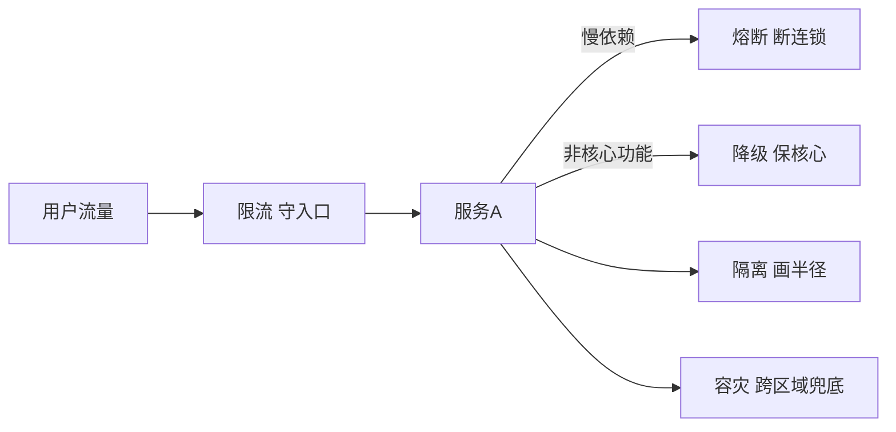
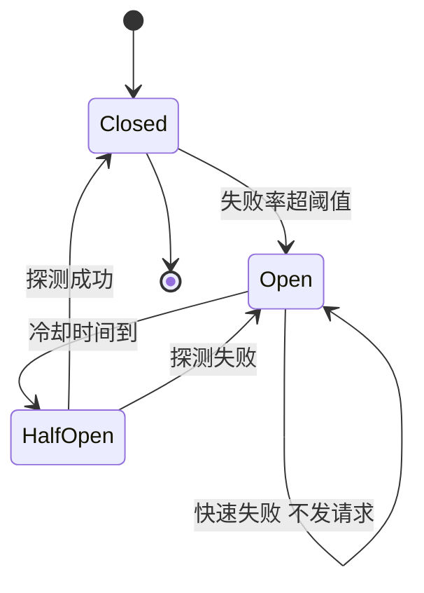
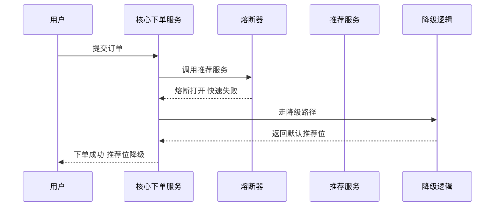
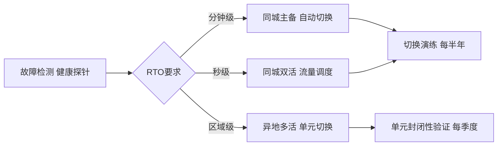

# 稳定性武器库：限流降级熔断隔离容灾的工具箱与选配逻辑

> 稳定性不是靠一次架构评审换来的，是靠一柜子武器加上「什么时候开哪一枪」的纪律：限流守入口、熔断断连锁、降级保核心、隔离画半径、容灾兜底跨区域。本篇讲大规模架构的稳定性武器箱——每件武器拦什么、代价是什么、按什么逻辑选配，以及 SLI/SLO/SLA 三件套与错误预算怎么成为武器的开火授权、故障演练与混沌工程怎么给武器做实弹校验。

## 一句话摘要

大规模架构的稳定性 = SLO 定水位 + 武器箱控半径——限流/熔断/降级/隔离/容灾五件武器不是并列选项，是按「故障传播方向」层层布防的纵深：入口限流、依赖熔断、核心降级、单元隔离、区域容灾，每件武器对应传播链上的一环。

## 🎯 本文核心

1. **稳定性的本质是控制爆炸半径**——故障无法消灭，能设计的是「一个故障能炸多大一圈」；武器箱的全部逻辑都围绕这条传播链展开。
2. **熔断和降级是两件事**——熔断保护「自己不被下游拖死」，降级保护「核心体验不被非核心拖死」；只配熔断不配降级，熔断触发后用户看到的是报错而不是备用路径。
3. **错误预算是武器的开火授权**——SLO 富余时敢于变更与实验，预算烧穿时自动收紧发布与演练节奏；没有错误预算，稳定性策略永远在拍脑袋。
4. **武器库不是越大越好**——十万级靠「发现得快」，百万级靠「隔得开」，千万级靠「切得小」，亿级靠「验证得勤」；选配逻辑比武器清单值钱。

## 一、不同量级的思考：约束驱动的武器选配

稳定性建设的常见误区是把大厂武器清单整个搬回家——武器是约束的产物，量级不同，约束来源完全不同，解法不能跨档套用：

- **十万级（单体与少量服务）**：约束来源是架构复杂度约束——服务少，故障模式以单点宕机为主，传播链短。这一档的核心问题是「故障能不能被发现」，而不是「武器箱全不全」。思考方式是「监控驱动」：健康检查、自动重启、备份恢复加基础告警，先把可见性补齐——武器不解决看不见的问题，发现得快已经能挡掉这一档八成的事故
- **百万级（服务化初中期）**：约束来源是调用链复杂度约束——服务间依赖成网，一个慢依赖拖垮整条链路的雪崩开始出现，故障从「点」变成「链」。这一档的核心问题是「雪崩有没有被隔断」，而不是「单点有没有冗余」。思考方式是「依赖驱动」：超时、重试、熔断三件套沿依赖方向逐条配齐，慢依赖必须在它拖死别人之前被切断
- **千万级（大规模服务化）**：约束来源是流量与变更频率约束——大促脉冲流量常态化，变更频率乘以故障半径的乘积变大，任何单件武器都罩不住全部场景。这一档的核心问题是「爆炸半径画出来了没有」，而不是「扛不扛得住峰值」。思考方式是「半径驱动」：限流按入口分级、降级按功能分级、隔离按业务分舱、容灾按单元切换，把故障切到最小的圈内
- **亿级（多活与常态化混沌）**：约束来源是物理与组织约束——同城双活到异地多活跨过物理边界，稳定性从技术问题演进成组织问题，方案在纸面上的完整性与实战水位是两回事。这一档的核心问题是「体系有没有被持续验证」，而不是「方案画得多完整」。思考方式是「演练驱动」：混沌工程常态化，故障注入按季度扫过核心链路，把「假设能扛」变成「验证过能扛」

思考方式总结：十万级靠「发现得快」，百万级靠「隔得开」，千万级靠「切得小」，亿级靠「验证得勤」——每一档的约束来自不同的层面（复杂度/依赖链/流量变更/物理组织），思考方式必须匹配约束来源。武器是思考的产物，不是清单的搬运。

**自下而上与触发升级**：先测档位再选思考——服务数量、核心链路依赖深度、大促峰值与日常峰值之比三个实测值决定你实际站在哪一档，不预支上一档的复杂度，也不滞留在下一档的侥幸里。触发升级的信号：依赖图出现环形调用、出现过一次跨服务雪崩、峰值与日常流量之比超过五倍——任一信号出现，思考方式必须随档演进（监控驱动 → 依赖驱动 → 半径驱动 → 演练驱动）。锚点始终是约束来源：依赖拓扑、流量形态、物理边界这些底层约束变了，武器选配才跟着变——业务翻倍只是信号，约束迁移才是升级的依据。

## 二、武器库全景：五件武器各拦什么

五件武器沿故障传播链各守一环，先看全景再逐件拆：

- **限流**：拒绝超出容量的流量，保护自己——它解决「流量比容量大」的问题，是唯一「主动拒绝用户」的武器，所以放行策略必须与业务对齐
- **熔断**：切断对不健康下游的调用，保护自己不被拖死——它解决「依赖故障沿调用链传播」的问题
- **降级**：牺牲非核心保核心，保护核心体验——它解决「资源不够时先保谁」的问题，是有损服务
- **隔离**：把资源切舱，限制故障在舱内——它解决「一个业务把共享资源吃光」的问题，是空间上的防爆墙
- **容灾**：跨机房跨地域冗余与切换，兜底区域性灾难——它解决「整个机房不可用」的问题，是武器库中最贵的一件

## 三、核心决策一：限流——在哪里限、限谁、限多少

限流的算法选型反而不是最难的：令牌桶应对突发、漏桶整流、并发数限流保护慢资源、自适应限流（按负载指标动态调阈值）兜底未知场景。真正难的是三个策略问题：

**第一，在哪一层限。** 入口网关做粗粒度总量限流，服务内部做细粒度的接口级与用户级限流——两层都要有，网关层防洪水，服务层防穿透。追问：只在网关限行不行？——不行，网关看不到服务内部的容量差异：同一个入口下来，核心接口能扛一万 QPS，报表导出只能扛两百，网关层一刀切要么浪费容量要么漏放洪水；再追问一层：那只在内服务限行不行？——也不行，下游限流时上游不知道，流量照样打过来占满连接，超时重试还会放大流量，所以两层是互补而不是二选一。

**第二，限谁。** 按重要性分级放行：核心交易流量与边缘浏览流量放在同一个桶里限流，等于把核心用户和爬虫排在同一优先级。按「用户 + 接口 + 业务域」三个维度打标，限流器按标记分流——这是把限流从「技术开关」变成「业务策略」的分水岭。

**第三，超了怎么办。** 被拒绝的流量要有去处：排队（削峰填谷）、降级页（告诉用户稍后再试）、还是直接拒绝——拒绝策略是产品决策，不是技术决策，必须提前和业务方对齐「被限流的是谁、他们看到什么」。

**反方案分析：为什么不选「只靠弹性扩容扛流量」？** 扩容解决的是「容量不足」，限流解决的是「流量失控」——两者的时间尺度差一个量级：故障传播以秒计，扩容以分钟计（拉起实例、预热、挂载流量，行业认知），扩容永远追不上雪崩；而且依赖故障引起的容量坍塌（数据库连接耗尽）扩容反而加重灾难。代价上，限流的成本是「误伤的体验」，扩容的成本是「真金白银的资源」——常态成本用限流控制，突发峰值才用扩容承接，两者是组合拳，取舍不是二选一。

## 四、核心决策二：熔断与降级——防雪崩的双保险

熔断器的设计哲学值得单独讲：**为什么这么设计成三态？** 直接调用的失败模式是每个请求都去撞故障的下游，等于用全量流量给下游做压力测试；彻底切断又让恢复后的下游接不到流量。三态机制把「什么时候断、什么时候试」变成状态机的自动演化——关闭态放行并统计失败率，失败率越阈值进入打开态直接快速失败，冷却期后进入半开态放少量探测请求，成功则关闭、失败则回打开态。半开态的底层原理是把「恢复探测」变成一个受控实验：用最小代价验证下游是否真的恢复。

但熔断只回答了「断了之后自己怎么办」，没回答「用户看到什么」——这就是降级的位置。两者的关系用一次调用时序看最清楚：

**设计取舍的关键在「谁配熔断、谁配降级」**：非核心读依赖（推荐、评论、积分）熔断加降级双配，用户无感；核心强一致依赖（库存扣减、支付扣款）不能自动熔断——断了订单就做不成，降级方案只能是「排队缓冲」或「人工开关切备用通道」。追问：熔断会不会误伤？——会，阈值太灵敏时下游只是轻微抖动就被切断，恢复探测又带来二次抖动；所以失败率阈值要按下游的常态错误率校准（常态错误率加数倍余量是行业认知的起点值），打开态的冷却期从指数退避起步，且熔断事件必须告警——熔断是异常状态，长期熔断说明容量规划有问题，不是熔断器在正常工作。

## 五、核心决策三：隔离与容灾——把爆炸半径画出来

隔离的设计思想借自船舶水密舱：船体必然进水，安全设计的目标是「进水只淹一舱」。工程上的舱壁有三层：线程池/连接池隔离（一个业务占满连接池不再可能）、实例隔离（核心与非核心业务分集群部署）、单元隔离（按用户分片路由到独立单元，故障只影响一个分片的用户）。隔离的共同代价是资源利用率下降——分舱之后每个舱都要预留余量，不能互相借力；规模小的体系分舱是浪费，规模大了分舱是保险，这就是量级分档的取舍。

容灾是武器库中最贵的一件，按恢复目标分层投入：

追问：为什么容灾不能一步到位上异地多活？——异地多活的成本不是「两倍的机器」：数据跨地域同步的延迟约束逼着你做单元化改造，业务上所有跨单元操作要重新设计一致性方案，组织上要有跨区域的切换指挥体系——这三项改造通常以年计（行业认知）。RTO/RPO 要求没到那个水位，把钱花在切换演练的熟练度上收益更高；替代方案是「同城双活加异地冷备」，用可接受的恢复时间换掉大部分改造代价——如果不做这个取舍，容灾预算会把业务预算整个吃掉。

## 六、SLO 三件套与错误预算：武器的开火授权

SLI/SLO/SLA 三件套不是文档作业，是武器系统的火控系统：

| 概念 | 定义 | 例子 | 谁消费 |
|---|---|---|---|
| SLI | 服务等级指标，可测量的信号 | 请求成功率、P99 延迟 | 监控系统 |
| SLO | 服务等级目标，SLI 的目标线 | 可用性 99.95%、P99 低于 300ms | 稳定性决策 |
| SLA | 服务等级协议，违约有后果 | 可用性低于承诺赔付 | 商务与客户 |

SLO 的定级有一条务实纪律：从真实基线出发而不是从愿望出发——当前 P99 是 400ms 就别定 100ms 的目标，天天烧穿的 SLO 会先耗尽机制的公信力；第一步定「现状加一成改善」，随架构优化逐年收紧。以 99.95% 可用性计，每月预算约 22 分钟全站不可用（公开口径的通行算法）——错误预算的花法对应三类决策：**变更决策**（预算充裕正常发布、烧穿自动冻结非核心变更，冻结机制必须预写「资损与安全修复豁免」通道，否则会在最需要发布时把修复也挡住）、**优先级决策**（预算烧得最快的链路自动上升为稳定性专项）、**容量决策**（预算消耗与容量水位联动，扩容论证省一半）。这个机制的设计思想是把「稳定与速度」的争论从人际冲突变成数据决策：不是开会拍板「这个月能不能发版」，是错误预算说话。

**边界**：SLO 定高了预算太薄，团队被冻结发布憋死；定低了预算太厚，稳定性形同虚设。校准锚点用历史数据回测——过去半年真实故障消耗的预算量就是合理水位，拍脑袋定的 99.99% 往往连历史水位都覆盖不了。

## 七、参数级配置清单（稳定性武器）

| 配置项 | 默认值 | 十万级推荐 | 千万级推荐 | 亿级推荐 | 为什么 |
|---|---|---|---|---|---|
| 读接口超时 | 3s | 1-3s | 500ms-1s | 按接口分级 200ms 起 | 超时是雪崩的第一道闸，越长放大越狠 |
| 重试次数 | 无 | 1 次 | 1 次 + 退避抖动 | 1 次 + 重试预算 | 重试是放大器，退避防踩踏 |
| 熔断失败率阈值 | 50% | 50% | 按常态错误率校准 | 校准 + 分接口 | 阈值要高于常态波动，低于故障水位 |
| 熔断冷却期 | 5s | 5s | 10-30s 指数退避 | 30s 起 + 手动干预 | 冷却太短反复试探，加剧抖动 |
| 入口限流阈值 | 无 | 峰值 1.2 倍 | 峰值 1.5 倍 + 用户级 | 多级 + 自适应 | 留余量吸收突发，用户级防单点刷量 |
| 核心与非核心部署 | 同集群 | 同集群 | 分集群 | 单元化分片 | 隔离档位随故障半径要求升级 |
| 演练频率 | 无 | 半年 | 月度故障演练 | 周度 + 常态混沌 | 武器不用等于没有，演练是实弹校准 |

## 八、步骤级操作：一次武器上线流程

前置条件：目标链路的容量评估完成（峰值 QPS、依赖拓扑、各环节容量水位），SLO 已定义且有历史数据锚点。

- Step 1 威胁建模：列出该链路「最可能的三个故障」（依赖变慢、流量翻倍、实例批次故障）。验证点：每个故障有明确的传播路径图。
- Step 2 影子运行：限流/熔断规则先以「只告警不生效」模式上线两周。验证点：告警日志中的「本应触发次数」与预期故障场景吻合，无误伤。
- Step 3 灰度生效：按单接口 → 单集群 → 全量的顺序推开，每步观察一个完整高峰。验证点：生效后核心指标（成功率、P99）无劣化。
- Step 4 实弹演练：注入对应故障（延迟下游、放大流量），验证武器按预期触发。验证点：故障注入下 SLO 不破，降级路径用户可感知但可接受。
- Step 5 机制固化：武器状态进监控大盘，触发事件进告警，预案文档与值班手册同步更新。验证点：值班同学不看代码能说清每件武器的当前状态。
- 回退：武器误伤时，生效开关一级回退（灰度范围先缩、再改阈值、最后关闭），影子模式保留继续观察——武器的回退开关必须和武器本身一起上线，这是铁律。

## 九、事故推演：三条复现的雪崩链

**其一，重试风暴。** 线上某下游服务抖动，错误率升到三成；上游全部调用按默认配置重试三次，下游收到的请求量瞬间放大约三倍（行业认知的典型放大区间），把「还能服务七成流量」的下游彻底压死，故障从抖动升级为不可用。排查时发现三件事全缺：超时没有按下游 P99 校准、重试没有退避与抖动、下游没有限流保护。修复动作是组合拳：上游配重试预算（重试流量不超过总量的百分之一量级，业内通行口径）、下游入口配限流、错误率异常自动告警。复盘的教训是：**重试是放大器不是保险丝**，每个重试配置都要问「下游最差的时候它在帮谁」。

**其二，缓存击穿连环雪崩。** 大促预热时一个热点 key 集中过期，瞬时数据库查询打满连接池，数据库变慢导致依赖它的所有服务线程池堆积，超时重试再加码，交易链路整体抖动。当时缓存层没有单飞（同一 key 的并发回源合并为一个），数据库层没有熔断。修复：热点 key 逻辑过期（永不过期加异步刷新）、回源单飞、数据库前置并发数限流，同链路补上「只读降级」预案——数据库不可达时交易用本地快照兜底。这次故障的底层机制是「共享资源无隔离」：所有服务共享一个数据库连接池上限，谁都能把它吃光。

**其三，导出功能拖垮交易。** 运营后台一个报表导出功能与核心交易接口部署在同批实例，一次大导出占满容器线程池，交易接口全部超时——用户看到的是「下单失败」，根因却在一公里外的报表。排查花了很久，因为没人怀疑「后台功能会影响线上交易」。修复分两层：立即层把导出改异步任务队列并限并发；机制层按业务域做实例隔离，后台功能与核心交易物理分家。这个事故的设计启示是：隔离不是性能优化，是把「谁可以伤害核心业务」这个问题用架构回答。

## 十、故障演练与混沌工程：武器的实弹打靶

武器箱里的东西不实弹打靶等于没有——这是演练存在的全部理由：

| 演练类型 | 场景 | 频率 | 验证什么 |
|---|---|---|---|
| 故障注入 | 杀实例/断网/延迟下游/磁盘打满 | 月度 | 武器按预期触发，恢复路径可用 |
| 容灾切换 | 主备切换/单元隔离 | 半年 | RTO/RPO 达标，切换指挥流程顺畅 |
| 混沌实验 | 随机注入 + 持续运行观察 | 常态化 | 未知的耦合与盲区 |
| 红蓝对抗 | 模拟大促流量与故障叠加 | 年度 | 体系级韧性与组织响应 |

**边界**：混沌工程最大的失败模式是「只在白天打已知的靶」——注入前先扩容、注入范围绕开核心链路，演练变成表演。可执行的纪律是：每次演练有明确的「假设验证」（我们假设熔断会在 10 秒内触发）、有影响面控制（一皿原则：随时可一键终止）、演练结论进改进项跟踪——没有改进项的演练是烟花。

## 十一、什么时候用/不用：选配决策与明确推荐

- **限流**：所有对外入口必配（明确推荐）——这是唯一确定要有的武器；内部非核心调用可以只告警不限流，避免过度设计。
- **熔断**：非核心依赖必配；核心强一致依赖（扣款、扣库存）不用自动熔断，用手动开关加排队缓冲——自动切断核心依赖的代价是订单失败，比雪崩更直接。
- **降级**：业务里「存在可牺牲功能」才配得起降级——纯交易系统没有降级空间，用限流与容灾兜底；内容型产品降级空间最大（推荐位、评论、画像都能关）。
- **隔离**：核心与非核心共享资源时必配；小规模体系（单集群、服务少于几十个）先靠部署纪律（后台不与交易混部），不必上单元化。
- **容灾**：由 RTO/RPO 驱动而不是由焦虑驱动——明确恢复目标，再选主备/双活/多活；十万级同城主备加可靠备份即可，亿级才需要异地多活的完整投入。

## 十二、四高自查与 Trade-off 总表

| 维度 | 本篇方案 | 代价 | 反方案 | 为什么不选 |
|---|---|---|---|---|
| 高可用 | 多层武器纵深 + 演练验证 | 建设与演练成本 | 单点 + 快速恢复 | 恢复速度追不上传播速度 |
| 高并发 | 分级限流 + 自适应阈值 | 误伤风险 | 无限流硬扛 | 洪峰下全站崩比部分拒绝更差 |
| 高一致 | 核心链路不做自动熔断 | 故障时核心也慢 | 全链路自动熔断 | 核心断掉等于资损 |
| 高扩展 | 单元化隔离与切换 | 资源冗余 | 全局共享池 | 半径不可控 |

## 十三、你们可能会问

**问：武器配这么多，谁来维护？** ——武器配置进代码库与配置中心，和代码一样走评审与灰度；维护成本的大头不是配置是「演练」——每件武器每季度至少被演练触发一次，否则视为失效。这个成本在千万级前是兼职人力，亿级才需要专职稳定性团队（行业认知）。

**问：限流阈值怎么定才科学？** ——容量压测拿基线，再按流量形态留余量（突发型留五成，平稳型留两成）；更进阶的是自适应限流，按负载信号（延迟、队列长度）动态调节，让阈值跟着容量走而不是跟着压测报告走。阈值是假设，流量回放与演练是验证假设的唯一方式。

**问：降级预案怎么保证真的能用？** ——降级路径与主路径同等对待：有监控、有演练、有 owner。线上见过太多「纸面降级」——预案文档写了三年，真触发时代码已经编译不过。纪律就一条：每次大促前把每个降级开关真的打开一次，看用户看到什么。

**问：熔断器和重试会不会打架？** ——会，配置不当就是重试风暴。原则是「重试在熔断器内侧、熔断统计要计入重试」：重试让单次调用变成多次尝试，熔断器统计的失败率必须包含重试失败，否则失败率被稀释、熔断迟迟不触发。

**问：SLO 定多少合适？** ——用历史数据回测：过去半年真实故障烧掉的可用性就是基线，SLO 定在「比历史水位略好但够得着」的位置；定 99.99% 但历史只有 99.9%，错误预算第一周就烧穿，机制直接废掉。

**问：稳定性方法论这些年是怎么演进的？** ——过去 5 年能看到一条清晰的演进主线：从「可用性百分比考核」到「错误预算」再到「混沌工程常态化」——考核时代追求不出事，预算时代量化「可以失败多少」，混沌时代主动验证防线。三个阶段不是替代是叠加，今天的成熟体系三层都在跑；演进的底层逻辑始终是把稳定性从「人的自觉」换成「机制的默认」。

## 十四、追问链与我的判断

**追问一：稳定性做到什么程度算够？** ——打破砂锅问下去：够的标准是什么？是 SLO 达标。SLO 怎么定才不是拍脑袋？用错误预算反推。错误预算烧穿了怎么办？自动触发冻结发布的机制。冻结影响业务了怎么办？说明 SLO 与业务节奏的匹配需要重新校准——这条链的终点是「稳定性是持续的量化管理，不是一次性建设」。我的判断：判断一个体系的稳定性水位，看它有没有活的错误预算机制，比看它有多少武器准确得多。

**追问二：为什么很多体系配齐了武器还是出大故障？** ——再问一层：武器触发了吗？多数时候没有——要么阈值失效（下游早已变慢但没过阈值），要么武器的假设过期（容量翻倍后限流阈值没更新）。为什么假设会过期？因为武器配置是一次性的而流量是演进的。所以根因不是缺武器，是缺「假设的持续验证」——这正是演练驱动思考方式的底层原理：武器会过期，验证不会。我的判断：武器箱的清单可以抄，验证节奏抄不来，那是稳定性的真正护城河。

## 十五、常见误区

- **误区一：上了容器编排就自动稳定了。** 编排解决的是「进程挂了拉起来」，不解决依赖雪崩与容量失控——容器化体系一样会整站雪崩，武器一样要配。
- **误区二：重试越多越可靠。** 重试是故障放大器，没有预算与退避的重试在故障期就是自我拒绝服务——重试策略必须全链路统一设计。
- **误区三：容灾切换等出事再说。** 没演练过的容灾等于没有——切换脚本过期、DNS 缓存、数据不同步，第一次真实切换的失败率远超想象（行业公开复盘的共性结论）。

## 💡 实战提示

- 💡 **超时是第一武器**：所有稳定性参数里，性价比最高的是把每个下游调用的超时从默认值改到「下游 P99 的一到两倍」——这一件事就能切断大半雪崩路径，成本为零。
- 💡 **武器先影子后生效**：限流熔断规则先以只告警模式跑两周，用「本应触发」日志校准阈值，直接生效的武器误伤自己人的概率极高。
- 💡 **降级开关要真拉**：每次大促前把每个降级开关真的打开一次——纸面预案在真实触发时的失效率，比你以为的高得多。
- 💡 **给熔断器配告警**：熔断是异常状态不是正常功能，长期熔断等于长期容量缺口；熔断事件必须进告警与周报。
- 💡 **错误预算进发布门禁**：把「预算烧穿自动冻结非紧急发布」做成流水线检查，稳定与速度的争论就从会议室搬进了数据。

## 十六、自测三问

1. 你的核心链路上，任意一个下游变慢十倍，第一个被拖死的是谁？有武器在它之前拦截吗？
2. 上个月错误预算烧掉了几成？烧穿时触发了什么机制，还是没人看这个数字？
3. 每件武器最近一次「真实触发或演练触发」是什么时候？超过一个季度的武器还能信吗？

## 十七、5W 速记卡

| W | 内容 |
|---|---|
| What | 限流/熔断/降级/隔离/容灾五武器 + SLO 错误预算火控系统 |
| Why | 故障不可消灭，可设计的是爆炸半径 |
| When | 百万级起依赖治理必配；千万级起分级限流降级隔离；亿级容灾与常态混沌 |
| Who | 平台团队供武器与演练，业务团队守阈值与降级预案 |
| Where | 入口网关、服务间调用、共享资源池、跨区域链路 |

## 十八、开放问题

1. 自适应限流在多租户大规模体系下，如何避免各服务阈值互相震荡？
2. AI 预测性扩容能否把「故障后扩容」变成「故障前扩容」，预测误报的成本怎么定价？
3. 混沌工程在监管行业（金融/支付）如何平衡「真实注入」与「变更合规」的冲突？

## 🎯 核心带走

- **核心一句话**：稳定性 = SLO 定水位 + 武器箱控半径——限流守入口、熔断断连锁、降级保核心、隔离画半径、容灾兜底，错误预算授权开火。
- **三个落地锚点**：超时按下游 P99 校准、武器先影子后生效、降级开关真实拉一次。
- **量级分档**：十万级发现得快、百万级隔得开、千万级切得小、亿级验证得勤。
- **哪里会坏**：阈值过期、重试风暴、纸面降级、容灾从未演练、错误预算没人看。
- **最小动作**：本周就能做的三件——盘点全链路超时配置、给最脆弱的下游配熔断、把大促的降级开关拉一次。

## 📌 数据与事实声明

- 写于 2026-09-15；武器选配逻辑与量级分档为行业公开实践的教学归纳（行业认知）
- 放大系数、阈值区间、演练频率、错误预算算法等为行业认知口径或公开口径的通行算法，落地前按自身体系压测校准
- 事故推演为公开技术社区高频故障模式的匿名化复述，非特定公司事件

## 📚 参考资料

| 类型 | 标题 | 来源 |
|---|---|---|
| 书 | 《SRE：Google 运维解密》SLO 与错误预算章节 | 公开出版 |
| 书 | 《Release It!》舱壁隔离与稳定性模式 | 公开出版 |
| 方法论 | Principles of Chaos Engineering | principlesofchaos.org |
| 方法论 | 熔断器模式（Circuit Breaker） | Martin Fowler 站点公开文章 |
