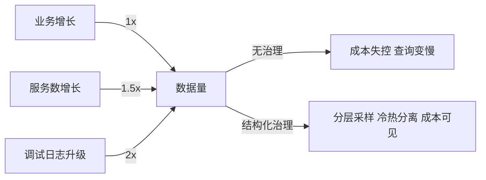
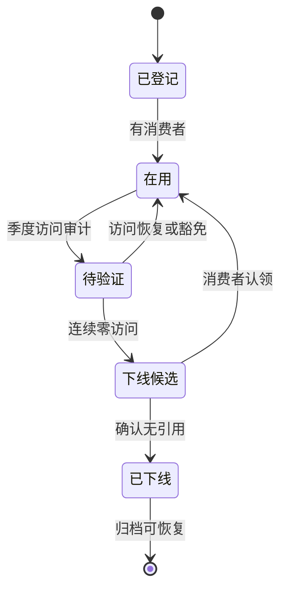
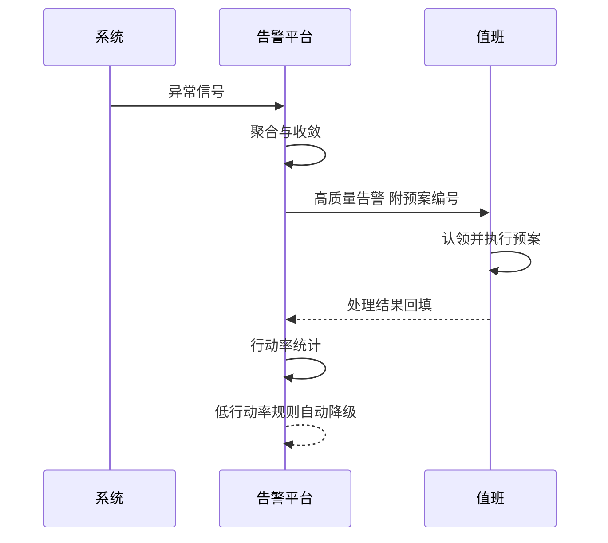
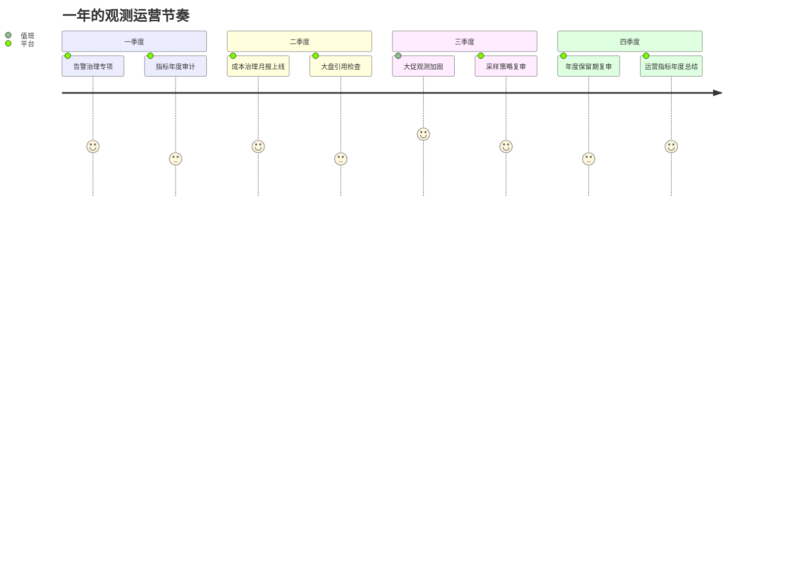

# 观测体系运营实战：从数据到行动的运营闭环

> 观测体系建好只是开始，让它持续产生价值靠运营：指标会不会腐化、告警会不会淹没值班、日志成本会不会失控、大盘还有没有人看。本篇讲观测的运营面：数据到行动的闭环怎么转、告警治理怎么量化、观测自身的成本与质量怎么管——观测体系也有自己的可用性，也需要被观测。

## 一句话摘要

观测运营 = 指标生命周期管理 + 告警质量经营 + 观测成本治理 + 闭环验证——数据只有变成行动才有价值，运营的任务是让「数据到行动」这条流水线持续运转不生锈。

## 🎯 本文核心

1. **观测的价值公式是「行动转化率」**——告警触发的行动率、大盘的决策引用率、报告的改进项转化率：三个转化率掉到零，观测体系就是在烧钱收藏数据。
2. **告警治理的对象是「注意力」**——值班的注意力是全链路里最稀缺的资源，告警治理的本质是注意力经济学：每条告警都要证明自己值得打断一个人。
3. **观测成本要结构化治理**——采样分层、保留期分级、冷热分离：成本治理靠架构而不是靠「大家少打点日志」的倡议。
4. **量级分档**：10 万 QPS 以内观测运营等于「季度清理 + 一条值班群」，千万级起需要告警质量指标与成本月报，亿级是观测平台自身的 SLO 化运营。

## 一、不同量级的思考：约束驱动的运营策略

观测体系有个内生趋势：数据量比业务量涨得快。服务数增加、调试日志的详细度升级、新组件自带指标爆炸——观测数据的增速通常是业务增速的一到两倍（行业认知）。不加运营的观测体系会在两年内走到「存储账单惊人、查询越来越慢、没人敢删数据」的三重困境。量级不是数字标签，是约束的边界——每一档该运营什么、怎么思考，由当期的约束来源决定：

- **十万级（单平台兼职运营）**：约束来源是人力约束——观测平台一套、运营靠兼任，数据量小到成本不是话题。这一档的核心问题是「关键路径有没有观测」，而不是「平台功能全不全」。思考方式是「覆盖驱动」：核心接口的可用性/延迟/错误率三件套与错误日志先立起来，腐化指标季度随手清一次就够
- **百万级（成本开始说话）**：约束来源是数据量约束——日志与指标的存储成本进入技术预算视野，查询性能开始劣化，「随便多存几天」变成真金白银的账单。这一档的核心问题是「成本与质量算没算账」，而不是「多存几天心里踏实」。思考方式是「成本驱动」：采样分层、保留期分级、冷热分离，成本月报把账单摊到产生它的团队面前
- **千万级（注意力成为瓶颈）**：约束来源是注意力约束——告警洪水淹没人，平均发现故障的时间从分钟级劣化，观测数据多到没人看得完，数据量大不再是问题，注意力稀缺才是。这一档的核心问题是「信号可信有没有」，而不是「监控项多不多」。思考方式是「信号驱动」：告警行动率经营、分级治理、同源收敛，让每条告警都值得打断一个人
- **亿级（观测自身平台化）**：约束来源是组织约束——几十个团队共用观测平台，谁保质量、谁管结构、谁给反馈全靠机制裁定，观测自身的可用性也需要 SLO。这一档的核心问题是「运营机制是否自转」，而不是「工具是否先进」。思考方式是「机制驱动」：指标生命周期进流程、观测自身 SLO 化、治理动作进年度日历并逐步自动化

思考方式总结：十万级靠「覆盖兜底」，百万级靠「成本精算」，千万级靠「信号提纯」，亿级靠「机制自转」——每一档的约束来自不同的层面（人力/数据量/注意力/组织），思考方式必须匹配约束来源。解法是思考的产物，不是平台功能的堆叠。

**自下而上与触发升级**：先测档位再选思考——观测月成本占技术预算的比例、人均日告警数、核心链路 SLI 覆盖率三个实测值决定你实际站在哪一档，不预支上一档的复杂度，也不滞留在下一档的侥幸里。触发升级的信号：观测成本增速连续两个季度快于业务、值班对告警普遍「已读不回」、一次故障中观测自身失明——任一信号出现，思考方式必须随档演进（覆盖驱动 → 成本驱动 → 信号驱动 → 机制驱动）。锚点始终是约束来源：人力、数据量、注意力、组织这些底层约束变了，运营策略才跟着变——业务翻倍只是信号，约束迁移才是升级的依据。

## 二、核心决策一：指标的生命周期管理

指标不是越多越好，指标有生命周期，腐化指标（没人看、口径过期、采集失效）是观测系统的坏账：

1. **出生要登记**：新指标登记 owner、口径、预期消费者——登记不是仪式，是「半年后没人知道这指标什么意思」的预防针。
2. **运行要看转化**：每季度统计指标看板访问量，连续一季度零访问的指标进「下线候选」——删除指标和删除代码一样需要流程，但没有下线流程的指标库只会无限膨胀。
3. **口径变更要广播**：指标口径变了但消费者不知道，是用数据的人最恨的事——口径变更有版本号，变更事件推送给所有引用方。

**边界**：「零访问」不等于「零价值」——有些指标是故障时才看的冷指标。所以下线候选要有「冷备豁免」通道：值班确认「故障排查时会用」的指标打豁免标，豁免指标定期抽查口径有效性。运营规则要为长尾场景留出口，一刀切的清理规则会误伤排障能力。

## 三、核心决策二：告警质量经营

告警治理的量化抓手是两个指标：**行动率**（触发后需要人行动的比例）与**响应疲劳度**（同一值班周期内的告警数量）。经营方法：

| 告警问题 | 诊断信号 | 治理动作 |
|---|---|---|
| 噪音告警 | 行动率低于 70% | 阈值校准或降级为日报 |
| 告警风暴 | 单事件触发超过 20 条 | 加收敛规则：同源聚合 |
| 僵尸告警 | 触发后无人认领 | 无人认领超时自动降级 |
| 漏报 | 复盘发现「当时没告警」 | 一票顶十票，触发规则补建 |
| 告警不可行动 | 需要人再查三步才知道干嘛 | 告警内容改造：附预案编号 |

**Trade-off**：告警治理的悖论是「减少告警」与「不能漏报」的张力。激进治理的行动率好看但漏报风险上升，保守治理的安全感强但值班疲劳会让人忽略所有告警。出路是分级治理：P0 告警（资损、全站）宁可噪音不漏报，P3 告警（资源水位）激进收敛进日报——这套分级的设计思想是把告警当成注意力资产来经营：P0 花的是不可再生的信任，P3 花的是可再生的时间，为什么这么设计？因为两类告警烧掉的资源根本不同，全局一个策略注定两头不讨好。

## 四、核心决策三：观测成本的结构化治理

成本治理三板斧，全部是架构动作而非倡议：

1. **采样分层**：错误与慢请求全量，正常流量按比例采样，调试日志按环境分级（生产低采样、预发全量）——采样决策在入口一次做出，全链路一致。
2. **保留期分级**：热数据（7 天）放高性能存储，温数据（30 天）自动降级，冷数据（1 年）压到对象存储——查询变慢是冷数据的特性，用检索耐心换存储成本。
3. **成本可见化**：按团队出观测成本月报（日志量、指标量、存储量 + 折算成本），成本数据进团队的技术负债视角——没有成本视图的团队不会知道自己贡献了多少账单，可见性本身就是治理。

**边界**：成本治理的禁区是「砍排障能力」。所有成本优化必须过一道「值班视角评审」：这次降采样、缩保留期之后，明晚的故障还能定位吗？——为省 10% 成本让 MTTR 翻倍，是最贵的「节约」。

## 五、参数级配置清单（观测运营）

| 配置项 | 默认值 | 10万级推荐 | 千万级推荐 | 亿级推荐 | 为什么 |
|---|---|---|---|---|---|
| 指标季度审计 | 无 | 年度 | 季度 | 季度自动 | 审计频率要快于指标腐化速度 |
| 告警行动率基线 | 无 | 60% | 70% | 80% | 行动率是告警质量的体温计，基线逐步收紧 |
| 无人认领降级 | 无 | 30 分钟 | 15 分钟 | 5 分钟 + 升级链 | 降级时限决定「告警孤儿」的存活时间 |
| 日志热保留 | 7 天 | 7 天 | 14 天 | 30 天 | 热保留期 = 最常见排障回溯窗口 |
| 冷保留 | 无 | 无 | 90 天 | 1 年 | 冷保留按合规与年度对比分析需求定 |
| 成本月报 | 无 | 无 | 团队维度 | 团队 + 服务维度 | 成本可见的粒度决定治理的精细度 |
| 大盘决策引用检查 | 无 | 无 | 半年 | 季度 | 没人用的大盘是墙纸，定期识别下线 |

## 六、步骤级操作：一次告警治理专项

前置条件：过去 30 天的告警全量数据（触发、认领、处理结果）可导出。

- Step 1 数据画像：统计行动率、Top 噪音规则、风暴事件。验证点：画像覆盖全部规则，不凭印象定「吵的告警」。
- Step 2 规则分诊：按「行动率 x 级别」四象限分诊——高行动率保留、低行动率 P0 修阈值、低行动率低级别降级为日报。验证点：每条规则有处置结论，无「待定」滞留。
- Step 3 收敛改造：风暴源加同源聚合，通知内容补预案编号。验证点：复放历史风暴事件，聚合后告警数下降 10 倍以上。
- Step 4 试运行两周：治理后的行动率与值班疲劳度对比。验证点：行动率提升 15 个百分点以上且无漏报投诉。
- Step 5 机制固化：分诊规则进告警平台自动化（低行动率自动降级），季度自动复检。验证点：下季度审计由平台自动出报告，不再需要人工专项。
- 回退：误降级的关键告警（试运行期发现的漏报）立即恢复并标记豁免——治理动作全部可逆，降级不是删除。

## 七、事故推演：一次「观测失明」的复盘

一次数据库主从切换的故障中，值班发现核心大盘的延迟指标停更了——观测链路自身依赖的那个数据库集群就在这次切换里，观测系统随业务一起失明，故障定位退化为人肉登录逐台机器看日志。复盘暴露的根因是「观测的自举依赖」：观测系统自己的组件放在了被观测的基础设施里，且没有独立于业务的采集通道。整改三层：观测关键路径（采集、告警通道）与业务基础设施做故障域隔离（独立集群/独立账号）；补建「观测自身健康」的一级监控（采集断流、告警通道延迟、查询超时率）——这套监控的告警走带外通道（独立短信网关），不与业务告警同池；大盘每个图表标注数据新鲜度，超过阈值自动打「数据过期」水印，防止有人拿着停更的图表做判断。观测体系的第一次自我审视，往往都发生在它自己失明的那一刻——先让观测可被观测，其他的运营动作才建立在可信地基上。

## 七点五、观测运营的年度日历

运营动作散着做容易被业务节奏冲掉，把它们编进年度日历，每个季度有固定主题：

日历的价值不在「 reminders」而在「预期管理」：业务团队知道三季度是观测加固期，变更计划会主动避开；管理层知道四季度会收到年度总结，观测的投入与产出进入固定对话节奏。运营一旦有了日历，就从「想起来才做」变成「到点必做」——这与大促备战的日历逻辑完全一致：观测运营要借大促的势，把加固动作排在业务最愿意配合的窗口。

三年以上的长期视角看，运营日历本身也在演进：第一年的主题是「建机制」（审计、月报、日历本身），第二年是「提基线」（行动率目标上调、成本占比下降），第三年是「自动化」（分诊自动出报告、审计自动跑）——机制建成后，运营的人力投入应该逐年下降，同样的日历，第三年的执行成本应该是第一年的一半。降不下来，说明机制没有真正自动化，运营还在靠人肉维持——这是观测平台下一年的建设方向输入。

## 七点六、什么时候用/不用：运营动作的明确推荐

运营动作也有选配逻辑，什么场景上什么投入，逐项给明确建议：

- **告警治理专项**：任何时候都推荐（明确推荐）——投入最小、体感最强的速赢，两周就能让值班体验肉眼可见地改善。但治理动作只「降级」不「删除」，保留可逆性。
- **指标生命周期审计**：服务数过百后必做；十万级用「季度随手清」就够，不必上平台化流程。如果不做，指标库三年膨胀十倍之后，就没人再敢动任何一条指标了。
- **成本月报**：日志与指标支出进入技术预算前列再上；过早的成本月报只会制造「为省小钱吵半天」的内耗，观测成本还不上桌的阶段把精力花在覆盖上。
- **观测自身 SLO 化**：多团队共用平台或亿级体系才值得投入；单团队自用的观测平台，用「采集断流告警」一件武器兜底即可。
- **什么时候不用做这些**：观测数据还在小几十 GB 量级、值班就一两个人的阶段——把运营预算换成多配两条核心告警、多补一个预案链接，收益更高。这份清单随体系演进定期复审，运营投入与体系量级同档才不浪费。

## 八、四高自查与 Trade-off 总表

| 维度 | 本篇方案 | 代价 | 反方案 | 为什么不选 |
|---|---|---|---|---|
| 高可用 | 观测关键路径故障域隔离 | 独立集群成本 | 观测与业务同池部署 | 同池等于与业务共死，失明是最贵故障 |
| 高并发 | 采样分层 + 入口单点决策 | 长尾细节丢失 | 全量采集 | 全量的成本曲线不可持续 |
| 高一致 | 口径版本化 + 变更广播 | 广播噪音 | 口径随意改 | 口径漂移是数据信任的头号杀手 |
| 高扩展 | 接入模板化 + 治理自动化 | 模板维护 | 手工逐服务配置 | 手工模式在服务数过百后必然失守 |

## 九、你们可能会问

**问：观测运营投入这么大，怎么向管理层证明价值？** ——把运营指标翻译成财务语言：告警行动率提升 15 个点 = 值班每月减少几十小时的无效打断；日志成本月报的治理收益 = 每季度节省的存储账单；MTTR 的下降 = 按故障频率折算的业务损失减少。观测是成本中心，但运营做得好的成本中心会持续给出可验证的节约与避险数字——证明价值的责任在观测团队自己身上，等别人来发现价值就晚了。

**问：指标下线会不会删掉将来要用的数据？** ——下线分两层：停采集（不再产生新数据）与删历史（不可逆）。默认只做前者，历史数据保留到保留期自然过期——「停止产生」止损未来成本，「保留历史」不销毁已有资产，两层的风险完全不同。真要删历史（存储压力），走独立的清理评审。

**问：告警收敛会不会把真实故障也收敛掉？** ——收敛规则只聚合「同源」信号（同一依赖、同一时间窗、同一故障域），且聚合后的「事件」保留全部明细可展开——值班看到的从 100 条变成 1 条事件加可下钻明细，信息没有损失，损失的是重复。把「聚合」与「丢弃」区分开，是收敛设计的底线。

**问：观测体系怎么支撑 AI 运维的落地？** ——AI 运维的质量上限由观测数据的质量决定：口径混乱的指标喂不出可信的模型，噪音横行的告警史教不出靠谱的归因。运营动作（打标、口径治理、行动率数据）本身就是在为 AI 准备训练数据——今天把观测运营做好，明天的 AI 落地才有地基；反过来，运营里最耗人力的分诊与归因，正是 AI 最好的第一个落地场景。

**问：值班与业务团队对观测的诉求冲突怎么办？** ——值班要「稳定不吵」，业务要「灵活自由看数据」，两个诉求抢的是同一套查询与存储资源。解法是分层供给：值班链路（核心大盘、P0 告警）走保障通道，资源独占且变更需评审；探索分析走弹性通道，高峰期自动降级排队。把「谁在什么时候必须被保障」写清楚，冲突就从抢资源变成了按等级排队——分层不是偏袒，是把不同等级的可靠性承诺显式化。

## 十、追问链与我的判断

追问一：观测运营的第一优先动作是什么？——我的判断是「告警治理」：它是投入最小、体感最强的杠杆——两周专项就能让值班体验发生肉眼可见的变化，而指标审计、成本治理都是季度级的慢功夫。先用一个速赢建立运营的可信度，再推进长期工程，比从最难的地方开头更容易让组织接受「观测需要运营」这个前提。

追问二：观测数据的所有权归谁？——数据的生产者是服务团队，消费者横跨值班、业务、管理层，平台的角色是管道与仓库。我的判断是「生产者负责质量、平台负责结构、消费者负责反馈」：指标口径错是生产者的债，存储结构乱是平台的债，没人看的大盘是消费者的债——债归位，运营责任才不会互相推诿。

## 十一、常见误区

- **误区一：观测是工具问题，买了平台就解决了**。平台提供的是能力不是结果，指标腐化、告警噪音、成本失控在最好的平台上照样发生——运营是持续的组织动作，不是一次性的采购决策。
- **误区二：日志越多越安全**。「全量日志在出事时总能查到」的代价是平时 90% 的日志没人看、查询变慢、成本失控——分层采样 + 错误全采的模式能在 10% 的成本下保住 99% 的排障能力（行业认知），全量是懒政不是保险。
- **误区三：大盘越大屏越全越好**。一块塞满 30 个图的大屏没人看，值班需要的核心大盘是「一屏五图、三十秒读完」——信息密度是负资产，克制是设计美德。

## 💡 实战提示

- 💡 **每个告警带预案编号**：告警文案里放预案链接，是把「告警到行动」的路径从记忆依赖变成结构依赖的最小改造——值班在半夜不需要回忆，只需要点开。
- 💡 **给大盘加「最后更新时间」**：数据停更的大盘比没有大盘更危险，一个时间戳水印是最便宜的防呆。
- 💡 **季度删一次指标**：像清理依赖一样清理指标库，「删除」能力常态化后，指标膨胀的势头自然被抑制。
- 💡 **成本月报抄送团队 leader**：成本可见性的第一读者不是财务是技术负责人——他们才知道哪个服务的日志量不对劲。

## 十二、自测三问

1. 你的告警行动率是多少？过去一个月被你手动忽略了几条告警？
2. 观测数据里有多少指标连续一个季度无人访问？
3. 观测系统自己挂了，你能多久知道？告警走的是什么通道？

## 十三、5W 速记卡

| W | 内容 |
|---|---|
| What | 指标生命周期 + 告警质量经营 + 成本治理的观测运营 |
| Why | 观测数据增速快于业务，无运营必然膨胀失控 |
| When | 千万级起告警质量指标化；亿级观测自身 SLO 化 |
| Who | 生产者保质量、平台管结构、消费者给反馈 |
| Where | 指标库、告警平台、存储分层、成本月报、值班链路 |

## 十四、开放问题

1. 「观测即代码」（指标、告警、大盘全部版本化进仓库）能否成为治理腐化的终极解法？
2. LLM 做告警摘要与初步归因的误报风险，如何在不损耗值班信任的前提下渐进上线？
3. 观测数据的跨团队共享（一条链路的数据同时服务多个团队）与成本分摊怎么设计才可持续？

## 🎯 核心带走

- **核心一句话**：观测的价值在行动转化率——指标管生命周期、告警经营质量、成本结构化治理、观测自身也要被观测。
- **三个落地锚点**：告警带预案编号、指标季度审计、成本月报可见。
- **量级分档**：10 万 QPS 季度清理、千万级质量指标化、亿级观测 SLO 化。
- **哪里会坏**：指标腐化、告警噪音淹没值班、成本失控、观测与业务共死。
- **最小动作**：本周就能做的三件——导出 30 天告警数据算行动率、给核心告警补预案链接、给核心大盘加更新时间戳。

## 📌 数据与事实声明

- 写于 2026-09-15；观测运营方法论为行业公开实践的教学归纳（行业认知）
- 量化数字（行动率基线、保留期、采样比例）为行业认知口径，按自身体系校准
- 事故案例为公开技术社区高频案例模式的匿名化复述

## 📚 参考资料

| 类型 | 标题 | 来源 |
|---|---|---|
| 书 | 《SRE: Google 运维解密》监控告警章节 | 公开出版 |
| 方法论 | Observability 白皮书（OpenTelemetry 社区） | opentelemetry.io |
| 书 | 《可观测性工程》公开出版物 | 公开出版 |
| 行业实践 | 各大厂告警治理与成本治理公开分享 | 公开报道 |
