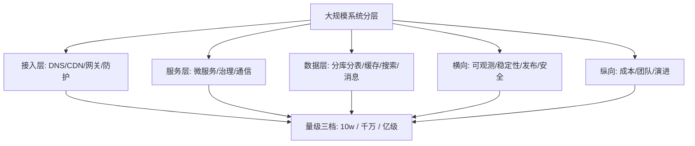

# 从零开始认识大规模架构系列导读 · 千万级用户的架构全景

> 本系列 13 篇（0 导读 + 12 正文），按大规模系统的「分层版图」全覆盖：接入层、服务层、数据层、中间件、可观测、稳定性、发布、成本、团队。每篇按「理念 → 机制 → 实践 → 主流方案」四层结构，贯穿 10w / 千万 / 亿级三档量级。

## 一、为什么需要这套系列

「大规模架构」不是一个单一技术，是一整套「当用户从万级涨到亿级时，系统每个层面该怎么变」的工程学科。传统教学零散地讲缓存、分库、消息队列，但**不讲它们之间的联动关系和演进顺序**——你学会了每个零件，却不知道怎么组装成一台引擎。

这套系列的设计思路：**以「千万级订单系统」为贯穿案例，从接入层到数据层逐层拆解**，每层讲清楚「为什么这个量级需要这个设计、上/下一档会发生什么」。

## 二、全局心智模型

三个要点：

1. **量级决定架构**：同一个问题在 10w 和亿级的最优解完全不同——10w 用 MySQL 单库即可，亿级必须分库分表 + 多活。
2. **层间联动**：接入层的限流策略影响服务层的容量规划，数据层的分片方案决定查询模式——不能孤立设计任何一层。
3. **演进不是重写**：从 10w 到亿级是逐步演进的过程，每一档的架构为下一档留好扩展点。

## 三、系列导航表（13 篇）

| # | 篇目 | 层 | 一句话定位 |
|---|---|---|---|
| 0 | 系列导读 | 全景 | 千万级系统分层心智模型 |
| 1 | [[大规模架构是什么](./1_大规模架构是什么与分层全景-入门.md)](./1_大规模架构是什么与分层全景-入门.md) | 接入 | 分层全景与量级分档 |
| 2 | [[流量接入与防护](./2_流量接入与防护-DNS网关CDN-入门.md)](./2_流量接入与防护-DNS网关CDN-入门.md) | 接入 | DNS/CDN/网关/限流四道防线 |
| 3 | [[服务层设计](./3_服务层设计-微服务与服务治理-入门.md)](./3_服务层设计-微服务与服务治理-入门.md) | 服务 | 微服务拆分/注册发现/通信 |
| 4 | [[数据层设计](./4_数据层设计-分库分表与缓存-入门.md)](./4_数据层设计-分库分表与缓存-入门.md) | 数据 | 分库分表/缓存/搜索三层 |
| 5 | [[中间件选型](./5_中间件选型与治理-入门.md)](./5_中间件选型与治理-入门.md) | 中间件 | MQ/缓存/搜索的选型决策 |
| 6 | [[可观测体系](./6_可观测体系-指标日志链路-入门.md)](./6_可观测体系-指标日志链路-入门.md) | 观测 | 三大信号与告警体系 |
| 7 | [[稳定性保障](./7_稳定性保障-限流降级与容灾-入门.md)](./7_稳定性保障-限流降级与容灾-入门.md) | 稳定 | 限流/降级/容灾/演练 |
| 8 | [[发布与变更管理](./8_发布与变更管理-灰度与回滚-入门.md)](./8_发布与变更管理-灰度与回滚-入门.md) | 发布 | 灰度/回滚/变更管控 |
| 9 | [[成本与容量规划](./9_成本与容量规划-FinOps实践-入门.md)](./9_成本与容量规划-FinOps实践-入门.md) | 成本 | FinOps/容量/弹性 |
| 10 | [[团队与工程效率](./10_团队与工程效率-平台工程实践-入门.md)](./10_团队与工程效率-平台工程实践-入门.md) | 团队 | 平台工程/效率工具 |
| 11 | [[安全与合规](./11_安全与合规-零信任实践-入门.md)](./11_安全与合规-零信任实践-入门.md) | 安全 | 零信任/合规/审计 |
| 12 | [[多活与容灾](./12_多活与容灾-同城双活与异地多活-入门.md)](./12_多活与容灾-同城双活与异地多活-入门.md) | 容灾 | 同城双活/异地多活 |

## 四、怎么读

- **新手**：0-5 顺序读（理解分层与量级）
- **有经验**：跳到 6-12（按你负责的层挑）
- **架构决策者**：1 + 7 + 9 + 12（决策视角四篇）

## 前置与去向

- 前置：Java 语言系列 / Docker 系列 / K8s 系列（本仓库 devops 域）
- 去向：专题层 16 篇深度实战（每方向从入门到专题的完整链路）

---

## 📌 数据与事实声明

本文的分层模型与量级分档为大规模架构领域的公开共识与教学归纳；具体数字为教学示意，以实际业务压测为准。

## 📚 参考资料

| 类型 | 标题 | 来源 |
|---|---|---|
| 图书 | 大型网站技术架构：核心原理与案例分析 | 电子工业出版社 |
| 图书 | 数据密集型应用系统设计（DDIA） | O'Reilly（2017 中译） |
| 系列文章 | 本系列专题层 16 篇深度实战 | 本仓库同系列专题层/ |
