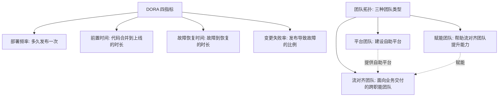
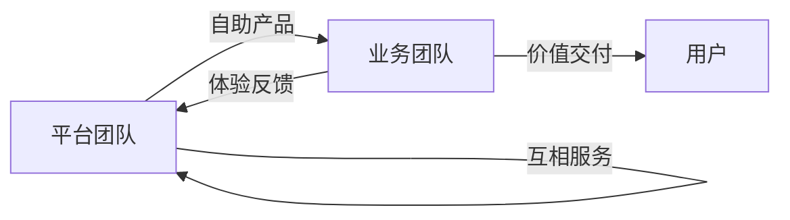

# 团队与工程效率：平台工程实践

> **一句话摘要**：团队效率 = 「工程师的时间花在业务逻辑上而非基础设施的重复劳动上」——**平台工程（Platform Engineering）把运维/部署/监控/安全的知识封装为「自助服务平台」，让业务团队「自服务」**；DORA 四指标（部署频率/前置时间/MTTR/失败率）是效率的度量框架——效率的瓶颈往往不在技术而在组织与流程。

> **本文核心**：机制链 = **效率瓶颈 = 环境等待 + 发布阻塞 + 重复劳动 + 沟通成本 → 平台工程的自服务门户（环境自助/部署自助/监控自助/安全自助）→ DORA 四指标度量 → 康威定律的镜像（组织结构 = 系统结构）→ 团队拓扑（平台团队/赋能团队/流对齐团队）**——「效率的瓶颈在组织结构」是康威定律的工程表达。

前置阅读：[服务层设计](./3_服务层设计-微服务与服务治理-入门.md)（微服务的团队组织含义）。

## 1. 背景：为什么「效率」是架构的一部分

技术架构决定了「系统怎么运行」，组织结构决定了「团队怎么协作」——两者必须匹配（康威定律）。当组织从 5 人长到 200 人：沟通成本从 O(1) 到 O(n²)、代码冲突从偶发到常态化、发布从自助到排队——**效率的瓶颈从技术转移到组织**。平台工程的回答：把「所有团队重复做的事情」封装成「自助服务平台」——环境自助创建、部署自助触发、监控自助配置、安全自助扫描。

## 2. 核心机制：DORA 四指标与团队拓扑

- **DORA 四指标的含义与目标**：① 部署频率（精英：每天多次 vs 低效：每月一次）；② 前置时间（精英：<1 小时 vs 低效：>1 月）；③ MTTR（精英：<1 小时 vs 低效：>1 月）；④ 变更失败率（精英：<15% vs 低效：>45%）。**四指标联动改善**——提升部署频率通常也缩短前置时间与 MTTR（同一套自动化体系支撑）。
- **团队拓扑的三种团队**：① **平台团队**——建设「自助服务平台」（内部 PaaS），让流对齐团队不需要懂底层基础设施；② **赋能团队**——跨团队传递技能与最佳实践（不长期交付，短期赋能）；③ **流对齐团队**——面向业务价值流的跨职能团队（开发+测试+运维一体化交付业务功能）。
- **康威定律的工程应用**：「组织设计系统，设计出的系统等价于组织的沟通结构」——想要微服务架构，就需要微服务式的团队拓扑（小团队自治）； centralized 的运维团队对应单体的架构模式。**改变架构必须同步改变组织**，否则康威定律会让架构退化回组织结构。

## 3. 落地实践：效率提升的工程清单

1. **CI/CD 流水线标准化**：每个团队用同一套流水线模板（构建/测试/部署/回滚）——模板由平台团队维护，业务团队只填参数。
2. **环境自助创建**：开发/测试/预发环境通过 API/门户自助创建——不等运维排期。
3. **Golden Path（黄金路径）**：新服务从创建到上线的「推荐路径」文档化 + 工具化——降低新人的认知负担，保证一致性。
4. **开发者体验（DX）度量**：工程师满意度调研 + 构建时间/部署耗时/环境等待时间的量化——开发者体验是效率的直接度量。
5. **文档即代码**：架构文档/运维手册/API 文档与代码同仓维护（docs-as-code）——文档与代码同步更新，不再过期。

## 4. 生产视角：效率低下的事故形态

- **「环境等待」的时间黑洞**：等测试环境、等预发环境、等运维排期——开发者 30% 的时间在「等待」（行业调研数据）。解法：环境自助化（按需创建/销毁）。
- **「代码合并冲突」的团队规模效应**：多人改同一个代码库——合并冲突随人数平方增长。解法：代码库拆分（按团队/按域）+ trunk-based development（短分支快速合并）。
- **「知识孤岛」的巴士因子**：某个系统只有一个人懂——这个人请假/离职，系统无人维护。解法：文档即代码 + 结对轮岗 + 知识分享会。
- **「重复造轮子」的碎片化**：每个团队自建日志/监控/配置管理——同一功能 N 套实现，维护成本 × N。解法：平台团队提供统一实现，业务团队按需消费。

## 5. 主流系统怎么做：效率工具的生态位

| 环节 | 主流工具 | 机制要点 |
|---|---|---|
| CI/CD | GitHub Actions / GitLab CI | 流水线即代码（.github/workflows） |
| 内部平台 | Backstage（CNCF）/ 自建门户 | 服务目录/脚手架/技术文档的统一入口 |
| 代码协作 | GitHub/GitLab + trunk-based development | 短分支 + 频繁合并 + 代码评审 |
| 知识管理 | Confluence / 内部 Wiki + docs-as-code | 文档与代码同仓同步更新 |
| 度量 | DORA 四指标 + SPACE 框架 | 效率的量化度量框架 |

规律：**效率工具链的核心是「自助服务平台」**——平台团队建好基础设施与工具，业务团队自助使用不需要等排期；「自服务」是效率的杠杆。

## 6. 典型场景

- **新服务从零上线**（起步级）：Golden Path 引导——从 `backstage create` 到部署完成 < 1 小时。
- **跨团队协作**（协作级）：API 契约先行（OpenAPI 规范）→ 各团队独立开发 → 集成测试——契约驱动降低沟通成本。
- **大促备战**（效率级）：扩容自动化 + 预案自动化 + 值班自动化——效率的极致场景。

## 7. 与相邻概念的区别

- **平台工程 vs DevOps**：DevOps 是「文化与实践」（开发运维一体化）；平台工程是「DevOps 的产品化」（把 DevOps 能力做成自助平台）——平台工程是 DevOps 的工程化实现。
- **效率工具 vs 业务代码**：效率工具提升「工程效率」；业务代码实现「业务价值」——效率工具的价值在于让业务代码更快更好地交付。
- **康威定律 vs 微服务**：康威定律是「组织决定架构」的观察；微服务是「架构影响组织」的设计——两者互为因果，团队拓扑设计需要与架构同步。
- **本篇 vs 全系列**：效率是「让前面所有架构实践可持续」的组织基础——没有团队效率的架构演进是无源之水。

## 8. 常见误区与不适用

- **「效率工具越多越好」**：工具堆砌反而增加认知负担——工具的判据是「是否减少了等待与重复劳动」，不是「是否最新最酷」。
- **「平台工程 = 建一个 Portal」**：Portal 只是入口——真正的平台工程是「把运维/部署/监控/安全的知识编码成自助服务」；Portal 是冰山露出水面的部分。
- **「DORA 四指标是 KPI 考核」**：四指标是「团队改进的方向指示」不是「个人绩效考评」——把 DORA 当 KPI 会导致指标 gaming（刷指标而非真改善）。
- **「效率 = 写代码的速度」**：效率不只是「打字速度」——「等待时间（环境/审批/排期）」往往大于「编码时间」；效率的杠杆在「减少等待」而非「加快打字」。
- **不适用**：5 人以下小团队（效率工具的维护成本 > 收益——直接用好 IDE 与 CI 就够了）；一次性项目（效率投资无法摊销）。

## 9. 你们可能会问

- **平台工程团队的规模应该多大？** 行业经验：平台团队 : 业务团队 ≈ 1:5 到 1:8——平台团队太少则服务不足，太多则「平台官僚化」。
- **Golden Path 的粒度怎么定？** 覆盖「新服务从创建到上线」的全流程——代码模板、CI/CD、监控、告警、日志一站式；粒度以「新人 1 天内完成首个部署」为标尺。
- **DORA 四指标怎么采集？** 从 CI/CD 工具的 API 自动采集（部署事件/代码合并事件/故障事件）——不要人工填报（人工填报的数据不可信也不可持续）。
- **SPACE 框架是什么？** GitHub 提出的开发者效率度量框架（Satisfaction/Performance/Activity/Communication/Efficiency 五维）——比 DORA 更全面但更难量化；与 DORA 互补。
- **怎么平衡「效率工具建设」与「业务交付」的资源分配？** 行业经验：70% 业务交付 + 20% 技术债与效率 + 10% 创新探索——效率投入是「业务交付的加速器」不是「与业务竞争的资源」。

## 10. 一句话总结 + 5W 速记卡 + 自测三问

**🎯 核心带走**：

- **核心一句话**：团队效率 = 平台工程（自助平台）× DORA 度量（四指标）× 团队拓扑（平台/赋能/流对齐）× 康威定律（组织与架构同步）——效率的瓶颈往往在组织而非技术。

**5W 速记卡**：

| 维度 | 内容 |
|---|---|
| What | DORA 四指标 + 团队拓扑 + 平台工程 + Golden Path |
| Why | 效率瓶颈从技术转移到组织——康威定律的工程表达 |
| When | 团队扩容、效率下降、平台立项、工程文化建设 |
| Where | CI/CD + 内部平台 + 协作工具 + 度量体系 |
| How | DORA 度量 → 瓶颈定位 → 平台自助化 → 团队拓扑调整 |

💡 **实战提示**：DORA 度量自动化采集；Golden Path 文档化+工具化；开发者满意度季度调研；效率工具判据 = 减少等待。

**开放问题**：AI 辅助编码（Copilot 类）正在改变「编码」这个环节的效率——当 AI 能写 50% 的代码，「效率的瓶颈」会从编码转移到哪里？架构设计与系统理解会成为新的瓶颈吗？

**决策（何时用）**：团队扩容、效率下降、平台立项、工程文化建设全场景；推荐「DORA 四指标自动化采集」进团队效能看板；推荐「Golden Path」作为新服务标准创建方式。

**Trade-off（代价与反方案）**：平台工程用「平台团队的人力」换「业务团队的自服务效率」；标准化用「灵活性下降」换「一致性与可维护性」；度量用「数据采集成本」换「改进方向的可见性」——效率工具链的每一项投入都在为「团队总产出」定价，投入的判据是「能否减少等待或消除重复」。

**演进视角**：从「运维外包」（2010s 前）到「DevOps 文化」（2010s）到「SRE 工程化」（2016+）到「平台工程」（2022+）到「AI 辅助开发」（2023+）——效率工程的演进主线是「知识的封装与自助化」；每一代演进都在回答同一个问题：**如何让工程师把更多时间花在业务逻辑上**。

---

**下篇预告**：规模上去后的安全挑战——下一篇[安全与合规](./11_安全与合规-零信任实践-入门.md)讲零信任、合规与审计在大规模系统中的落地。

---

### 量级分档与一次值得思考的组织观察

不同量级的团队形态：10 万级业务一个团队全栈——沟通零成本，强行引入平台团队是负资产；百人规模起，平台团队必须成立，把发布、观测、权限这些通用能力收口；千人规模，平台产品化、机制自动化。这里有一个值得思考的观察：**为什么「平台太慢」是最常见的组织抱怨？**——因为平台的供需张力是结构性的：平台资源永远赶不上业务团队的需求增长。健康的形态不是消灭张力，是给张力一个出口：平台做自助化产品，业务团队自己动手解决 80% 的常规需求，排队只发生在真正需要定制的 20%。追问下去：衡量平台团队成功的标准是什么？不是「做了多少功能」，是**业务团队愿意用**——被强制使用的平台，最终会催生绕开它的影子流程。

### 一个值得追问的问题收尾

最后留一个追问：**平台团队自己谁来「服务」？**——平台为业务团队服务，业务团队为用户服务，那平台团队的工程体验（内部的工具好不好用、流程顺不顺）谁在乎？成熟组织的答案是：平台团队互相 review、互相做「用户调研」，把开发者体验当产品指标管。这个追问的深层含义是：服务链路不能有断点，断掉的最后一环会让整个服务文化退化成口号。团队效率的改进没有银弹，但有方向——每一次「让等待变成自助、让口头变成文档、让重复变成模板」的小改动，都在把组织的效率复利往前滚一格。

## 📌 数据与事实声明

DORA 四指标出自 DORA State of DevOps 年度报告（dora.dev）；团队拓扑三类型出自 Skelton & Pais《Team Topologies》（2019）；康威定律出自 Melvin Conway（1968）；SPACE 框架出自 Microsoft Research 公开论文。以各官方文档为准。

## 📚 参考资料

| 类型 | 标题 | 来源 |
|---|---|---|
| 图书 | Team Topologies（Skelton & Pais） | IT Revolution（2019） |
| 报告 | DORA State of DevOps Report（年度） | dora.dev |
| 框架 | SPACE of Developer Productivity | ACM Queue（2021） |
| 系列文章 | 成本与容量规划（上一篇）/ 安全与合规（下一篇） | 本仓库同系列 |
