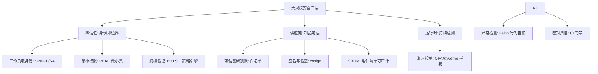
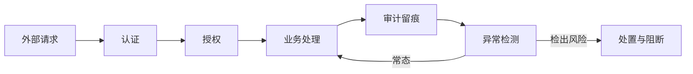

# 安全与合规：零信任实践

> **一句话摘要**：大规模系统的安全 = **零信任（永不信任，持续验证）+ 合规（监管要求的制度化落地）+ 审计（一切可追溯）**——规模越大，攻击面越大，安全从「部署前检查清单」变成「持续运行的声明式控制系统」；安全不是技术团队一家的事，是全组织的文化与流程。

> **本文核心**：机制链 = **规模越大攻击面越大（更多服务/更多依赖/更多人员/更多数据）→ 零信任三层（身份即边界/最小权限/持续验证）→ 合规框架（数据分级/权限审计/变更留痕）→ 安全左移（CI 安全扫描/依赖审计/密钥检测）→ 安全度量（漏洞存量/响应时效/合规覆盖率）**——安全的每道防线都需要「可度量、可审计、可自动化」。

前置阅读：[云原生安全](../../../../cloud-native/入门层/从零开始认识云原生系列/9_云原生安全-零信任与供应链-入门.md)（容器与供应链安全的完整展开）。

## 1. 背景：大规模安全的特殊性

100 人团队、1000 个微服务、PB 级数据的大规模系统，安全的复杂度不是线性增长的：① 攻击面 = 所有服务 × 所有依赖 × 所有人员 × 所有数据——每个维度都在扩大；② 权限管理 = 谁能访问什么（RBAC）× 谁能改什么（变更权限）× 谁能看什么（数据权限）——权限矩阵爆炸；③ 合规 = 多重监管框架（GDPR/等保/SOC2/行业规范）叠加——合规清单随业务地域与行业扩展。大规模安全的核心不是「买更多安全工具」，是**把安全编码进流程与文化**。

## 2. 核心机制：三层安全体系

- **零信任的三支柱在大规模系统的落地**：① **工作负载身份**——每个服务有唯一可验证的身份（SPIFFE ID/K8s ServiceAccount），服务间通信基于身份而非 IP（IP 可变，身份不变）；② **最小权限**——每个服务的权限只覆盖它需要的最小集合（RBAC 按需授予，默认拒绝）；③ **持续验证**——每次访问都验证身份与授权，策略引擎（OPA/Envoy）在每个调用点执行检查。
- **合规框架的工程化**：合规不是「安全团队检查后发报告」，是**编码进 CI/CD 的自动化检查**——数据分级（敏感数据标记）、权限审计（RBAC 定期审查）、变更留痕（所有生产变更走 Git + 审批）、数据加密（传输 TLS + 存储加密）。合规的度量 = 合规检查覆盖率 × 检查通过率。
- **安全左移（Shift Left Security）**：安全检查从「上线前安全团队审」左移到「开发期 CI 自动扫」——密钥扫描（防 Git 泄密）、依赖审计（SCA 查已知漏洞）、代码扫描（SAST 查逻辑漏洞）、IaC 扫描（查基础设施配置错误）。**左移的价值：违规在合并前拦截，修复成本最低。**

## 3. 落地实践：安全体系的建设清单

1. **密钥治理**：密钥不进镜像/Git 明文（TruffleHog/gitleaks 扫描进 CI）；用平台密钥管理（K8s Secret + 加密 / Vault 类）+ 最小权限注入。
2. **镜像供应链**：可信基础镜像白名单 + 构建时扫描（Trivy）+ 签名（cosign）+ 部署验签 + 运行时 CVE 持续监控（新 CVE 爆出时定位受影响工作负载）。
3. **网络默认拒绝**：NetworkPolicy 默认 deny，按需显式放行——零信任的「内网也需要验证」原则在网络层落地。
4. **审计日志全覆盖**：所有生产操作（API 调用/权限变更/配置修改/数据访问）留痕——审计日志不可篡改（append-only）+ 定期审计（异常操作检测）。
5. **安全度量**：四指标（高危镜像存量/密钥泄漏事件/补丁时效/合规覆盖率）——安全要可度量才可治理。

## 4. 生产视角：安全的事故形态

- **被泄露的密钥**：CI 凭证进了 Git 明文——攻击者用凭证推送恶意镜像或访问敏感数据。防线：密钥扫描进 CI（gitleaks/trufflehog）+ 短时效凭证 + 泄漏告警。
- **过度权限的爆炸半径**：ServiceAccount 绑定了 cluster-admin——应用被攻破即整个集群沦陷。RBAC 最小权限评审是持续项不是一次性。
- **「内网可信」的横向移动**：一个 Pod 被攻破后，攻击者在内网自由横向（默认全通的网络 + 无 mTLS）——NetworkPolicy 默认拒绝 + mTLS 是横向移动的刹车。
- **被遗忘的漏洞镜像持续运行**：新 CVE 爆出但无人知道「哪些服务用了这个组件」——SBOM 缺失的代价；SBOM 库 + CVE 匹配是「漏洞响应十分钟化」的前提。
- **安全策略形同虚设**：准入策略部署了但紧急豁免通道常态化——「豁免要带过期时间与审批」是策略存活的条件。

## 5. 主流系统怎么做：安全工具的生态位

| 层 | 主流工具 | 机制要点 |
|---|---|---|
| 策略即代码 | OPA Gatekeeper / Kyverno | 准入控制 + CI 策略检查 |
| 镜像扫描 | Trivy / Grype | CVE 门禁 + 增量监控 |
| 签名验证 | cosign（Sigstore） | 构建签名 + 部署验签 |
| 运行时检测 | Falco / Tetragon | 系统调用级异常检测 |
| 工作负载身份 | SPIFFE/SPIRE + mTLS | 身份即边界 |
| 依赖审计 | SCA 工具（Dependency-Track 等） | SBOM 管理 + CVE 匹配 |
| 密钥扫描 | gitleaks / trufflehog | Git 仓库密钥泄漏检测 |

规律：**安全工具链与 CI/CD/编排深度集成**——安全从「独立的检查团队」变成「流水线的内建关卡」；「Shift Left（左移）」是主旋律。

## 6. 典型场景

- **金融合规**（监管级）：mTLS 全覆盖 + 准入基线 + 审计留痕 + SBOM 报送——合规要求把安全三层全部制度化。
- **开源供应链治理**（供应链级）：私有中转 + 签名 + SBOM 审计——供应链治理组织化。
- **多租户平台**（隔离级）：命名空间隔离 + 网络默认拒绝 + 资源配额 + Pod 安全标准——租户互不踩踏。

## 7. 与相邻概念的区别

- **安全 vs 合规**：安全是「实际防御能力」；合规是「监管要求的满足」——合规不一定安全（合规检查通过但逻辑漏洞仍在），安全不一定合规（有防御但无审计留痕）——两者都要。
- **安全 vs 隐私**：安全是「防外部攻击」；隐私是「用户数据的合规处理」（GDPR/数据分级/数据最小化）——隐私是安全的子集但更关注「用户权利」。
- **DevSecOps vs 安全团队**：DevSecOps 是「安全融入 DevOps 流程」（开发承担安全责任）；安全团队是「专业指导与兜底」——「安全是全团队的责任」不是口号而是分工重构。
- **本篇 vs Docker 安全篇**：Docker 篇讲「单机容器加固」（用户/能力/只读根）；本篇讲「大规模系统的全链路安全体系」——单机与平台的分层。

## 8. 常见误区与不适用

- **「买了安全工具就安全了」**：工具产出告警与报告，「有人响应、有流程闭环」才是安全——安全运营（响应/复盘/策略迭代）比采购重。
- **「内网服务不需要 mTLS」**：横向移动正是从「可信内网」开始的——零信任的内网是「更需要验证」的地方。
- **「安全是安全团队的事」**：云原生安全一半在开发流水线里（扫描/密钥/依赖）——「安全左移」要求开发承担对应责任与技能。
- **「开源组件出 CVE 就要立刻升级」**：先评估可达性（漏洞路径是否真的会被触发）→ 缓解措施（配置规避/WAF 规则）→ 排期修复 + 临时白名单带过期时间——盲目全量升级引入的兼容性故障也是事故。
- **不适用**：安全不是「一个阶段」——它不是「做完就结束」的项目；本篇的每条防线都是持续运行的机制，不是一次性检查。

## 9. 你们可能会问

- **从哪里开始建云原生安全？** 三步优先级：① 密钥治理与镜像扫描（最高频漏洞入口）→ ② Pod 安全基线 + RBAC 最小权限 → ③ 网络默认拒绝 + mTLS——先堵最高频入口。
- **SBOM 的实际产出与消费怎么落地？** 产出：CI 构建 Syft 一类工具生成随制品归档；消费：新 CVE 爆出时按组件反向匹配受影响制品——「生成-归档-匹配」三步闭环。
- **准入策略与 CI 策略重复吗？** 不重复——CI 是「合并前拦截」（开发者体验好），准入是「部署时兜底」（防绕过）；两层同规则双保险。
- **怎么度量安全水位？** 四指标：高危镜像存量、策略豁免数量与时长、密钥泄漏事件、补丁时效（CVE 爆出到修复的天数）——安全要可度量才可治理。
- **零信任改造从哪起步？** 身份先行（工作负载身份 + mTLS）→ 网络默认拒绝 → 授权细化——「先认证、再隔离、后授权」的次序最稳。

## 10. 一句话总结 + 5W 速记卡 + 自测三问

**🎯 核心带走**：

- **核心一句话**：大规模安全 = 零信任（身份即边界）+ 供应链纵深（镜像/签名/SBOM）+ 运行时防护 + 合规工程化——安全从「部署前检查清单」变成「持续运行的声明式控制系统」。

**5W 速记卡**：

| 维度 | 内容 |
|---|---|
| What | 零信任 + 供应链 + 运行时 + 合规工程化 |
| Why | 规模越大攻击面越大，边界消失后传统防御失效 |
| When | 容器化全程、新 CVE 响应、合规审计、租户平台建设 |
| Where | CI 流水线 + 镜像仓库 + 集群准入 + 运行时 |
| How | 基线先行 → 三件套纵深 → 左移进 CI → 度量治理 |

💡 **实战提示**：Pod 安全标准 restricted 起步；网络默认拒绝按需放行；密钥扫描进 CI；SBOM 归档支撑 CVE 响应；豁免必须带过期时间。

**开放问题**：AI 生成的代码与依赖正在加速供应链攻击的「产量化」——SBOM + provenance 的验证体系能跟上 AI 速度的攻击面扩张吗？

**决策（何时用）**：容器化全程适用（安全左移零时点开始）；存量集群按三步优先级整改；推荐「四指标安全水位」进团队月度安全看板。

**Trade-off（代价与反方案）**：零信任用「认证延迟与策略运维」换「横向移动刹车」；供应链纵深用「流水线复杂度」换「投毒防御」；安全左移用「开发责任加重」换「违规前置拦截」；默认拒绝用「配置成本」换「爆炸半径收窄」——安全的每一道防线都在为「攻击者的时间」定价，而攻击者的时间是无限的。

**演进视角**：从「防火墙 + 补丁」（2000s）到「主机加固 + IDS」到「零信任 + 供应链」（2020s）——安全范式三十年从「守边界」演进为「验一切」；云原生安全的未来在「安全的自动化与智能化」（策略生成/异常学习），但「纵深防御 + 最小权限」的零信任内核不可动摇。

---

**下篇预告**：灾备的终极形态——下一篇[多活与容灾](./12_多活与容灾-同城双活与异地多活-入门.md)讲同城双活、异地多活与容灾演练。

---

### 量级视角与一条安全的设计思想

10 万 QPS 以内的安全底线三件套：凭证管理（定期轮换）、权限收敛（最小权限）、扫描进流水线；千万级起零信任分阶段铺开（先南北向入口，后东西向服务间）；亿级安全平台化——打标、审计、策略引擎全部产品化。这里有一条贯穿的设计思想值得思考：**检测优先于阻断**。阻断类控制一旦误伤业务，组织对安全团队的信任瞬间清零；检测先行让组织看到风险的真实频率，再决定哪里值得阻断。追问一层：为什么「检测先行」在安全领域成立而在很多工程领域不成立？——因为安全的误判成本（业务中断）远高于漏判的期望成本，这个成本不对称决定了策略取向。安全投入的度也跟着这个逻辑走：按「资产价值乘以威胁概率」排序，先覆盖期望损失最高的两成场景。

## 📌 数据与事实声明

零信任原则（NIST SP 800-207）、K8s Pod 安全标准、NetworkPolicy、RBAC、ObjectInputFilter、SPIFFE/Sigstore/Falco 语义为 NIST、Kubernetes 与各项目官方文档公开内容；供应链攻击案例为公开安全事件的一般化归纳（不指向具体公司）；SLSA 为公开框架。以官方文档为准。

## 📚 参考资料

| 类型 | 标题 | 来源 |
|---|---|---|
| 标准 | NIST SP 800-207（Zero Trust Architecture） | nist.gov |
| 文档 | Kubernetes: Pod Security Standards / Network Policy | kubernetes.io |
| 项目 | Kyverno / Falco / SPIFFE / Sigstore | 各官方仓库 |
| 系列文章 | 容器化基石（镜像三件套联动） | 本仓库同系列 |
