# 多活与容灾：同城双活与异地多活

> **一句话摘要**：容灾的终极形态是**异地多活**——多个地域同时对外服务，任一地域故障不影响用户；实现路径三阶：同城双活（低延迟同步，机房级容灾）→ 两地三中心（区域级容灾）→ 异地多活（地域级容灾，最高成本最高能力）；数据一致性是容灾的核心难题——「同步复制保一致但影响延迟，异步复制保延迟但可能丢数据」。

> **本文核心**：机制链 = **容灾等级（RPO=可容忍数据丢失量，RTO=可容忍服务中断时长）→ 三阶路线（同城双活→两地三中心→异地多活）→ 数据层方案（同步复制/异步复制/单元化路由）→ 切换能力（自动切换 vs 人工决策）→ 演练是容灾的试金石**——容灾等级按「业务可容忍的损失」定价，不是按「技术能做到」定价。

前置阅读：[稳定性保障](./7_稳定性保障-限流降级与容灾-入门.md)、[多云与混合云](../../../architecture/cloud-native/入门层/从零开始认识云原生系列/12_多云与混合云架构-入门.md)。

## 1. 背景：容灾等级与业务损失的关系

容灾等级不是技术选择，是**业务决策**：每分钟停机损失多少？可容忍的数据丢失量是多少？这些业务问题决定了容灾的技术方案。两个核心指标：**RPO**（Recovery Point Objective——最多丢多少数据，如「最多丢 5 分钟的写入」）与 **RTO**（Recovery Time Objective——多久恢复服务，如「30 分钟内恢复」）。RPO 与 RTO 越小，容灾方案的成本越高——**按业务的「最大可容忍损失」反推技术方案**。

## 2. 核心机制：三阶容灾路线

```mermaid
flowchart TD
    L1[同城双活: 两个机房 同城延迟<2ms] --> L2[两地三中心: 同城双活+异地灾备<br/>区域级容灾]
    L2 --> L3[异地多活: 多地域同时服务<br/>地域级容灾 最高形态]
    L1 --> K1[数据: 同步复制 RPO≈0]
    L1 --> K2[切换: 机房级 RTO≈分钟]
    L3 --> K3[数据: 异步复制 RPO>0<br/>单元化路由 数据分片归属]
    L3 --> K4[切换: 地域级 RTO≈分钟到小时]
    K1 & K2 & K3 & K4 --> DRILL[容灾演练: 唯一验证手段]
```

- **同城双活**：两个机房在同城（延迟 < 2ms），数据同步复制（RPO ≈ 0），机房级故障切换 RTO ≈ 分钟。**适合**：RPO 要求极高（不能丢数据）但 RTO 可以接受分钟级的业务。
- **两地三中心**：同城双活 + 异地灾备中心（冷备或温备）——异地中心日常不承载流量（或仅承载灾备演练流量），灾难时接管。**适合**：需要区域级容灾（如整个城市不可用）但异地延迟不可接受实时双活的业务。
- **异地多活**：多个地域同时对外服务，用户按地域路由到最近单元——**最高形态也最高成本**。核心难题是**数据一致性**：跨地域的异步复制必然有延迟窗口，单元化路由（用户固定归属某个单元）是主流解法——每个用户的数据只在一个单元写入（避免跨单元冲突），其他单元只读或异步同步。
- **单元化路由**：按用户 ID 分片到不同单元——每个单元是「完整的服务闭环」（含数据），跨单元只读或异步同步。**单元化的前提是「业务可以按用户维度分片」**——不是所有业务都能单元化（全局唯一资源如库存，需要跨单元协调）。

## 3. 落地实践：容灾建设的工程清单

1. **业务分级**：核心业务（支付/交易）→ 异地多活；重要业务（搜索/推荐）→ 同城双活；边缘业务（日志查询）→ 单机房+备份——按业务损失定价容灾等级。
2. **数据同步方案**：同步复制（同城，RPO≈0）vs 异步复制（异地，RPO > 0 但延迟低）vs 半同步（折中）；MySQL 的半同步复制/Group Replication 是数据库层的实现。
3. **流量切换能力**：DNS 切换（分钟级但 TTL 缓存延迟）/ 全局负载均衡（GSLB 秒级）/ 单元化路由（配置中心推送秒级）——切换能力必须常态化演练。
4. **容灾演练**：季度级演练（断网/断电/模拟机房故障）+ 年度大演练（真实切换流量到备单元）——「不演练的容灾 = 没有容灾」。
5. **回切方案**：切回原机房的流程同样重要（数据回同步 + 流量回切 + 验证）——回切往往比切换更复杂（两边都有增量数据需要合并）。

## 4. 生产视角：容灾的事故形态

- **切换失败的二次事故**：主机房故障 → 切换到备机房 → 备机房容量不足/数据不是最新/依赖服务没切——切换失败的根因通常是「切换演练不够充分」。
- **数据不一致的合并难题**：双活期间两边都有写入 → 网络恢复后合并冲突——单元化设计避免双写（用户数据归属固定单元），全局资源（库存）需要分布式锁或协调服务。
- **容灾切换的「心跳超时误判」**：网络抖动导致心跳超时 → 误判主机房故障 → 触发切换 → 但主机房实际正常 → 双主。防线：多探测点交叉验证 + 仲裁服务（第三个地点做仲裁）。
- **回切的数据丢失**：切回原机房时，原机房在故障期间被修复但缺少备机房的增量数据——回切前必须先完成「增量数据反向同步」。
- **容灾演练流于形式**：演练只做「通知所有人我们要演练了」——没有真实注入故障（提前切换流量而非真实故障切换）。演练的进化方向：从「通知式」到「无通知」（真实模拟）。

## 5. 主流系统怎么做：容灾的工具链

| 环节 | 主流工具/机制 | 机制要点 |
|---|---|---|
| 流量切换 | GSLB / DNS 智能调度 | 全局负载均衡 + 健康检查 + 自动/手动切换 |
| 数据同步 | MySQL 半同步/Group Replication | 同城同步 / 异地异步 |
| 单元化路由 | 配置中心 + 路由规则 | 用户 ID 分片到单元 |
| 容灾演练 | ChaosBlade / ChaoS | 故障注入 + 切换验证 |
| 备份恢复 | 定时备份 + 增量备份 + 恢复演练 | 备份是数据安全的最后防线 |

规律：**容灾工具链的核心是「切换能力」**——流量切换、数据切换、缓存切换、配置切换——每个维度的切换都要有自动化能力并定期演练。

## 6. 典型场景

- **电商大促容灾**（峰值级）：大促期间最高优先级保障可用性——同城双活 + 流量分流 + 预案前置。
- **支付系统容灾**（资金级）：RPO = 0（不丢任何交易），RTO < 5 分钟——同步复制 + 自动切换 + 资金对账兜底。
- **全球化业务**（地域级）：多地多活 + 单元化路由 + 就近接入——用户按地域归属就近服务。

## 7. 与相邻概念的区别

- **容灾 vs 备份**：容灾是「快速恢复服务」；备份是「数据安全的最后防线」——容灾保证业务连续，备份保证数据不丢（两者互补不可互替）。
- **同城双活 vs 异地多活**：同城延迟低可同步复制（RPO≈0）；异地延迟高只能异步复制（RPO > 0）——延迟决定数据一致性方案。
- **单元化 vs 微服务**：单元化是「按用户分片的完整服务闭环」；微服务是「按业务能力拆分的服务单元」——单元内含多个微服务，是一个「迷你全栈」。
- **本篇 vs 分布式理论系列**：理论系列讲 CAP/一致性/共识的原理；本篇讲容灾的工程实践——原理是根基，工程是落地。

## 8. 常见误区与不适用

- **「容灾 = 备份」**：备份只保数据不丢（RPO），不保服务快速恢复（RTO）——容灾 = 备份 + 快速切换能力 + 演练验证。
- **「异地多活 = 用户体验更好（就近接入）」**：就近接入是收益之一——但数据一致性的复杂度与成本远超就近接入的收益；「非核心业务的异地多活」通常是过度设计。
- **「容灾等级越高越好」**：RPO/RTO 越小 → 成本越高（冗余越多/同步复制越多/演练越频繁）——容灾等级按「业务可容忍损失」定价，不是越高越好。
- **「容灾建设是一次性项目」**：容灾是持续运营（演练/容量同步/预案更新）——「一次性建设完成」的容灾会随架构演进逐渐失效。
- **不适用**：RPO/RTO 要求极低且预算有限的业务（单机房 + 备份可能是性价比最优）；无法按用户维度分片的业务（单元化不适用——需要其他容灾方案）。

## 9. 你们可能会问

- **同城双活的延迟到底多少？** 同城两个机房的光纤延迟 < 2ms（30km 光纤 ≈ 0.15ms 单向），加上设备转发总 RTT < 5ms——对多数业务无感知。
- **异地多活的数据冲突怎么解决？** 首选「避免冲突」（单元化路由，用户数据归属固定单元）——无法避免的场景（全局资源如库存）用分布式锁或协调服务。
- **RPO 和 RTO 怎么定？** 从「业务可容忍损失」反推：RPO = 「最多丢多少分钟的数据而不影响业务」（支付类 RPO = 0，日志类 RPO = 小时）；RTO = 「最多停机多久而不影响业务」。
- **容灾演练的频率？** 同城切换：季度；异地切换：半年到一年——频率越高团队越熟练但成本越高；「不演练的容灾等于没有」。
- **单元化的「单元」怎么划分？** 按用户 ID 分片（如 user_id % 10 → 单元 0-9）——每个单元包含「该用户的全部数据 + 服务该用户所需的全部服务」；全局资源（库存/配置）需要跨单元协调。

## 10. 一句话总结 + 5W 速记卡 + 自测三问

**🎯 核心带走**：

- **核心一句话**：容灾 = 按「业务可容忍损失」选择三阶路线（同城双活→两地三中心→异地多活）——数据一致性是核心难题，单元化路由是主流解法，演练是唯一验证手段。

**5W 速记卡**：

| 维度 | 内容 |
|---|---|
| What | 三阶容灾路线 + 单元化路由 + RPO/RTO + 演练 |
| Why | 机房/区域/地域级故障的容灾是核心业务的刚需 |
| When | 容灾立项、演练、切换、回切全场景 |
| Where | 同城双机房 → 两地三中心 → 多地域多单元 |
| How | 业务分级 → RPO/RTO 定标 → 数据方案 → 切换演练 → 回切预案 |

💡 **实战提示**：RPO/RTO 按业务损失定价；切换演练常态化；回切前先做增量同步；单元化路由按用户 ID 分片；全局资源需要跨单元协调。

**开放问题**：云厂商的「多 Region 托管数据库」（如 Aurora Global Database）正在降低异地多活的数据层门槛——自建容灾 vs 云托管容灾的成本与能力边界在持续重绘吗？

**决策（何时用）**：核心业务容灾、全球化业务、合规数据驻留全场景适用；推荐「业务分级 → 容灾等级匹配 → 演练常态化」的容灾治理体系；推荐「RPO/RTO 按业务损失定价」作为容灾立项的决策依据。

**Trade-off（代价与反方案）**：容灾等级每升一级（同城双活→异地多活），成本翻倍增长（冗余基础设施 + 数据同步 + 演练投入）；反方案——单机房+备份（最便宜，代价是机房级故障全灭）；同城双活（折中，代价是区域级故障不可防）；「容灾等级」的选择本质是「用多少钱买多少 RPO/RTO」——定价的依据是业务的「每分钟停机损失」。

**演进视角**：从容灾概念（1970s 大型机磁带备份）到同城双活（2000s 金融行业）到异地多活（2010s 互联网巨头）到云原生容灾（2020s 多 Region 托管）——容灾五十年从「磁带运到保险柜」进化为「多 Region 秒级切换」；下一站是「AI 驱动的自动容灾决策」（AI 实时判断是否切换与切换到哪），但「业务分级 + 数据一致性 + 演练验证」的容灾三支柱不会变。

---

## 🎓 大规模架构入门层全 13 篇收官

13 个方向的理念、机制、实践与决策全覆盖——从「什么是大规模架构」到「怎么容灾」的完整知识闭环；专题层 16 篇深度实战、特性层 4 子系列、整合层 1 篇收束——大规模架构域的 L1 入门层全量落盘，L2-L4 待后续批次按占位展开。

---

## 📌 数据与事实声明

容灾三阶路线（同城双活/两地三中心/异地多活）、单元化路由、RPO/RTO 为容灾领域公开共识（各云厂商容灾白皮书与行业实践的机制级归纳）；「同城延迟 < 2ms」为光纤物理特性的公开计算；容灾演练频率为行业惯例。以实际业务与演练为准。

## 📚 参考资料

| 类型 | 标题 | 来源 |
|---|---|---|
| 图书 | Site Reliability Engineering（Google SRE 书） | sre.google |
| 文档 | 各云厂商容灾白皮书 | AWS/Azure/GCP/阿里云官方 |
| 系列文章 | 本系列全部篇章 + 稳定性工程 | 本仓库 |
