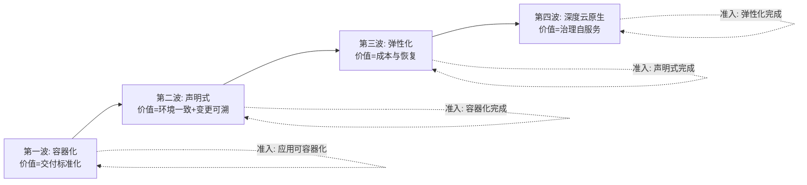

# 演进与反模式：大规模架构的终局思考

> **一句话摘要**：大规模架构没有「终局」，只有**持续演进的「当前最优解」**——每一步演进都在解决上一个阶段的问题并引入新问题；反模式清单是演进路上的「护栏」——它们不会让你走得更快，但能让你不走错方向。

> **本文核心**：机制链 = **评估（当前瓶颈在哪一层）→ 四波演进（容器化→声明式→弹性化→深度云原生）→ 每波的准入条件与退出标准 → 反模式清单护航 → 5 年视角（什么变什么不变）**——演进策略的本质是「价值前置 + 风险后置」的排序艺术。

前置阅读：全系列 1-12 篇。反模式清单是本篇的核心交付物——它们是「演进路上的安全护栏」。

## 1. 背景：为什么大规模架构没有「终局」

业务量持续增长、技术持续演进、团队持续扩大——**架构是一个「移动靶」**：今天的最优解可能是明天的瓶颈。大规模架构的正确心智不是「设计一个完美架构」，是**「建立一套持续演进的机制」**：监控瓶颈信号 → 评估演进方向 → 分步实施 → 验证效果 → 循环。

## 2. 核心机制：四波演进与反模式清单

**反模式清单**（大规模架构的十大反模式）：

| # | 反模式 | 危害 | 正确做法 |
|---|---|---|---|
| 1 | 大爆炸重写 | 两年周期业务停摆 | 绞杀者模式逐步替换 |
| 2 | Lift-and-Shift 当终点 | 只拿到「更贵的机房」 | 容器化是过渡态不是终点 |
| 3 | 微服务先行 | 拆分先于平台能力 | 先容器化再逐步微服务化 |
| 4 | 平台大而全上线 | 团队消化不了 | 按痛点逐个引入 |
| 5 | 分库分表过早 | 复杂度无谓引入 | 先索引/缓存/读写分离 |
| 6 | 迁移了架构没迁移组织 | 康威定律退化 | 组织与架构同步演进 |
| 7 | 无演练的容灾 | 切换即二次事故 | 容灾演练常态化 |
| 8 | 一次性安全建设 | 随架构演进失效 | 安全融入 CI/CD 持续运行 |
| 9 | 无成本治理的弹性 | 弹性=成本失控 | FinOps 与弹性同步 |
| 10 | 迁移完成后松懈 | 架构随业务演进逐渐劣化 | 持续治理是常态 |

反模式的价值：**它们不会让你走得更快，但能让你不走错方向**——每一条反模式背后都是多个团队的真实教训。

## 3. 落地实践：5 年视角——什么会变什么不会变

**不会变的**（机制层的永恒真理）：

- 数据一致性与可用性的权衡（CAP）
- 网络不可靠（延迟/丢包/分区）
- 缓存与持久化存储的层级
- 故障必然发生，演练是唯一验证
- 安全需要纵深防御

**会变的**（技术层的持续演进）：

- 具体的工具与框架（K8s→新编排器？）
- 编程语言与运行时（Java/Go/Rust/Wasm）
- 基础设施形态（VM→容器→Serverless→???）
- 数据存储引擎（MySQL→NewSQL→??）

**5 年视角的判断框架**：

1. **机制层投资优先**——学 CAP/一致性/GC 原理，这些 20 年不变。
2. **工具层保持警惕**——K8s 5 年后可能被替代，但「声明式+控制循环」的思想不会。
3. **量级分档贯穿始终**——10w/千万/亿级的三档思维模式跨语言跨平台。

## 4. 生产视角：演进中的组织形态

- **第一阶段：全员全能**（10 人团队）：每人什么都做——效率高但依赖个人英雄。
- **第二阶段：按层分工**（50 人团队）：前端/后端/运维/DBA 各司其职——效率提升但墙出现。
- **第三阶段：按业务域组队**（200 人团队）：流对齐团队自治交付，平台团队提供基础设施——微服务架构的团队形态。
- **第四阶段：平台工程**（500+ 人团队）：平台团队建设自助门户，业务团队自助使用——「开发者只写业务逻辑，基础设施由平台自动管理」。

## 5. 主流系统怎么做：演进路线的验证

| 验证手段 | 机制 | 产出 |
|---|---|---|
| 架构适配度函数 | 用自动化测试验证架构约束是否被遵守 | CI 门禁 |
| 技术雷达 | 定期评估新技术与工具的成熟度 | 技术选型的输入 |
| ADR 决策记录 | 每个架构决策留痕（背景/决策/后果） | 决策可追溯 |
| 混沌工程 | 持续验证系统韧性 | 韧性的实证 |
| DORA 四指标 | 度量交付效能（频率/前置/MTTR/失败率） | 演进的量化反馈 |

规律：**演进的验证手段也在演进**——从「专家评审」到「自动化门禁」到「混沌工程」到「AI 辅助分析」——验证的自动化程度与演进的效率正反馈。

## 6. 典型场景

- **大促备战**（节奏级）：大促前 3 个月的备战清单——容量/演练/预案/冻结，全部就位。
- **技术债大扫除**（债务级）：每季度的技术债清理专项——「技术债的利息」在持续累积。
- **新 CTO 的云原生议程**（决策级）：接手存量团队后的头 90 天——先做自评与应用画像，再定路线。

## 7. 与相邻概念的区别

- **演进 vs 重构**：演进是「随业务量变化的持续调整」；重构是「不改变行为的前提下改善代码结构」——演进的粒度更大（涉及架构层面），重构的粒度更小（代码/模块层面）。
- **本篇 vs 系列所有篇章**：本篇是「知识地图的最终收束」——把 1-12 篇的单方向知识组装成组织级演进路线，反模式清单是路线图的安全护栏。
- **演进 vs 全系列**：本系列从篇 1 到篇 41（Java）到本系列（large-scale）——大规模架构的知识从「理念」到「分层」到「演进」的全覆盖。

## 8. 常见误区与不适用

- **「演进路线一次规划管五年」**：业务与技术都在变化——路线需要年度评审与调整；「五年计划」是方向指引不是执行清单。
- **「技术债等有空再还」**：技术债的「利息」（维护成本+bug 率+新人上手成本）持续累积——技术债需要纳入迭代规划（20% 时间常态化偿还）。
- **「反模式清单有了就不会犯」**：清单是知识不是护栏——「护栏」需要 CI 门禁/评审 checklist/架构治理委员会来强制执行。
- **不适用**：无持续演进需求的小系统（一次性设计可能更经济）；架构稳定且无增长压力的系统——「持续演进」的前提是「业务在持续增长」。

## 9. 你们可能会问

- **大规模架构的「终局」是什么？** 没有终局——业务增长与技术演进永不停歇；「终局思维」是「为下一阶段留好扩展点」而非「设计一个终极架构」。
- **怎么判断「架构到了必须重构的时候」？** 四信号：发布频率下降、故障率上升、新功能开发变慢、团队流失率上升——四个信号同时出现就是重构的信号。
- **怎么向管理层争取架构演进的投资？** 三笔账：交付账（发布频率与故障 MTTR）、资源账（利用率提升幅度）、风险账（故障爆炸半径与回滚速度）——用业务语言讲技术演进。
- **技术债的「利息」怎么量化？** 维护成本（bug 率 × 修复时间）+ 上手成本（新人理解时间）+ 机会成本（因为技术债无法快速实现的需求价值）——量化后与技术债偿还成本对比。
- **本系列学完了下一步是什么？** 进入专题层深度实战（16 篇从千万订单到 1000 服务的全链路实战），或选择特定方向深入（特性层子系列）——知识地图画完了，风景在地图之外。

## 10. 一句话总结 + 5W 速记卡 + 自测三问

**🎯 核心带走**：

- **核心一句话**：大规模架构没有终局，只有持续演进的当前最优解——四波路线 + 反模式清单 + 5 年视角构成演进的导航系统；「知道什么变什么不变」是架构师最重要的能力。

**5W 速记卡**：

| 维度 | 内容 |
|---|---|
| What | 四波演进 + 反模式清单 + 5 年视角决策框架 |
| Why | 一步到位与大爆炸是迁移失败的最高频形态 |
| When | 云原生立项、迁移规划、年度架构评审、技术债治理 |
| Where | 组织级（技术+组织+流程三线同步） |
| How | 画像排序 → 四波推进 → 反模式护航 → 5 年视角校准 |

💡 **实战提示**：技术债纳入迭代规划常态化偿还；反模式清单进评审 checklist；ADR 决策记录让架构演进可追溯；5 年视角校准方向。

**开放问题**：AI 辅助的架构设计（从需求直接生成架构方案）正在兴起——「架构师」的角色会从「设计方案」变成「验证与微调 AI 方案」吗？架构经验的价值会贬值吗？

**决策（何时用）**：大规模架构的规划、评估、演进全场景；推荐「反模式清单」作为迁移项目的安全护栏；推荐「5 年视角」作为架构决策的终局校验。

**Trade-off（代价与反方案）**：演进用「长周期与新旧共存成本」换「风险分散与持续价值兑现」；反方案——大爆炸重写（周期短，风险集中且以年计）、不迁移（稳定，代价是瓶颈固化与人才流失）；「每波价值兑现」与「总体最优路线」存在张力——务实的选择是「波内求最优、波间可调整」。

**演进视角**：大规模架构的知识从「个人经验」（2015 前后先驱者）到「方法论框架」（2018+ CNCF 与咨询公司体系化）到「平台工程产品化」（2020s 迁移工具与评估模型）——迁移正在从「艺术」变成「工程」，但每个组织的迁移故事仍是独一无二的——方法论框住风险，业务现实决定路线。

---

## 🎓 大规模架构入门层全 13 篇收官

从分层全景（篇 1）到演进路线（篇 13），大规模架构入门层的知识面全覆盖——专题层 16 篇深度实战、特性层子系列源码级深挖、整合层体系收束，待后续批次按占位展开。

---

## 📌 数据与事实声明

四波演进路线与反模式清单为云原生迁移领域公开共识（CNCF 白皮书、Gartner 迁移模型与行业案例的机制级归纳）；「绞杀者模式」出自 Martin Fowler（2004）；12-Factor 为公开方法论；失败率表述为行业观察的定性归纳。以公开资料为准。

## 📚 参考资料

| 类型 | 标题 | 来源 |
|---|---|---|
| 文章 | Strangler Fig Application（Martin Fowler） | martinfowler.com |
| 方法论 | The Twelve-Factor App | 12factor.net |
| 图书 | Accelerate（DORA 四指标的出处） | IT Revolution |
| 系列文章 | 本系列全部篇章 + 专题层 16 篇深度实战 | 本仓库 large-scale/ |
