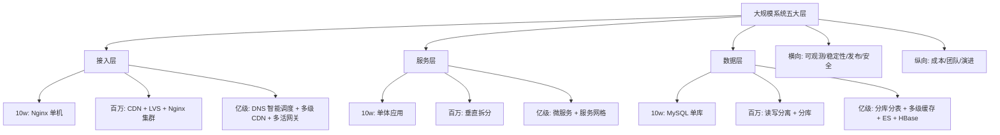

# 大规模架构是什么与分层全景

> **一句话摘要**：大规模架构 = 「当用户量/数据量/并发量跨越量级阈值时，系统每个层面必须做出的结构性改变」——不是加机器，是分层重构：接入层从单机到 CDN+多级网关，服务层从单体到微服务+网格，数据层从单库到分库分表+多级缓存+搜索。

> **本文核心**：机制链 = **量级增长 → 每层遇到瓶颈 → 结构性重构该层 → 联动影响上下层 → 下一瓶颈浮现**——大规模架构不是「设计一次管到底」，是「随量级演进的持续结构变革」。

前置阅读：[系列导读](./0_系列导读-全景.md)。分层设计的理论根基见[系统架构演进全景](../../../system-design/distributed-system-design/入门层/从零开始认识分布式系统设计系列/2_系统架构演进全景-入门.md)。

## 1. 背景：量级增长的三次「必变时刻」

10w 日活的系统与亿级日活的系统，表面上是「同一套代码不同配置」，实质上是**不同的架构物种**。三次「必变时刻」：

- **10w → 百万**：数据库单表撑不住了 → 分库分表 / 读写分离 / 缓存引入
- **百万 → 千万**：服务间调用成网状、单机房容灾不够 → 微服务拆分 / 同城双活 / 消息队列解耦
- **千万 → 亿级**：多机房/多地域部署、单元化路由 → 异地多活 / CDN 全覆盖 / 平台化

每一个「必变时刻」都是一次结构性重构——不是「加机器」能解决的，是**架构层面需要重新设计**的信号。

## 2. 核心机制：分层全景与各层的量级阈值

分层拆解（每层追问「量级阈值在哪」）：

- **接入层**：10w 用 Nginx 单机（10w QPS 是 Nginx 天花板的 1/10）；百万级需要 LVS 四层负载 + Nginx 七层集群；亿级需要 DNS 智能调度（按地域路由到最近接入点）+ 全网 CDN + 多活网关。**上下游联动**：接入层的限流策略直接决定服务层需要扛多少 QPS。
- **服务层**：10w 用单体（部署简单、事务容易）；百万级垂直拆分（按业务线拆应用）；亿级微服务 + 服务网格（服务数从个位数到千位数）。**Trade-off**：拆得越细，运维越复杂——「拆到什么粒度」是团队规模与业务复杂度的函数，不是技术偏好。
- **数据层**：10w 用 MySQL 单库（足够）；百万级读写分离 + 按业务分库；亿级分库分表（1024 张表量级）+ Redis 多级缓存 + Elasticsearch 搜索 + HBase 海量存储。**Trade-off 量级三档**：10w 用 MySQL 单库足够 / 千万级分库分表 + Redis 缓存 / 亿级多活数据层 + 异构存储全家桶。

## 3. 落地实践：量级分档自评

| 维度 | 10w 档 | 千万档 | 亿级档 |
|---|---|---|---|
| 日活用户 | <10w | 百万-千万 | 亿级 |
| 峰值 QPS | <1000 | 万级 | 十万级+ |
| 数据量 | <100GB | TB 级 | PB 级 |
| 服务数 | 1-5 | 10-50 | 100-1000 |
| 团队规模 | 5-20 人 | 50-200 人 | 200+ 人 |
| 发布频率 | 周/月 | 日 | 日多次 |

用这张表自评：你的系统在哪一档？下一档的瓶颈信号出现了吗？

## 4. 生产视角：量级误判的形态

- **「过早优化」**：10w 日活就用微服务 + 分库分表 + K8s——架构复杂度远超业务需要，团队被基础设施淹没。
- **「过晚优化」**：千万日活还在单库——数据库成为全站瓶颈，每次慢查询都影响全站 RT。
- **「跳档优化」**：从 10w 直接到亿级架构——中间档次的验证空缺，问题只在最终量级暴露。
- **「各层不同步」**：接入层升了（CDN+多级网关），数据层还是单库——全站瓶颈从接入层转移到数据层。

## 5. 主流系统怎么做：分层全景的行业兑现

| 层 | 10w 档 | 千万档 | 亿级档 |
|---|---|---|---|
| 接入 | Nginx | CDN+LVS+Nginx 集群 | DNS 智能调度+多级 CDN+多活网关 |
| 服务 | 单体 | 垂直拆分+RPC | 微服务+网格+服务治理平台 |
| 数据 | MySQL 单库 | 读写分离+分库 | 分库分表+Redis 多级+ES+HBase |
| 缓存 | 本地缓存 | Redis 单实例 | Redis Cluster+多级缓存+本地缓存 |
| 消息 | 无 | RabbitMQ 单实例 | Kafka/RocketMQ 集群+多 Topic |
| 可观测 | 日志文件 | ELK+基础监控 | 全链路追踪+Metrics+告警体系 |

## 6. 典型场景

- **电商大促**（流量级）：从日常到峰值的 10-50 倍流量突增——接入层限流、服务层弹性、数据层缓存的联动。
- **社交内容分发**（数据级）：亿级用户的内容读写——分库分表 + 缓存 + CDN 的组合。
- **金融交易**（一致性级）：资金链路的强一致要求——分库分表与事务的权衡。

## 7. 与相邻概念的区别

- **大规模架构 vs 微服务架构**：微服务是服务层的一种组织方式；大规模架构涵盖接入/服务/数据/横向/纵向五层——微服务只是其中一层的策略之一。
- **大规模架构 vs 高并发**：高并发是「单点如何扛更多请求」（技术问题）；大规模架构是「系统整体如何承载更多业务」（架构问题）——并发是手段，规模是目标。
- **分层全景 vs 单点优化**：单点优化解决「这一层慢了」；分层全景解决「系统为什么到瓶颈了、应该改哪层」——视角不同。

## 8. 常见误区与不适用

- **「大规模 = 加机器」**：加机器解决水平扩展层的容量问题——不能解决数据一致性、服务治理、运维复杂度的问题。
- **「架构要一步到位设计到亿级」**：过度设计比不足更危险——每一步「为未来设计」的复杂度都在当下产生维护成本。
- **「大规模架构 = 微服务 + K8s + 分库分表」**：这是特定量级的特定方案——真正的能力是「知道什么量级该用什么方案」。
- **不适用**：10w 日活以下的系统（优化单体更有效）；非互联网业务（企业内部系统的「大规模」含义完全不同）。

## 9. 你们可能会问

- **怎么判断我的系统到了哪个量级档？** 三问：日活/峰值 QPS 是多少（流量档）？数据量多大（数据档）？团队多少人（组织档）——三者取最大值定位。
- **从 10w 到百万的关键改变是什么？** 一件事：数据库不能单库了。其他的（缓存、消息、微服务）都是围绕这个展开的。
- **为什么缓存是数据层的第一道扩展？** 因为读请求通常占 90%+，缓存把读压力从 DB 卸载——最低成本解决最大头的压力。
- **演进路线中哪一步最容易出错？** 数据层——分库分表一旦做了就很难回退（数据已分散），schema 变更涉及全部分片；应用层的演进可以反复，数据层的演进必须一次做对。
- **怎么向团队传达演进路线？** 用本篇的分层全景图作为沟通工具——每一层标注「当前状态 → 下一档的变化 → 触发条件」，让全团队看到同一张地图。

## 10. 一句话总结 + 5W 速记卡 + 自测三问

**🎯 核心带走**：

- **核心一句话**：大规模架构 = 「量级增长 → 分层重构 → 联动演进」的持续过程——每一层都有量级阈值，跨过阈值就要结构性重构该层并联动上下层。

**5W 速记卡**：

| 维度 | 内容 |
|---|---|
| What | 五层分层全景 + 量级三档阈值 + 各层演进路线 |
| Why | 量级增长是必然的，每层的结构性瓶颈是可预见的 |
| When | 架构评审、容量规划、性能瓶颈归因 |
| Where | 接入/服务/数据/横向/纵向五层 |
| How | 量级自评 → 定位当前档 → 监控下一档触发信号 → 分波演进 |

💡 **实战提示**：用分层表自评定位；监控下一档的触发信号；架构演进是分波的不是一步的；数据层演进必须一次做对。

**开放问题**：Serverless 和云托管服务的普及正在把「量级驱动的架构演进」部分外包给云厂商——未来的架构师需要掌握的「分层演进知识」会减少还是转向新的层面？

**决策（何时用）**：架构评审、容量规划、性能瓶颈归因全场景；推荐「分层全景图 + 量级自评表」作为架构评审的固定工具。

**Trade-off（代价与反方案）**：每个层的演进都有代价——缓存引入一致性挑战、微服务引入运维复杂度、分库分表引入跨片查询——**大规模架构的全部智慧在于：知道什么时候该动哪一层、动到什么程度**。

**演进视角**：从「一个 MySQL 打天下」到「微服务 + 多活 + 平台化」，大规模架构的演进是「业务量驱动技术形态」的最好案例——每个技术决策的背后都是一个量级阈值，每个阈值背后都是一次业务增长的里程碑。

---

**下篇预告**：从接入层开始逐层拆解——下一篇[流量接入与防护](./2_流量接入与防护-DNS网关CDN-入门.md)讲 DNS/CDN/网关/限流四道防线。

---

## 📌 数据与事实声明

分层模型与量级分档为大规模架构领域公开共识（大型网站技术架构、DDIA 等）；具体阈值数字为教学示意，以实际业务压测为准；各层技术方案为公开技术资料的机制级归纳。以实际压测与业务数据为准。

## 📚 参考资料

| 类型 | 标题 | 来源 |
|---|---|---|
| 图书 | 大型网站技术架构 | 电子工业出版社 |
| 图书 | 数据密集型应用系统设计（DDIA） | O'Reilly |
| 系列文章 | 本系列全部篇章 | 本仓库同系列 |
