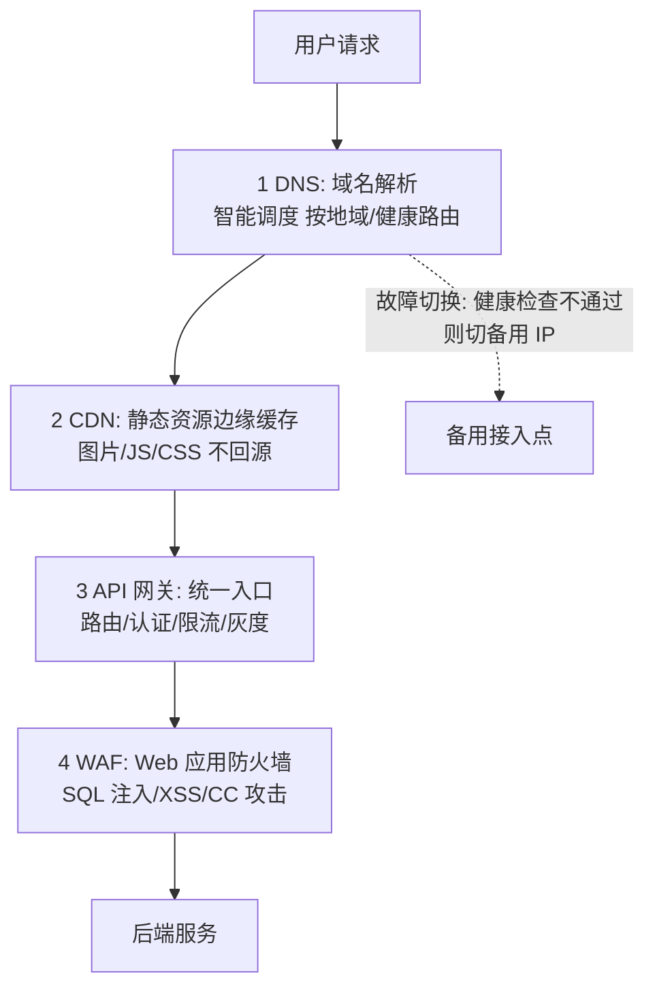

# 流量接入与防护：DNS / 网关 / CDN

> **一句话摘要**：接入层 = 流量进入系统的**四道防线**——DNS（去哪拿）、CDN（就近拿）、网关（统一入口+路由+限流）、WAF（防攻击）；每道防线解决不同的问题，顺序不可变，跳过任何一道都会让后面的防线承受本可拦截的流量。

> **本文核心**：机制链 = **用户请求 → DNS 解析（路由到最近/最健康的接入点）→ CDN（静态资源边缘缓存）→ 网关（路由/认证/限流/灰度）→ WAF（防攻击）→ 后端服务**——接入层的核心职责是「在流量到达业务代码之前，把不该进来的挡住、该缓存的缓存掉、该路由到对的路由对」。

前置阅读：[大规模架构是什么与分层全景](./1_大规模架构是什么与分层全景-入门.md)。

## 1. 背景：为什么接入层值得单独一篇

接入层是全链路的「第一道关卡」——它决定了多少流量能进来、进来的流量怎么分配、恶意流量怎么拦截。接入层设计不当的后果不是「慢一点」，是**全站不可用**：DNS 配错 = 用户找不到你；CDN 缺失 = 所有静态流量打到源站；网关无限流 = 洪峰直接穿透到数据库。接入层的投入产出比在全链路中最高——一层配置影响全部流量的质量。

## 2. 核心机制：四道防线的分工与联动



- **DNS 的两种角色**：① 域名解析（用户输入域名 → 返回 IP）；② 智能调度（根据用户地理位置/接入点健康状态返回不同 IP）——大型系统的 DNS 是「流量的第一层分配器」，不是简单的名称翻译。
- **CDN 的缓存策略**：静态资源（图片/JS/CSS）设置长 TTL（Cache-Control: max-age=31536000）+ 文件名带 hash（内容变 = 文件名变 = 缓存自然失效）；动态 API 通常不缓存（除非加短 TTL + 大imiz）。CDN 的命中率每提升 10%，源站压力下降约 10-20%。
- **网关的四大职责**：① 路由（按 path/header 分发到后端服务）；② 认证（Token/JWT 校验）；③ 限流（令牌桶/漏桶，保护后端）；④ 灰度（按用户/权重路由到不同版本）。**网关是「所有横切关注点」的集中处理点**——没有网关，这些逻辑必须在每个服务里重复实现。
- **WAF 的攻防模式**：SQL 注入（模式匹配拦截）、XSS（输出编码拦截）、CC 攻击（频率限制拦截）——WAF 的核心价值是「在流量到达业务代码之前拦截已知攻击模式」，但它挡不住「零日漏洞」和「业务逻辑攻击」（这些靠代码安全）。

## 3. 落地实践：接入层的工程配置

```text
DNS 配置:
  - 主域名 A 记录 → 接入点 IP 列表
  - 多活场景: 按地域分线路(电信/联通/海外)
  - 健康检查: 定时探测接入点, 异常自动切备用

CDN 配置:
  - 静态资源域名: static.example.com → CDN
  - Cache-Control: max-age=31536000, immutable
  - 动态 API 域名: api.example.com → 直连源站(不过 CDN)

网关配置:
  - 路由: /api/orders → order-service
  - 限流: 全局 10000 QPS + 单用户 100 QPS
  - 灰度: weight-based 5% → 新版本
  - 超时: connect 3s / read 5s / write 5s

WAF 配置:
  - SQL 注入规则: 开启
  - CC 攻击: 单 IP 60s 内 > 100 次则拦截
  - 白名单: 内网 IP / 健康检查 UA
```

三条纪律：① **超时全链路显式配置**（DNS TTL / CDN TTL / 网关三超时 / 服务超时，每层超时 < 上层超时）；② **限流分级**（全局 → 网关 → 服务 → 方法，每层独立设限）；③ **灰度分层**（DNS 按地域 → 网关按用户 → 服务按权重，三层灰度联动）。

## 4. 生产视角：接入层的事故形态

- **DNS 故障的全站不可达**：DNS 服务商故障 → 所有用户解析不到 IP → 全站不可达。防线：双 DNS 服务商 + 低 TTL（300s）+ 客户端缓存兜底。
- **CDN 缓存污染**：CDN 节点缓存了被篡改的内容——全用户看到错误内容。防线：CDN 内容签名 + 关键资源不走 CDN。
- **网关单点的全站阻塞**：网关集群全部故障 → 所有请求无法到达后端。防线：网关多可用区部署 + 绕行通道（直连服务 IP，应急用）。
- **限流阈值误配的体验事故**：限流阈值设得太低（正常流量也被限）——大量用户收到 429。预防：限流阈值基于压测 + 流量模型分析，不拍脑袋。
- **灰度策略错误的全量发布**：灰度比例配置错误（5% 写成 95%）——未验证的新版本直接服务全量流量。防线：灰度比例变更走审批 + 灰度期监控自动回滚。

## 5. 主流系统怎么做：接入层工具链

| 层 | 主流方案 | 机制要点 |
|---|---|---|
| DNS | DNSPod / Route53 / Cloudflare | 智能调度 + 健康检查 + 地域路由 |
| CDN | Cloudflare / Akamai / 阿里 CDN | 边缘缓存 + DDoS 防护 + WAF 集成 |
| 网关 | Nginx / Kong / APISIX / 云网关 | 路由 + 限流 + 认证 + 灰度 |
| WAF | ModSecurity / 云 WAF | 攻击模式库 + 自定义规则 |
| 全局负载均衡 | GSLB / GTM | 多机房/多 Region 流量分配 |

## 6. 典型场景

- **大促流量接入**（峰值级）：CDN 预热 + 网关限流分级 + WAF 白名单调整——三防线联动备战。
- **多机房容灾切换**（容灾级）：DNS 智能调度 + 全局负载均衡——机房间流量自动分配与故障切换。
- **灰度发布**（发布级）：网关按用户/权重路由到不同版本——金丝雀发布的流量底座。

## 7. 与相邻概念的区别

- **接入层 vs API 网关**：接入层是「整条入口链路」（DNS+CDN+网关+WAF）；API 网关是接入层的「统一入口组件」——网关是接入层的子集。
- **CDN vs 反向代理**：CDN 是「离用户最近的缓存节点」（边缘部署）；反向代理是「服务端的统一入口」（中心部署）——地理分布与功能定位不同。
- **限流 vs 熔断**：限流在「入口」（拒绝超额请求）；熔断在「调用端」（停止调故障依赖）——限流是「我不想被你打挂」，熔断是「你挂了我不再叫你」。
- **本篇 vs 安全篇**：本篇的 WAF 是「网络层防护」；安全篇的零信任是「身份层防护」——互补不可互替。

## 8. 常见误区与不适用

- **「CDN 只加速静态资源」**：现代 CDN 支持动态加速（路由优化/TLS 终端/边缘计算）——CDN 的能力已远超「缓存文件」。
- **「网关限流阈值越高越好」**：阈值高 = 保护弱——限流的目的是「保护后端」，不是「放更多请求进来」；阈值应基于后端容量而非前端期望。
- **「WAF 能拦截所有攻击」**：WAF 拦截「已知攻击模式」——零日漏洞、业务逻辑攻击、社会工程都不在射程内；WAF 是纵深防御的一层，不是全部。
- **「DNS TTL 越短越好」**：TTL 短 = 切换快但 DNS 查询量增大 = 权威 DNS 压力大——按「故障切换速度需求」与「DNS 查询成本」平衡。
- **不适用**：内部微服务间调用（服务网格治理，不走外层接入）；移动端 Native 网络（有自己的连接管理库）；长连接场景（WebSocket/gRPC 流——接入层策略不同）。

## 9. 你们可能会问

- **四道防线的顺序能变吗？** 顺序基本固定：DNS（路由）→ CDN（缓存）→ 网关（路由/限流）→ WAF（防攻击）。变通：WAF 可集成在 CDN 或网关中（云厂商一体化方案）。
- **多机房场景下 DNS 怎么配？** 按地域分线路（国内/海外）+ 健康检查（探测失败自动切）+ TTL 权衡（短 TTL 快切换但 DNS 查询压力大）。
- **API 网关的限流和服务内限流什么关系？** 网关限流是「粗粒度入口保护」（全 API 级）；服务内限流是「细粒度业务保护」（按业务方法级）——两层配额独立设置。
- **灰度发布在接入层怎么实现？** 三层联动：DNS 按地域灰度（少量城市先切）→ 网关按用户/权重灰度（核心用户先切到新版）→ 服务层金丝雀（内部按实例权重分流）。
- **怎么监控接入层的健康度？** 四指标：DNS 解析成功率与延迟、CDN 命中率、网关 QPS 与错误率、WAF 拦截量——每层独立监控 + 联动告警。

## 10. 一句话总结 + 5W 速记卡 + 自测三问

**🎯 核心带走**：

- **核心一句话**：接入层 = DNS 路由 + CDN 缓存 + 网关治理 + WAF 防护的四道防线——在流量到达业务代码之前，挡住不该进来的、缓存掉重复的、路由到对的、拦截攻击的。

**5W 速记卡**：

| 维度 | 内容 |
|---|---|
| What | DNS/CDN/网关/WAF 四道防线 |
| Why | 接入层是全链路的流量分配与安全拦截第一站 |
| When | 大促备战、多机房容灾、灰度发布、安全加固 |
| Where | 用户 → DNS → CDN → 网关 → WAF → 后端 |
| How | 四层联动配置 → 超时全链路显式 → 限流分级 → 灰度分层 |

💡 **实战提示**：DNS TTL 300s + 双服务商；CDN 静态长缓存 + 动态不过；网关三超时必配；WAF 规则定期更新；灰度三层联动。

**开放问题**：边缘计算（Cloudflare Workers/Lambda@Edge）正在把「计算」也推到接入层——当 CDN 节点能运行业务逻辑，「接入层」和「服务层」的边界会模糊到什么程度？

**决策（何时用）**：一切对外服务的接入层设计；推荐「四道防线分层图」作为接入层架构评审的标准工具；推荐「超时全链路配置表」作为上线检查项。

**Trade-off（代价与反方案）**：每道防线都有代价——DNS 多服务商用「配置复杂度」换「可用性」；CDN 用「缓存一致性风险」换「源站卸载」；网关限流用「请求拒绝」换「后端保护」；WAF 用「误拦截风险」换「攻击拦截」——接入层的全部设计就是在「流量质量」与「流量数量」之间定价。

**演进视角**：接入层从 Nginx 单机（2000s）到 CDN+多级网关（2010s）到「边缘计算」（2020s）——接入层正在从「流量的过滤器」进化为「计算的执行器」；边缘函数的兴起意味着「在哪里运行代码」的答案正在从数据中心向用户身边移动。

---

**下篇预告**：穿过接入层后的服务层怎么设计——下一篇[服务层设计](./3_服务层设计-微服务与服务治理-入门.md)讲微服务拆分、注册发现与服务治理。

---

## 📌 数据与事实声明

四道防线架构与配置参数为行业公开实践；DNS/CDN/WAF 机制为各服务商官方文档；性能量级（Nginx QPS 天花板/CDN 命中率影响）为业内通用认知。以官方文档与自身压测为准。

## 📚 参考资料

| 类型 | 标题 | 来源 |
|---|---|---|
| 文档 | Nginx / Kong / APISIX 官方文档 | 各官方站点 |
| 文档 | Cloudflare / 阿里云 CDN 官方文档 | 各官方站点 |
| 系列文章 | 服务层设计（下一篇） | 本仓库同系列 |
