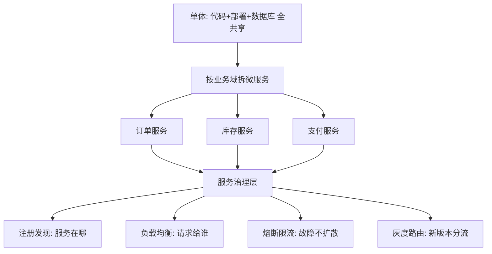
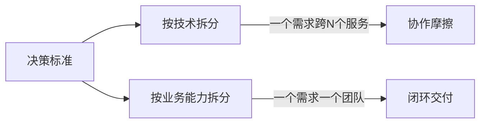

# 服务层设计：微服务与服务治理

> **一句话摘要**：服务层 = 「业务逻辑的运行时组织」——从单体到微服务的拆分不是终点，是**按业务边界将复杂度从代码内部转移到服务间通信**的架构决策；微服务数量的增长带来服务治理（注册发现/通信/容错/灰度）的指数级复杂度——拆分粒度是团队规模与业务复杂度的函数，不是技术偏好。

> **本文核心**：机制链 = **单体瓶颈（发布耦合/资源互抢/团队冲突）→ 按业务域拆微服务 → 服务间通信（RPC/消息）→ 服务治理（注册发现/负载均衡/熔断限流）→ 治理复杂度随服务数指数增长 → 网格与平台化下沉**——拆分的本质是把「代码内的模块边界」升级为「网络上的服务边界」，每多一个服务就多一份网络不可靠与治理开销。

前置阅读：[大规模架构是什么与分层全景](./1_大规模架构是什么与分层全景-入门.md)。服务间通信的机制细节归本仓库 service-governance 子域。

## 1. 背景：单体为什么撑不住

单体的三个结构性瓶颈，在团队和业务规模上去后集中爆发：① **发布耦合**——任何改动都要全量发布，发布频率被最慢的模块拖住；② **资源互抢**——一个模块的内存泄漏拖垮整个进程，无法独立扩容；③ **团队冲突**——多团队改同一代码库，合并冲突与协调成本随团队数平方增长。微服务把这三个问题转化为：**每个服务独立开发/部署/扩容**——代价是服务间通信的复杂度。

## 2. 核心机制：拆分策略与治理体系

拆分策略的追问链：**按什么粒度拆？**——按业务能力（订单/库存/支付）而非技术层（DAO/Service/Controller）；**拆多细？**——以「一个团队能独立开发和部署」为标尺（Two Pizza Team），拆太细反而治理成本爆炸；**数据库也要拆吗？**——理想是每个服务独立数据库（数据库私有），但「一次拆服务+拆数据库」的风险极高，渐进做法是「先拆应用、数据库共享过渡、再逐步拆库」。

## 3. 落地实践：服务治理的工程纪律

1. **接口契约先行**：服务间调用先定 IDL/接口文档（参数/返回值/错误码/超时），后实现——接口即合同。
2. **超时全链路显式**：每个 RPC 调用必须设超时，且**下游超时 < 上游超时**（避免上游还在等、下游已超时的悬空）。
3. **熔断与降级预案**：每个服务的每个下游依赖都有「熔断后的降级方案」（返回缓存/默认值/空结果）——不是「熔断了再说」。
4. **灰度发布标配**：每个服务的新版本先灰度 5% → 观察指标 → 逐步放量——直接全量发布在微服务架构下是赌博。

## 4. 生产视角：微服务的事故形态

- **级联故障**：A 调 B 调 C，C 慢了 → B 的线程池被 C 占满 → B 也慢了 → A 也慢了——级联扩散。防线：熔断（B 调 C 失败率超阈值自动熔断）+ 舱壁隔离（B 调不同下游用不同线程池）。
- **服务发现的脑裂**：注册中心网络分区 → 两个实例组各自认为自己是「活的」→ 双写。防线：注册中心的共识机制 + 客户端容错。
- **循环依赖的部署死锁**：A 依赖 B，B 依赖 A——发布时 A 等 B 先起、B 等 A 先起，谁也不起。解法：事件驱动解耦（A 发消息、B 消费——不直接同步依赖）。
- **数据一致性的分布式事务**：跨服务的写操作（下单扣库存）不再有本地事务——需要 Saga/消息最终一致/TCC（本仓库事务系列专讲）。

## 5. 主流系统怎么做：服务层的工具链

| 环节 | 主流方案 | tips |
|---|---|---|
| RPC | gRPC / Dubbo / Thrift | gRPC 生态最大，Dubbo 国内主流 |
| 注册发现 | Nacos / Consul / etcd | Nacos 国内主流；etcd 与 K8s 原生 |
| 熔断限流 | Sentinel / Resilience4j / Hystrix(退役) | Sentinel 国内生态最全 |
| 服务网格 | Istio / Linkerd | Sidecar 模式治理下沉（云原生篇详述） |
| API 网关 | Kong / APISIX / 云网关 | 统一入口 + 路由 + 限流 |

规律：**Java 生态 Spring Cloud + Dubbo 双雄并存；多语言用 gRPC + Envoy 路线**——选型按团队技术栈与运维能力，不存在「最好」的通用答案。

## 6. 典型场景

- **电商微服务拆分**（交易级）：按业务域拆（订单/商品/库存/支付），数据层逐步解耦——大规模架构最典型的拆分案例。
- **中台服务**（平台级）：多业务线共享的能力（用户/商品/库存）沉淀为中台服务——治理复杂度最高的形态（多租户+多业务线+版本兼容）。
- **遗留系统逐步拆分**（渐进级）：绞杀者模式——新功能用微服务实现，旧功能逐步迁移——不搞大爆炸。

## 7. 与相邻概念的区别

- **微服务 vs SOA**：SOA 强调企业服务总线（ESB）集中路由；微服务去中心化（点对点+智能端点）——治理思想不同：集中 vs 分散。
- **微服务 vs Serverless**：微服务仍需管理运行时（容器/伸缩）；Serverless 完全托管（只写函数）——Serverless 是更极端的服务形态。
- **服务拆分 vs 数据库拆分**：服务拆分是「应用层边界」；数据库拆分是「数据层边界」——理想是同步拆（服务私有数据库），现实常是先拆应用后拆库。
- **本篇 vs service-governance 子域**：本篇讲「服务层的架构设计」（拆分策略/治理体系概览）；service-governance 讲「每个治理机制的深入机制」——概览与深挖的分层。

## 8. 常见误区与不适用

- **「微服务 = 拆得越细越好」**：服务数超过团队维护能力后治理成本反噬——「两个 Pizza 团队管一个服务」比「一个团队管十个微服务」更健康。
- **「拆了微服务就自动解耦了」**：物理拆分 ≠ 逻辑解耦——如果服务间的依赖关系设计不合理（循环依赖/共享数据库），拆了照样耦合。
- **「先拆了再治理」**：服务治理（注册发现/熔断/灰度）必须在拆之前就位——没有治理的微服务比单体更危险。
- **「每个服务都要独立数据库」**：理想但不现实（跨服务事务复杂度爆炸）——渐进策略是「先共享、逐步拆」，关键是有拆的时间表。
- **不适用**：团队 < 5 人的小项目（单体的交付效率更高）；计算密集型单体（无 IO 瓶颈不需要拆）；强事务一致性要求且无法最终一致的场景（分布式事务成本过高）。

## 9. 你们可能会问

- **微服务拆分的粒度怎么定？** 三个标尺：① 一个团队能独立开发部署；② 一个服务的故障不影响其他服务；③ 一个服务的数据不需要跨服务事务——三条同时满足才拆。
- **怎么处理跨服务的数据一致性？** 优先消息最终一致（可靠消息+幂等消费+对账兜底）；强一致场景用 TCC/Saga（事务系列专讲）——能用最终一致就不上分布式事务。
- **服务间通信选同步还是异步？** 需要实时结果用同步（RPC）；不需要实时结果用异步（消息）——「需要等多久」决定通信方式。
- **服务治理的监控指标有哪些？** 四维度：调用量（QPS）、成功率、RT 分位值、依赖健康度——每个维度都要有独立的告警阈值。
- **微服务数量什么时候「够了」？** 当新增一个业务功能的边际成本开始上升（需要改 N 个服务才能加一个功能）——「边际成本上升」就是拆分过细的信号。

## 10. 一句话总结 + 5W 速记卡 + 自测三问

**🎯 核心带走**：

- **核心一句话**：服务层 = 把业务逻辑按边界拆为独立部署的服务——微服务解决发布/资源/团队三个单体瓶颈，代价是服务治理复杂度；粒度按「团队自治」定，不按技术偏好。

**5W 速记卡**：

| 维度 | 内容 |
|---|---|
| What | 拆分策略 + 注册发现 + 通信 + 熔断灰度 |
| Why | 单体的发布/资源/团队三瓶颈在规模化后必然爆发 |
| When | 团队 > 10 人、发布频率受耦合拖累、需要独立扩容时 |
| Where | 服务层（应用运行时组织方式） |
| How | 业务域拆分 → 契约先行 → 治理就位 → 灰度标配 |

💡 **实战提示**：先治理后拆分；契约先行后实现；熔断降级预案在拆之前定；接口变更走评审。

**开放问题**：虚拟线程与 Service Mesh 的成熟让「拆服务的理由」从技术变成了组织——当技术瓶颈消失后，服务拆分的粒度会回归到纯组织问题吗？

**决策（何时用）**：团队 > 10 人且发布耦合明显时启动微服务化；推荐「两 Pizza 原则 + 契约先行 + 灰度标配」进团队微服务规范。

**Trade-off（代价与反方案）**：微服务用「网络复杂度 + 治理开销 + 数据一致性成本」换「独立部署 + 独立扩容 + 团队自治」；反方案——模块化单体（简单，代价是部署耦合）、Serverless（免运维，代价是绑定）、SOA（集中治理，代价是 ESB 瓶颈）——拆分的每一刀都在「自治收益」与「治理成本」之间定价。

**演进视角**：从单体（1990s）到 SOA（2000s）到微服务（2014+）到服务网格（2017+）到虚拟线程时代的重新思考（2023+）——服务形态的演进是「复杂度在代码/网络/平台三层之间的持续转移」；终点方向是「业务逻辑纯净、复杂度全部平台化」——每一代演进都在逼近这个理想。

---

**下篇预告**：数据的分层拆解——下一篇[数据层设计](./4_数据层设计-分库分表与缓存-入门.md)讲分库分表/缓存/搜索三层的数据架构。

---

### 量级视角与一次值得思考的拆分

10 万 QPS 以内，服务拆到 5-10 个「业务服务」就够了——拆得太细，注册发现、链路追踪、发布协调的复杂度会先于收益到来。千万级日订单起，团队边界倒逼服务边界，拆分粒度跟着组织走。这里有一个值得思考的判断题：**服务该按「技术功能」拆还是按「业务能力」拆？**——按技术拆（用户库服务、订单库服务、消息服务）看起来复用性好，实际会造成每个业务需求横跨所有服务，改一个功能要三个团队排期；按业务能力拆（订单服务包含自己的表和缓存），单个需求一个团队闭环。行业踩了几轮坑后的共识是：**按业务能力拆，技术细节下沉平台**。拆分错了的代价不是性能，是组织协作的永久摩擦——拆分决策值得多花一周想清楚，省下的将是数年的沟通成本。

服务层还有一个高频追问：**拆开之后怎么保证它们还是一个系统？**——答案是三份契约：接口契约（API 规范与版本策略）、数据契约（谁能读谁的数据、跨服务查询怎么处理）、事件契约（什么状态变化要广播给谁）。三份契约越清晰，服务越「散而不乱」；契约缺失的微服务集群，表面是几十个独立服务，实际是一堆靠人肉记忆耦合的隐形单体——这是微服务失败案例里最常见的形态。新人加入时能不能在一天内画出「服务依赖图」，是契约健康度的快速检验法。

## 📌 数据与事实声明

微服务拆分策略与治理体系为行业公开实践（Sam Newman《Building Microservices》、Martin Fowler 微服务系列）；工具定位为各项目官方文档；「Two Pizza Team」出自 Amazon 公开管理实践。以官方文档为准。

## 📚 参考资料

| 类型 | 标题 | 来源 |
|---|---|---|
| 图书 | Building Microservices（Sam Newman） | O'Reilly |
| 图书 | Java 并发编程实战（微服务的并发基础） | Addison-Wesley |
| 系列文章 | 数据层设计（下一篇） | 本仓库同系列 |
