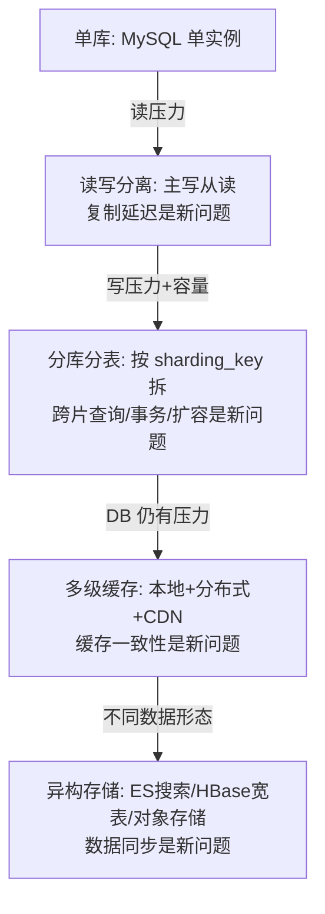
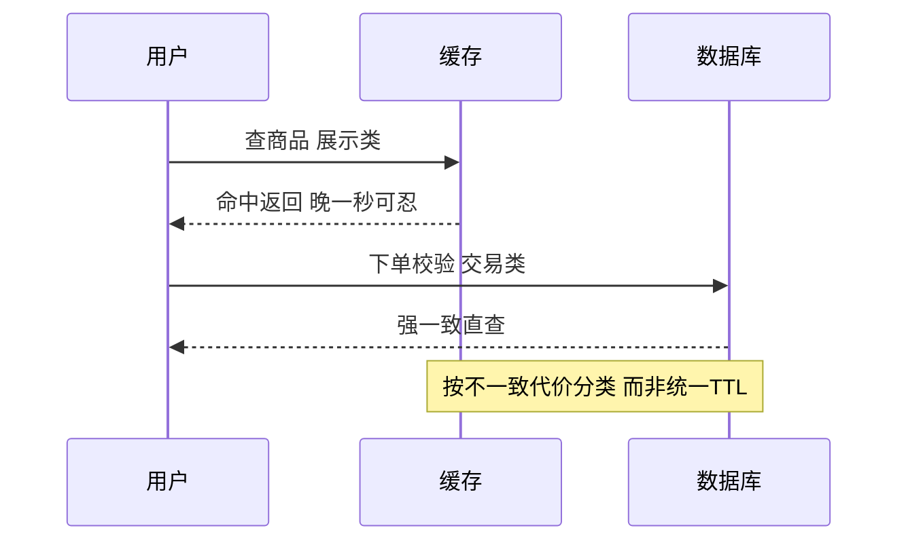

# 数据层设计：分库分表与缓存

> **一句话摘要**：数据层 = 大规模架构的「最终瓶颈」——**计算可以无限加机器，数据的一致性与容量受物理限制**；数据层的演进路线是「单库 → 读写分离 → 分库分表 → 多级缓存 → 异构存储」，每一步都是在「数据量增长」与「一致性/复杂度代价」之间的权衡——**数据层的迁移不可逆，每次分片都必须一次做对**。

> **本文核心**：机制链 = **单库瓶颈（连接数/存储容量/QPS 上限）→ 读写分离（读扩展）→ 分库分表（写扩展+容量扩展）→ 多级缓存（减少 DB 压力）→ 异构存储（不同数据形态用不同存储）→ 跨片查询/事务/扩容是新问题**——数据层设计的核心是「读路径优化」与「写路径拆分」两条线的独立演进。

前置阅读：[服务层设计](./3_服务层设计-微服务与服务治理-入门.md)。分库分表的实现细节归本仓库 data/mysql 系列。

## 1. 背景：数据层为什么是「最终瓶颈」

计算可以水平扩展（无状态服务加机器即可），但**数据有状态**：一致性要求、事务边界、存储容量、连接数上限都是物理约束。当写入 QPS 超过单库上限（通常万级量级）、单表行数超过千万级（B+ 树深度导致性能退化）、单库存储超过 TB 级（备份/迁移时间不可接受）——就到了「必须拆」的时候。

拆的方式决定了解决什么问题：**分库**解决连接数与 QPS 瓶颈；**分表**解决单表容量与索引性能瓶颈；**读写分离**解决读多写少的压力分布；**缓存**减少对 DB 的直接访问。**通常按「先缓存、再读写分离、最后分库分表」的顺序**——每一步的复杂度递增，优先用最简单的手段解决当前瓶颈。

## 2. 核心机制：四步演进与新问题



- **读写分离的复制延迟**：主从复制是异步的——写后立即读从库可能读到旧数据。对策：关键路径强制读主（`FORCE_MASTER`）、会话内读己之写、业务容忍秒级延迟。复制延迟是**结构性的**，无法消除只能管理。
- **分库分表的分片键选择**：分片键决定数据分布与查询路由——选得好则查询精确路由到单片（高效），选错则需要广播查询（全分片扫——性能灾难）。**分片键 = 最高频查询条件**（如 user_id、order_id），这是数据层设计最关键的一次决策。
- **跨片查询的三种对策**：① 冗余双写（两张分片表，按不同分片键各建一份——空间换时间）；② 异构索引（写入 MySQL + 同步到 ES——查询走 ES）；③ 聚合层（中间件聚合多分片结果——复杂度高）。**没有万能方案，按查询模式选**。
- **缓存的三级体系**：本地缓存（进程内，微秒级）→ 分布式缓存（Redis，毫秒级）→ DB（磁盘，十毫秒级）——命中率逐级递减但延迟逐级递增。**缓存一致性的主流方案是「先更新 DB 再删缓存」（Cache-Aside）**——不是完美一致，是最终一致（延迟窗口毫秒到秒级）。

## 3. 落地实践：数据层的设计决策

```text
第一步: 判断是否需要拆
  - 单表行数 > 500 万? (B+ 树深度导致索引效率下降)
  - 单库 QPS > 5000? (MySQL 连接数与 IO 上限)
  - 单库存储 > 500GB? (备份时间不可接受)
  三条全没到 -> 优化索引和SQL比拆表有效

第二步: 选分片键
  - 最高频查询条件 (user_id/order_id)
  - 均匀分布 (避免数据倾斜)
  - 不可变 (变更分片键=数据迁移)

第三步: 定分片算法
  - Hash 取模: 均匀但扩容需迁移
  - Range 范围: 扩容方便但可能倾斜
  - 一致性哈希: 扩容只迁移邻近数据

第四步: 缓存策略
  - 读: Cache-Aside (先缓存, miss 则查 DB 回填)
  - 写: 先更新 DB 再删缓存
  - TTL: 随机抖动防雪崩
```

## 4. 生产视角：数据层的事故形态

- **分片键选错导致数据倾斜**：80% 数据落在 1 个分片（热点用户/热点商品）——该分片 QPS 远超其他，成为全链路瓶颈。预防：分片键的分布分析在上线前做。
- **跨片事务的一致性事故**：跨两个分片的写操作，一个成功一个失败——数据不一致。对策：避免跨片事务设计（同一分片键的数据在同一片）或用分布式事务框架。
- **缓存雪崩**：大量缓存同时过期 → 请求全部打到 DB → DB 过载 → 更多缓存 miss → 雪崩。防线：TTL 随机抖动 + 缓存预热 + 熔断降级。
- **在线 DDL 的长时间锁表**：千万级大表加字段/改索引——锁表期间业务不可写。对策：gh-ost/pt-osc 在线变更工具或分步 DDL（先加列再切流量）。
- **缓存与 DB 不一致**：先删缓存后更新 DB 的窗口期内，读请求把旧值写回缓存——不一致持续到下次更新。正解：先更新 DB 再删缓存（+ 延迟双删兜底）。

## 5. 主流系统怎么做：数据层的工具链

| 环节 | 主流方案 | tips |
|---|---|---|
| 分库分表中间件 | ShardingSphere / MyCat | ShardingSphere 生态最全（JDBC/Proxy 双模式） |
| 缓存 | Redis Cluster / Codis | Redis Cluster 原生分片；Codis 中间件代理 |
| 搜索 | Elasticsearch | 异构索引的标准选择 |
| 宽表 | HBase / TiDB | 海量写入 + 随机读的场景 |
| 数据同步 | Canal/Debezium（CDC） | binlog 订阅 → 缓存/搜索/数仓的实时同步 |
| 在线 DDL | gh-ost / pt-osc | 不锁表的表结构变更 |

规律：**数据层的工具链围绕「拆分/缓存/同步/变更」四个动作**——每个动作都有成熟工具，不需要自研核心机制。

## 6. 典型场景

- **订单分库分表**（交易级）：按 user_id 分片（16 库 × 64 表 = 1024 张表），用户维度的查询精确路由到单片——电商最经典的拆分方案。
- **商品搜索**（查找级）：商品数据 MySQL 存储 + Canal 同步到 ES——搜索走 ES（全文检索），交易走 MySQL（事务保证），双存储各司其职。
- **热点商品缓存**（缓存级）：秒杀商品预加热到 Redis + 本地缓存二级——缓存命中率高则 DB 压力极低。

## 7. 与相邻概念的区别

- **分库分表 vs 分布式数据库（TiDB/OceanBase）**：分库分表是应用层拆分（中间件路由）；分布式数据库是存储层内置分片（对应用透明）——「拆在应用」vs「拆在数据库」的层级差。
- **缓存 vs CDN**：缓存是「应用与 DB 之间的加速层」（进程/Redis）；CDN 是「离用户最近的静态资源缓存」（网络边缘）——不同位置的加速。
- **读写分离 vs 分库分表**：读写分离扩展**读**能力（副本分担读流量）；分库分表扩展**写**与**存储**能力（数据水平切开）——解决的是不同的瓶颈。
- **本篇 vs MySQL 系列**：本篇讲「数据层的架构设计」（拆分策略/缓存体系/异构存储）；MySQL 系列讲「MySQL 本身的机制与运维」——架构与实现的分层。

## 8. 常见误区与不适用

- **「分库分表是万能药」**：分片引入跨片查询/事务/扩容三个新问题——能用索引优化/读写分离/缓存解决的，不上分库分表。
- **「缓存和 DB 的数据一定一致」**：Cache-Aside 是最终一致不是强一致——一致性窗口期内读到旧数据是设计内的行为，不是 bug。
- **「分片键选 ID 就对了」**：自增 ID 分片后范围查询（按时间段查）需要全分片扫描——分片键要匹配「最高频的查询模式」，不是简单取模。
- **「缓存命中率越高越好」**：为提升命中率把长尾数据也缓存——内存被冷数据占满，热数据被挤出来。命中率要看「拦截了多少本会打垮 DB 的量」，不看绝对值。
- **不适用**：写少读多且数据量小的系统（单库 + 缓存足矣）；强事务依赖且无法拆分的业务（单库 + 读写分离可能是终态）；非结构化数据为主（对象存储/文档库）。

## 9. 你们可能会问

- **分库分表后全局唯一 ID 怎么生成？** 雪花算法/号段模式/分布式 ID 服务（本仓库 ID 系列专讲）——不能用自增 ID（分片间会冲突）。
- **扩容时怎么迁移数据？** 双写方案：新旧分片同时写 → 历史数据批量迁移 → 校验一致性 → 切读流量 → 停旧写——「不停机迁移」的完整流程（数据迁移篇专讲）。
- **多级缓存的更新顺序是什么？** 先更新 DB → 删本地缓存 → 删分布式缓存——顺序错了会出现「缓存更新了但 DB 还没写」的脏读。
- **什么时候该用 ES 而不是 MySQL 查询？** 复杂条件组合查询/全文检索/聚合分析——ES 擅长「多维度灵活查询」；MySQL 擅长「精确条件的事务读写」——按查询模式分存储。
- **怎么向团队解释「先缓存再分表」的顺序？** 一句话：缓存解决读压力（90% 的请求），分表解决写与容量（10% 的请求但最贵）——先解决便宜且大头的问题。

## 10. 一句话总结 + 5W 速记卡 + 自测三问

**🎯 核心带走**：

- **核心一句话**：数据层演进 = 「单库 → 读写分离 → 分库分表 → 多级缓存 → 异构存储」的渐进路线——每步解决一个瓶颈、引入一个新问题；分片键是「最贵的一次决策」，缓存是「最高 ROI 的第一刀」。

**5W 速记卡**：

| 维度 | 内容 |
|---|---|
| What | 四步演进 + 分片键选择 + 跨片查询对策 + 缓存体系 |
| Why | 数据层是架构的最终瓶颈，计算可扩但数据有物理约束 |
| When | 数据量/QPS 增长、查询变慢、数据层架构评审 |
| Where | DB → 缓存 → 搜索 → 异构存储 |
| How | 判断是否需要拆 → 选分片键 → 定分片算法 → 缓存策略 → 同步与异构 |

💡 **实战提示**：分片键上线前做分布分析；缓存 TTL 随机抖动；跨片查询用异构索引；在线 DDL 用 gh-ost；备份与恢复定期演练。

**开放问题**：分布式数据库（TiDB/OceanBase）的成熟让「应用层透明分片」成为可能——ShardingSphere 类中间件还有多长的生命周期？「拆在应用」vs「拆在数据库」的边界会消失吗？

**决策（何时用）**：数据量/QPS 增长到触发瓶颈信号时启动数据层演进；推荐「先索引/缓存、再读写分离、最后分库分表」的渐进顺序；推荐「分片键分布分析」作为分库分表立项的前置评审。

**Trade-off（代价与反方案）**：分库分表用「跨片查询/事务/扩容复杂度」换「写扩展与容量」；缓存用「一致性窗口」换「读性能」；异构存储用「数据同步成本」换「查询能力」——数据层的每个方案都在「一致性 × 容量 × 性能」三角里定价，没有免费的午餐。

**演进视角**：数据层从「单库打天下」（2000s）到「读写分离 + 分库分表」（2010s）到「NewSQL 分布式数据库」（2020s TiDB/OceanBase）——「拆在应用」正在被「拆在数据库内核」逐步替代；但理解分库分表的原理仍然是理解 NewSQL 的前提——「分片键选择」「跨片查询」「分布式事务」这些概念在新旧方案中同构。

---

**下篇预告**：中间件的选型与治理——下一篇[中间件选型与治理](./5_中间件选型与治理-入门.md)讲 MQ/缓存/搜索的选型决策框架。

---

### 一个追问引发的缓存设计

有个问题值得追问：缓存和数据库不一致，用户会看到什么？——答案是「取决于哪类数据」：商品价格缓存晚一秒，用户下单按数据库价结算，无感；库存缓存晚一秒，用户下单成功但库存不足，事故。所以缓存策略不是全局一个 TTL，而是**按「不一致的代价」分类**：可容忍的走缓存（展示类），不可容忍的直查（交易校验类）。把这个分类写进设计文档，比争论「缓存该多久过期」有用得多——过期时间只是参数，分类才是设计。



## 📌 数据与事实声明

分库分表策略、缓存体系、异构存储为数据架构领域公开共识（DDIA、ShardingSphere 官方文档等）；MySQL 连接数/QPS 量级为业内通用认知（以压测为准）；「500 万行」「500GB」等阈值为行业经验值。以官方文档与自身压测为准。

## 📚 参考资料

| 类型 | 标题 | 来源 |
|---|---|---|
| 图书 | 数据密集型应用系统设计（DDIA）第 6 章 | O'Reilly（2017 中译） |
| 项目 | Apache ShardingSphere 官方文档 | shardingsphere.apache.org |
| 文章 | 美团 Leaf 分布式 ID 方案 | tech.meituan.com |
| 系列文章 | 分布式 ID 系列 / MySQL 系列 | 本仓库 |
