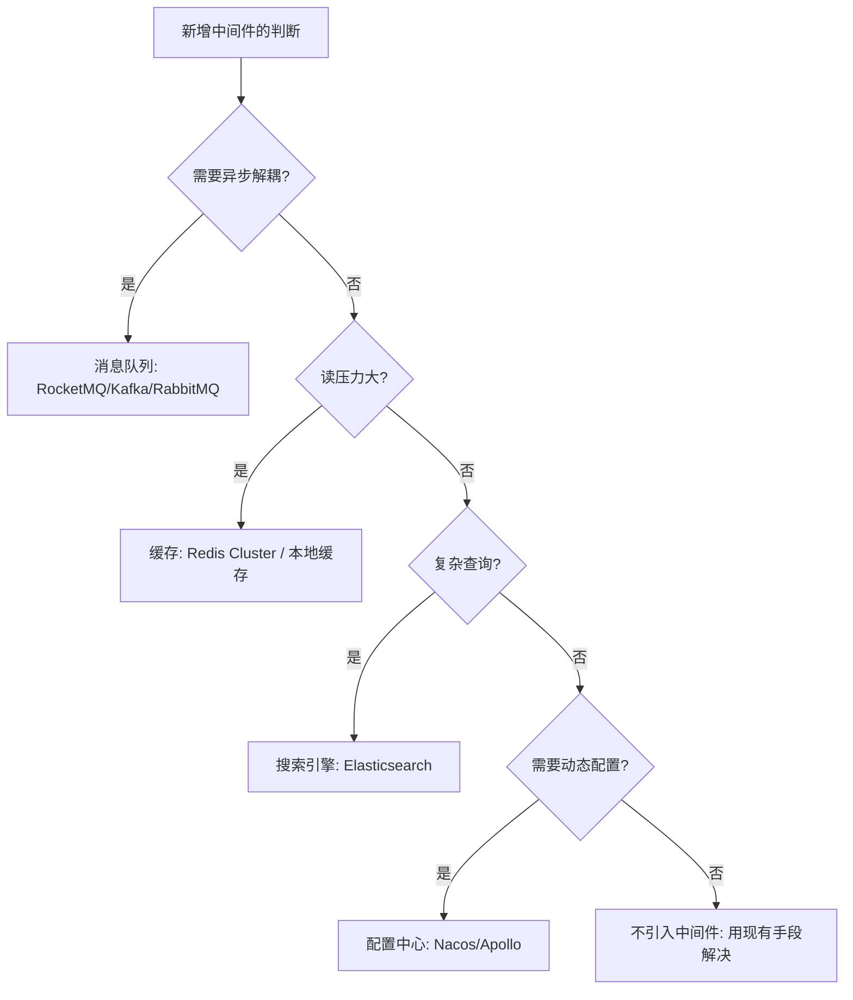

# 中间件选型与治理

> **一句话摘要**：中间件 = 服务层与数据层之间的「基础设施胶水」——**消息队列（异步解耦）、缓存（加速读取）、搜索（灵活查询）、配置中心（动态配置）、注册中心（服务发现）**——每类中间件解决一个独立的横切问题；选型的本质是「按瓶颈选中间件」，不是「把所有中间件都堆上」。

> **本文核心**：机制链 = **微服务化后的横切需求（异步解耦/读加速/搜索/动态配置/服务发现）→ 每类需求对应一类中间件 → 选型决策（按瓶颈与团队能力）→ 中间件治理（版本/容量/监控/安全）→ 治理复杂度随中间件种类数线性增长**——「中间件堆砌」是大规模架构的常见病，选型的纪律是「每引入一个中间件都要回答：不用它行不行」。

前置阅读：[数据层设计](./4_数据层设计-分库分表与缓存-入门.md)。各中间件的机制细节归本仓库 middleware 域对应系列。

## 1. 背景：中间件的「横切」本质

业务代码解决业务问题；中间件解决**所有业务都需要的非业务问题**——异步解耦（消息队列）、读加速（缓存）、灵活查询（搜索引擎）、动态配置（配置中心）、服务发现（注册中心）。这些问题的共同特征：**不与任何特定业务绑定，但所有业务都需要**——所以抽成独立的中间件，由专门团队维护，业务团队按需使用。

## 2. 核心机制：五类中间件的选型决策

- **消息队列（RocketMQ/Kafka）**：核心价值是**异步解耦 + 削峰填谷**——把「同步等待」变成「异步通知」，把「峰值流量」变成「平滑消费」。选型：RocketMQ 适合业务消息（事务消息/延迟消息/重试机制完善）；Kafka 适合日志流与大数据管道（高吞吐/分区有序）；RabbitMQ 适合低延迟小消息。**运维代价**：消息丢失/重复/堆积/顺序是四个持续治理项。
- **缓存（Redis）**：核心价值是**读加速**——用内存的纳秒级访问替代磁盘的毫秒级 IO。Redis Cluster 解决单机容量与吞吐限制；多级缓存（本地 + Redis + DB）进一步降低延迟。**运维代价**：缓存一致性（与 DB 的延迟窗口）、雪崩/穿透/击穿三大经典问题。
- **搜索引擎（Elasticsearch）**：核心价值是**灵活的全文检索与聚合分析**——MySQL 的 B+ 树索引只适合精确匹配与范围查询；ES 的倒排索引支持全文检索/多条件组合/聚合统计。**运维代价**：数据同步延迟（MySQL → ES 的管道）、集群资源消耗大、调参复杂。
- **配置中心（Nacos/Apollo）**：核心价值是**动态配置**——不用重启服务就能改配置。**运维代价**：配置错误的全网放大（配置变更 = 所有实例立即生效，错了就是全网事故）。
- **注册中心**：核心价值是**服务发现**——服务消费者自动找到服务提供者的地址。**运维代价**：注册中心挂了则服务间调用瘫痪——注册中心自身的高可用是平台的生命线。

追问链：**为什么不用一个「万能中间件」？** 因为不同中间件优化的是不同的 IO 模式（消息 = 顺序写 + 顺序读；缓存 = 随机读写；搜索 = 倒排索引匹配）——没有一个数据结构能同时优化所有 IO 模式。**中间件的多样性是 IO 模式多样性的映射**。

## 3. 落地实践：中间件的引入与治理

1. **引入判据**：每引入一个中间件前回答三问——① 当前瓶颈是它解决的吗？② 团队有运维它的能力吗？③ 不用它能否用现有手段缓解？——三问过两问才引入。
2. **版本治理**：中间件版本升级是「高风险变更」（可能有不兼容改动/行为变化）——版本升级走变更评审 + 灰度升级 + 回滚预案。
3. **容量规划**：中间件的容量指标各不相同（MQ 看 lag，Redis 看内存命中率与 QPS，ES 看堆与磁盘），但**容量告警全覆盖**是通用的纪律。
4. **安全基线**：中间件的默认配置通常不安全（无认证/明文传输/默认端口）——安全基线（认证开启/加密传输/非默认端口）在部署模板中固化。

## 4. 生产视角：中间件的事故形态

- **MQ 消息堆积**：消费速度 < 生产速度 → 消息持续堆积 → 内存/磁盘耗尽 → 消息丢失。治理：消费端扩容 + 消息 TTL + 死信队列 + 堆积告警。
- **Redis 内存打满**：maxmemory 配置不足或大 key 未治理 → Redis 开始淘汰数据 → 缓存失效 → DB 压力暴增。治理：内存告警（80% 预警）+ 大 key 排查 + 淘汰策略调整。
- **ES 集群脑裂**：网络分区导致两个 master → 数据不一致 → 索引损坏。治理：合理配置 discovery.zen.minimum_master_nodes（quorum 数）+ 集群健康监控。
- **配置中心推送错误配置**：配置修改没有灰度——错误配置立即推到全部实例（全网事故）。治理：配置灰度（先推 1 个实例验证）+ 回滚机制 + 变更审计。
- **注册中心的单点**：注册中心集群故障 → 服务间无法发现新实例 → 已有连接继续但新扩容的实例不可用。治理：注册中心集群部署 + 客户端本地缓存兜底。

## 5. 主流系统怎么做：中间件的生态版图

| 类别 | 主流选择 | 替代选择 | tips |
|---|---|---|---|
| 消息队列 | RocketMQ / Kafka | RabbitMQ / Pulsar | RocketMQ 业务消息 / Kafka 日志流 |
| 缓存 | Redis Cluster | Memcached / Dragonfly | Redis 生态最全（数据结构/持久化/复制） |
| 搜索 | Elasticsearch | OpenSearch / MeiliSearch | ES 生态最成熟；OpenSearch 是 ES 的开源分叉 |
| 配置中心 | Nacos / Apollo | Consul / etcd | Nacos 注册+配置二合一；Apollo 配置功能更精细 |
| 注册中心 | Nacos / Consul / etcd | Eureka(停更) | 与配置中心选型联动（Nacos 二合一的优势） |

规律：**国内互联网生态 Nacos + RocketMQ + Redis 是「黄金三角」**——注册+配置+消息+缓存一体化；国际生态 Consul + Kafka + Redis 更常见——按生态选型减少运维分裂。

## 6. 典型场景

- **电商订单链路**（交易级）：下单 → RocketMQ 事务消息 → 库存扣减 → 积分发放——MQ 串联异步链路。
- **商品搜索**（搜索级）：商品数据 MySQL + Canal → ES——搜索走 ES（全文+聚合），交易走 MySQL（事务）。
- **全局配置热更新**（运维级）：Nacos 配置中心 → 动态推送限流阈值/开关/白名单——不重启生效。

## 7. 与相邻概念的区别

- **中间件 vs 框架**：中间件是「独立的基础设施进程」（Redis/Kafka/Nacos）；框架是「代码库或运行时环境」（Spring/Netty）——中间件需要独立部署与运维。
- **消息队列 vs 事件总线 vs 事件流**：消息队列（点对点，消费即删）、事件总线（发布订阅，按订阅分发）、事件流（Kafka 的持久化日志，可重放）——三者的消费语义与保留策略不同。
- **缓存 vs CDN**：缓存是「应用与 DB 之间」（进程/Redis，加速动态数据读取）；CDN 是「离用户最近的静态资源缓存」（网络边缘）——位置与数据类型不同。
- **本篇 vs 各中间件系列**：本篇讲「选型与治理的决策框架」；各中间件系列（Redis/RocketMQ/Kafka）讲「每个中间件的机制与运维」——决策与实现的分层。

## 8. 常见误区与不适用

- **「中间件越多越好，架构越完整」**：每个中间件都是一份运维负担（部署/监控/升级/安全）——中间件数量应该恰好覆盖当前瓶颈，多一个都是负债。
- **「开源中间件免费所以没有成本」**：开源免费的是许可证，不免费的是运维人力（部署/监控/故障处理/版本升级）——运维成本往往超过许可证成本。
- **「选最新的中间件版本就是最好的」**：稳定版 > 最新版——最新版可能有未知 bug 与不兼容变更；生产环境用「上一个稳定大版本的最新小版本」是行业惯例。
- **「中间件故障不影响业务」**：中间件故障直接影响依赖它的全部业务（缓存挂 = DB 压力暴增；MQ 挂 = 异步链路停摆）——中间件高可用是业务高可用的前提。
- **不适用**：单体小项目（一个数据库 + 一个缓存足够，不需要全套中间件）；无运维团队的组织（托管服务优先于自建中间件）。

## 9. 你们可能会问

- **中间件的高可用怎么建？** 每类中间件的 HA 方案不同：Redis 用 Cluster/Sentinel、Kafka 用多 Broker 副本、Nacos 用集群模式——但共同原则是「跨可用区部署 + 最小节点数 + 健康检查」。
- **中间件的监控指标有哪些通用的？** 四维度：吞吐（QPS/TPS）、延迟（P99）、可用性（错误率/存活）、资源（内存/磁盘/连接数）——每个中间件在这四个维度上都有对应的指标。
- **怎么评估一个新中间件是否值得引入？** 五维评估：功能匹配度、性能基准、社区活跃度、运维成熟度（文档/工具/案例）、团队学习成本——五维打分，加权排序。
- **中间件升级的最佳实践？** 三步：看 release notes（breaking changes）→ 灰度升级（先升一个实例观察）→ 全量升级——「跨大版本」必须先在测试环境全量验证。
- **怎么决定「去掉一个中间件」？** 当它的功能可以被其他中间件覆盖（合并）、或者业务不再需要它的功能（需求消失）——「引入有判据、去除也有判据」才是完整的治理。

## 10. 一句话总结 + 5W 速记卡 + 自测三问

**🎯 核心带走**：

- **核心一句话**：中间件 = 服务层与数据层之间的基础设施胶水——五类（消息/缓存/搜索/配置/注册）各解决一个横切问题；选型按瓶颈，治理按纪律，去除按判据。

**5W 速记卡**：

| 维度 | 内容 |
|---|---|
| What | 五类中间件（消息/缓存/搜索/配置/注册）的选型与治理 |
| Why | 横切需求（异步/加速/查询/配置/发现）所有业务都需要 |
| When | 微服务化后、性能瓶颈、运维复杂度失控时 |
| Where | 服务层与数据层之间的基础设施层 |
| How | 三问引入 → 五维评估 → 版本治理 → 安全基线 → 监控全覆盖 |

💡 **实战提示**：三问再引入（瓶颈匹配/运维能力/现有手段）；安全基线在部署模板固化；版本升级走灰度；中间件数量 = 运维负担的线性函数。

**开放问题**：Service Mesh 正在把「部分中间件能力」（重试/熔断/灰度/mTLS）下沉到基础设施层——传统中间件（如 SDK 类熔断器）会被网格替代吗？中间件的边界会重新划分吗？

**决策（何时用）**：微服务化后的中间件选型与治理全场景；推荐「三问引入 + 五维评估」作为中间件引入的标准流程；推荐「中间件清单 + 版本 + Owner」进团队资产文档。

**Trade-off（代价与反方案）**：每引入一个中间件都在「运维负担」与「能力增强」之间定价——MQ 换异步解耦但增加消息可靠性治理、Redis 换读性能但增加一致性问题、ES 换搜索能力但增加集群运维——**中间件的总成本 = 许可证(零) + 运维人力 + 故障风险**，这笔账要按年算而不是按次算。

**演进视角**：中间件从「自研轮子」（每个公司自写 MQ/缓存）到「开源标准化」（Kafka/Redis 统一）到「云托管服务」（免运维）到「Service Mesh 下沉」（治理入基础设施）——四十年演进的主线是「运维责任逐步上收」；终局方向是「开发者只写业务逻辑，一切基础设施由平台自动管理」——而中间件工程师的角色从「运维者」演进为「平台建设者」。

---

**下篇预告**：系统出了问题怎么知道——下一篇[可观测体系](./6_可观测体系-指标日志链路-入门.md)讲指标/日志/链路三大信号的体系建设。

---

## 📌 数据与事实声明

五类中间件的选型框架与治理纪律为中间件工程领域公开共识；各中间件的机制描述为官方文档的机制级概括；工具对比基于各项目官方文档与公开基准测试。以官方文档为准。

## 📚 参考资料

| 类型 | 标题 | 来源 |
|---|---|---|
| 文档 | RocketMQ / Kafka / Redis / Nacos / Elasticsearch 官方文档 | 各官方站点 |
| 图书 | 数据密集型应用系统设计（DDIA） | O'Reilly（2017 中译） |
| 系列文章 | 本系列全部篇章 | 本仓库同系列 |
