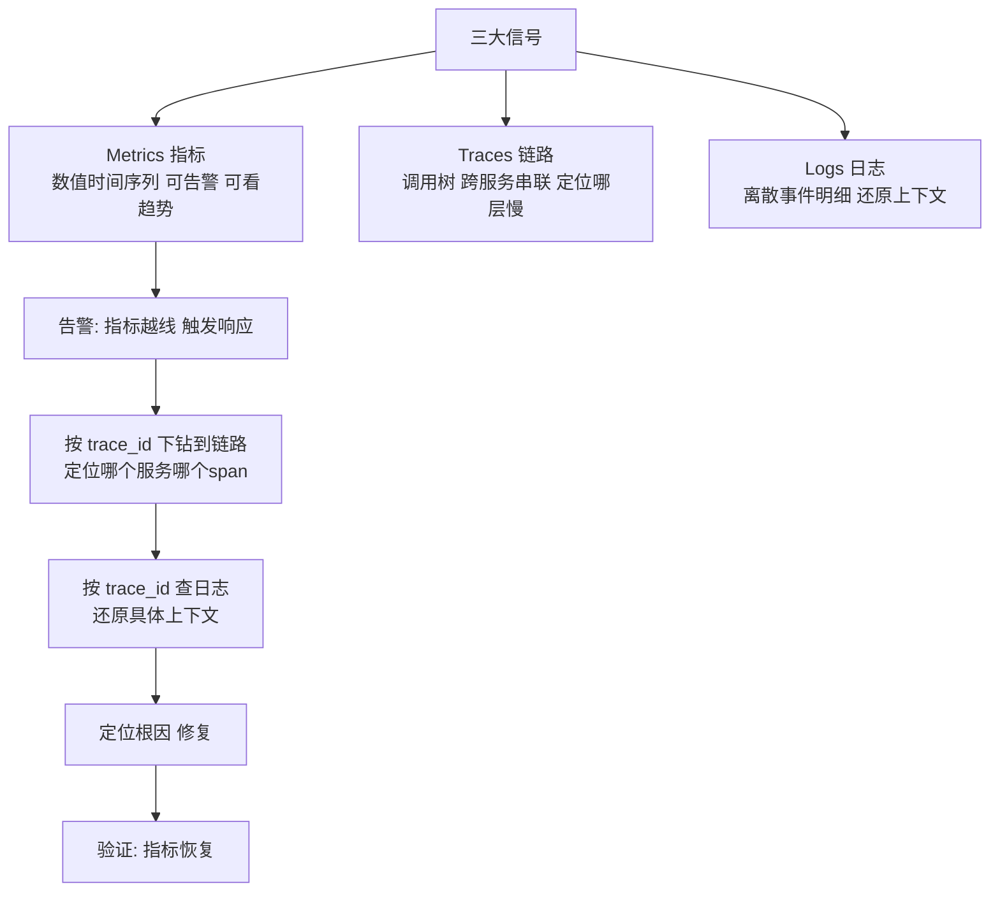

# 可观测体系：指标 / 日志 / 链路

> **一句话摘要**：可观测体系 = 从系统外部信号**推断内部状态**的能力——三大信号各司其职：**Metrics（数值序列：知道不对了）→ Traces（调用链：定位哪层慢了）→ Logs（明细日志：还原上下文）**；三者由 trace_id 缝合成一张「排障证据网」——没有可观测体系的微服务集群是「蒙眼开车」。

> **本文核心**：机制链 = **分布式化让传统监控失效（跨服务调用链不可见/实例瞬生瞬灭/日志散落在千节点）→ 三大信号分工 → OpenTelemetry 统一采集 → 告警驱动响应 → 故障演练验证可观测体系自身**——可观测的目标不是「采集数据」，是「缩短 MTTR（平均修复时间）」。

前置阅读：[中间件选型与治理](./5_中间件选型与治理-入门.md)。可观测的完整深度（OTel 语义约定/采样策略/成本治理）归本仓库云原生可观测篇。

## 1. 背景：为什么微服务时代「看日志」不够了

单体时代看一台机器的日志就能定位问题；微服务时代一次请求跨 10 个服务、每个服务多个实例瞬生瞬灭、日志散落在千节点的滚动文件里——**「登机器 grep 日志」的排障方式在微服务集群面前完全失效**。可观测体系的本质：把散落的信号**集中化、结构化、关联化**——让工程师在同一个界面上看到一次请求的完整旅程。

## 2. 核心机制：三大信号与告警闭环

- **Metrics 的黄金指标（RED/USE）**：RED 面向服务请求——Rate（QPS）、Errors（错误率）、Duration（延迟分位值）；USE 面向资源——Utilization（使用率）、Saturation（饱和度）、Errors（错误）。**每个服务都必须有 RED 四指标 + USE 三指标**——这是可观测的地基。
- **Traces 的 span 树**：一次请求经过的每个服务生成一个 span（含耗时/状态/标签），span 按 trace_id 串成调用树——**「哪一层慢了」一眼可见**（火焰图/瀑布图）。跨服务传递靠 W3C TraceContext 标准头（traceparent）。
- **Logs 的结构化**：JSON 格式 + 固定字段（timestamp/level/trace_id/service/message）——非结构化文本日志无法有效检索与关联。日志分级（ERROR/WARN/INFO/DEBUG）控制日志量与信噪比。
- **告警的纪律**：每条告警必须「可行动」（收到后知道做什么）——不可行动的告警是噪声，噪声告警让真告警被淹没。告警分级（P0 电话/P1 即时消息/P2 工单）+ 告警治理（周审信噪比）。

## 3. 落地实践：可观测体系的建设清单

1. **统一关联键**：全链路 trace_id 透传（HTTP header/消息属性/RPC 元数据）+ 日志带 trace_id + 指标标签带服务名/版本——「缝合」先于「采集」。
2. **指标分层**：基础设施（节点 CPU/内存/磁盘）→ 中间件（MQ lag/Redis 命中率/DB 连接池）→ 应用（RED 四指标）→ 业务（订单率/支付成功率）——四层缺一不可。
3. **日志结构化**：JSON 格式 + 固定字段规范 + 分级（ERROR/WARN/INFO）+ 采集管道（Filebeat/Fluentd → Kafka → ES/Loki）。
4. **告警分级与治理**：P0（电话，核心链路故障）/ P1（即时消息，非核心异常）/ P2（工单，趋势劣化）——告警信噪比每周审计（噪声 > 50% 需要优化规则）。
5. **故障演练验证**：注入故障（断网/延迟/错误）核对「告警触发 → 链路完整 → 日志可查 → 定位时长」——不演练的可观测等于没有。

## 4. 生产视角：可观测缺失的形态

- **「知道有问题但不知道在哪」**：只有聚合监控（总错误率上升）无链路追踪——十个服务人工逐个排查。有链路的团队分钟级定位，无链路的团队小时级（行业共识量级）。
- **告警疲劳的真告警淹没**：日告警数千条 90% 无需行动——值班人对告警脱敏，真故障漏响应。告警信噪比（真告警/总告警）低于 20% 即需治理。
- **「幽灵故障」无法复现**：偶发问题没有留存证据——JFR 飞行记录（持续低开销采样）是「事后回放」的唯一手段。
- **监控数据的「可观测幻觉」**：装了 Prometheus/Grafana 就是可观测了——只看仪表盘不做告警联动、不做链路串联、不做演练验证 = 有工具无可观测。

## 5. 主流系统怎么做：可观测的工具链

| 信号 | 主流后端 | 统一采集 | tips |
|---|---|---|---|
| Metrics | Prometheus + Grafana | OTel Collector / exporter | Pull 模型 + PromQL |
| Logs | ELK / Loki / 云日志 | Filebeat/Fluentd → Kafka | 结构化 JSON + 索引策略 |
| Traces | Jaeger / Zipkin / SkyWalking | OTel SDK / Agent | span 树 + 服务拓扑 |
| 统一 | Grafana（多信号统一面板） | OTel Collector | 「一黑板看全部信号」的趋势 |
| 持续剖析 | Pyroscope / Parca | 代码级 CPU/内存火焰图 | 「第四信号」的兴起 |

规律：**Grafana 正在成为「多信号统一面板」的事实标准**——Metrics/Logs/Traces/Profiling 在同一个 UI 中关联展示是可观测的终态方向。

## 6. 典型场景

- **跨服务排障**（日常级）：告警 → 链路 → 日志的标准动线——MTTR 的主要缩短来源。
- **容量规划**（FinOps 级）：资源指标 + 成本标签的联合分析——FinOps 的数据基础。
- **发布验证**（发布级）：金丝雀发布期间的指标对比与错误率——自动化发布分析的数据源。

## 7. 与相邻概念的区别

- **可观测 vs 监控**：监控是「预定义项的检查」（知道会出什么问题）；可观测是「未知问题也可探查」（开放式问询）——监控答已知，可观测答未知。
- **Metrics vs Logs vs Traces 选型**：不互替——「都能用日志查」在大流量下成本失控；每个信号有性价比最优的用途。
- **可观测 vs SRE**：可观测提供「感知能力」；SRE 提供「响应能力」（SOP/演练/on-call）——感知与行动的分工。
- **本篇 vs 稳定性篇（第 7 篇）**：可观测是稳定性工程的「眼睛」（发现问题）；稳定性是稳定性工程的「手脚」（解决问题）——「看」与「做」的分工。

## 8. 常见误区与不适用

- **「装了 Prometheus 就可观测了」**：工具是载体——语义约定、关联键、告警纪律、排障动线的体系才是可观测；「可观测幻觉」比不可观测更危险（虚假的安全感）。
- **「告警越多越安全」**：告警疲劳会让真告警被忽略——信噪比 < 20% 即需治理；「宁多勿漏」是告警设计的反模式。
- **「日志永不删除」**：日志的存储成本与检索噪声随量线性增长——分层保留（热 7 天/温 30 天/冷归档）是工程必答题。
- **「可观测体系建完就完了」**：故障形态在变（新服务/新依赖/新流量模式）——可观测体系需要随架构演进持续调整；「一次性建设」是可观测的终极误区。
- **不适用**：超小系统（一台机器两块面板足够——体系成本不值）；强离线分析（离线数仓另说）——可观测体系的成本要配得上业务的 MTTR 价值。

## 9. 你们可能会问

- **三大信号的保留期怎么定？** 按「价值衰减」：指标原始 15 天+降采样 1 年、链路全量 7 天+采样 30 天、日志热 7 天+温 30 天+冷归档按合规——保留期是「排障价值 × 存储成本」的定价。
- **告警的信噪比怎么算？** 真告警（需要行动的）/ 总告警数——低于 20% 说明告警规则需要治理（去掉不可行动的/合并重复的/调低噪声阈值）。
- **怎么做「可观测自身的容灾」？** 采集管道（Kafka）集群化 + 存储后端多副本 + 查询层多活——可观测自身的故障不能成为排障的盲区。
- **怎么做「可观测的演练」？** 注入故障 → 核对告警触发/链路完整/日志可查/MTTR 达标——不演练的可观测等于没有；演练频率建议季度。
- **「持续剖析」（Profiling）是什么？** 代码级的 CPU/内存火焰图持续采样——定位「哪个函数消耗最多资源」；作为「第四信号」正在加入 OTel 标准。

## 10. 一句话总结 + 5W 速记卡 + 自测三问

**🎯 核心带走**：

- **核心一句话**：可观测 = Metrics 告警发现 + Traces 定位 + Logs 还原的三信号证据网，由 trace_id 缝合、OTel 统一采集、告警驱动响应——目标是缩短 MTTR，不是采集数据。

**5W 速记卡**：

| 维度 | 内容 |
|---|---|
| What | 三大信号 + 关联缝合 + 告警分级 + 演练验证 |
| Why | 分布式化让传统监控失效，排障需要跨服务证据链 |
| When | 故障排查、发布验证、容量治理、安全审计 |
| Where | 应用埋点 → 采集管道 → 后端存储与展示 |
| How | 缝合键先行 → 指标分层 → 结构化日志 → 告警治理 → 演练验收 |

💡 **实战提示**：trace_id 全链透传；指标标签控基数；日志结构化 JSON；告警必须可行动；故障演练验收可观测。

**开放问题**：AI 辅助排障（自动关联信号/定位根因/生成假设）正在成为 APM 的新卖点——「从数据到根因」的推理会被 AI 接管多少，工程师的排障技能要向哪里迁移？

**决策（何时用）**：微服务与云原生系统全场景必建；推荐「三信号关联 + 演练验收」作为可观测建设标准；推荐「告警信噪比」纳入稳定性 SLA 治理。

**Trade-off（代价与反方案）**：全量采集用「存储与传输成本」换「完整证据」；尾部采样用「集中决策成本」换「价值密度」；结构化日志用「格式纪律」换「可检索性」；告警从严用「漏报风险」换「信噪比」——可观测的每一档投入都在为 MTTR 定价，账要按「故障小时的业务损失」来算。

**演进视角**：从 SNMP/主机监控（1990s）到 APM（2010s 商用）到开源三件套（ELK/Prometheus/Jaeger）到 OTel 统一（2020s）再到 AI 排障（在途）——可观测三十年从「看单机」进化为「问系统」；信号在增多的路上（Profiling 第四信号），「从外部信号推断内部状态」的定义三十年如一日。

---

**下篇预告**：系统崩了怎么办——下一篇[稳定性保障](./7_稳定性保障-限流降级与容灾-入门.md)讲限流/降级/容灾/演练的完整体系。

---

## 📌 数据与事实声明

三大信号定义、RED/USE 方法、W3C TraceContext、OTel 语义约定为 OpenTelemetry 与 W3C 官方文档；「MTTR 差异」为行业共识量级；告警信噪比与保留期为行业经验值。以官方文档为准。

## 📚 参考资料

| 类型 | 标题 | 来源 |
|---|---|---|
| 标准 | OpenTelemetry / W3C TraceContext | opentelemetry.io · w3.org |
| 工具 | Prometheus / Jaeger / Grafana / Loki | 各官方文档 |
| 系列文章 | 稳定性保障（下一篇）/ 服务网格（篇 5） | 本仓库同系列 |
