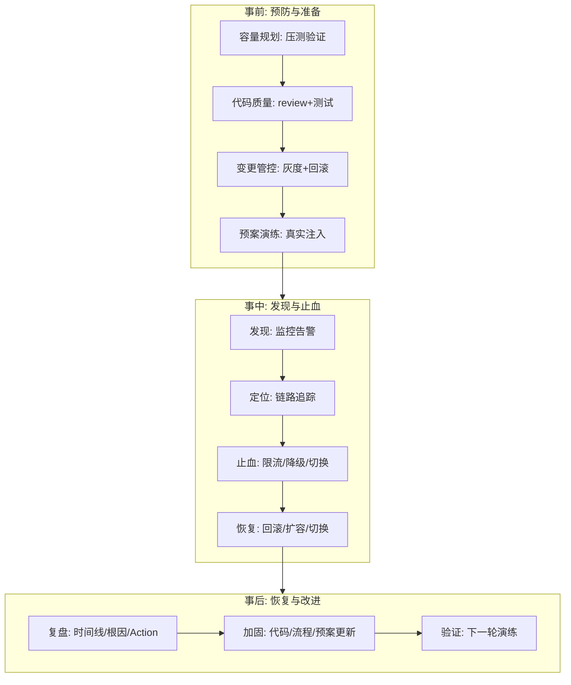

# 稳定性保障：限流 / 降级 / 容灾 / 演练

> **一句话摘要**：稳定性保障 = 「承认故障必然发生后的系统性应对」——**事前预防（容量规划+代码质量+变更管控）、事中止血（限流+降级+熔断+切换）、事后恢复（回滚+复盘+加固）**；稳定性的最高标准不是「不出故障」而是「故障时用户无感知」——这需要预案前置、自动化响应、常态化演练。

> **本文核心**：机制链 = **故障时间线（发生→发现→定位→止血→恢复→复盘）→ 每个环节的最短化手段（监控告警→链路追踪→预案执行→自动回滚→复盘 Action）→ MTTR（平均修复时间）的每分钟都在放大业务损失 → 演练是唯一能验证预案的手段**——稳定性的投入产出比 = 「故障损失 × 故障概率」vs「预防投入」。

前置阅读：[可观测体系](./6_可观测体系-指标日志链路-入门.md)（发现故障的眼睛）。限流/熔断/降级的机制细节归 service-governance 子域。

## 1. 背景：稳定性的经济账

故障的代价不是「技术问题」而是「业务损失」——每分钟的故障 = 每分钟的订单损失 + 用户信任损失 + 品牌影响。**MTTR（平均修复时间）每缩短一分钟，就是在节省真实的业务损失**。稳定性的全部投入（监控/预案/演练/自动化）都是在购买「MTTR 的缩短」——这笔投资要按「故障损失 × 故障概率」来计算 ROI。

## 2. 核心机制：事前-事中-事后的完整闭环

- **事前预防的四道工序**：① **容量规划**（压测验证能扛预期峰值）；② **代码质量**（review + 测试覆盖 + 静态扫描）；③ **变更管控**（灰度发布 + 快速回滚 + 变更窗口）；④ **预案演练**（真实注入故障验证预案有效性）。**行业共识**：多数线上事故由「变更」引发——变更管控是稳定性的第一道防线。
- **事中止血的优先级**：① **限流**（拒绝超额请求，保护系统不崩）；② **降级**（关闭非核心功能，保住核心链路）；③ **切换**（切到备用机房/备用服务）；④ **回滚**（回到上一个稳定版本）——按「影响面从小到大」的顺序执行。
- **事后的复盘纪律**：时间线（精确到分钟的事件序列）→ 根因（不是「谁的错」而是「哪个环节缺失」）→ Action（可执行的改进项，带 Owner 与 Deadline）——复盘的价值不是追责而是**把这次事故变成下一次的免疫力**。
- **演练是唯一验证手段**：预案文档写得再好，没演练过就不确定是否可用——混沌工程（Chaos Engineering）通过「主动注入故障」验证系统的韧性与预案的有效性。

## 3. 落地实践：稳定性体系的建设清单

1. **SLA 分级**：核心链路（支付/下单）99.99%、重要功能（搜索/推荐）99.9%、边缘功能（日志查询）99.5%——SLA 决定投入级别。
2. **监控告警全覆盖**：核心链路每个环节都有指标 + 告警——「用户先于监控发现故障」是监控体系的最大失败。
3. **预案文档化 + 演练**：每类故障（DB 挂/MQ 堆积/缓存全灭/网络分区）都有「发现→判断→止血→恢复」的 SOP——预案是文档 + 自动化脚本 + 人工决策点的组合。
4. **变更管控三板斧**：灰度发布（小流量验证）、快速回滚（一键回退）、变更冻结（大促期间禁变更）——「变更引发故障」是行业最高频的事故根因。
5. **混沌工程常态化**：每季度注入故障（杀 Pod/断网络/打满 CPU）验证系统韧性——「不演练的预案 = 没有预案」。

## 4. 生产视角：稳定性事故的形态

- **变更引发的全站故障**：一次配置变更（改了一个参数）→ 全站 500——变更管控（灰度/审批/回滚）是稳定性的第一道防线。行业数据：多数线上事故由变更引发（Google SRE 书的公开结论）。
- **限流配置错误的体验事故**：限流阈值设得太低——正常流量被误杀。预防：限流阈值基于压测 + 流量模型分析，不拍脑袋。
- **降级开关失灵**：降级开关本身有 bug（开了等于没开）——降级预案也需要测试验证。
- **回滚速度跟不上故障速度**：回滚流程需要 30 分钟而故障扩散只要 5 分钟——回滚自动化是「缩短 MTTR」的最大杠杆。
- **复盘没有 Action**：复盘开了会但没有可执行的改进项（或者有但没人执行）——同类事故反复发生。复盘的产出必须是「有 Owner、有 Deadline 的 Action 列表」。

## 5. 主流系统怎么做：稳定性的工具链

| 环节 | 主流工具/机制 | 机制要点 |
|---|---|---|
| 监控告警 | Prometheus + Grafana + AlertManager | 指标采集 + 告警分级 |
| 链路追踪 | Jaeger / SkyWalking | span 树 + 服务拓扑 |
| 限流熔断 | Sentinel / Resilience4j / Envoy | 限流/熔断/降级的策略执行 |
| 混沌工程 | ChaosBlade / Chaos Mesh / Litmus | 故障注入（杀 Pod/断网/延迟） |
| 变更管控 | GitOps + 灰度发布 | 变更可追溯可回滚 |
| 值班响应 | PagerDuty 类 + OnCall 制度 | 告警到人的自动路由 |

规律：**稳定性工具链与 CI/CD/可观测/网格深度集成**——稳定性不是一个独立工具，是「贯穿全链路的工程实践集合」。

## 6. 典型场景

- **大促稳定性保障**（峰值级）：扩容预案 + 限流分级 + 降级预案 + 值守编排——大促前一个月开始的系统性准备。
- **新服务上线**（发布级）：灰度 1% → 5% → 25% → 50% → 100%，每步观察指标——渐进式发布。
- **故障复盘**（改进级）：精确时间线 → 根因分析 → Action 列表 → 下一轮演练验证——闭环。

## 7. 与相邻概念的区别

- **稳定性 vs 高可用**：高可用是「系统不挂」的架构设计（冗余/切换）；稳定性是「系统即使挂了也能快速恢复」的工程实践——高可用是设计目标，稳定性是工程能力。
- **限流 vs 熔断**：限流在入口「拒绝超额」（保护自己）；熔断在调用端「停止调故障依赖」（保护自己不被拖垮）——限流是「守门」，熔断是「断臂」。
- **降级 vs 回滚**：降级是「关闭非核心功能保核心」（有损服务）；回滚是「回到上一个稳定版本」（回到过去）——降级可以在线做（秒级），回滚通常需要发布（分钟级）。
- **本篇 vs 可观测篇（第 6 篇）**：可观测提供「发现问题与定位根因」的眼睛；稳定性提供「止血与恢复」的手脚——眼睛与手脚的配合。
- **本篇 vs service-governance 子域**：service-governance 讲「服务治理的机制」（限流算法/熔断器模式/负载均衡策略）；本篇讲「稳定性保障的组织与流程」——机制与体系的分工。

## 8. 常见误区与不适用

- **「稳定性 = 加机器」**：加机器解决容量问题——不解决代码 bug、配置错误、依赖故障、网络分区的问题。
- **「监控告警够了，不需要演练」**：演练验证的是「预案是否真的可用」——监控只能发现故障，演练验证恢复能力。
- **「稳定性是运维团队的责任」**：稳定性是全团队的责任——开发写代码的每一次「随手一改」都是稳定性风险；安全与稳定是全团队的文化。
- **「大促前才做稳定性建设」**：大促前的突击只能「止血」（扩容/限流调整）——真正的稳定性（代码质量/架构韧性/自动化响应）需要常年的工程积累。
- **不适用**：原型/实验系统（稳定性投入与业务成熟度匹配）；纯离线分析（无 SLA 承诺）；预算极端有限的初创（先保核心链路可用，其他简化）。

## 9. 你们可能会问

- **SLA 99.99% 是什么概念？** 全年停机 ≤ 52.6 分钟——每个 9 的增加意味着成本指数级上升（冗余层次/自动化程度/演练频率全部升级）。
- **MTTR 怎么缩短？** 拆解 MTTR = 发现时间 + 定位时间 + 决策时间 + 执行时间——每段的最短化手段不同（监控/链路/预案/自动化），分别治理。
- **混沌工程从哪里起步？** 最小实验：在测试环境杀一个 Pod，观察自愈——从小到大（杀 Pod → 断网络 → 打满磁盘 → 模拟区域故障）逐步升级。
- **值班（On-Call）制度怎么设计？** 轮值 + 升级机制（15 分钟无响应升级到下一级）+ 值班后调休 + 事后复盘——值班制度的健康度直接影响响应速度。
- **「稳定性文化」怎么建立？** 三步：无责复盘（聚焦流程不追责）→ 安全事件共享（团队内透明）→ 混沌工程奖励（找到问题的工程师受表扬）——文化靠制度与激励，不靠口号。

## 10. 一句话总结 + 5W 速记卡 + 自测三问

**🎯 核心带走**：

- **核心一句话**：稳定性 = 事前预防（容量/质量/变更/演练）+ 事中止血（限流/降级/切换/回滚）+ 事后改进（复盘/加固/验证）——目标是 MTTR 最短化，不是零故障。

**5W 速记卡**：

| 维度 | 内容 |
|---|---|
| What | 事前-事中-事后完整闭环 + 混沌工程 + 复盘纪律 |
| Why | 故障的每分钟都在放大业务损失，MTTR 是可优化的 |
| When | 大促备战、新服务上线、故障复盘、季度演练 |
| Where | 监控/限流/降级/切换/回滚的全链路 |
| How | SLA 分级 → 预案文档化 → 演练验证 → 复盘 Action 闭环 |

💡 **实战提示**：监控告警全覆盖（用户不先于监控发现）；变更管控三板斧；预案文档化+演练验证；复盘产出必须有 Owner 与 Deadline 的 Action。

**开放问题**：AI 辅助的「自动根因分析 + 自动止血」正在成为 AIOps 的新方向——「值班工程师」的角色会从「手动执行预案」变成「监督 AI 执行预案」吗？

**决策（何时用）**：生产系统全场景必建；推荐「稳定性四问（SLA 是什么/怎么监控/怎么止血/怎么演练）」进架构评审；推荐「混沌工程」作为稳定性成熟度的试金石。

**Trade-off（代价与反方案）**：稳定性投入用「工程资源与时间」换「故障损失减少与团队信心」；反方案——不投入（省资源，代价是故障损失不可控）；过度投入（过度冗余，代价是成本暴涨）——稳定性投入的最优解 = 「故障损失的期望值」= 故障概率 × 故障损失，按这个公式定价每一项投入。

**演进视角**：从「运维人肉救火」（2000s）到「自动化运维」（2010s）到「SRE 工程化」（Google 2016 SRE 书发布）到「混沌工程常态化」（2020s）——稳定性三十年从「被动响应」进化为「主动验证」；Google SRE 的核心理念「通过软件工程方法解决运维问题」已经成为全行业的共识。

---

**下篇预告**：代码怎么安全上线——下一篇[发布与变更管理](./8_发布与变更管理-灰度与回滚-入门.md)讲灰度/回滚/变更管控的完整体系。

---

## 📌 数据与事实声明

事前-事中-事后闭环、混沌工程理念、SRE 方法论出自 Google SRE 书（sre.google，在线开源）与行业公开实践；「多数事故由变更引发」为 Google SRE 公开结论；MTTR 分解为行业通用模型。以官方文档为准。

## 📚 参考资料

| 类型 | 标题 | 来源 |
|---|---|---|
| 图书 | Site Reliability Engineering（Google SRE 书） | sre.google |
| 工具 | ChaosBlade / Chaos Mesh / Litmus | 各官方仓库 |
| 系列文章 | 可观测体系（第 6 篇）/ 服务治理子域 | 本仓库 |
