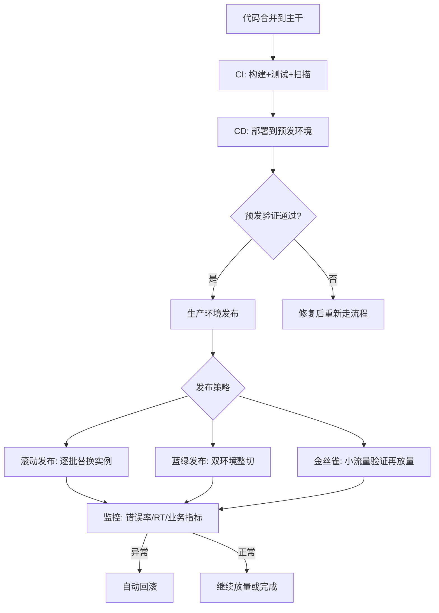

# 发布与变更管理：灰度与回滚

> **一句话摘要**：发布与变更管理 = 「代码从合并到用户手中的**安全通道**」——灰度发布（小流量验证新版本）、快速回滚（秒级退回稳定版本）、变更管控（审批/冻结/审计）三板斧构成发布的完整安全体系；行业数据：**多数线上事故由变更引发**——发布管理的核心是「把变更的风险从集中爆发变为分散消化」。

> **本文核心**：机制链 = **代码合并 → 构建 → 制品（镜像/包）→ 灰度发布（按比例放量）→ 指标验证（错误率/延迟）→ 全量 → 监控 → 需要时回滚**——「发布」的每个环节都有可能引入故障：构建产物污染、灰度比例配置错误、指标误判、回滚不及时——每个环节都需要「门禁 + 自动化 + 审计」。

前置阅读：[稳定性保障](./7_稳定性保障-限流降级与容灾-入门.md)（发布是变更引发故障的最高频场景）。GitOps 的部署联动见特性层 GitOps 系列。

## 1. 背景：为什么「发布」是事故之王

行业数据（Google SRE 书与各厂公开复盘）：**多数线上事故由变更引发**——代码变更、配置变更、基础设施变更都是变更。发布是「变更」的最高频与最大风险形态：每次发布都可能引入 bug、性能退化、兼容性问题。发布管理的全部内容就是**把变更的风险从「切换日集中爆发」变为「灰度期分散验证」**。

## 2. 核心机制：发布流程与三种灰度策略

- **滚动发布（Rolling Update）**：逐批替换实例，新旧版本共存——最简单的策略，K8s 默认支持（`maxSurge`/`maxUnavailable` 控制节奏）。代价：过渡期两版本共存（要求接口向前兼容）。
- **蓝绿发布（Blue-Green）**：两套完整环境，流量整切——切换秒级、回滚秒级，代价是双倍资源。适合「需要快速回滚保障」的核心服务。
- **金丝雀发布（Canary）**：小比例流量（1%→5%→25%→100%）先到新版本，指标验证后逐步放量——影响面最小的策略，代价是需要流量分流与指标自动化分析的基础设施（Argo Rollouts/Flagger）。
- **回滚的三种方式**：① **制品回滚**（部署上一个稳定版本镜像——秒级）；② **配置回滚**（切回旧配置——配置中心一键回退）；③ **数据回滚**（最难，依赖数据库 binlog 与备份——防患优于回滚）。**回滚速度的决定因素是「制品与配置是否可秒级替换」**——数据回滚是最后手段。

## 3. 落地实践：发布的工程纪律

1. **发布窗口纪律**：避开业务高峰（如电商避开大促、金融避开交易日）——发布窗口是「变更风险的时段约束」。
2. **发布检查清单**：发布前检查（依赖服务版本兼容/配置正确/回滚方案就绪/监控确认正常）——清单化防遗漏。
3. **灰度比例自动化**：Argo Rollouts/Flagger 按指标（错误率/RT）自动判断放量或回滚——人工决策在小半夜不可靠。
4. **发布审计**：每次发布记录「谁/何时/发了什么/结果如何」——审计是「变更可追溯」的底线。
5. **冻结窗口**：大促/重大事件期间冻结全部非紧急变更——「变更冻结」是最激进的稳定性保障手段，但也是最有效的。

## 4. 生产视角：发布的事故形态

- **「测试都过了但线上炸了」**：测试环境与生产环境的差异（数据量/配置/依赖版本）导致线上问题无法在测试阶段暴露——环境一致性与全链路压测是解药。
- **回滚失败的二次事故**：回滚时发现上一个版本的镜像已被清理/数据库 schema 已变更不兼容——回滚能力需要「日常维护」（镜像保留策略/schema 兼容性纪律）。
- **灰度比例配置错误的全量发布**：5% 写成 95%——灰度配置错误直接变成全量发布。防线：灰度比例变更走审批 + 自动监控大比例变更。
- **「发布完了没人看监控」**：发布后 30 分钟是故障高发窗口——但发布往往在深夜，没人看监控。解法：发布自动化 + 指标自动分析 + 自动回滚——「不依赖人守着」的发布。

## 5. 主流系统怎么做：发布的工具链

| 环节 | 主流工具 | 机制要点 |
|---|---|---|
| CI | Jenkins / GitLab CI / GitHub Actions | 构建+测试+扫描的自动化 |
| CD | Argo CD / Flux（GitOps） | Git 提交触发部署 |
| 灰度 | Argo Rollouts / Flagger | 指标驱动的自动放量/回滚 |
| 制品管理 | Harbor / Nexus | 镜像/包的版本化存储 |
| 密钥管理 | Vault / Sealed Secrets | 密钥不进 Git 明文 |

规律：**发布工具链的核心是「自动化门禁」**——每个环节都有自动化的检查与门禁（测试通过才构建/扫描通过才部署/指标正常才放量），人工只在「决策点」介入。

## 6. 典型场景

- **日常发布**（高频级）：每日多次发布——CI/CD 自动化 + 灰度 + 自动回滚的完整闭环。
- **大促版本发布**（大版本级）：提前一个月冻结功能开发 → 集中测试与压测 → 大促前一周完成发布 → 冻结窗口。
- **紧急修复**（Hotfix 级）：紧急 bug 修复走快速通道——跳过部分灰度直接上线（但必须事后补全量验证）。

## 7. 与相邻概念的区别

- **发布 vs 部署**：部署是「制品放到环境」（技术动作）；发布是「用户看到新功能」（业务动作）——特性开关可以解耦两者（部署了但不发布）。
- **灰度发布 vs A/B 测试**：灰度是「验证新版本是否稳定」（技术验证）；A/B 测试是「验证哪个版本更好」（产品验证）——灰度是前置门禁，A/B 是后续优化。
- **发布管理 vs 变更管理**：发布管理管「代码发布」；变更管理管「一切变更」（代码+配置+基础设施+数据）——发布是变更的子集。
- **本篇 vs GitOps（特性层）**：GitOps 是「Git 为事实源 + 控制器自动收敛」的部署模式——发布管理是 GitOps 的上层流程（什么可以发布/怎么灰度/怎么回滚）。

## 8. 常见误区与不适用

- **「发布频率越高越好」**：发布频率的上限由「测试覆盖率 + 自动化程度 + 团队纪律」决定——超越能力的发布频率是事故制造机。
- **「有了自动化就不需要发布检查清单」**：自动化处理「可预见的检查」，清单覆盖「不可预见的场景」——两者互补，清单不可省。
- **「回滚就是回到上一个版本」**：回滚涉及制品+配置+数据库+缓存+下游通知——只回滚制品是「半个回滚」，其余的漂移照样出问题。
- **「灰度只需要控制流量比例」**：灰度还需要「指标自动分析」（错误率/RT/业务指标）——只控比例不看指标 = 盲人金丝雀。
- **不适用**：内部工具/测试环境（发布策略可以极简）；初创 MVP（快速上线优先于完善的发布流程——但至少要有回滚能力）。

## 9. 你们可能会问

- **金丝雀的指标怎么选？** 三层：技术指标（错误率/延迟 P99）、业务指标（转化率/订单率）、安全指标（异常请求比例）——只看技术指标会漏「技术正常但业务受损」的事故。
- **发布窗口怎么定？** 按「业务低峰 + 团队值守能力」定——避开业务高峰（降低影响）但保证有人值守（及时响应）。
- **自动回滚的误判怎么处理？** 自动回滚基于指标阈值——阈值太敏感会频繁误回滚（可用性抖动），太迟钝会放大事故。解法：指标基线学习 + 多指标联合判断。
- **特性开关（Feature Flag）和灰度发布什么关系？** 特性开关是「代码部署了但功能没开」——比灰度发布更细粒度（可以按用户/按功能开关）；两者组合是「部署与发布解耦」的完整方案。
- **怎么度量发布成熟度？** 四指标：发布频率（DORA 指标）、变更失败率、MTTR、发布前置时间——DORA 四指标是行业标准的发布效能度量。

## 10. 一句话总结 + 5W 速记卡 + 自测三问

**🎯 核心带走**：

- **核心一句话**：发布管理 = 「代码合并 → 灰度放量 → 指标验证 → 全量/回滚」的安全通道——灰度策略 × 回滚方案 × 变更管控三板斧构成完整体系；多数事故由变更引发，发布管理的核心是「把变更风险分散消化」。

**5W 速记卡**：

| 维度 | 内容 |
|---|---|
| What | CI/CD 流水线 + 三种灰度策略 + 回滚方案 + 变更管控 |
| Why | 多数线上事故由变更引发，发布管理的核心是变更风险分散 |
| When | 日常发布、大促版本、紧急修复、发布体系评估 |
| Where | CI → 制品仓库 → CD → 生产环境 |
| How | 灰度放量 → 指标验证 → 自动/手动回滚 → 审计追溯 |

💡 **实战提示**：回滚能力日常维护（镜像保留+schema 兼容）；金丝雀指标含业务维度；发布审计全记录；大促冻结窗口提前公告。

**开放问题**：AI 辅助的「自动发布决策」（分析代码变更 → 预测风险 → 自动选择发布策略）会替代人工发布审批吗——「发布审批」这个人工环节会消失吗？

**决策（何时用）**：一切生产发布的场景；推荐「DORA 四指标」作为发布效能的度量标准；推荐「发布检查清单 + 灰度自动化 + 回滚演练」进团队发布规范。

**Trade-off（代价与反方案）**：灰度发布用「发布周期变长」换「故障影响面收窄」；自动回滚用「误判回滚的可能」换「MTTR 缩短」；变更冻结用「迭代暂停」换「稳定性保障」——发布管理的每一项策略都在「迭代速度」与「稳定性」之间定价，DORA 四指标是行业给出的度量框架。

**演进视角**：从「FTP 手动部署」（2000s）到「CI/CD 自动化」（2010s）到「GitOps + 渐进式交付」（2020s）到「AI 辅助发布决策」（在途）——发布管理的演进主线是「从人工操作到自动化决策」；DORA 报告的数据显示，发布效能高的团队，业务指标也更好——「更快发布」与「更稳发布」不是对立而是统一。

---

**下篇预告**：花的每一分钱要有数——下一篇[成本与容量规划](./9_成本与容量规划-FinOps实践-入门.md)讲 FinOps 与容量规划的工程实践。

---

## 📌 数据与事实声明

三种发布策略与回滚方式为发布管理领域公开共识（Google SRE 书、DORA 报告）；DORA 四指标（发布频率/变更失败率/MTTR/前置时间）为 DORA State of DevOps 报告标准指标；Argo Rollouts/Flagger 为各项目官方文档；「多数事故由变更引发」为 Google SRE 书结论。以官方文档为准。

## 📚 参考资料

| 类型 | 标题 | 来源 |
|---|---|---|
| 报告 | Accelerate（DORA State of DevOps 年度报告） | dora.dev |
| 工具 | Argo Rollouts / Flagger 官方文档 | 各官方仓库 |
| 文档 | Kubernetes Deployment 策略 | kubernetes.io |
| 系列文章 | 稳定性保障（第 7 篇联动） | 本仓库同系列 |
