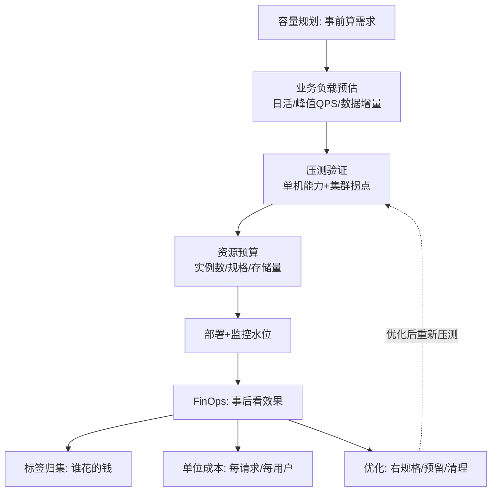
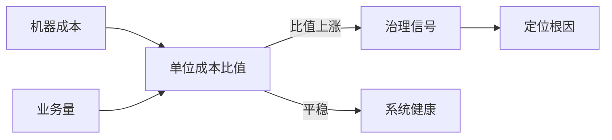

# 成本与容量规划：FinOps 实践

> **一句话摘要**：成本与容量规划 = **在「性能够用」与「成本可控」之间找到最优平衡点的持续过程**——容量不足导致性能事故，容量过剩导致成本浪费；FinOps 的核心是「让工程师为自己的架构决策看到并负责成本后果」——把成本从「财务的事」变成「工程指标」。

> **本文核心**：机制链 = **容量规划（预估需求 → 压测验证 → 留余量 → 部署）× 成本治理（标签归集 → 单位成本 → 右规格 → 预留/竞价 → 清理）→ 两者共享同一份数据基础（利用率指标 + 成本标签）→ 联动优化（容量规划指导资源采购，成本分析指导规格调整）**——「容量规划 = 事前算需求，FinOps = 事后看效果」的持续循环。

前置阅读：[大规模架构是什么与分层全景](./1_大规模架构是什么与分层全景-入门.md)。FinOps 的完整框架归[云原生 FinOps 篇](../../../../cloud-native/入门层/从零开始认识云原生系列/11_FinOps云成本治理-入门.md)。

## 1. 背景：为什么成本需要「工程化治理」

云的按量计费把成本决策分散到了每个工程师手里——每次选实例规格、每个存储类型、每个 Region 都在实时产生成本。传统 IT 的成本是「年审」（一年做一次预算），云的成本是「实时漂移」（每个决策都在花钱）。**FinOps 的本质：让工程师像治理性能一样治理成本**——成本也要有指标、有告警、有优化、有 Owner。

## 2. 核心机制：容量规划与成本治理的双轮

- **容量规划的方法**：① **业务指标预估**（日活→峰值 QPS 换算：日活 × 人均请求 ÷ 秒数 × 峰值系数）；② **单机能力压测**（每个服务压测出单实例的 QPS 上限）；③ **计算所需实例数**（峰值 QPS ÷ 单实例 QPS × 冗余系数 1.5-2）；④ **存储容量预估**（日增量 × 保留天数 × 冗余系数）。
- **FinOps 的四大杠杆**（按收益排序）：① **右规格**（CPU/内存利用率 < 30% 的实例降规格——最大杠杆）；② **购买优化**（稳定负载买预留/节省计划——折扣 30-60%）；③ **清理**（闲置资源/孤儿盘/遗忘环境——纯浪费直接删）；④ **架构优化**（存储分级/冷热分离/架构降本——长期收益最大）。
- **单位成本指标（Unit Economics）**：每千次请求成本、每活跃用户成本、每单成本——**绝对成本受业务波动影响，单位成本才是工程效率的度量**；单位成本上升 = 工程效率劣化的早期信号。
- ** FinOps 的文化内核**：「工程师为自己的架构决策看到并负责成本后果」——选 32 核机器还是 8 核、用 SSD 还是 HDD、预留一年还是按量——这些决策的成本差异要**实时反馈给决策者**，而不是月底财务来追问。

## 3. 落地实践：成本与容量的联动优化

1. **标签门禁先行**：所有资源必须带标签（team/service/env/owner）——无标签资源 CI 拦截或不允许部署；「无标签成本」看板每周公布。
2. **利用率常态化分析**：CPU/内存/磁盘/网络的 P50 与 P95 利用率周报——长期 < 30% 的实例标记为「右规格候选」。
3. **预留与竞价组合**：稳定基线（24/7 运行的核心服务）买预留或节省计划（折扣 30-60%）；可中断负载（批处理/测试）用竞价实例（折扣 60-90%）；突发弹性按需。
4. **存储生命周期**：热数据 SSD → 温数据标准盘 → 冷数据归档存储/Glacier——数据随时间降温，成本逐级递减。
5. **成本效益验证**：每次优化前后用同一压测模型对比（性能不降级为前提）——「成本节约了但稳定性下降了」的优化是负优化。

## 4. 生产视角：成本失控的形态

- **「沉默的成本爬坡」**：数据/日志/流量的自然增长——月账单逐月上升无人察觉（直到财务来问）。预防：预算线 + 月度成本看板 + 异常告警。
- **「僵尸资源的存量」**：实验环境忘记删、缩容后的孤儿盘、未挂载 IP——纯浪费的存量。定期自动化清理（未使用超 N 天自动回收）。
- **「为峰值全年付费」**：按大促峰值配全年容量——利用率常年低下。治理：弹性优先（按需扩缩）+ 预留只买基线。
- **「跨团队的成本扯皮」**：共享资源的成本无法归集到团队——按「驱动因素」分摊（调用量/数据量/占用率），分摊规则透明且共识。
- **「优化与稳定性打架」**：降规格降出了稳定性事故——成本优化的每一步都压测验证，「成本节约」与「稳定性风险」一起上会。

## 5. 主流系统怎么做：FinOps 的工具与组织

| 环节 | 主流工具/机制 | 机制要点 |
|---|---|---|
| 账单归集 | 云厂商成本 API + FinOps 平台 | 账单按标签维度拆解 |
| 看板 | 自建 / 云成本工具 / FOCUS 标准 | 团队与服务双维度 |
| 右规格建议 | 利用率分析工具 | 基于 P95 用量的规格推荐 |
| 预算告警 | 云预算 API + 告警联动 | 逐级预算线 + 超线通知 |
| 组织 | FinOps 团队 + 各团队成本 Owner | 中央协调 + 分散执行 |

规律：**FinOps 组织模式是「中央协调 + 分散执行」**——中央团队管标准/工具/看板，各团队成本 Owner 管自己的优化执行；规模化后需要专职 FinOps 团队。

## 6. 典型场景

- **大促成本规划**（弹性级）：活动期间弹性扩容的成本预估与预算审批——弹性成本的「事前算账」。
- **季度成本复盘**（运营级）：单位成本趋势 + 优化项跟踪 + 下季目标——成本治理的节奏感。
- **新服务立项**（事前级）：新服务的成本预估进立项材料——「事前算账」比「事后追责」文化健康得多。

## 7. 与相邻概念的区别

- **FinOps vs 成本砍预算**：砍预算是「一刀切压总额」；FinOps 是「归因后精准优化」——一刀切伤稳定性，FinOps 是外科手术。
- **FinOps vs 采购谈判**：谈判优化「单价」（折扣/预留）；FinOps 优化「用量与效率」——两者互补，谈判省 10-30%，工程优化可省更多但需投入。
- **成本优化 vs 稳定性**：天然张力——右规格降成本可能降冗余；解法是「压测验证 + SLO 不降级」的约束下优化。
- **本篇 vs 多租户篇**：多租户建立「隔离与配额」（谁用多少）；FinOps 建立「成本归集与优化」（用了多少钱、怎么省）——配额的数据基础直接喂给 FinOps。

## 8. 常见误区与不适用

- **「FinOps = 砍成本」**：FinOps 是「最大化业务价值/云成本」的比率——有时正确的决策是「多花钱」（新业务投入/性能换转化率）；目标是价值最大化不是成本最小化。
- **「成本是财务的事」**：云成本由工程决策产生——只有工程师能优化；财务的角色是预算框架与合规，优化的主战场在工程。
- **「一次优化运动解决」**：运动式清理一次性见效，但云成本随行为漂移——治理是持续运营（月度节奏），不是年度运动。
- **「标签以后再补」**：标签缺失的每一分钟都在制造「无主成本」——回补标签的历史成本远高于上线时打好；「标签即门禁」从第一天执行。
- **不适用**：固定成本的传统数据中心（成本结构不同——但 FinOps 思想仍可迁移到「软件许可与资产治理」）；纯内部私有化部署（无按量计费则优化对象变为利用率）。

## 9. 你们可能会问

- **FinOps 团队应该几个人？** 中央协调 1-3 人（小团队）起步：看板建设 + 优化建议 + 节奏运营——优化执行分散在各团队成本 Owner；规模化后再扩。
- **怎么让工程师关心成本？** 三招：成本可见（团队看板）、成本归因（自己的决策自己的账）、成本激励（节约共享或纳入绩效）——「可见性」是三招的地基。
- **预留和竞价怎么组合？** 稳定基线买预留/节省计划（一年期起步），可中断负载用竞价（批处理/无状态计算），突发弹性按需——三层组合是成本优化的最大杠杆。
- **单位成本指标怎么选？** 选「与业务价值直接相关」的分母：电商用「每订单成本」、内容用「每 DAU 成本」、SaaS 用「每租户成本」——分母要与业务目标一致。
- **FinOps 成熟度怎么评估？** FinOps Foundation 的三阶段模型：爬行（只有账单）→ 走（有归集与优化）→ 跑（自动化治理 + 文化）——自评定位后按短板补。

## 10. 一句话总结 + 5W 速记卡 + 自测三问

**🎯 核心带走**：

- **核心一句话**：成本与容量规划 = 「事前算需求（容量规划）× 事后看效果（FinOps）」的双轮——标签归集、单位成本度量、四大优化杠杆、中央协调+分散执行的组织闭环。

**5W 速记卡**：

| 维度 | 内容 |
|---|---|
| What | 容量规划 + FinOps 三阶段 + 单位成本 + 四大杠杆 |
| Why | 按量计费 + 决策分散 + 无人对账 = 云账单失控三机制 |
| When | 月度成本运营、大促规划、新服务立项、成本事故 |
| Where | 云账单 → 标签归集 → 团队/服务看板 → 工程优化 |
| How | 标签门禁 → 看板建立 → 清理与右规格 → 预算告警 → 文化养成 |

💡 **实战提示**：标签即门禁；单位成本比绝对成本诚实；首轮清理砍闲置；优化与压测同行；成本 Owner 到人。

**开放问题**：AI 工作负载（GPU 训练/推理）的成本量级与优化维度与传统计算完全不同（GPU 时/Token 计费）——FinOps 的方法论要为 AI 时代扩展哪些新指标与新杠杆？

**决策（何时用）**：云支出超预算、无成本可见性、月账单持续爬升时启动；推荐「标签门禁 + 团队看板 + 季度复盘」作为 FinOps 的最小运营闭环。

**Trade-off（代价与反方案）**：FinOps 用「组织精力与工具建设」换「成本可见与持续优化」；反方案——不治理（省精力，代价是账单失控）、一刀切砍预算（省人力，代价是稳定性与效率双降）；容量规划的权衡：预留过多（浪费）vs 预留不足（性能风险）——容量与成本的定价是「业务损失的期望值」×「资源成本」的期望值优化。

**演进视角**：从「IT 预算年审」（传统）到「云账单月度看」（上云初期）到「FinOps 三阶段闭环」（行业标准化，FinOps Foundation 2020 成立）——云成本的治理在十年内从财务问题变成工程学科；AI 时代的 GPU 成本正在把这门学科推向它的下一个成熟度台阶。

---

**下篇预告**：技术与团队——下一篇[团队与工程效率](./10_团队与工程效率-平台工程实践-入门.md)讲平台工程与研发效能。

---

### 成本治理的一条设计思想

成本治理容易做成「 periodic 砍机器」，更可持续的设计思想是：**把成本变成工程指标，让省钱自动化**。举例：给每个服务标注单位成本（每千次请求多少钱），成本指标进监控大盘——某个服务的单位成本突然上涨，往往先于性能故障暴露问题（比如缓存失效导致数据库压力上升，机器成本同步上涨）。这个设计思想的底层逻辑是：成本是系统行为的影子，治理成本的本质是治理系统行为。10 万级团队可以只做一件事：每月把「机器成本除以业务量」这个比值画成曲线——比值连续上涨就是治理信号，比值平稳说明系统健康。FinOps 的全部复杂方法，都建立在这个简单比值之上。

## 📌 数据与事实声明

FinOps 三阶段模型与组织模式出自 FinOps Foundation（finops.org）官方框架；优化收益量级（10-30% 首轮清理）为行业经验值；右规格/预留/竞价的机制为各云厂商官方文档。以 FinOps Foundation 与云厂商文档为准。

## 📚 参考资料

| 类型 | 标题 | 来源 |
|---|---|---|
| 框架 | FinOps Foundation（框架与成熟度模型） | finops.org |
| 文档 | 各云厂商成本管理与预算告警文档 | 各云官方文档 |
| 系列文章 | 多租户与资源隔离（上一篇）/ 团队与工程效率（下一篇） | 本仓库同系列 |
