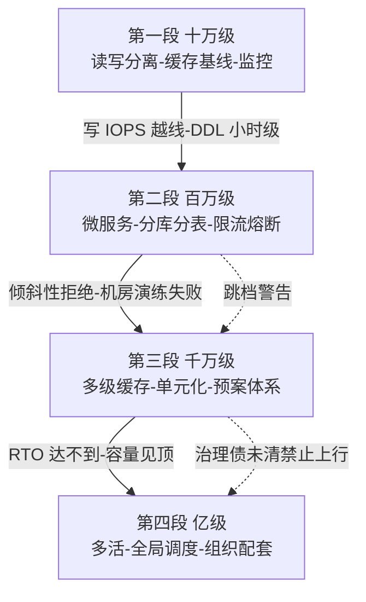
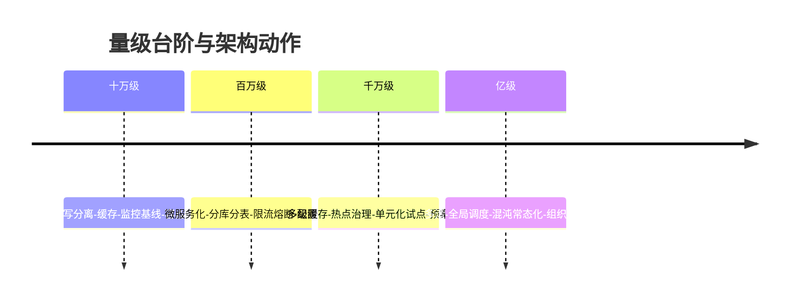
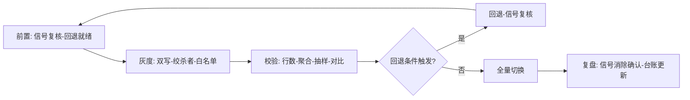
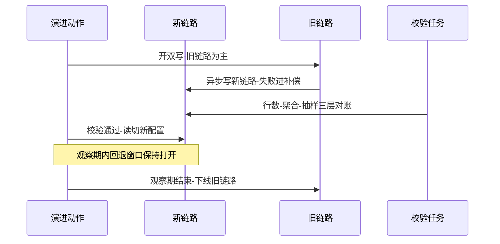
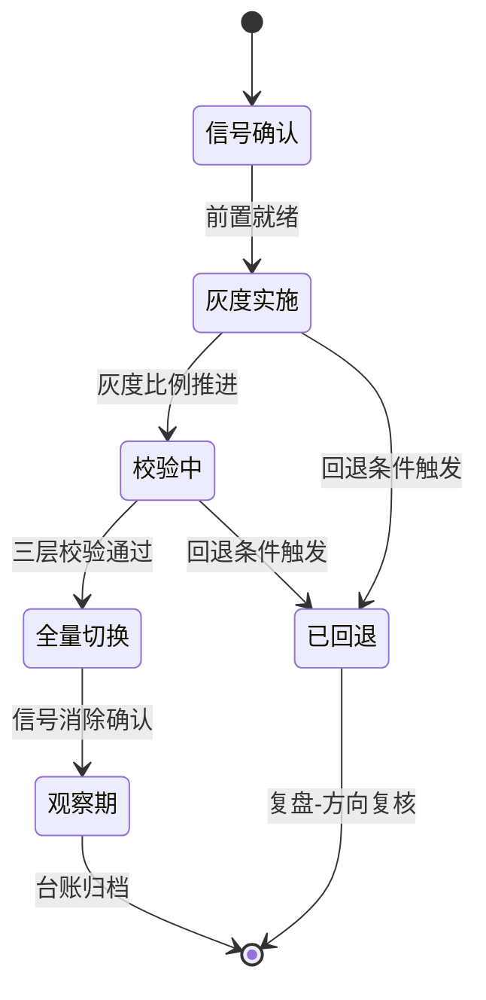

# 从百万级到亿级的架构演进之路：四段主线、信号纪律与路线决策

> **本文核心**：架构演进的本质不是「提前设计出亿级架构」，而是建立一条**信号驱动的结构升级流水线**——每个量级档位有明确的约束来源与触发信号，信号出现才动作、动作必然带灰度与回退、回退不丢人。本文把入门层的分层全景、特性层的机制深读、专题层的实战叙事收束为四段演进主线（十万级的读写分离与缓存基线 → 百万级的微服务化与分库分表 → 千万级的多级缓存与单元化 → 亿级的多活与全局治理），给出每段的入口信号、动作清单、代价账与验证口径，并对三条路线（自建演进、云托管、单元化先行）做横向决策。**机制链**：水位与行为信号观测 → 档位判定（约束来源分析）→ 动作清单选择 → 灰度实施（双写/配额/预案）→ 校验与回退判定 → 信号消除确认 → 进入下一档观察。

## 一句话摘要

演进的最大浪费是「过早优化」与「过晚升级」两个方向的动作都做了——过早是把亿级的复杂度税交给十万级的业务，过晚是水位越线后用救火代替演进。**正确的姿势是把演进变成流水线：信号触发、档位对齐、小步灰度、每步可回退**。10 万级该做的事是监控基线与读写分离，千万级该做的是分库分表收尾与单元化预案，亿级才谈多活——顺序错了一样要付代价：跳档做单元化的团队，最常见的结局是单元化没建成，微服务治理的债先爆了。

## 前置阅读

- 入门层《从零开始认识大规模架构系列》全系列（分层全景）
- 特性层《深入理解数据架构系列》《深入理解流量治理系列》（机制底座）
- 专题层《从零开始大规模架构实战系列》（实战叙事）

## 目标导向

本文是什么：大规模架构演进的整合视角——把前三层的机制与实战收束成决策主线。功能：掌握档位判定、动作清单、演进步骤纪律与路线选型。收益：容量规划与架构路线评审中给出「什么时候动、动什么、怎么验证」的完整答案。必看场景：业务快速增长期的架构规划、年度容量评审、架构债清理路线制定。

## 一、演进的元问题：为什么多数演进都做错了顺序

架构演进的失败模式高度雷同，根子都在「用设计思维做演进」——想一次性设计出终态架构。终态思维的两个典型症状：**跳档**（业务还在百万级，直接上多活与单元化，复杂度税压垮团队，微服务治理的基础债反而没人还）与**恋战**（十万级的系统恋战单体，等到写入瓶颈爆发才被迫拆，拆分动作在事故压力下变形）。两条路的共同点是**演进的触发器错了**——不是「隔壁公司这样做」也不是「架构理想是这样」，而是自己系统的行为信号。

信号分两类，必须都建监控：**水位信号**（连接池使用率、CPU、主存 IOPS——决定「什么时候加机器就不够了」）与**行为信号**（DDL 时长、命中率突变、倾斜性拒绝、跨机房演练失败——决定「什么时候加机器已经无效，要改结构」）。**约束来源决定动作类型**：资源型约束（CPU/磁盘/带宽）用加机器解决，结构型约束（单点写、数据倾斜、机房故障域）只能改结构。把两类信号混在一个告警面板里，是演进决策迟钝的直接原因。

这一档的元纪律用一句话钉死：**每一档的核心问题是「本档约束的解除动作」，而不是「下一档架构的提前施工」**——十万级的核心问题是把读写分离与监控基线做扎实，而不是提前分库分表；百万级的核心问题是服务边界与分片键押注，而不是提前单元化。思考方式：**信号驱动**——演进动作永远由自己系统的行为信号触发，不由外部样板触发。

## 5W 速记卡

| 维度 | 一句话 |
|---|---|
| What | 四段量级台阶的演进主线：信号、动作、代价、验证 |
| Why | 结构动作的复杂度税必须与业务量级对齐，早与晚都是浪费 |
| When | 水位信号与行为信号触发时，年度容量评审时 |
| Where | 全栈——接入、服务、数据、部署、治理五条线联动 |
| How | 信号观测 → 档位判定 → 动作清单 → 灰度实施 → 校验回退 → 信号消除 |

## 二、四段演进主线：每段的信号、动作与代价账

### 第一段：十万级——读写分离与监控基线

**入口信号**：读流量让单库压力抬升（CPU 长期过半）、报表查询影响在线业务。**动作清单**：主从读写分离（互指 MySQL 域主从复制主题）、热点读加 Redis 缓存（互指中间件域 Redis 系列）、监控基线（水位面板+慢查询治理）、部署上容器化与基本的弹性伸缩。**代价账**：读写分离引入主从延迟——「写后立读」的场景要处理（读主或会话内粘主）；缓存引入一致性窗口——失效语义从此是必修课（互指特性层缓存架构篇）。这一档的核心问题是「把观测与基础扩展手段做扎实」，而不是「上微服务」——十万级的单体只要模块边界清晰，完全不是技术债。

### 第二段：百万级——微服务化与分库分表

**入口信号**：单库写 IOPS 到顶（写扩容失效）、DDL 进小时级、发布耦合（一个模块的变更拖全量回归）、团队规模让单人无法理解全库。**动作清单**：微服务拆分（按业务能力拆，先拆数据边界再拆代码）、分库分表启动（分片键押注+查询维度清单，互指特性层分库分表篇）、限流熔断体系（互指特性层流量治理系列）、配置中心与服务治理（互指 service-governance 系列）。**代价账**：微服务化的税是**分布式复杂性**——跨服务事务、链路排障、发布编排；分库分表的税是**分片键终身负责**——跨片查询靠异构索引赎回。这一段是整个演进主线里**动作最重、回退最难**的一段，灰度纪律要最严。这一档的核心问题是「边界与押注的决策质量」，而不是「拆多少个服务」——服务拆细了还能合并，分片键押错了只能靠异构链路赎回。思考方式在此从**扩展驱动**切换为**决策驱动**。

### 第三段：千万级——多级缓存与单元化预案

**入口信号**：命中率突变频繁（热点结构变化）、倾斜性拒绝出现（热点打穿分片）、故障演练发现机房级故障域无法隔离、容量成本曲线开始陡峭。**动作清单**：多级缓存体系成型（L1/L2 分层+热点本地化）、单元化部署试点（按用户维度切流量单元，故障域收敛到单元内）、预案体系化（限流/熔断/降级的预案进剧本、进演练）、成本治理（互指入门层 FinOps 篇与特性层成本系列 index）。**代价账**：单元化的税是**数据同步与跨单元事务**——单元间数据一致性、全局服务的归属设计；多级缓存的税在一致性窗口管理（互指特性层缓存架构篇）。这一档的核心问题是「故障域的收敛」，而不是「更大的集群」。

### 第四段：亿级——多活与全局治理

**入口信号**：单机房故障演练失败（RTO/RPO 达不到业务要求）、监管或业务要求异地容灾、单区域容量物理见顶。**动作清单**：同城双活到异地多活（互指入门层多活篇）、全局数据同步（binlog 双向同步+冲突处理）、流量全局调度（DNS/网关层的单元路由）、组织配套（值班体系、混沌演练常态化，互指专题层观测与团队篇）。**代价账**：多活的税是**一切都有两份**——数据双写冲突处理、全局 ID 的机房位、跨机房延迟进入每个设计决策。这一档的核心问题是「把容灾从演练变成常态能力」。

四段在时间轴上的形态——每一档的驻留时长由业务增速决定，动作清单不变：

## 三、演进步骤纪律：每一步怎么走才不出事

演进动作的步骤结构高度一致，抽象成五步纪律（对应专题层的操作步骤规范——前置/执行/验证/回退/复盘）：

**第一步：前置确认**。信号复核（水位信号要与业务事件对账——是大促带来的还是结构性上涨）、预案与回退脚本就绪、灰度范围划定、相关方同步窗口。**第二步：灰度实施**。任何结构动作都带灰度形态：分库分表用双写迁移（互指特性层分库分表篇与专题层迁移篇）、微服务拆分用绞杀者模式（新旧路径并存按流量比例切换）、单元化用白名单用户先导。**第三步：校验**。数据类动作做行数+聚合+抽样三层校验，链路类动作做全链路对比（新旧路径的响应差异审计）。**第四步：回退判定**。每个动作预设「回退触发条件」（错误率阈值、延迟阈值、信号未消除）——回退条件不预设的动作不允许上生产。**第五步：复盘归档**。信号消除确认（行为信号真的消失了吗）、代价账结算（预估税与实际税的偏差）、演进台账更新。

灰度实施以双写迁移为例的完整时间线（互指特性层分库分表篇与专题层迁移篇）：

单次演进动作在其生命周期里的状态迁移——回退边在任何状态都保持可用：

演进的验证口径也有一套「报错识别表」——动作做错了方向的典型信号：分库分表后慢查询**上升**（分片键押错或跨片散射）、微服务拆分后发布时长**上升**（拆分粒度过细或依赖倒置）、缓存体系升级后一致性客诉**上升**（失效语义没跟上层次）。**每个动作都有预期输出**（信号消除+对应指标改善），预期输出没出现就要怀疑方向而不是怀疑运气。

步骤纪律之外，演进决策有一组量化红线参数——它们的默认值来自行业认知量级，推荐值要按自己业务的压测与水位校准：

| 参数名 | 默认值 | 推荐值 | 为什么 |
|---|---|---|---|
| 回退触发-错误率 | 无默认 | 上线基线的 2-3 倍 | 低于它感知不到，高于它损失扩大 |
| 回退触发-延迟 P99 | 无默认 | 超时预算的一半 | 越过它客户端已开始体验劣化 |
| 灰度起步比例 | 1%-5% | 按故障爆炸半径定 | 白名单起步，爆炸半径可控 |
| 双写观察期 | 1-2 周 | 覆盖一个完整业务周期 | 周期性流量形态全走一遍 |
| 校验抽样比例 | 千分之一 | 资损数据全量对账 | 资损字段不适用抽样 |
| 阈值校准周期 | 无默认 | 每季度随压测校准 | 容量漂移让旧阈值失真 |

## 四、横向对比：三条路线的选型决策

| 维度 | 自建演进 | 云托管路线 | 单元化先行 |
|---|---|---|---|
| 节奏控制 | 完全自主 | 跟随产品能力 | 一次性投入大 |
| 团队要求 | 深运维能力 | 产品化降低门槛 | 极强的治理体系 |
| 成本曲线 | 平缓但要自担 | 单位成本高（行业认知） | 前置重、后期摊薄 |
| 退出成本 | 无锁定 | 引擎与产品锁定 | 结构性投入难退 |

**选型口径**：团队运维深度足够且量级处于百万到千万区间，自建演进的总拥有成本通常占优（互指特性层分库分表篇的追问）；团队规模有限或业务爆发期来不及建能力，云托管路线用钱换时间——公开报道的头部实践显示托管分片与托管多活已是成熟产品形态；业务有天然的用户维度隔离属性（社交、SaaS 租户）且目标就是多机房容灾，单元化先行才有意义——**单元化是容灾路线不是性能路线**，为性能做单元化是把容灾的税交给了不需要容灾的业务。

决策的关键动作是「路线评审会」：把三条路线的五年成本曲线（建设成本+运维成本+锁定成本）画在同一张图上，用自己业务的量级预测数据代入——**路线选择是财务决策披着技术外衣**，纯技术视角的路线之争不会有结论。

## 五、跨周期视角：过去 5 年与未来 5 年

回看过去 5 年（行业认知），三个结构性变化值得记录：**结构动作前移**——缓存体系、配额治理这些曾经亿级才碰的手段，如今百万级业务就在用（公开的云产品定价与开源生态把门槛打下来了）；**托管化加速**——注册中心、消息队列、分片方案的托管形态成熟，自建与托管的成本交点在持续左移；**单元化从神秘走向方法论**——公开报道的多活实践让「按用户切单元」从头部公司的独门武功变成有方法论可循的工程。未来 5 年的变数在两处：**存算分离**的普及可能改变「数据本地性」这个分片设计的前提假设；**服务网格与多集群管理的成熟**可能把部分演进动作（流量调度、故障域隔离）下沉为基础设施能力。**不变的规律**：信号驱动的演进纪律、灰度与回退的步骤纪律、每档复杂度税与业务量级对齐的经济纪律——载体怎么变，这三条纪律不变。

## 六、典型场景与误区

**典型场景**：业务年增长数倍的交易系统（按第二段到第三段的节奏排演进路线）；用户量爆发的内容平台（缓存体系与热点治理先行，分库分表后置）；多机房合规要求的数据业务（单元化与多活提前进路线图）；成本压力下的存量系统（按演进台账倒查「哪一档的动作没做」补课）。

**常见误区**：① **「照抄大厂终态架构」**——把亿级的复杂度税交给十万级的业务，团队规模与业务量级撑不起架构的自重；② **「演进一次到位不用再动」**——量级台阶是动态的，三年前的演进路线到今天可能整段错位；③ **「灰度是可选项」**——结构动作不做灰度，回退就没有抓手，事故时的唯一选项变成硬扛；④ **「单元化=高可用」**——单元化的高可用收益以数据同步与跨单元事务为代价，没有治理体系承接的单元化是灾难放大器；⑤ **「演进是架构组的事」**——代价账里有业务方的那份（一致性窗口、灰度期的双写成本），业务方不进评审的演进路线执行不下去。

## 七、事故与实践叙事

**事故一：跳档单元化，治理债先行引爆**。某团队业务刚进千万级就启动单元化改造（看齐公开的多活实践），半年后单元没建成，微服务治理的存量债（配置混乱、依赖无序）先在故障中爆发——一次普通发布引发雪崩，根因正是本该在第二段完成的服务治理没做扎实。复盘把演进路线回滚到「治理补课优先」，单元化延后一年。**教训：演进路线有依赖序，跳档不是省时间，是把债记到更高利息的账户上。**

**事故二：回退条件没预设，灰度变成单行道**。某团队做分库分表双写迁移，灰度两周后读切换——切换后发现新链路的一致性客诉上升，但方案里没有预设「回退触发条件」，回退动作需要临时评审，拖了三天才执行，期间客诉持续。复盘把「回退条件不预设不允许上生产」立为演进红线。**教训：灰度之所以是灰度，是因为它随时可以退——退不了的路不是灰度是赌注。**

**事故三：预期输出没定义，演进变成仪式**。某团队按路线图完成了限流熔断体系的大版本升级，半年后一次真实突发流量中系统照样过载——复盘发现升级后的阈值还是从旧容量抄来的，压测校准环节被跳过。动作做完了，信号（突发下的自动保护）没有消除，但没人对照「预期输出」检查。**教训：演进动作的验收标准是行为信号消除，不是「动作完成」——没有预期输出的演进是仪式。**

## 八、设计思想：演进是系统的成长纪律

把整条演进主线抽象到底，是一套**系统的成长纪律**：量级台阶对应生物的成长阶段，行为信号对应身体的报警反应，结构动作对应骨骼的定向发育，复杂度税对应成长的能量开销。这套纪律的哲学内核是**反完美主义**：不追求终态架构的完美，只追求「当前档位下约束解除与代价支付的最优比」——每一段的架构都是「够用且可退出」的临时最优，演进能力本身才是那个终态。这与工程治理的思想同构（互指 architecture 域工程治理主题）：**好的系统不是不再变化的系统，而是变化成本被管理起来的系统**。演进台账（每段的动作、代价、信号消除记录）就是这份管理的载体——它是跨会话、跨团队的记忆，丢了它，下一个增长周期就要重新付一遍学费。

## 九、追问链

**质疑者第一层**：既然每档都有明确的动作清单，为什么还需要「信号」？不能直接按量级数字排计划吗？——量级数字是**容量代理指标**，行为信号是**瓶颈直接证据**：同样是百万级日活，读多写少的业务离分库分表还很远，写密集的业务已经在筹备——按数字排计划会对前者过度施工、对后者反应迟钝。数字可以进年度规划做预算，动作启动必须看信号——**规划用数字，动作用信号**，两层不混。

**质疑者第二层**：灰度期新旧路径并存的双倍成本，业务方不接受怎么办？——把双写期的成本账摊开给业务方看：灰度几周的双倍写入成本，对比直接切换失败一次的资损与客诉，这笔账几乎总是灰度便宜。真正难的不是说服而是**灰度期的数据一致性维护**——新旧路径并存的窗口里，两边的数据差异要靠校验任务持续对账（互指特性层数据架构篇的对账设计）。成本叙事对业务方，一致性工程对技术侧，两条线并行。

**质疑者第三层**：云厂商把演进动作产品化后，「演进能力」这个组织能力还有价值吗？——产品化改变的是动作的**执行成本**，不改变**决策责任**：什么时候升级、升级后的一致性窗口业务能不能接受、回退条件怎么设——这些判断依然要自己做。公开报道的事故里有不少「托管产品用错档位」的案例（托管的分片方案配了不适合业务的分片键）。**产品降低的是操作门槛，抬高的反而是选型判断的权重**——组织能力从「会做」转向「会选会验」，价值没有消失，是搬家了。

## 十、你们可能会问

**Q1：怎么判断自己现在在哪一档？**
按行为信号倒查而不是按业务数字：有监控基线与读写分离吗？分库分表做了吗（或确认不需要）？预案进演练了吗？——缺口最大的那段就是当前所在档。演进台账缺失的团队，可以从一次「架构债盘点」补起。

**Q2：业务量级预测很不准，路线怎么排？**
路线排到「下一个信号触发点」为止：把当前档位的动作清单做完做实，为下一档做的只有「预留」（分片键按最终形态设计、模块边界按业务能力切）——**预留是无成本的，施工是有税的**。量级预测只决定预留的幅度，不决定施工的时间。

**Q3：演进期间业务还在高速迭代，怎么协调？**
演进窗口与业务窗口错峰（避开大促与版本高峰）、结构动作的灰度形态尽量对业务透明（双写、绞杀者模式的本质是让业务无感）、每季度的「演进带宽」与业务方事先约定——**演进带宽是产能分配问题，不是技术问题**，进排期才有演进，不进排期的演进永远在让位。

**Q4：存量系统没做过演进规划，从哪里开始补？**
从监控基线补起（水位信号与行为信号两类面板），然后做一次全量架构债盘点（对照四段主线的动作清单逐项打勾），按「风险×成本」排序补课——顺序通常是：先观测、后防护（限流熔断）、再结构（缓存/分表）、最后组织（预案与演练）。互指专题层存量治理篇。

## 💡 实战提示

- 💡 决策口径：规划用量级数字，动作用行为信号——两层不混，混了就会过度施工或反应迟钝
- 💡 每个演进动作五步纪律：前置确认、灰度实施、三层校验、回退条件预设、信号消除复盘
- 💡 路线评审是财务决策：三条路线的五年成本曲线画同一张图，用自己业务的量级数据代入
- 💡 预留无成本、施工有税：为下一档只做预留（分片键、模块边界），施工等信号

## 十一、自测三问

1. 水位信号与行为信号的区别？（答：水位信号决定加机器是否有效，行为信号决定何时必须改结构——DDL 时长、命中率突变、倾斜性拒绝是行为信号）
2. 为什么跳档演进危险？（答：每档动作有依赖序，跳档把低档的治理债记到更高利息的账户——单元化先行的失败案例里，先爆的都是微服务治理债）
3. 演进动作的验收标准是什么？（答：行为信号消除+预期指标改善，不是「动作完成」——阈值没校准的限流升级等于没升级）

## 十二、开放问题

- 云托管与自建的成本交点持续左移，「自建演进能力」的组织投入边界在哪里，尚无稳定定论（行业认知）。
- 存算分离普及后，「分片键终身负责」的前提（数据本地性）会不会松动，公开实践仍在早期。

## 📎 核心带走

- **核心一句话**：架构演进 = 信号驱动的结构升级流水线——四段台阶各有约束来源与动作清单，五步纪律保每步可退，路线选择是财务决策，预留无成本、施工有税
- **机制链**：信号观测（水位+行为）→ 档位判定 → 动作清单 → 灰度实施（双写/绞杀者/白名单）→ 三层校验 → 回退判定 → 信号消除复盘 → 台账归档
- **失效点/边界**：跳档把治理债记到高息账户；没有回退条件的灰度是赌注；没有预期输出的演进是仪式；量级预测只能管预留不能管施工

## 📌 数据与事实声明

- 写于 2026-09-23，量级阈值与成本曲线为行业认知口径；「过去 5 年/未来 5 年」的趋势判断基于公开报道与社区共识，落地以自己业务的实测为准
- 免责：云产品能力与开源框架形态以官方文档与所用版本为准

## 📚 参考资料

| 类型 | 标题 | 来源 |
|---|---|---|
| 原理书 | 《数据密集型应用系统设计》DDIA（运维与演进章） | 公开出版 |
| 关联文章 | 入门层全系列、特性层两系列、专题层实战系列、从零实现大规模架构Demo、stability 系列、service-governance 系列 | 本仓库 |
