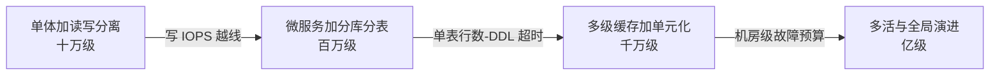
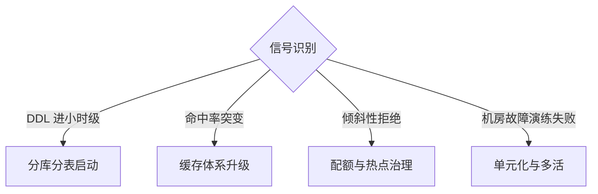
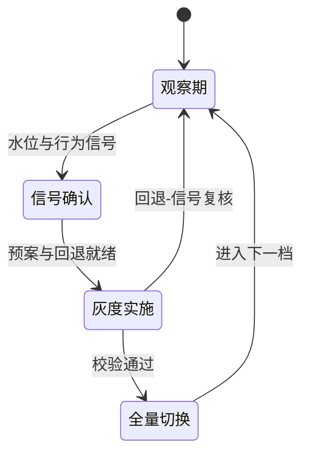
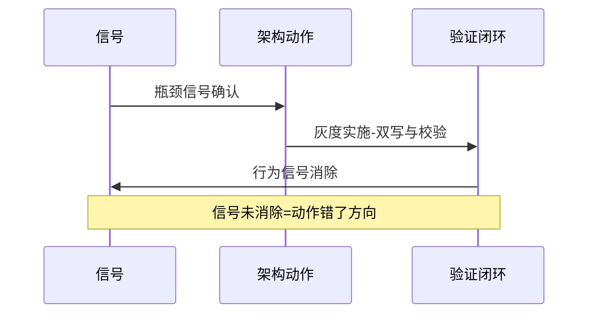
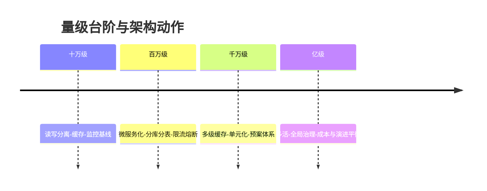

# 从百万级到亿级的架构演进之路

> **本文核心**：大规模架构不是一次设计出来的，是沿着量级台阶**逐档演进**出来的——每上一档台阶，约束来源就从「单点资源」移向「协同复杂度」，架构动作也随之从「加机器」移向「改结构」。整合层把入门层的分层全景、特性层的机制深读、专题层的实战叙事收束成一条可执行的演进主线：每个量级档位有明确的触发信号、动作清单与代价账，演进不是自由发挥，是**按信号触发的结构升级**。

## 一句话摘要

演进主线四段式：单体加读写分离（十万级）→ 微服务化加分库分表（百万到千万级）→ 多级缓存体系加单元化部署（千万到亿级）→ 多活与全局演进（亿级以上）——**每段的入口信号、出口动作与代价账都在本系列展开**，配合大流量治理与数据架构两条特性层主线，回答「什么时候动、动什么、怎么验证动对了」。

## 篇目

1. [从百万级到亿级的架构演进之路](1_从百万级到亿级的架构演进之路-深度.md)——四段演进主线、每档的信号与动作清单、演进步骤纪律、横向路线对比与跨周期视角

## 演进的触发信号

每次结构升级都由可观察的行为信号触发，而不是容量数字——信号驱动是演进的第一纪律：

## 演进节奏与验证

跨周期视角：过去 5 年（行业认知）的演进主线是「结构动作前移」——曾经亿级才需要的手段（缓存体系、配额治理）如今百万级就在用，公开报道的云托管方案把部分演进动作产品化；未来 5 年的变数在存算分离与服务网格的普及度。**不变的规律是信号驱动的演进纪律**：不管载体怎么变，「观察信号、小步灰度、可回退」的三步节奏没有变过。

## 📌 数据与事实声明

- 量级与信号阈值为行业认知口径，落地以各自业务的压测与水位实测为准

## 📚 参考资料

| 类型 | 标题 | 来源 |
|---|---|---|
| 关联文章 | 入门层全系列 + 特性层数据架构/流量治理系列 + 专题层实战系列 + 从零实现大规模架构Demo | 本仓库 large-scale/ |
