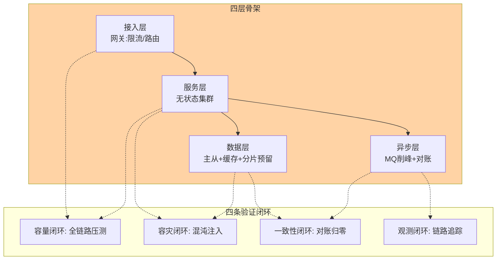
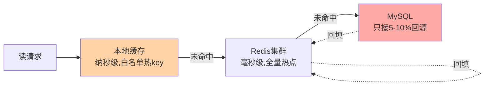
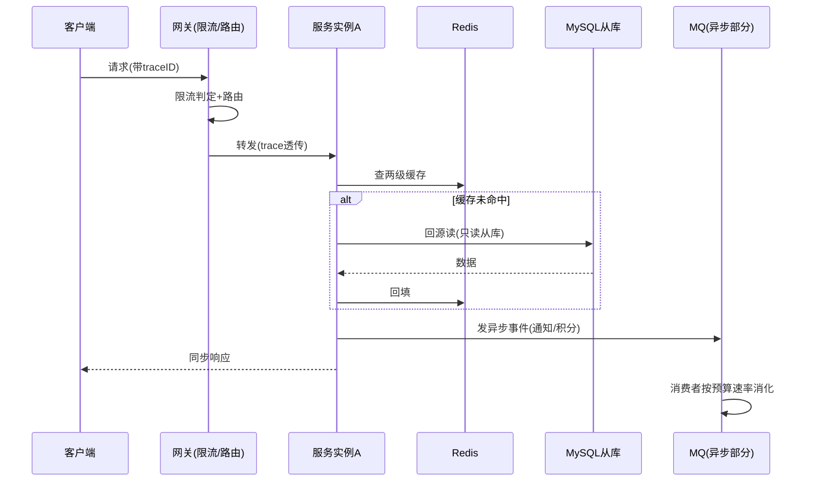
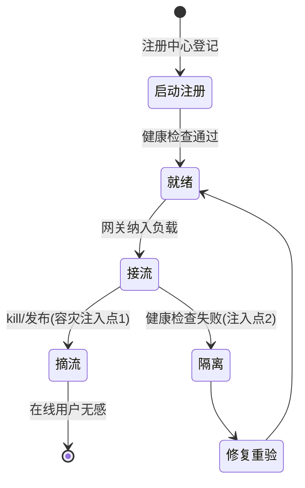
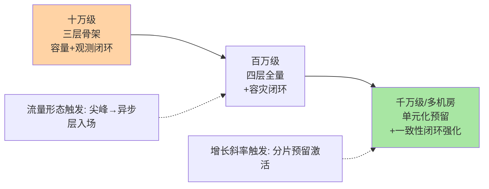

# 从零实现大规模架构 Demo：千万级请求的四层骨架与验证闭环

> 大规模架构的入门层讲了分层全景，专题层讲了稳定性与观测的武器库——本篇把它们装配成一个可运行、可压测、可验证的最小骨架：四层（接入/服务/数据/异步）各自该有什么组件、组件之间怎么接、整机怎么验证「真的扛得住」。**Demo 的目标不是能跑，是每个架构决策都有对应的验证证据。**

> **本文核心**：大规模架构的最小骨架 = 四层各一个职责锚点——接入层（流量识别与防护）、服务层（无状态水平扩展）、数据层（读写分离 + 缓存纵深 + 分片预留）、异步层（削峰与解耦）；骨架成立的标准不是组件齐全，是**四条验证闭环**——容量闭环（压测到目标水位）、容灾闭环（杀节点不中断）、一致性闭环（对账差异归零）、观测闭环（链路可追踪可归因）。四个闭环全绿，架构才算「实现」而不只是「画了」。

## 一句话摘要

本 Demo 以「千万级日请求的订单查询服务」为载体，装配最小可用的大规模架构：接入层用 Nginx/网关承担 TLS 终结、限流与路由（单机十万级 QPS，业内量级认知，横向加节点）；服务层无状态化部署（会话外置 Redis、配置中心下发），扩容只加实例；数据层 MySQL 主从 + 读写分离、Redis 缓存纵深（本地 + 集群两级）、按分片键预留水平拆分路径；异步层 MQ 削峰（写请求异步化、堆积有预算）。验证环节用四闭环压测框架：全链路压测打容量、混沌注入验容灾、对账任务验一致性、链路追踪验观测——每个架构决策（为什么读写分离、为什么两级缓存）都对应一个可测量的验收标准。

## 🎯 本文核心（机制坐标）

四层骨架与四条验证闭环的映射：



## 一、四层骨架的组件选型与决策依据

| 层 | 组件 | 为什么是它 | 替代与演进 |
|---|---|---|---|
| 接入 | Nginx + 网关（限流/路由） | 限流必须在流量进业务前；路由规则集中治理 | 云 LB / Service Mesh 演进 |
| 服务 | 无状态 Spring 集群 | 水平扩展的前提是无状态（会话外置） | K8s HPA 自动扩缩 |
| 数据 | MySQL 主从 + Redis 两级 | 读多写少形态的最优性价比 | 分库分表/分布式库按档位升级 |
| 异步 | RocketMQ/Kafka | 削峰 + 解耦 + 堆积预算管理 | 按吞吐与语义选型（互指事件驱动系列） |

四个「为什么」背后是同一条决策链：**先定该层要扛的变更与流量形态，再选组件**——接入层扛攻击与突发（限流优先），服务层扛波动（无状态优先），数据层扛增长（分片预留优先），异步层扛尖峰（堆积预算优先）。

## 二、关键实现：三个容易被 Demo 跳过的机制

### 2.1 会话外置与无状态化

```java
// 状态外置: 会话进 Redis,实例只做无状态计算
@Service
public class OrderService {
    public Order create(OrderRequest req) {
        User user = sessionStore.get(req.token());   // 状态从 Redis 取
        return orderRepo.insert(Order.of(user, req)); // 实例内存不留任何会话
    }
}
// 验收标准: kill 任一实例,在线用户零感知(网关摘流+新请求路由到他实例)
```

无状态化的完整清单不止会话：本地缓存要声明为「可丢的加速层」（失效不引发错误）、定时任务要分布式锁防重复、文件存储外置对象存储——**任何一个「实例内有状态」的角落都会破坏水平扩展**，验收标准是「随机杀实例业务无感」。

### 2.2 缓存纵深的防御次序



两级缓存的验收数字：本地命中率 20-30%（白名单 discipline，互指 Redis 专题层雪崩篇）、Redis 命中率 ≥90%、数据库只接 5-10% 回源——**缓存纵深的效果是「数据库接到的量」而非「缓存命中率」本身**，验收盯着回源比例。

### 2.3 异步化的堆积预算

写请求中「可异步的部分」（通知、积分、统计）进 MQ，同步链只留「必须即时完成」的部分。堆积预算三要素（可容忍堆积量/追平时长/可否跳过）写入容量表，消费速率按「峰值生产 × 追平 SLA」反推——**异步层不是「加了 MQ 就完事」，堆积预算与消费容量是它的核心工程量**（互指专题层堆积篇）。

一条请求在骨架中的全链路时序（观测闭环的验证对象）：



服务实例的生命周期与容灾验证点：



## 三、demo 验证点：四条闭环的执行清单

1. **容量闭环**：全链路压测到目标水位（峰值 QPS × 1.5 安全系数），各层水位不越线；产出「容量预算表」（每环节水位/上限/告警线，互指 engineering 容量篇）
2. **容灾闭环**：混沌注入——kill 一个服务实例（业务无感）、断主库（30 秒内切换）、Redis 集群单节点故障（命中率短降后恢复）、MQ broker 宕机（消息不丢）；每项记录「影响时长 + 恢复方式」，写入容灾手册
3. **一致性闭环**：对账任务跑「缓存-DB」「MQ-DB」「影子-真实」三组比对，差异率归零；注入「人为制造差异」验证对账能抓到（对账自身要被验证）
4. **观测闭环**：注入一条测试请求，链路追踪能完整还原「网关 → 服务 → 缓存/DB/MQ」的调用树与耗时分布；告警联动验证——人为打高水位，预算线告警在 1 分钟内触达值班

```bash
# 验证环境最小集: 3台起步(网关/服务/数据各1)+压测机
docker compose up -d   # nginx + app×2 + mysql主从 + redis + rocketmq
./stress/run.sh --target 5000qps --duration 10m   # 容量闭环
./chaos/run.sh --scenario kill-app                 # 容灾闭环
./reconcile/run.sh --full                          # 一致性闭环
```

## 四、事故叙事三则（Demo 阶段就要防住的形态）

**叙事一：本地缓存私放全量，扩容后命中率反而跌。**团队把「热门数据」全量放本地缓存图省事，实例从 10 扩到 40 后——每实例各自回源预热，数据库回源量涨了四倍（每实例独立 miss）。修复：本地缓存收缩为白名单热 key（Redis 侧承载全量热点）。复盘沉淀：**本地缓存的容量是「白名单内」而不是「想放就放」**——扩容会放大本地缓存的回源惩罚，这是无状态化与缓存策略的交叉盲区。

**叙事二：定时任务无锁，双实例重复跑批。**Demo 期一切正常（单实例），上线扩到两实例后对账任务双跑——同一批差异修了两遍，第二遍基于第一遍的中间态，数据错乱。修复：分布式锁 + 任务幂等（任务 ID 去重）。复盘沉淀：**Demo 的单实例形态会掩盖全部「多实例语义」缺陷**——凡任务/锁/计数类代码，Demo 期就要双实例跑一遍。

**叙事三：MQ 消费直连主库，削峰变填谷。**异步消费把削峰的写流量直接打回主库——尖峰时 MQ 帮主库挡了 API 流量，消费者却按同等速率把写压给主库，削峰变「延迟填谷」。修复：消费速率限流（按 DB 写入预算）+ 堆积预算承接。复盘沉淀：**异步化的容量收益只在「消费速率有预算」时成立**——无预算的消费是把尖峰摊平到几分钟而已。

## 五、追问链：把「四层骨架」问穿一层

- **追问一：为什么是这四层？少一层或多一层会怎样？**——层 = 变更与流量形态不同的关注点：接入（攻击/突发）、服务（波动）、数据（增长）、异步（尖峰）四个驱动源独立，才有四层。少一层（无异步层）尖峰直打数据层；多一层要警惕——每个新增层都要能回答「独立的变更源是什么」（互指设计模式整合层的控制权分层，同构思想）。
- **再追问：Demo 骨架到真实生产的距离有多远？**——三段距离：规模距离（Demo 数千 QPS 到生产数十万，验证方法同、容量数字要重测）、工程距离（多机房、多租户、合规——Demo 不含）、组织距离（值守、变更流程、跨团队协议——Demo 不含）。**Demo 给的是「架构决策的正确性」，生产的难点一半在组织**——这个认知决定你把 Demo 结论用到哪为止。
- **打破砂锅：直接用云厂商全家桶，还用自己搭 Demo 吗？**——更要用：托管服务改变的是「运维责任」，不是「架构决策」——限流配多少、缓存怎么分层、堆积预算多少，这些决策在云上照样要做，而且云的按量计费让错误决策更贵。Demo 是决策的演练场——**云解决了「怎么运维」，没解决「怎么设计」**。

## 六、反方案分析：Demo 骨架的三个「省略诱惑」

- **为什么不禁用「跳过异步层」**：同步化短期简单，但尖峰防护与解耦的债在第一次流量波动就还——异步层是四层中「事后补成本最高」的一层（要补堆积预算、幂等、对账全套）
- **为什么不做「一步到位分库分表」**：Demo 阶段数据量未到档位，分片引入的跨片复杂度没有收益——正确姿势是「单库但按分片键设计表结构」，把未来的拆分路径预留好（分片键即业务键、禁跨键查询）。**预留路径 ≠ 提前施工**
- **为什么观测不能等**：四闭环里的观测闭环是其他三环的前提——没有链路追踪，压测的瓶颈归因靠猜；没有预算线告警，容量结论无法运营。观测是最不能「先跑起来再说」的一层

## 七、设计思想：Demo 是架构的可执行规格

架构图回答「组件怎么连」，Demo 回答「这些组件在这个流量形态下真的成立吗」——**Demo 本质是把架构从「声明」变成「可执行规格」**：容量闭环验证性能声明、容灾闭环验证可用性声明、一致性闭环验证正确性声明、观测闭环验证可运维声明。这套思想与 TDD 同构：先写验收（四闭环标准），再让架构满足验收——区别是测试对象从函数变成了拓扑。Demo 的深价值在验证文化：**任何没有对应验证闭环的架构声明，一律视为待验证假设**——这个纪律从 Demo 带进生产，是大规模架构最值钱的迁移物。

## 八、不同量级的思考：骨架的档位演进

- **十万级 QPS 以下**：约束来源是正确性——四层骨架全量装配是过度设计，接入+服务+数据三层足够。这一档的核心问题是「组件语义是否正确」，而不是「骨架完整性」
- **百万级 QPS**：约束来源是无状态与缓存纵深——异步层入场，堆积预算、两级缓存、读写分离成为主战场。这一档的核心问题是「水平扩展的纯净度」，解法是状态外置清单逐项清零
- **千万级 QPS / 多机房**：约束来源是地域与组织——单元化预留、多活拓扑、跨团队治理面进入视野；Demo 骨架升格为「多套骨架的编排」。这一档的核心问题是「切分维度与组织对齐」，架构决策让位于业务建模（互指容量篇档位论）

**自下而上与触发升级**：先测当前水位与骨架档位的匹配度，低档不装配全量；触发升级的信号是「该层流量形态出现」（尖峰出现→异步层、增长加速→分片预留、多机房诉求→单元化评估）——骨架随流量形态长，不按蓝图一次建全。

### 骨架各层的「最简可行组件」对照表

预算有限的团队常问「每层最少要什么」——每层给出最简件与升级件：接入层 Nginx 限流起步、路由规则变更频繁再上网关；服务层双实例加注册中心起步、实例数过十再上 K8s 与弹性伸缩；数据层主从加单层 Redis 起步、回源占比超一成半再加两级缓存与分片预留；异步层单 MQ 起步、多业务共享再上配额隔离；观测层链路加基础指标起步、进入容量运营再上预算线告警与全链路归因。每行的升级触发信号都写清楚——避免一次性建满，也避免该升不升，这张表与四闭环排序表一起构成最小骨架的完整采购清单。

## 九、参数级配置清单（ADR-0012）

| 配置项 | 默认值参考 | 分档推荐 | 为什么 |
|---|---|---|---|
| 网关限流阈值 | 容量预算的 80% | 大促窗口下调到 60% | 限流线=保护线，留 20% 给内部调用余量 |
| 服务实例数 | 峰值 QPS ÷ 单实例能力 ×1.5 | 弹性伸缩下限同此 | 1.5 系数覆盖发布窗口的容量抖动 |
| 本地缓存白名单 | ≤50 个 key 组 | 大促前重估白名单 | 本地缓存回源惩罚随实例数放大 |
| Redis 命中率告警 | <90% | 新业务冷启动期单独基线 | 命中率是回源量的指数开关 |
| MQ 堆积预算 | 追平 ≤30 分钟 | 账务类 ≤5 分钟 | 契约数字，写进容量表 |
| 主从延迟告警 | >500ms | 读分级严的业务 >200ms | 延迟预算决定读路由 |
| 对账周期 | 小时级增量+日级全量 | 资金类分钟级 | 对账时效=纠错窗口 |

## 十、步骤级操作（ADR-0012）

1. **前置**：docker compose 环境就绪（nginx/app×2/mysql 主从/redis/rocketmq）；监控（预算线）与追踪（trace）先于压测部署
2. **容量闭环**：`./stress/run.sh` 按 1000→5000→目标 QPS 爬坡，每档观察预算表水位；产出容量预算表初版
3. **容灾闭环**：逐项注入（kill 实例/断主库/Redis 单点/MQ broker），记录影响时长与恢复动作；任何项超 SLA 即为骨架缺陷，修复后重验
4. **一致性闭环**：全量对账跑三组比对 → 注入人为差异验证对账灵敏度 → 差异归零报告
5. **回退**：骨架缺陷的修复走变更单；混沌注入都有一键停止；Demo 环境可整体销毁重建（compose down -v）——可重建性本身是 Demo 的纪律

## 十一、业内惯例

- 容量评审惯例：Demo/预发的容量预算表直接作为生产容量评审的输入——「验证过的数字」才有评审资格
- 混沌演练惯例：从 Demo 期开始建立「注入 → 记录 → 修复 → 重验」循环，生产演练（互指稳定性武器库篇）是这个循环的规模化
- 团队惯例：Demo 代码库与生产同构（同配置中心、同中间件 SDK），「Demo 能跑生产能跑」的迁移路径最短——异构 Demo 的验证结论不可信

## 你们可能会问

**Q1：Demo 用单机 docker，验证结论能外推到生产集群吗？**
「架构语义」可外推（限流在业务前、缓存纵深次序、堆积预算）——「容量数字」不可外推（单机资源与集群完全不同）。结论分两栏记：语义结论（外推）与数字结论（重测）。

**Q2：四闭环全绿后，架构就定型了吗？**
四闭环验证的是「当前流量形态下的成立性」——流量形态变化（尖峰形态、增长斜率、读写比）会打破成立性。闭环是定期重跑的体检项，不是一次性验收——这也是它们被叫「闭环」而不是「检查项」的原因。

**Q3：小团队没有压测平台和混沌工具，闭环怎么落地？**
闭环的精髓是「声明-验证」配对，工具可以极简：ab/wrk 压测、kill -9 混沌、SQL 对账脚本、zipkin 单机版——四个开箱即用件就能跑通四闭环的最小形态。真正的门槛从来不是工具，是「每个架构声明都要有验证」这个共识——共识立住，wrk 也能跑出容量结论；共识缺位，再贵的平台也只是摆设。工具上限随规模演进，闭环纪律从第一天就在——纪律比工具便宜，也比工具难补。

## 十二、什么时候用 / 不用

- ✅ 用：新系统立项（骨架验证前置）、重大架构变更（决策验证）、容量规划周期（数字刷新）
- ✅ 教学与迁移：团队架构对齐的公共参照物——「四层四闭环」是可共享的语言
- ❌ 不用：存量系统的渐进优化（没机会搭骨架）——用同样的闭环方法审计存量即可，不必重搭
- ❌ 不用：追求 Demo 的组件生产化——Demo 的价值是验证结论，不是可复用代码

## 开放问题

- Demo 环境的云原生化：compose 骨架与 K8s 声明的双轨维护成本上升，是否直接用 kind/minikube 让 Demo 与生产同构（K8s 声明即骨架定义）——同构性与入门成本之间的取舍
- AI 辅助的闭环自动化：压测瓶颈归因、混沌注入的爆炸半径评估、对账差异的根因初判——闭环里「人分析」的环节有多少可交给自动化，验证文化的执行成本会大幅下降
- 骨架的跨项目复用：四层骨架 + 四闭环清单能否模板化（脚手架仓库），让每个新系统跳过「从零搭骨架」——模板化与「每系统架构应按需裁剪」之间的张力

骨架与闭环的演进匹配关系（哪个量级装配哪层、跑哪环）：



四闭环的验证成本与收益排序（预算有限时的执行顺序）：

| 闭环 | 建设成本 | 单位收益 | 建议时机 |
|---|---|---|---|
| 观测闭环 | 低（开源件即可） | 极高（其余闭环的前提） | 第一天 |
| 容量闭环 | 中（压测脚本） | 高（容量结论的唯一来源） | Demo 期 |
| 容灾闭环 | 中（注入工具） | 高（可用性声明验证） | 预发期 |
| 一致性闭环 | 高（对账体系） | 按业务风险定价 | 资金类功能引入时 |

## Trade-off：验证完备性与推进速度的交换

四闭环全跑一遍的成本不低（尤其一致性闭环的对账建设）——省略闭环的团队跑得快，但架构声明的「未验证债务」在生产期连本带息偿还。折中的成熟路径是**闭环分档**：Demo 期容量+观测闭环必跑（成本最低收益最大），容灾闭环在预发期补，一致性闭环随资金类功能引入——闭环的完备度跟随业务的风险等级，但「声明必须有验证」的纪律不打折。排序表的存在还有一层组织价值：它把「验证不完备」从道德问题转化为排期问题——预算与时机都摆上桌，团队能力再有限，也知道第一步先建观测、第二步压容量，而不是在「要不要验证」上空转。

## 跨周期视角：五年后骨架的形态

四个变量会重画骨架：①Serverless 把「服务层无状态」从纪律变成默认（实例概念弱化），骨架的第二层被平台吸收；②存算分离让数据层的「分片预留」方式改变（计算层弹性、存储层托管）；③服务网格把接入层的限流路由下沉为 sidecar 能力；④AI 负载（向量检索、GPU 推理）加入流量形态，四层之外可能长出第五层。**四层的具体组件五年后大半换代，但「按变更与流量形态分层、每层决策配验证闭环」的方法论不变**——这是本篇从 Demo 里最想让你带走的东西。

## 💡 实战提示

- 💡 监控与追踪先于压测部署——没有观测的压测结论无法归因
- 💡 Demo 期就双实例跑——单实例掩盖全部多实例语义缺陷
- 💡 本地缓存只放白名单——扩容会放大本地缓存的回源惩罚
- 💡 消费速率必须有预算——无预算的异步是把尖峰摊平不是削掉
- 💡 四闭环结论分两栏记：语义结论可外推、数字结论须重测

### 从 Demo 到生产的迁移检查单（十问）

Demo 结论要迁移进生产，过这十问：①容量数字重测了吗（环境变了）？②配置差异梳理了吗（Demo 宽松/生产严苛）？③多实例语义双实例验过吗？④数据量级上量后的行为验过吗（索引与查询计划变化）？⑤监控预算线移植并校准了吗？⑥容灾手册的恢复动作在生产环境彩排过吗？⑦安全基线（鉴权/加密/审计）补齐了吗？⑧变更流程（发布/回滚）接入了吗？⑨值班与升级路径定了吗？⑩「Demo 能跑所以生产能跑」的侥幸清零了吗？十问全过，迁移才算启动——**这份清单的本质是把「Demo 与生产的差异」从隐性经验变成显式问题**，每答一个「没」就是一条待办。

## 自测三问

1. 四层骨架各扛什么变更与流量形态？少一层会发生什么？
2. 四条验证闭环分别验证架构的什么声明？
3. Demo 结论外推到生产的边界是什么？哪类结论可外推、哪类须重测？

## 🎯 核心带走

- **核心一句话**：大规模架构的最小骨架 = 四层各握一个流量形态 + 四条验证闭环各验一类架构声明——Demo 是架构的可执行规格，声明的另一半是验证
- **骨架**：接入（防护）、服务（无状态）、数据（纵深+预留）、异步（削峰+预算）
- **哪里会坏**：本地缓存全量化、单实例掩盖多实例缺陷、消费无预算填谷
- **边界**：语义结论可外推、数字结论重测；闭环分档但不打折
- **量级迁移**：十万级问正确性、百万级问扩展纯净度、千万级问切分与治理
- **迁移纪律**：十问检查单把「Demo 与生产的差异」变显式待办——每答一个「没」就是一条工单
- **共识优先**：闭环的工具可以极简，「声明必有验证」的共识不能省

## 📌 数据与事实声明

- 写于 2026-09-15；组件能力量级（Nginx/Redis/MySQL/MQ）为业内量级认知，以自有压测实测为准
- Demo 拓扑为教学验证环境，生产部署以各组件官方部署文档为准
- 事故叙事为业内高频架构缺陷模式的匿名化叙事，非特定公司事件
- 免责：组件配置随版本演进，以官方文档为准

## 📚 参考资料

| 类型 | 标题 | 来源 |
|---|---|---|
| 系列内 | 入门层分层全景 / 专题层稳定性武器库·观测体系·安全合规 | large-scale 各层 |
| 关联篇 | 《亿级容量实战选型决策》《全链路压测的生产安全》 | engineering/专题层 |
| 官方文档 | Nginx / MySQL / Redis / RocketMQ 部署文档 | 各官方站 |
| 系列导航 | large-scale 整合层目录 | 本目录 index |
