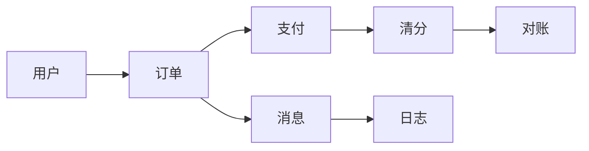
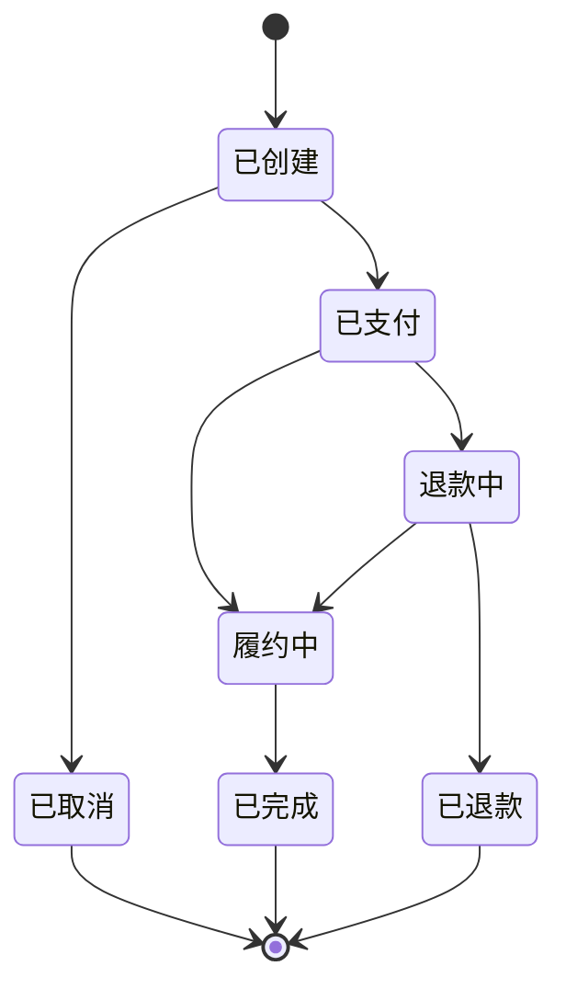

# 深入理解交易链路系列

> 交易链路的核心：订单/支付/一致性——金融场景的高可用与数据一致。

## 一句话摘要

本系列沿交易主链拆解订单、支付、一致性、幂等、风控五个专题——每篇回答一个「机制怎么运转、边界在哪、量级变了怎么办」，与 L1 服务层入门的区别是深到机制与参数，与 L3 实战的区别是单点透而非全景。

## 一、为什么需要这个系列

交易链路是金融场景的核心：
- 订单：创建/支付/履约
- 支付：多通道/对账/清分
- 一致性：分布式事务

## 二、全局心智模型

## 三、系列篇目规划

| 序号 | 篇目 | 核心内容 |
|---|---|---|
| 1 | 深入理解订单架构 | 创建/状态机/超时关单 |
| 2 | 深入理解支付清分 | 多通道/对账/差错处理 |
| 3 | 深入理解一致性保障 | 本地消息表/事务消息/TCC |
| 4 | 深入理解幂等设计 | 去重/状态机/防重复提交 |
| 5 | 深入理解交易风控 | 规则引擎/黑名单/额度控制 |

## 四、量级三档

| 量级 | 订单方案 | 支付方案 | 一致性方案 |
|---|---|---|---|
| 10w | 单库+状态机 | 单通道 | 本地消息表 |
| 千万 | 分库分表 | 多通道 | 事务消息 |
| 亿级 | 分片+异构 | 清分中心 | Saga + 对账 |

## 四层进阶路径

- L1 入门：大规模架构 - 服务层设计
- L2 特性：本系列
- L3 专题：千万订单系统实战
- L4 整合：交易链路 Demo

## 五、核心问题链

1. 订单状态怎么设计？（状态机 + 事件驱动）
2. 支付超时怎么处理？（关单 + 退款）
3. 对账差异怎么处理？（差异表 + 人工介入）

### 一笔交易的状态旅程（预览）

### 机制与取舍的阅读建议

每篇都带一条追问线：机制为什么会演化成今天这样、代价是什么、10 万级与亿级的解法差在哪。建议按篇目顺序读，状态机与幂等两篇是其余各篇的地基，取舍的思路贯穿全部——先建立「一致性是分级预算的」这个心智，后面的机制选择就都顺理成章。

## 自测三问

1. 一笔订单的状态机，哪些跃迁是可逆的、哪些是单向的？
2. 你的支付链路里，对账差异从发现到处理平均多久？
3. 幂等键的 TTL 应该覆盖什么时间窗？

交易链路导读v2

### 演进视角

回看过去 5 年（行业认知），交易链路的形态演进方向清晰：同步链路越来越短（预计算与异步化把确认后移），对账从日终走向准实时——机制在变，「一致性按预算分配」的取舍观不变。以下三层依赖是全系列的地基图：

## 📌 数据与事实声明

- 量级与参数数字为行业认知量级，落篇时以实测替换。

## 📚 参考资料

- 本仓库 distributed-transaction 系列 / biz 域