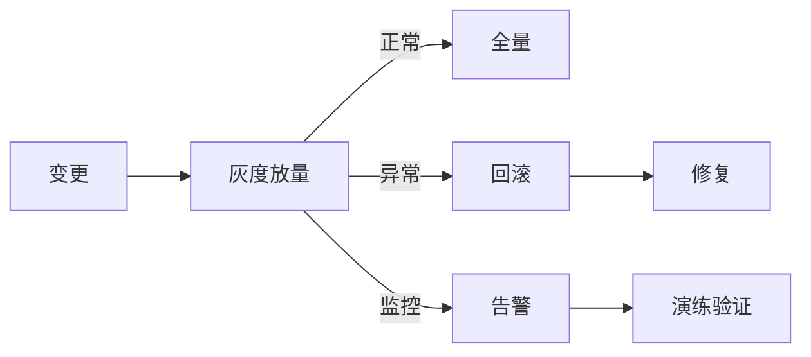
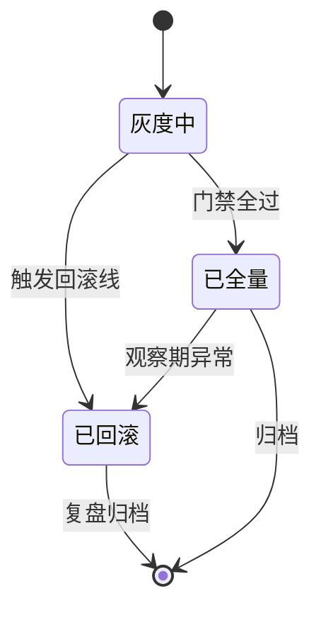
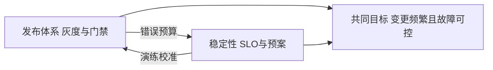

# 深入理解发布与稳定性系列

> 发布与稳定性的核心：灰度 + 回滚 + 故障演练——变更安全的工程保障。

## 一句话摘要

本系列覆盖发布体系（灰度、门禁、回滚）与稳定性武器库（SLO、降级、熔断、演练）两条线——每篇把机制推到参数级与操作级，回答「变更怎么安全地发生、故障怎么被机制化地消化」。

## 一、为什么需要这个系列

大规模架构的变更风险极高：
- 灰度：逐步放量
- 回滚：快速撤销
- 演练：验证预案

## 二、全局心智模型

## 三、系列篇目规划

| 序号 | 篇目 | 核心内容 |
|---|---|---|
| 1 | 深入理解灰度发布 | 金丝雀/蓝绿/滚动 |
| 2 | 深入理解回滚机制 | 配置回滚/代码回滚/数据回滚 |
| 3 | 深入理解故障演练 | 混沌工程/红蓝对抗 |
| 4 | 深入理解 SLO 体系 | SLI/SLO/SLA 定义与考核 |
| 5 | 深入理解应急响应 | 故障分级/响应流程/复盘 |

## 四、量级三档

| 量级 | 灰度方案 | 回滚方案 | 演练方案 |
|---|---|---|---|
| 10w | 手动灰度 | 手动回滚 | 桌面推演 |
| 千万 | 自动灰度 | 自动回滚 | 实战演练 |
| 亿级 | 流量染色 | 秒级回滚 | 常态化演练 |

## 四层进阶路径

- L1 入门：大规模架构 - 发布与变更
- L2 特性：本系列
- L3 专题：稳定性武器库实战
- L4 整合：发布平台 Demo

## 五、核心问题链

1. 灰度比例怎么定？（5% → 20% → 50% → 100%）
2. 回滚多久算成功？（< 5 分钟）
3. 演练频率？（每季度一次）

### 发布与故障的状态机（预览）

### 机制与演练的双重保障

稳定性机制的真实水位等于「最近一次演练的通过率」：门禁会不会误报、回滚脚本还能不能跑、降级开关是不是真的能关——演练是校准机制与现实的唯一手段。每篇的追问线围绕「机制的可执行性」：发布频率与自动化能力怎么匹配、错误预算怎么驱动决策、混沌演练的注入怎么与真实故障区分——10 万级流程大于平台，亿级发布即日常，机制随量级升档是本系列的演进主线。

## 自测三问

1. 上一次回滚用了多久、谁执行的、依据什么信号？
2. 你的降级预案，最近一次真实演练是什么时候？
3. 发布门禁的四类信号（错误率、延迟、资源、业务埋点）都齐了吗？

发布稳定导读v2

### 机制间的取舍关系

发布线与稳定性线共享一套底层取舍：速度与安全的权衡、自动化的收益与误判代价——这张关系图是全系列的取舍地图：

## 📌 数据与事实声明

- 量级与参数数字为行业认知量级，落篇时以实测替换。

## 📚 参考资料

- 本仓库稳定性系列 / 混沌工程官方文档