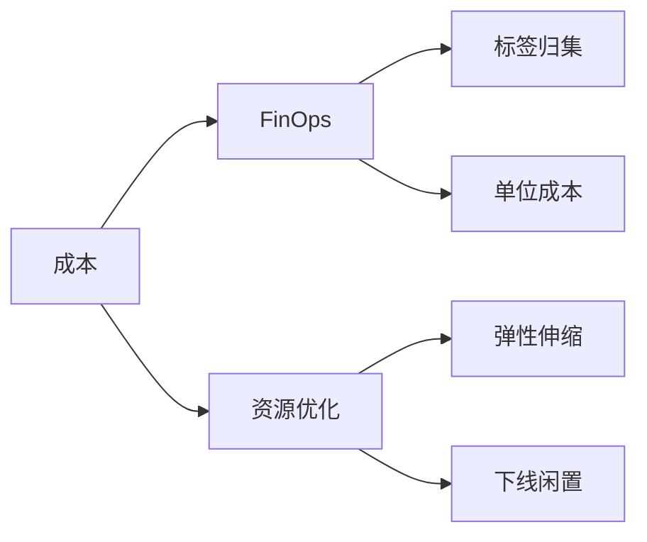
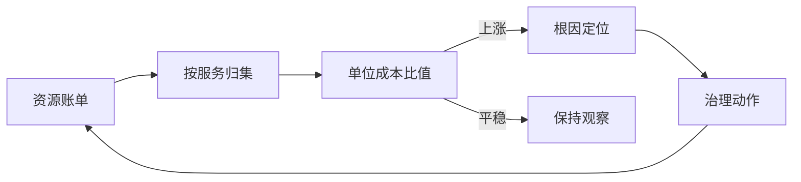
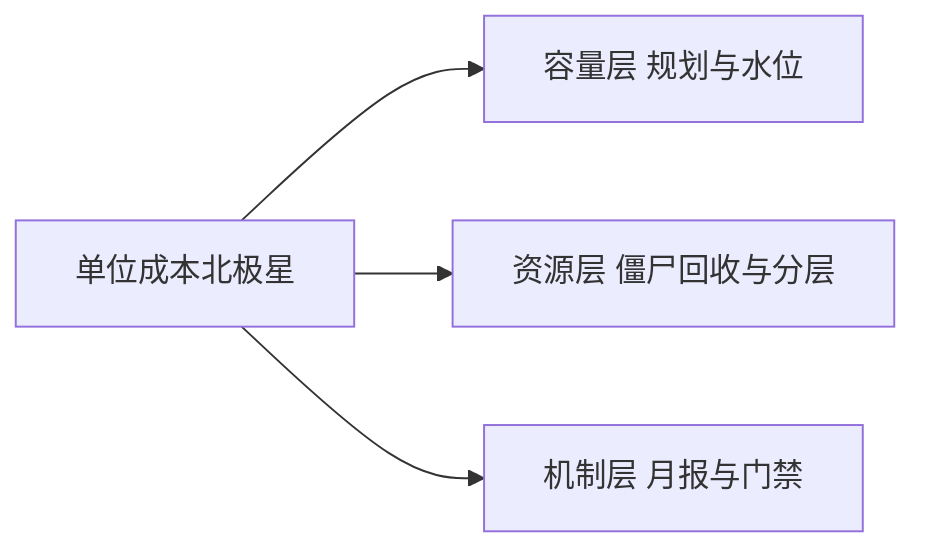

# 深入理解成本治理系列

> 成本治理的核心：FinOps + 资源优化 + 弹性伸缩——用最少的钱办最多的事。

## 一句话摘要

本系列把成本当成工程指标拆解：容量怎么规划、单位成本怎么度量、FinOps 怎么落地——每篇给出可执行的度量口径与治理动作，让「省钱」从口号变成可以看板化的持续机制。

## 一、为什么需要这个系列

大规模架构的成本压力大：
- 资源浪费：闲时过度配置
- 成本失控：无标签无归属
- 弹性不足：峰值过度预留

## 二、全局心智模型

## 三、系列篇目规划

| 序号 | 篇目 | 核心内容 |
|---|---|---|
| 1 | 深入理解 FinOps | 标签/分摊/考核 |
| 2 | 深入理解弹性伸缩 | HPA/VPA/集群伸缩 |
| 3 | 深入理解资源优化 | 混部/超卖/降配 |
| 4 | 深入理解存储成本 | 冷热分层/压缩/去重 |
| 5 | 深入理解成本大盘 | 可视化/预警/优化建议 |

## 四、量级三档

| 量级 | 成本方案 | 弹性方案 | 优化空间 |
|---|---|---|---|
| 10w | 手动管理 | 手动扩容 | 20-30% |
| 千万 | 标签归集 | HPA 自动 | 30-50% |
| 亿级 | FinOps 平台 | 集群伸缩 | 50%+ |

## 四层进阶路径

- L1 入门：大规模架构 - 成本与容量规划
- L2 特性：本系列
- L3 专题：成本优化实战
- L4 整合：FinOps 平台 Demo

## 五、核心问题链

1. 成本归集到谁？（团队/服务/应用）
2. 弹性阈值怎么定？（CPU > 70% 扩容）
3. 优化优先级？（存储 > 计算 > 网络）

### 成本治理的度量闭环（预览）

### 治理机制与演进视角

成本腐化是渐进的：先是一个服务的日志量翻倍，然后是没人用的集群挂了大半年——治理机制（月报、单位成本、审批门禁）的作用是让这些渐进过程可见。每篇会给出对应量级的最小动作集：10 万级只需比值曲线，千万级要归集与月报，亿级要自动化治理——机制跟着量级走是本系列的取舍主线。

## 自测三问

1. 你负责的服务的单位成本（每千次请求）是多少？
2. 最近一次成本异动（上涨或下降）能定位到根因吗？
3. 机器成本里有多少是「僵尸资源」（无人使用的实例、无人读的日志）？

成本治理导读v2

### 治理动作的分层展开

单位成本比值是北极星，往下拆是三层动作的机制树——每层可独立演进：

## 📌 数据与事实声明

- 量级与参数数字为行业认知量级，落篇时以实测替换。

## 📚 参考资料

- 本仓库 engineering 系列 / CNCF FinOps 文档